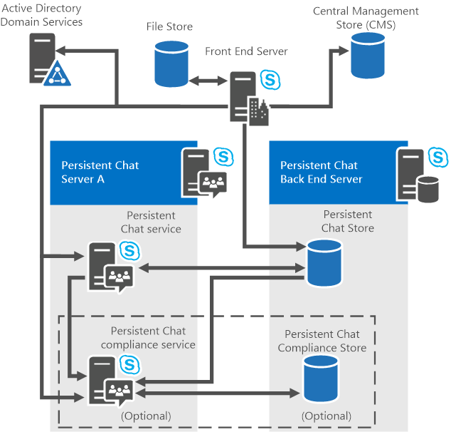

# Планирование топологии стойких чат-серверов
 
**Сводка:** Ознакомьтесь с этой темой, чтобы узнать о компонентах и топологиях сохраняемого сервера чата в Skype для бизнеса Server 2015 г.
  
Стойкий сервер чата поддерживает конфигурации с одним сервером и несколькими серверами. Вы можете установить постоянный сервер чата на Skype для бизнеса Server 2015 выпуск Enterprise или выпуск Standard Server. 

> [!NOTE] 
> Постоянный чат доступен в Skype для бизнеса Server 2015 г., но больше не поддерживается Skype для бизнеса Server 2019 г. Такая же функциональность доступна в Teams. Дополнительные сведения см. в ссылке Начало работы [с обновлением Microsoft Teams обновления.](/microsoftteams/upgrade-start-here) Если вам нужно использовать постоянный чат, вы можете либо перенести пользователей, требующих Teams, либо продолжить использование Skype для бизнеса Server 2015 г. 
  
## Постоянные компоненты chat Server

Постоянный сервер чата состоит из следующих компонентов:
  
- Один или несколько компьютеров, работающих на стойком сервере чата и предоставляющих следующие службы:
    
  - Постоянная служба чата
    
  - Служба соответствия, которая включается, если включено соответствие
    
- Один или несколько серверов (несколько, если используется зеркальное отражение) с SQL Server базы данных для размещения базы данных контента сохраняемого чата, в которой хранятся содержимое комнат чата, комнаты и категории.
    
    > [!NOTE]
    > В задней базе данных хранится история чата, в том числе сведения о категориях и созданных постоянных чатах. 
  
- Если включено соответствие требованиям, один или несколько серверов (несколько, если используется зеркальное отражение) запускают SQL Server базу данных для размещения базы данных сохраняемого соответствия чату, где хранятся события соответствия требованиям и содержимое чата для обеспечения соответствия требованиям.
    
Подробные сведения о требованиях к оборудованию и программному обеспечению для сохраняемой сервера чата см. в Skype для бизнеса Server [2015](../../plan-your-deployment/requirements-for-your-environment/server-requirements.md) г. и требования к оборудованию и программному обеспечению для persistent Chat Server в [Skype для бизнеса Server 2015](hardware-and-software-requirements.md)г. . 
  
## Постоянные топологии chat Server

Вы можете развернуть стойкий сервер чата в пулах с одним сервером или несколькими серверами, а также с топологией с одним пулом или несколькими пулами. Постоянный сервер чата поддерживает следующие топологии:
  
-  выпуск Standard Сервер с постоянным сервером чата, расположенный на переднем сервере
    
-  выпуск Standard Сервер с постоянным сервером чата на отдельном сервере
    
-  выпуск Enterprise Сервер с одним стойким сервером чата на отдельном сервере
    
-  выпуск Enterprise Сервер с более чем одним стойким сервером чата на отдельных серверах
    
Несмотря на то, что на сервере выпуск Standard можно развернуть стойкий сервер чата, следует помнить, что производительность и масштаб будут затронуты, а высокая доступность не является вариантом. Поэтому рекомендуется развернуть постоянный чат на сервере выпуск Standard в первую очередь для подтверждения целей концепции и оценки. 
  
Skype для бизнеса Server 2015 поддерживает различные сценарии коллокации, обеспечивая гибкость для экономии затрат на оборудование, запуская несколько компонентов на одном сервере (если у вас небольшая организация) или запуская отдельные компоненты на разных серверах (если у вас есть более крупная организация, нуждающаяся в масштабируемости и производительности). Прежде чем принимать решение о коллокации компонентов, следует учитывать факторы масштабируемости. Сценарии коллокации для Skype для бизнеса Server 2015 выпуск Enterprise и выпуск Standard серверов. 
  
В следующих разделах описаны более подробные топологии, включая сценарии коллокации и параметры серверов базы данных. Подробные сведения о коллокациях всех ролей и баз данных серверов см. в материале [Topology Basics for Skype для бизнеса Server 2015 г.](../../plan-your-deployment/topology-basics/topology-basics.md)
  
### выпуск Standard Сервер с постоянным сервером чата, расположенный на переднем сервере

С выпуск Standard вы можете коллокировать постоянный чат на переднем сервере. Это самая простая и базовая конфигурация. Необходимо убедиться, что у существующего переднего конечного сервера достаточно емкости с точки зрения физических ресурсов: ЦП, памяти, дискового пространства и т. д.
  
Кроме того, на локальном сервере SQL Server Express можно совместить сервер сохраняемого сервера чата и базу данных сохраняемого соответствия требованиям. Вы также можете использовать отдельный SQL Server с выделенным экземпляром. 
  
> [!IMPORTANT]
> Нельзя добавлять дополнительные серверы в пул сохраняемого сервера чата, если первый сервер сохраняемого чата выпуск Standard сервером переднего выпуск Standard. Рекомендуется установить первый сервер в качестве автономных экземпляров, чтобы можно было добавить больше серверов позже, если это необходимо. 
  
### выпуск Standard Сервер с постоянным сервером чата, установленным на отдельном сервере

С выпуск Standard, вы можете установить стойкий сервер чата в качестве автономных экземпляров и добавить больше серверов позже, если это необходимо. 
  
На локальном сервере SQL Server Express можно совместить сервер сохраняемого сервера чата и базу данных сохраняемого соответствия требованиям. Вы также можете использовать отдельный SQL Server с выделенным экземпляром. 
  
### выпуск Enterprise Сервер с одним стойким сервером чата

С выпуск Enterprise на отдельном компьютере необходимо установить стойкий сервер чата. То есть невозможно коллокировать сервер сохраняемой беседы на выпуск Enterprise переднем конце сервера. Это развертывание требует отдельного сервера, на который выполняется постоянный сервер чата и служба соответствия требованиям (если включена).
  
Однако вы можете объединить базу данных SQL Server для стойкого сервера чата в задней базе данных выпуск Enterprise переднего конечного пула.
  
> [!NOTE]
> Если вы планируете использовать SQL AlwaysOn Availability Groups для HA DR, обратите внимание, что он не поддерживается для баз данных сохраняемой системы чат-сервера. 
  
При коллокации базы данных сохраняемого чата с задней базой данных можно использовать один экземпляр SQL Server для любой или всех баз данных, либо использовать отдельный экземпляр SQL Server для каждой базы данных.
  
> [!IMPORTANT]
> Сервер, на который размещена база данных сохраняемого чата, может принимать другие базы данных. Однако, если вы рассматриваете возможность совмещение базы данных сохраняемого чата с другими базами данных, следует помнить, что при хранении сообщений нескольких пользователей пространство диска, необходимое базе данных persistent Chat, может вырасти очень большим. По этой причине мы не рекомендуем коллокировать базу данных "Постоянный чат" с помощью базы данных задней части. 
  
На следующем рисунке показаны все компоненты топологии для одного сервера сохраняемого чата с включенной поддержкой (необязательно).
  
**Односерверная топология**

  
### выпуск Enterprise Сервер с несколькими стойкими серверами чата

С выпуск Enterprise вы можете развернуть многосерверную топологию для большей емкости и надежности. Топология с несколькими серверами такая же, как топология одного сервера, за исключением того, что на нескольких серверах находится стойкий сервер чата, и может масштабироваться выше. Топология с несколькими серверами может включать до четырех активных компьютеров, работающих на стойком сервере чата (высокая доступность и конфигурация аварийного восстановления позволяют использовать до восьми, но только четыре могут быть активными, а остальные четыре — в режиме ожидания). Каждый сервер может поддерживать до 20 000 одновременно пользователей, в общей сложности 80 000 пользователей, подключенных к пулу сохраняемого сервера чата с 4 серверами. Несколько компьютеров с постоянным сервером чата должны находиться в том же домене доменных служб Active Directory, Skype для бизнеса Server и службе соответствия требованиям.
  
На следующем рисунке показаны все компоненты топологии на нескольких серверах с несколькими компьютерами под управлением Persistent Chat Server, необязательная служба соответствия требованиям и отдельная база данных соответствия требованиям.
  
**Многосерверная топология**

  
Топологии с несколькими серверами обеспечивают объединение функциональности серверов в пулы. В пуле серверов службы сохраняющихся чатов общаются и делятся данными. Например, история чата, которая изначально была размещена в одной службе сохраняемой беседы, доступна из любой службы сохраняемой системы чата. Файл, загруженный через одну службу сохраняемой беседы, можно получить доступ к любой службе сохраняемой беседы. Пользователи могут быть подключены к различным стойким серверам переднего сервера чата и могут общаться друг с другом. Порт TCP 8011 по умолчанию соединяет сервер с пулом серверов и используется службами сохраняемого чата для связи между собой или в административных целях.
  
Например, в развертывании серверов постоянного чата с четырьмя серверами, в котором одновременно могут быть подписаны 80 000 пользователей в Persistent Chat, нагрузка равномерно распределяется по 20 000 пользователей на сервер. Если один сервер становится недоступным, пользователи, подключенные к этому серверу, потеряют доступ к серверу сохраняемого чата. Эти отключенные пользователи будут автоматически перемещены на оставшиеся серверы на время восстановления недоступного сервера. 
  

