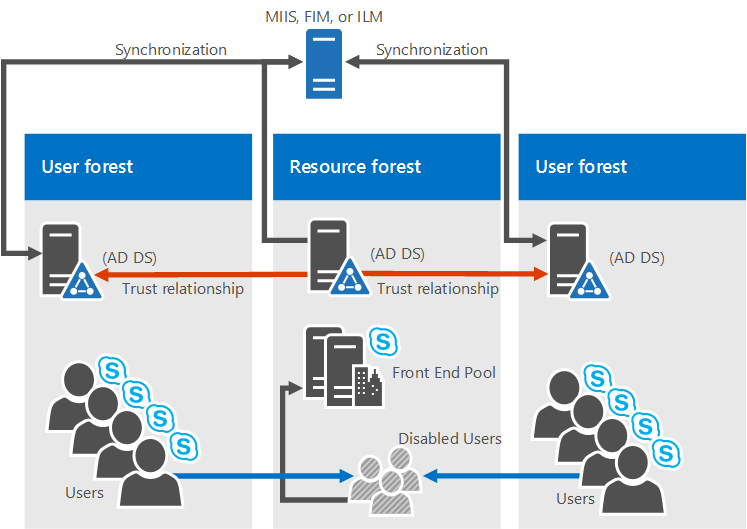

# Требования к окружающей среде для Skype для бизнеса Server 2015 г.
 
**Сводка:** Настройка не серверных требований для Skype для бизнеса Server 2015 г. Перед развертыванием необходимо настроить множество вещей, в том числе Active Directory, DNS, Certs и Fileshares.
  
Какое экологическое требование для Skype для бизнеса Server 2015 г.? Ну, мы поместили в эту тему все, что непосредственно не связано с сервером, поэтому вам не нужно так много щелкнуть. Если вы ищете предпосылки сервера, вы можете проверить требования к серверу для Skype для бизнеса Server [2015](server-requirements.md) [doc.](../../plan-your-deployment/network-requirements/network-requirements.md) Планирование сетей также задокументировано отдельно. В противном случае, это то, что мы получили в этой статье:
  
- [Active Directory](environmental-requirements.md#AD)
  
- [Служба доменных имен (DNS)](environmental-requirements.md#DNS)
  
- [Сертификаты](environmental-requirements.md#Certs)
  
- [Файл Share](environmental-requirements.md#Fileshare)
  
## Active Directory

Несмотря на то, что большое количество данных о конфигурации серверов и служб хранится в Skype для бизнеса Server 2015 г., в Active Directory по-прежнему хранятся некоторые вещи:
  
|**Объекты Active Directory**|**Типы объектов**|
|:-----|:-----|
|Расширения схемы    |Расширения объекта пользователя    |
||Расширения для Lync Server 2013 и Lync Server 2010 для поддержания обратной совместимости с предыдущими поддерживаемыми версиями.    |
|Данные    |URI SIP пользователя и другие пользовательские параметры    |
||Контактные объекты для приложений (например, приложение Группы ответа и приложение ).    |
||Данные, опубликованные для обратной совместимости.    |
||Пункт управления службами (SCP) для центра управления магазином.    |
||Учетная запись проверки подлинности Kerberos (необязательный объект компьютера).    |
   
### ОС для контроллеров домена

Итак, какую ОС контроллера домена можно использовать? У нас есть следующий список:

- Windows Server 2019 (необходимо иметь Skype для бизнеса Server 2015 накопительное обновление 5 или более позднее)
  
- Windows Server 2016
    
- Windows Server 2012 R2
    
- Windows Server 2012
    
- Windows Server 2008 R2
    
- Windows Server 2008
    
Теперь функциональный уровень домена любого домена, в который вы Skype для бизнеса Server 2015 г., и функциональный уровень лесопользования любого леса, в который вы Skype для бизнеса Server 2015 г., должны быть одним из следующих:

- Windows Server 2019 (необходимо иметь Skype для бизнеса Server 2015 накопительное обновление 5 или более позднее)
  
- Windows Server 2016
    
- Windows Server 2012 R2
    
- Windows Server 2012
    
- Windows Server 2008 R2
    
- Windows Server 2008
    
- Windows Server 2003
    
Можно ли использовать контроллеры домена только для чтения в этих средах? Конечно, пока на том же сайте, что и на Skype для бизнеса Server, доступны также контроллеры домена.
  
Теперь важно знать, что Skype для бизнеса Server 2015 не поддерживает однометные домены. Какими? Если у вас есть корневой домен с меткой contoso.local, это будет нормально. Если у вас есть корневой домен с только что названным локальным, он не будет работать и в результате не поддерживается. Немного больше об этом было написано в [этой статье Базы знаний](https://support.microsoft.com/kb/300684/en-us).
  
Skype для бизнеса Server 2015 г. также не поддерживает переименование доменов. Если вам действительно нужно это сделать, вам потребуется удалить Skype для бизнеса Server 2015 г., переименовать домен, а затем Skype для бизнеса Server 2015 г.
  
Наконец, вы можете иметь дело с доменом с заблокированной средой AD DS, и все в порядке. У нас есть дополнительные сведения о развертывании Skype для бизнеса Server 2015 г. в такой среде в docs deployment.
  
### AD Topologies

Skype для бизнеса Server 2015 г. поддерживаемые топологии:
  
- один лес с одним доменом;
    
- один лес с одним деревом и несколькими доменами;
    
- один лес с несколькими деревьями и несвязанными пространствами имен;
    
- несколько лесов в топологии с центральным лесом;
    
- несколько лесов в топологии с лесом ресурсов.
    
- Несколько лесов в топологии Skype для бизнеса леса с Exchange Online
    
- Несколько лесов в топологии леса ресурсов с Skype для бизнеса Online и Azure Active Directory Подключение
    
У нас есть схемы и описания, которые помогут определить топологию, которая имеется в среде, или то, что необходимо настроить до установки Skype для бизнеса Server 2015 г. Чтобы все было просто, мы также включаем клавишу:
  

  
#### один лес с одним доменом;

  
Это не становится проще, чем это, это один лес домена, это распространенная топология.
  
#### один лес с одним деревом и несколькими доменами;

  
На этой схеме снова показан один лес, но в нем также есть один или несколько детских доменов (в этом конкретном примере три). Таким образом, созданный пользователями домен может быть не таким, как Skype для бизнеса Server в 2015 году. Зачем беспокоиться об этом? Важно помнить, что при развертывании пула Skype для бизнеса Server переднего конца все серверы в этом пуле должны быть в одном домене. Администрирование между доменами можно Skype для бизнеса Server поддержку Windows универсальных групп администраторов.
  
Возвращаясь к приведенной выше схеме, можно увидеть, что пользователи из одного домена могут получать доступ к пулам Skype для бизнеса Server из одного домена или из разных доменов, даже если эти пользователи находятся в детском домене.
  
#### один лес с несколькими деревьями и несвязанными пространствами имен;

  
Возможно, у вас есть топология, похожая на эту схему, где у вас есть один лес, но в этом лесу находятся несколько доменов с отдельными пространствами имен AD. Если это так, эта схема является хорошей иллюстрацией, так как у нас есть пользователи в трех различных доменах, Skype для бизнеса Server 2015. Сплошные строки указывают, что они имеют доступ к пулу Skype для бизнеса Server в собственном домене, в то время как пунктирная строка указывает, что они собираются в пул в другом дереве вообще.
  
Как видите, пользователи одного домена, одного дерева или даже другого дерева могут успешно получать доступ к пулам.
  
#### несколько лесов в топологии с центральным лесом;

  
Skype для бизнеса Server 2015 г. поддерживает несколько лесов, настроенных в топологии центрального леса. Если вы не уверены, что это то, что у вас есть, центральный лес в топологии использует объекты в нем, чтобы представлять пользователей в других лесах, и размещены учетные записи пользователей для всех пользователей в лесу.
  
Как это работает? Продукт синхронизации каталогов (например, Forefront Identity Manager или FIM) управляет учетной записью пользователей организации на протяжении всего их существования. Когда учетная запись создается или удаляется из леса, это изменение синхронизируется до соответствующего контакта в центральном лесу.
  
Очевидно, что если инфраструктура AD на месте переехав в эту топологию, может оказаться непростой задачей, но если вы уже там или все еще планируете свою лесную инфраструктуру, это может быть хорошим выбором. Вы можете централизовать развертывание Skype для бизнеса Server 2015 г. в одном лесу, а пользователи могут искать, общаться и просматривать присутствие других пользователей в любом лесу. Все обновления контактов пользователей обрабатываются автоматически с помощью программного обеспечения синхронизации.
  
#### Несколько лесов в топологии Skype для бизнеса лесных ресурсов

  
Также поддерживается топология лесных ресурсов; здесь лес предназначен для запуска серверных приложений, таких как Microsoft Exchange Server и Skype для бизнеса Server 2015 г. В этом лесу ресурсов также размещено синхронизированное представление объектов активных пользователей, но нет учетных записей пользователей с поддержкой логотипа. Таким образом, лес ресурсов — это среда общих служб для других лесов, в которых находятся объекты пользователей, и они имеют отношение доверия уровня леса к лесу ресурсов.
  
Обратите внимание, Exchange Server можно развернуть в том же лесу ресурсов, что и Skype для бизнеса Server или в другом лесу.
  
Чтобы развернуть Skype для бизнеса Server 2015 в этом типе топологии, в лесу ресурсов для каждой учетной записи пользователя в лесах пользователей будет создаваться один отключенный объект пользователя (если Microsoft Exchange Server уже находится в среде, это можно сделать для вас). Затем вам потребуется средство синхронизации каталогов (например, Forefront Identity Manager или FIM) для управления учетной записью пользователей в течение жизненного цикла.
  
#### Несколько лесов в топологии Skype для бизнеса леса с Exchange Online

Эта топология похожа на топологию, описанную в нескольких лесах в топологии лесов Skype для бизнеса [ресурсов.](environmental-requirements.md#BKMK_multipleforestopology)
  
В этой топологии существует один или несколько лесов пользователей, Skype для бизнеса Server развертывается в выделенном лесу ресурсов. Exchange Server можно развернуть локально в одном лесу ресурсов или другом лесу и настроиться на гибрид с Exchange Online, или службы электронной почты могут предоставляться исключительно Exchange Online для учетных записей на месте. Диаграмма для этой топологии отсутствует.
  
#### Несколько лесов в топологии леса ресурсов с Skype для бизнеса Online и Azure Active Directory Подключение

  
В этом сценарии существует несколько лесных массивов с топологией леса ресурсов. Между лесами Active Directory существует полное отношение доверия. Средство Azure Active Directory Подключение используется для синхронизации учетных записей между лесами пользователей на месте и Microsoft 365 или Office 365.
  
 Организация также имеет Microsoft 365 или Office 365 и использует ) Azure Active Directory Подключение для синхронизации собственных учетных записей с Microsoft 365 или Office 365. Пользователи, включенные для Skype для бизнеса, включены через Microsoft 365 или Office 365 и Skype для бизнеса Online. Skype для бизнеса Server не развертывается на месте.
  
Проверка подлинности с одним входом обеспечивается фермой служб Федерации Active Directory, расположенной в лесу пользователей.
  
В этом сценарии поддерживается развертывание локального Exchange, Exchange Online гибридного Exchange или не Exchange развертывание. (Схема показывает только Exchange локальном, но другие Exchange также полностью поддерживаются.)
  
#### Несколько лесов в топологии лесов ресурсов с гибридными Skype для бизнеса

В этом сценарии существует один или несколько пользовательских лесов, и Skype для бизнеса развертывается в выделенном лесу ресурсов и настраивается для гибридного режима с Skype для бизнеса Online. Exchange Server можно развертывать локально в одном лесу ресурсов или другом лесу и настроиться на гибрид с Exchange Online. Кроме того, службы электронной почты могут предоставляться исключительно Exchange Online для локальной учетной записи.
  
Дополнительные сведения см. в [перенастройке многолесной среды для гибридных Skype для бизнеса.](../../../SfbHybrid/hybrid/configure-a-multi-forest-environment-for-hybrid.md?bc=%2fSkypeForBusiness%2fbreadcrumb%2ftoc.json&toc=%2fSkypeForBusiness%2ftoc.json)
  
## Служба доменных имен (DNS)

Skype для бизнеса Server 2015 г. требуется DNS по следующим причинам:
  
- DNS позволяет Skype для бизнеса Server 2015 г. для обнаружения внутренних серверов или пулов, что позволяет использовать связь между серверами и серверами.
    
- DNS позволяет клиентских машинам открывать пул переднего выпуск Standard сервер, используемый для транзакций SIP.
    
- Он связывает простые URL-адреса для конференций с серверами, на которые размещены эти конференции.
    
- DNS позволяет внешним пользователям и клиентских машинам подключаться к вашим edge Servers или обратному прокси-серверу HTTP для обмена мгновенными сообщениями (IM) или конференциинга.
    
- Он позволяет устройствам единой связи(UC), которые не вошли в систему, обнаружить пул переднего выпуск Standard сервера, на который работает веб-служба Обновления устройств, для получения обновлений и отправки журналов.
    
- Использование DNS позволяет мобильным клиентам автоматически открывать ресурсы веб-служб без необходимости вручную вводить URL-адреса в настройках устройств.
    
- Он используется для балансировки нагрузки DNS.
    
Важно отметить, что Skype для бизнеса Server 2015 г. не поддерживает интернационализированные доменные имена (IDNs).
  
И очень важно помнить, что любое имя в DNS идентично имени компьютера, настроенного на любом сервере, используемом Skype для бизнеса Server 2015 г. В частности, мы не можем иметь короткие имена в среде и должны иметь FQDNs для Topology Builder.
  
Это кажется логичным для любого компьютера, уже присоединились к домену, но если у вас есть edge Server, который не присоединился к вашему домену, он может иметь по умолчанию короткое имя, без суффикса домена. Убедитесь, что это не так, как в DNS или на edge Server, Skype для бизнеса Server сервере или пуле 2015 г., если на то пошло.
  
И определенно не используйте символы Юникод или подчеркивает. Стандартные символы (это A-Z, a-z, 0-9 и дефис) — это те, которые будут поддерживаться внешними службами DNS и общедоступными сертификатами (вам потребуется назначить FQDN SN в сертификате, не забывайте), поэтому вы пощадите себя, если назовете это в виду.
  
Дополнительные статьи о требованиях DNS к сетевой сети можно узнать в разделе [Networking](../../plan-your-deployment/network-requirements/network-requirements.md) документации по планированию.
  
## Сертификаты

Одна из самых важных вещей, которые вы можете сделать перед развертывание, это убедиться, что у вас есть сертификаты в порядке. Skype для бизнеса Server 2015 г. необходима инфраструктура общедоступных ключей (PKI) для обеспечения безопасности транспортных слоев (TLS) и взаимной безопасности транспортного слоя (MTLS). В основном для безопасной связи стандартизированным способом Skype для бизнеса Server сертификаты, выдавлимые органами сертификации (CAs).
  
Вот некоторые из вещей, которые Skype для бизнеса Server 2015 использует сертификаты для:
  
- TLS-подключения между клиентами и серверами
    
- для подключений MTLS между серверами;
    
- для федерации с использованием автоматического обнаружения DNS партнеров;
    
- для доступа удаленных пользователей к обмену мгновенными сообщениями;
    
- Внешний доступ пользователей к сеансам аудио- и видеосвязи, совместному доступу к приложениям и конференциям
    
- Беседа с веб-приложениями и Outlook веб-доступом (OWA)
    
Поэтому планирование сертификатов является обязательным. Теперь давайте рассмотрим список некоторых вещей, которые необходимо иметь в виду при запросе сертификатов:
  
- Все сертификаты серверов должны поддерживать авторизацию сервера (EKU сервера).
    
- Все сертификаты серверов должны содержать точку распространения списка отзыва сертификатов (CDP).
    
- Все сертификаты должны подписываться с помощью алгоритма подписи, поддерживаемых операционной системой. Skype для бизнеса Server 2015 г. поддерживает набор пакетов дайджестов SHA-1 и SHA-2 (224, 256, 384 и 512-бит) и отвечает требованиям операционной системы или превышает их.
    
- Автоматическая регистрация поддерживается для внутренних серверов, работающих Skype для бизнеса Server 2015 г.
    
- Автоматическая регистрация не поддерживается для Skype для бизнеса Server 2015 edge Servers.
    
- Запрос на сертификат через Интернет в центр сертификации Windows Server 2003 необходимо подавать с компьютера, работающего под управлением либо Windows Server 2003 с пакетом обновления 2 (SP2), либо Windows XP.
    
> [!NOTE]
> Хотя KB922706 поддерживает решение проблем с регистрацией веб-сертификатов для веб-регистрации служб сертификатов Windows Server 2003, это не позволяет использовать Windows Server 2008, Windows Vista или Windows 7 для запроса сертификата от Windows Server 2003 CA. 
  
> [!NOTE]
> Использование алгоритма подписи RSASSA-PSS неподтверждется и может привести к ошибкам при входе в систему и проблемам с переадпортом вызовов. 

> [!NOTE]
> Skype для бизнеса Server 2015 г. не поддерживает сертификаты CNG.
  
- Поддерживаются длины ключей шифрования 1024, 2048 и 4096. Рекомендуется использовать длины ключей 2048 и более.
    
- Дайджест по умолчанию или подписание хаша — алгоритм RSA. Поддерживаются ECDH_P256, ECDH_P384 и ECDH_P521 алгоритмы.
    
Так что много думать, и, безусловно, существует множество уровней комфорта с запросом сертификатов из ЦС. Ниже приведены дополнительные рекомендации, которые сделают планирование максимально безболезненно.
  
### Сертификаты для внутренних серверов

Вам потребуется сертификаты для большинства внутренних серверов, и, скорее всего, вы получите их из внутреннего ЦС (это один из них, расположенный в вашем домене). Если вы хотите, вы можете запросить эти сертификаты из внешнего ЦС (один из них расположен в Интернете). Если вам интересно, в какой общедоступный ЦС следует перейти, вы можете проверить список партнеров сертификата [единой](../../../SfbPartnerCertification/certification/services-ssl.md) связи.
  
Вам также потребуется сертификаты, когда Skype для бизнеса Server 2015 г. взаимодействует с другими приложениями и серверами, такими как Microsoft Exchange Server. Очевидно, что это должен быть сертификат, который эти другие приложения и серверы могут использовать с поддержкой. Skype для бизнеса Server 2015 г. и другие продукты Майкрософт поддерживают протокол Open Authorization (OAuth) для проверки подлинности и авторизации от сервера к серверу. Если вы заинтересованы в этом, у нас есть дополнительная статья планирования для OAuth и Skype для бизнеса Server 2015.
  
Skype для бизнеса Server 2015 г. также включает поддержку (без необходимости) сертификатов, подписанных с помощью функции криптографического хаша SHA-256. Для поддержки внешнего доступа с помощью SHA-256 внешний сертификат должен быть выдан общедоступным ЦС с помощью SHA-256.
  
Чтобы попытаться сохранить все просто, мы поместили требования к сертификатам для серверов выпуск Standard, пулов переднего плана и других ролей в следующие таблицы, а вымышленные contoso.com используются в примерах (возможно, вы будете использовать что-то другое для вашей среды). Это все стандартные сертификаты веб-сервера с закрытыми ключами, которые не экспортируются. Некоторые дополнительные вещи, которые следует отметить:
  
- Использование расширенного ключа сервера (EKU) автоматически настраивается при использовании мастера сертификатов для запроса сертификатов.
    
- Каждое удобное имя сертификата должно быть уникальным в магазине компьютера.
    
- В примере имен ниже, если вы sipinternal.contoso.com или sipexternal.contoso.com в DNS, они должны быть добавлены в альтернативное имя субъекта сертификата (SAN).
    
Сертификаты для выпуск Standard серверов:
  
|**Сертификат**|**Имя субъекта/общее имя**|**Альтернативное имя субъекта**|**Пример**|**Comments**|
|:-----|:-----|:-----|:-----|:-----|
|По умолчанию    |Полное доменное имя пула    |FQDN пула и FQDN сервера    Если существует несколько доменов SIP и включена автоматическая настройка клиента, мастер сертификатов обнаруживает все поддерживаемые полные доменные имена SIP.    Если этот пул является сервером для автоматического входа клиентов и для групповой политики требуется строгое сопоставление DNS-имен, также необходимы записи для sip.sipdomain (для каждого домена SIP).    |SN=se01.contoso.com; SAN=se01.contoso.com    Если этот пул предназначен для сервера автоматического входа для клиентов, а в групповой политике требуется строгое сопоставление DNS, необходимо также добавить строки SAN=contoso.com SIP; SAN=fabrikam.com SIP.    |На сервере Standard Edition полное доменное имя сервера совпадает с полным доменным именем пула.    Мастер обнаруживает домены SIP, указанные во время установки, и автоматически добавляет их в качестве альтернативных имен субъекта.    Вы также можете использовать этот сертификат для проверки подлинности между серверами.    |
|Внутренняя сеть    |Полное доменное имя сервера    |Каждое из следующих:    • Внутренний веб-FQDN (то же самое, что и FQDN сервера)    AND    • Встреча с простыми URL-адресами    • Простой URL-адрес с диалогом    • Простой URL-адрес администратора    OR    • Запись под диктовки для простых URL-адресов    |SN=se01.contoso.com; SAN=se01.contoso.com; SAN=meet.contoso.com; SAN=meet.fabrikam.com; SAN=dialin.contoso.com; SAN=admin.contoso.com    Использование групповых сертификатов:    SN=se01.contoso.com; SAN=se01.contoso.com; SAN= \* .contoso.com    |Нельзя переопределять внутренний веб-FQDN в Topology Builder.    Если у вас есть несколько простых URL-адресов Meet, необходимо включить все их в качестве SANs.    Для простых URL-адресов поддерживаются подстановочные записи.    |
|Внешняя сеть    |Полное доменное имя сервера    |Каждое из следующих:    • Внешний веб-FQDN    AND    • Простой URL-адрес с диалогом    • Встреча простых URL-адресов в домене SIP    OR    • Запись под диктовки для простых URL-адресов    |SN=se01.contoso.com; SAN=webcon01.contoso.com; SAN=meet.contoso.com; SAN=meet.fabrikam.com; SAN=dialin.contoso.com    Использование групповых сертификатов:    SN=se01.contoso.com; SAN=webcon01.contoso.com; SAN= \* .contoso.com    |Если у вас есть несколько простых URL-адресов Meet, необходимо включить их в качестве альтернативных имен субъекта.    Для простых URL-адресов поддерживаются подстановочные записи.    |
   
Сертификаты для серверов переднего выпуск Enterprise переднего конца:
  
|**Сертификат**|**Имя субъекта/общее имя**|**Альтернативное имя субъекта**|**Пример**|**Comments**|
|:-----|:-----|:-----|:-----|:-----|
|По умолчанию    |Полное доменное имя пула    |FQDN пула и FQDN сервера    Если существует несколько доменов SIP и включена автоматическая настройка клиента, мастер сертификатов обнаруживает все поддерживаемые полные доменные имена SIP.    Если этот пул является сервером для автоматического входа клиентов и для групповой политики требуется строгое сопоставление DNS-имен, также необходимы записи для sip.sipdomain (для каждого домена SIP).    |SN=eepool.contoso.com; SAN=eepool.contoso.com; SAN=ee01.contoso.com    Если этот пул предназначен для сервера автоматического входа для клиентов, а в групповой политике требуется строгое сопоставление DNS, необходимо также добавить строки SAN=contoso.com SIP; SAN=fabrikam.com SIP.    |Мастер обнаруживает все домены SIP, указанные вами во время установки, и автоматически добавляет их в альтернативное имя субъекта.    Вы также можете использовать этот сертификат для проверки подлинности между серверами.    |
|Внутренняя сеть    |Полное доменное имя пула    |Каждое из следующих:    • Внутренний веб-FQDN (который не то же самое, что и FQDN сервера)    • Сервер FQDN    • Skype для бизнеса пула FQDN    AND    • Встреча с простыми URL-адресами    • Простой URL-адрес с диалогом    • Простой URL-адрес администратора    OR    • Запись под диктовки для простых URL-адресов    |SN=ee01.contoso.com; SAN=ee01.contoso.com; SAN=meet.contoso.com; SAN=meet.fabrikam.com; SAN=dialin.contoso.com; SAN=admin.contoso.com    Использование групповых сертификатов:    SN=ee01.contoso.com; SAN=ee01.contoso.com; SAN= \* .contoso.com    |Если у вас есть несколько простых URL-адресов Meet, необходимо включить их в качестве альтернативных имен субъекта.    Для простых URL-адресов поддерживаются подстановочные записи.    |
|Внешняя сеть    |Полное доменное имя пула    |Каждое из следующих:    • Внешний веб-FQDN    AND    • Простой URL-адрес с диалогом    • Простой URL-адрес администратора    OR    • Запись под диктовки для простых URL-адресов    |SN=ee01.contoso.com; SAN=webcon01.contoso.com; SAN=meet.contoso.com; SAN=meet.fabrikam.com; SAN=dialin.contoso.com    Использование групповых сертификатов:    SN=ee01.contoso.com; SAN=webcon01.contoso.com; SAN= \* .contoso.com    |Если у вас есть несколько простых URL-адресов Meet, необходимо включить их в качестве альтернативных имен субъекта.    Для простых URL-адресов поддерживаются подстановочные записи.    |
   
Сертификаты для директора:
  
|**Сертификат**|**Имя субъекта/общее имя**|**Альтернативное имя субъекта**|**Пример**|
|:-----|:-----|:-----|:-----|
|По умолчанию    |Пул директоров    |FQDN директора, FQDN пула Директора.    Если этот пул является автоматическим сервером для клиентов и строгим соответствием DNS в групповой политике, вам также потребуются записи для sip.sipdomain (для каждого домена SIP у вас есть).    |pool.contoso.com; SAN=dir01.contoso.com    Если этот пул Директоров предназначен для сервера автоматического входа для клиентов, а в групповой политике требуется строгое сопоставление DNS, необходимо также добавить строки SAN=contoso.com SIP; SAN=fabrikam.com SIP.    |
|Внутренняя сеть    |Полное доменное имя сервера    |Каждое из следующих:    • Внутренний веб-FQDN (то же самое, что и FQDN сервера)    • Сервер FQDN    • Skype для бизнеса пула FQDN    AND    • Встреча с простыми URL-адресами    • Простой URL-адрес с диалогом    • Простой URL-адрес администратора    OR    • Запись под диктовки для простых URL-адресов    |SN=dir01.contoso.com; SAN=dir01.contoso.com; SAN=meet.contoso.com; SAN=meet.fabrikam.com; SAN=dialin.contoso.com; SAN=admin.contoso.com    Использование групповых сертификатов:    SN=dir01.contoso.com; SAN=dir01.contoso.com SAN= \* .contoso.com    |
|Внешняя сеть    |Полное доменное имя сервера    |Каждое из следующих:    • Внешний веб-FQDN    AND    • Встреча простых URL-адресов в домене SIP    • Простой URL-адрес с диалогом    OR    • Запись под диктовки для простых URL-адресов    |Внешний веб-FQDN Director должен быть отличается от пула переднего конца или переднего end Server.    SN=dir01.contoso.com; SAN=directorwebcon01.contoso.com SAN=meet.contoso.com; SAN=meet.fabrikam.com; SAN=dialin.contoso.com    Использование групповых сертификатов:    SN=dir01.contoso.com; SAN=directorwebcon01.contoso.com SAN= \* .contoso.com    |
   
Сертификаты для отдельного сервера-посредника:
  
|**Сертификат**|**Имя субъекта/общее имя**|**Альтернативное имя субъекта**|**Пример**|
|:-----|:-----|:-----|:-----|
|По умолчанию    |Полное доменное имя пула    |Полное доменное имя пула    FQDN сервера участника пула    |SN=medsvr-pool.contoso.net; SAN=medsvr-pool.contoso.net; SAN=medsvr01.contoso.net    |
   
Сертификаты для устройства для сохранившихся филиалов:
  
|**Сертификат**|**Имя субъекта/общее имя**|**Альтернативное имя субъекта**|**Пример**|
|:-----|:-----|:-----|:-----|
|По умолчанию    |Полное доменное имя устройства    |SIP.\<sipdomain\> (для одного домена SIP требуется только одна запись)    |SN=sba01.contoso.net; SAN=sip.contoso.com; SAN=sip.fabrikam.com    |
   
### Сертификаты для сервера сохраняемой беседы

При установке сервера постоянного чата потребуется сертификат, выданный тем же ЦС, что и внутренний сервер Skype для бизнеса Server 2015 г. Это необходимо сделать для каждого сервера с постоянными веб-службами чата для файловой Upload/Download. Мы настоятельно рекомендуем вам иметь необходимый сертификат (s) перед началом установки стойких чатов, и если ваш ЦС является внешним, тем более (эти вещи могут занять немного времени, чтобы быть выданы).
  
### Сертификаты для внешнего доступа к пользователю (Edge)

Skype для бизнеса Server 2015 г. поддерживает использование  единого открытого сертификата для внешних интерфейсов edge доступа и веб-конференций, а также службы проверки подлинности A/V, которая предоставляется через edge Server(s). Внутренний интерфейс Edge обычно использует частный сертификат, выданный внутренним ЦС, но если вы хотите, для этого можно использовать и общедоступный сертификат, если он из доверенного ЦС.
  
Обратный прокси-сервер (RP) также будет использовать общедоступный сертификат, который шифрует сообщение от RP до клиентов и RP на внутренние серверы с помощью HTTP (точнее, TLS над HTTP).
  
### Сертификаты для мобильности

Если вы развертываете мобильность и поддерживаете автоматическое обнаружение для мобильных клиентов, вам потребуется включить дополнительные записи альтернативных имен субъекта в сертификаты для поддержки безопасных подключений от мобильных клиентов.
  
Какие сертификаты? Для автоматического обнаружения в сертификатах здесь нужны имена SAN:
  
- Пул директоров
    
- Интерфейсный пул
    
- Обратный прокси-сервер
    
Ниже мы перечислим конкретные особенности в каждой таблице.
  
Здесь хорошо немного предварительного планирования, но иногда вы развернули Skype для бизнеса Server 2015 г., не намереваясь развернуть мобильность, и это сводится к черте, когда у вас уже есть сертификаты в среде. Переиздание их через внутренний ЦС обычно довольно просто, но с общедоступными сертификатами из общедоступных ЦС это может быть немного дороже.
  
Если это то, что вы ищете, и если у вас много доменов SIP (что сделает добавление SANS более дорогим), вы можете настроить обратный прокси для использования HTTP для первоначального запроса службы автообнаружания, а не с помощью HTTPS (это конфигурация по умолчанию). В разделе Планирование мобильности дополнительные сведения по этому вопросу.
  
Требования к пулу директоров и сертификату переднего конечных пула:
  
|**Описание**|**Запись SAN**|
|:-----|:-----|
|URL-адрес внутренней службы автооткрытия    |SAN=lyncdiscoverinternal.\<sipdomain\>    |
|URL-адрес службы внешней автооткрытия    |SAN=lyncdiscover.\<sipdomain\>    |
   
Можно также использовать SAN= \* .\<sipdomain\>
  
Требования к сертификату обратного прокси-сервера (public CA):
  
|**Описание**|**Запись SAN**|
|:-----|:-----|
|URL-адрес службы внешней автооткрытия    |SAN=lyncdiscover.\<sipdomain\>    |
   
Этот SAN должен быть назначен сертификату, назначенного прослушивательу SSL на обратном прокси-сервере.
  
> [!NOTE]
> Обратный прокси-прослушиватель будет иметь SANs для внешнего URL-адреса веб-служб(ы). В качестве некоторых примеров можно привести SAN=skypewebextpool01.contoso.com и dirwebexternal.contoso.com, если вы развернули director (это необязательно). 
  
## Файловый ресурс

Skype для бизнеса Server 2015 г. может использовать один и тот же файл для всего хранилища файлов. Необходимо помнить следующее:
  
- Доля файлов должна быть на непосредственном присоединенном хранилище (DAS) или сети области хранения (SAN), и это включает распределенную файловую систему (DFS), а также избыточный массив независимых дисков (RAID) для файловых магазинов. Дополнительные чтения на DFS для Windows Server 2012, ознакомьтесь [с этой страницей DFS](/previous-versions/windows/it-pro/windows-server-2012-R2-and-2012/jj127250(v=ws.11)).
    
- Рекомендуется общий кластер для общего файла. Если используется один из них, необходимо Windows Server 2012 или Windows Server 2012 R2. Windows Допустим и сервер 2008 R2. Почему последний Windows? Более старые версии могут не иметь нужных разрешений, чтобы включить все функции. Для создания файловой доли можно использовать  администратора кластера, и это поможет вам в создании файлов в статье кластера.
    
> [!CAUTION] 
> Вы должны знать, что использование сетевого подключенного хранилища (NAS) в качестве файла не поддерживается, поэтому используйте один из перечисленных выше вариантов. 
