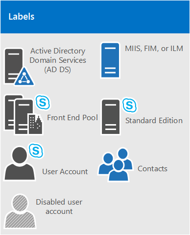

# Требования к среде Skype для бизнеса Server 2015Environmental requirements for Skype for Business Server 2015
 
**Сводка:** Настройка серверных требований для Скайп для Business Server 2015.**Summary:** Configure your non-server requirements for Skype for Business Server 2015. Перед развертыванием вам потребуется настроить множество компонентов, включая Active Directory, DNS, сертификаты и файловые ресурсы.There are a variety of things you'll want configured before doing your deployment, including Active Directory, DNS, Certs and Fileshares.
  
Что такое окружающей среды требование к Скайп для Business Server 2015?What is an environmental requirement for Skype for Business Server 2015? Итак мы собрали все, что не непосредственно связанных с в этом разделе, поэтому вам не потребуется выполнить как намного выберите команду, применимую к серверу.Well, we've put everything that's not directly server related into this topic, so you don't have to do as much clicking around. Если вы ищете требования для установки сервера, можно извлечь док [требования к серверу для Скайп для Business Server 2015](server-requirements.md) [Сети планирования](../../plan-your-deployment/network-requirements/network-requirements.md) также описана отдельно.If you're looking for Server Prerequisites, you can check out the [Server requirements for Skype for Business Server 2015](server-requirements.md) doc.[Networking Planning](../../plan-your-deployment/network-requirements/network-requirements.md) is also documented separately. В противном случае — это то, что у нас есть в этой статье:Otherwise, this is what we've got in this article:
  
- [Active DirectoryActive Directory](environmental-requirements.md#AD)
  
- [Служба доменных имен (DNS)Domain Name System (DNS)](environmental-requirements.md#DNS)
  
- [СертификатыCertificates](environmental-requirements.md#Certs)
  
- [Файловый ресурсFile Share](environmental-requirements.md#Fileshare)
  
## Active DirectoryActive Directory

Хотя большого объема данных конфигурации для серверов и служб хранится в Скайп для Business Server 2015 центрального хранилища управления, существуют некоторые факторы, по-прежнему хранятся в Active Directory:While a lot of configuration data for servers and services is stored in Skype for Business Server 2015's Central Management store, there are some things still stored in Active Directory:
  
|**Объекты Active Directory****Active Directory objects**|**Типы объектов****Object types**|
|:-----|:-----|
|Расширения схемыSchema extensions    |Расширения объекта пользователяUser object extensions    |
||Расширения для Lync Server 2013 и Lync Server 2010 для поддержки обратной совместимости с предыдущими поддерживаемыми версиями.Extensions for Lync Server 2013 and Lync Server 2010, to maintain backward compatibility with the previous supported versions.    |
|ДанныеData    |URI SIP пользователя и другие пользовательские параметрыUser SIP URI and other user settings    |
||Контактные объекты для приложений (например, приложения группы ответа и помощник по конференц-связи приложения).Contact objects for applications (like the Response Group application and the Conferencing Attendant application).    |
||Данные, опубликованные для совместимости с предыдущими версиями.Data published for backward compatibility.    |
||Элемент управления службы точки подключения службы для центрального хранилища управления.A service control point (SCP) for the Central Management store.    |
||Учетная запись Kerberos для проверки подлинности (необязательный объект-компьютер).Kerberos Authentication Account (an optional computer object).    |
   
### ОС для контроллеров доменовOS for Domain Controllers

Ниже приведен список допустимых ОС для контроллеров доменов:So, what Domain Controller OS can be used? We have the following list:
  
- Windows Server 2016Windows Server 2016
    
- Windows Server 2012 R2Windows Server 2012 R2
    
- Windows Server 2012Windows Server 2012
    
- Windows Server 2008 R2Windows Server 2008 R2
    
- Windows Server 2008Windows Server 2008
    
Теперь из любого домена, Скайп развертывания для бизнеса 2015 сервера в режим работы домена и леса любого леса, Скайп развертывания для Business Server 2015, которых необходимо одно из следующих:Now, the domain functional level of any domain you deploy Skype for Business Server 2015 into, and the forest functional level of any forest you deploy Skype for Business Server 2015 into, have to be one of the following:
  
- Windows Server 2016Windows Server 2016
    
- Windows Server 2012 R2Windows Server 2012 R2
    
- Windows Server 2012Windows Server 2012
    
- Windows Server 2008 R2Windows Server 2008 R2
    
- Windows Server 2008Windows Server 2008
    
- Windows Server 2003Windows Server 2003
    
Допускается наличие в этих средах контроллеров доменов, доступных только для чтения. Однако необходимым условием является наличие контроллеров доменов, доступных для записи.Can you have read-only domain controllers in these environments? Sure, as long as there are also writable domain controller available.
  
Теперь важно знать, что Скайп для Business Server 2015 не поддерживает с меткой одним доменов.Now, it's important to know that Skype for Business Server 2015 doesn't support single-labeled domains. Что это такое?What are they? При наличии корневого домена с меткой contoso.local, который будет нормально.If you have a root domain labeled contoso.local, that's going to be fine. При наличии корневого домена, который только что с именем локального, который не будет работать и в результате не поддерживается.If you have a root domain that's just named local, that's not going to work, and it's not supported as a result. Немного больше об этом был записан [в этой статье базы знаний](https://support.microsoft.com/kb/300684/en-us).A little more about this has been written [in this Knowledge Base article](https://support.microsoft.com/kb/300684/en-us).
  
Скайп для Business Server 2015 не поддерживает переименования доменов.Skype for Business Server 2015 also doesn't support renaming domains. Если вы знаете действительно для этого, будет требуется удаление Скайп для Business Server 2015, выполните Переименование домена затем переустановить Скайп для Business Server 2015.If you've really got to do that, then you'll need to uninstall Skype for Business Server 2015, do the domain rename, and then reinstall Skype for Business Server 2015.
  
Наконец может иметь дело с доменом с заблокированной среде Доменные службы Active Directory, и все в порядке.Finally, you may be dealing with a domain with a locked-down AD DS environment, and that's all right. У нас есть Дополнительные сведения о развертывании Скайп для Business Server 2015 в такого рода среды в документах развертывания.We have more information on how to deploy Skype for Business Server 2015 into that sort of environment in the Deployment docs.
  
### Топологии ADAD Topologies

Скайп для поддерживаемых топологий Business Server 2015 являются:Skype for Business Server 2015's supported topologies are:
  
- Один лес с одним доменомSingle forest with single domain
    
- Один лес с одним деревом и несколькими доменамиSingle forest with a single tree and multiple domains
    
- Один лес с несколькими деревьями и несвязанными пространствами именSingle forest with multiple trees and disjoint namespaces
    
- Несколько лесов в топологии с центральным лесомMultiple forests in a central forest topology
    
- Несколько лесов в топологии с лесом ресурсовMultiple forests in a resource forest topology
    
- Несколько лесов в топологии с лесом ресурсов Skype для бизнеса с Exchange OnlineMultiple forests in a Skype for Business resource forest topology with Exchange Online
    
- Несколько лесов в топологии с лесом ресурсов с Skype для бизнеса Online и Azure Active Directory ConnectMultiple forests in a resource forest topology with Skype for Business Online and Azure Active Directory Connect
    
У нас есть схемы и описания, которые помогут вам определить, какую топологию, у вас есть в вашей среде или какие может потребоваться настроить перед установкой Скайп для Business Server 2015.We have diagrams and descriptions to help you determine what topology you have in your environment, or what you may need to set up prior to installing Skype for Business Server 2015. Для простоты, также включая ключа:To keep it simple, we're also including a key:
  

  
#### Один лес с одним доменомSingle forest with single domain

  
Не становится проще, чем это, леса с одним доменом, а это типичные топологии.It doesn't get easier than this, it's a single domain forest, this is a common topology.
  
#### Один лес с одним деревом и несколькими доменамиSingle forest with a single tree and multiple domains

  
На схеме показан один лес с одним или несколькими дочерними доменами (в данном примере с тремя).This diagram shows a single forest, again, but it has one or more child domains as well (there are three in this specific example). Поэтому домен, в котором пользователи создаются в может отличаться от домена Скайп for Business Server 2015 развертывается на.So the domain the users are created in might be different from the domain Skype for Business Server 2015 is deployed to. Это не препятствует нормальной работе.Why worry about this? Важно помнить, что при развертывании Скайп для пула переднего плана Business Server, все серверы в этом пуле, должны быть в одном домене.It's important to remember that when you deploy a Skype for Business Server Front End pool, all the servers in that pool need to be in a single domain. Может иметь доменам Администрирование с помощью Скайп для поддержки Business Server групп универсальные администраторов Windows.You can have cross-domain administration via Skype for Business Server's support of Windows universal administrator groups.
  
Вернуться к схеме выше можно увидеть, что пользователей из одного домена имеют доступ к Скайп для пулов Business Server из того же домена или из разных доменов, даже если эти пользователи в дочернем домене.Back to the diagram above, you can see that users from one domain are able to access Skype for Business Server pools from the same domain or from different domains, even if those users are in a child domain.
  
#### Один лес с несколькими деревьями и несвязанными пространствами именSingle forest with multiple trees and disjoint namespaces

  
Может быть, у вас есть топологии примерно на этом рисунке, при наличии одного леса, но в пределах леса являются несколько доменов, с помощью отдельных пространства имен AD.It may be that you've got a topology similar to this diagram, where you have one forest, but within that forest are multiple domains, with separate AD namespaces. Если это так, на этом рисунке 's хороший иллюстрации, как у нас есть пользователи в трех разных доменах, доступ к Скайп для Business Server 2015.If that's the case, this diagram's a good illustration, as we have users in three different domains accessing Skype for Business Server 2015. Линия указывает, что они доступ к которым осуществляется Скайп для пула Business Server в том же домене, в то время как пунктирная линия указывает, что они будут пула в другое дерево полностью.Solid lines indicate they're accessing a Skype for Business Server pool in their own domain, while a dashed line indicates they're going to a pool in a different tree altogether.
  
Как показано на схеме, пулы доступны пользователям из того же домена, из того же дерева и даже из других деревьев.As you can see, users in the same domain, the same tree, or even a different tree are able to access pools successfully.
  
#### Несколько лесов в топологии с центральным лесомMultiple forests in a central forest topology

  
Скайп для Business Server 2015 поддерживает несколько лесов, настроенных в топологии с центральным лесом.Skype for Business Server 2015 does support multiple forests configured in a central forest topology. Если вы не знаете, которая является то, что у вас есть, центральный лес в топологии использует объекты в нем для представления пользователей в других лесов и узлов учетные записи пользователей для всех пользователей в лесу.If you're not sure that's what you have, the central forest in the topology uses objects in it to represent users in the other forests, and hosts user accounts for any users in the forest.
  
Эта топология функционирует следующим образом.How does this work? Также продукт для синхронизации службы каталогов (например, Forefront Identity Manager или FIM) Управление учетными записями пользователей вашей организации во всем их существования.Well, a directory synchronization product (such as Forefront Identity Manager, or FIM) manages your organization's user accounts throughout their existence. При создании или удалении учетной записи в лесу это изменение синхронизируется с соответствующим контактом в центральном лесу.When an account is created or deleted from a forest, that change is synched up to the corresponding contact in the central forest.
  
Очевидно если ваша инфраструктура AD на месте перемещение Эта топология может быть простой, но если вы уже существует, или по-прежнему планирования инфраструктуры леса в работе, это может быть хорошим выбором.Clearly, if your AD infrastructure is in-place moving to this topology might not be easy, but if you're already there, or still planning out your forest infrastructure, this can be a good choice. Хотя пользователи могут поиска, общаться и просматривать сведения о присутствии других пользователей в любом лесу можно централизовать вашей Скайп для развертывания Business Server 2015 в пределах одного леса.You can centralize your Skype for Business Server 2015 deployment within a single forest, while users can search, communicate, and view the presence of other users in any forest. Обновление всех контактов пользователей выполняются автоматически с помощью программного обеспечения синхронизации.All user contact updates are handled automatically with synchronization software.
  
#### Несколько лесов в топологии с лесом ресурсов Skype для бизнесаMultiple forests in a Skype for Business resource forest topology

  
Топологии с лесом ресурсов также поддерживается; Это где выделенный лес для выполнения сервера приложений, как Скайп для Business Server 2015 и Microsoft Exchange Server.A resource forest topology is also supported; it's where a forest is dedicated to running your server applications, like Microsoft Exchange Server and Skype for Business Server 2015. В таких лесах ресурсов размещается также синхронизированное представление активных объектов-пользователей, но не могут размещаться учетные записи пользователей, по которым возможен вход в систему.This resource forests also hosts a synchronized representation of active user objects, but no logon-enabled user accounts. Таким образом, лес ресурсов представляет собой среду общих служб для других лесов, в которых расположены объекты-пользователи; при этом на уровне лесов поддерживаются отношения доверия с лесом ресурсов.So the resource forest is a shared services environment for other forests in which user objects reside, and they have a forest-level trust relationship with the resource forest.
  
Обратите внимание на то, что в одном лесу ресурсов с Скайп для Business Server или в другом лесу можно развернуть Exchange Server.Note that Exchange Server can be deployed in the same resource forest as Skype for Business Server or in a different forest.
  
Чтобы развернуть Скайп для Business Server 2015 в этом типе топологии, при создании один объект отключенных пользователей леса ресурсов для каждой учетной записи пользователя в лесах пользователя (если Microsoft Exchange Server в среде, это можно сделать для вас).To deploy Skype for Business Server 2015 in this type of topology, you'd create one disabled user object in the resource forest for each user account in the user forests (if Microsoft Exchange Server is already in the environment, this might be done for you). Затем необходимо средства синхронизации каталогов (например, Forefront Identity Manager или FIM) для управления учетных записей пользователей с помощью их жизненного цикла.Then you'll need a directory synchronization tool (like Forefront Identity Manager, or FIM) to manage user accounts through their life cycle.
  
#### Несколько лесов в топологии с лесом ресурсов Skype для бизнеса с Exchange OnlineMultiple forests in a Skype for Business resource forest topology with Exchange Online

Эта топология аналогична топологии, описанной в разделе [Несколько лесов в топологии Skype для бизнеса с лесом ресурсов (Multiple forests in a Skype for Business resource forest topology)](environmental-requirements.md#BKMK_multipleforestopology).This topology is similar to the topology described in [Multiple forests in a Skype for Business resource forest topology](environmental-requirements.md#BKMK_multipleforestopology).
  
В этой топологии существует один или несколько лесов пользователя и Скайп для Business Server развертывается в лесу выделенных ресурсов.In this topology, there are one or more user forests, and Skype for Business Server is deployed in a dedicated resource forest. Сервер Exchange может быть развертываются локально в том же лесу ресурсов или из другого леса и настроенная для гибридной работы с Exchange Online или службы электронной почты может быть реализована исключительно Exchange Online для локальных учетных записей.Exchange Server can be deployed on-premises in the same resource forest or a different forest and configured for hybrid with Exchange Online, or email services may be provided exclusively by Exchange Online for the on-premises accounts. Схема не доступна для данной топологии.There is no diagram available for this topology.
  
#### Несколько лесов в топологии с лесом ресурсов с Skype для бизнеса Online и Azure Active Directory ConnectMultiple forests in a resource forest topology with Skype for Business Online and Azure Active Directory Connect

  
При данном сценарии несколько лесов расположены локально с топологией с лесом ресурсов, что является отношением полного доверия между лесами Active Directory. Служба Azure Active Directory Connect используется для синхронизации учетных записей между локальными лесами пользователей и Office 365.With this scenario, there are multiple forests on-premises, with a resource forest topology. There is a full trust relationship between the Active Directory forests. The Azure Active Directory Connect tool is used to synchronize accounts between the on-premises user forests and Office 365.
  
 Организации Office 365, а также использует [Подключения Azure Active Directory](https://go.microsoft.com/fwlink/p/?LinkId=614836) для синхронизации своих локальных учетных записей с помощью Office 365.The organization also has Office 365, and uses [Azure Active Directory Connect](https://go.microsoft.com/fwlink/p/?LinkId=614836) to synchronize their on-premises accounts with Office 365. Пользователи, которым разрешена Скайп для бизнеса включены с помощью Office 365 и Скайп для бизнеса в Интернет.Users who are enabled for Skype for Business are enabled via Office 365 and Skype for Business Online. Скайп для Business Server не развертываются локально.Skype for Business Server is not deployed on-premises.
  
Единого входа проверки подлинности предоставляется в ферму служб федерации Active Directory, расположенных в лесу пользователя.Single sign-on authentication is provided by an Active Directory Federation Services farm located in the user forest.
  
В этом сценарии поддерживается для развертывания Exchange в локальной, Exchange Online гибридного решения Exchange, или чтобы отказаться от Exchange развернут на всех.In this scenario, it is supported to deploy Exchange on-premises, Exchange Online, a hybrid Exchange solution, or to not have Exchange deployed at all. (На схеме изображены только локальные службы Exchange, однако другие решения Exchange также полностью поддерживаются.)(The diagram shows only Exchange on-premises, but the other Exchange solutions are also fully supported.)
  
#### Несколько лесов в топологии с лесом ресурсов с гибридным развертыванием Skype для бизнеса и Azure Active Directory Connect Multiple forests in a resource forest topology with hybrid Skype for Business

В этом сценарии имеется одна или несколько локальных пользователей лесов, и Скайп для бизнеса развертывается в лесу выделенных ресурсов и настроен режим гибридного с Скайп для бизнеса в Интернет.In this scenario, there are one or more on-premises user forests, and Skype for Business is deployed in a dedicated resource forest and is configured for hybrid mode with Skype for Business Online. Exchange Server может быть развертываются локально в том же лесу ресурсов или из другого леса и может быть настроен для гибридной работы с Exchange Online.Exchange Server can be deployed on-premises in the same resource forest or a different forest and may be configured for hybrid with Exchange Online. Кроме того службы электронной почты может предоставляться исключительно с Exchange Online для локальных учетных записей.Alternatively, email services may be provided exclusively by Exchange Online for the on-premises accounts.
  
Дополнительные сведения можно [настроить среду нескольких лесов для гибридных Скайп для бизнеса](../../skype-for-business-hybrid-solutions/deploy-hybrid-connectivity/configure-a-multi-forest-environment-for-hybrid.md).For more information, see [Configure a multi-forest environment for hybrid Skype for Business](../../skype-for-business-hybrid-solutions/deploy-hybrid-connectivity/configure-a-multi-forest-environment-for-hybrid.md).
  
## Служба доменных имен (DNS)Domain Name System (DNS)

Скайп для Business Server 2015 требуется DNS, по следующим причинам:Skype for Business Server 2015 requires DNS, for the following reasons:
  
- DNS позволяет Скайп для 2015 Business Server для обнаружения внутренних серверов или пулов, позволяя обеспечить обмен данными сервер сервер.DNS enables Skype for Business Server 2015 to discover internal servers or pools, allowing for server-to-server communications.
    
- DNS позволяет клиентских компьютеров для обнаружения пула переднего плана или сервера Standard Edition, используемый для транзакций SIP.DNS allows client machines to discover the Front End pool or Standard Edition server being used for SIP transactions.
    
- Она обеспечивает связывание простых URL‑адресов для конференций с серверами, на которых размещаются эти конференции.It associates simple URLs for conferences with the servers hosting those conferences.
    
- DNS позволяет внешним пользователям и клиентских компьютерах, для подключения к пограничных серверов, или HTTP обратного прокси-сервера, обмена мгновенными сообщениями обмена Мгновенными сообщениями или конференц-связи.DNS allows external users and client machines to connect to your Edge Servers, or the HTTP reverse proxy, for instant messaging (IM) or conferencing.
    
- Позволяет объединенных коммуникаций (UC) устройств, которые не вошли в обнаружения пула переднего плана или сервера Standard Edition, на котором работает веб-службы обновления устройств для получения обновлений и отправлять журналы.It lets unified communications (UC) devices that aren't logged in discover the Front End pool or Standard Edition server that's running the Device Update web service to get updates and send logs.
    
- На мобильных клиентах служба доменных имен обеспечивает автоматическое обнаружение ресурсов веб-служб без ввода URL‑адресов вручную в разделе параметров устройства.Using DNS allows mobile clients to automatically discover web services resources without requiring users to manually enter URLs in their device settings.
    
- Балансировка нагрузки также может выполняться средствами службы доменных имен.And it's used in DNS load balancing.
    
Важно отметить, что Скайп для Business Server 2015 не поддерживает международные имена доменов (IDN).It's important to note that Skype for Business Server 2015 doesn't support internationalized domain names (IDNs).
  
И очень важно помнить, что любое имя в DNS, должно совпадать с именем компьютера, настроен на любом сервере, используемые Скайп для Business Server 2015.And it's extremely important to remember that any name in DNS be identical to the computer name configured on any server being used by Skype for Business Server 2015. В частности, мы не могут иметь имена short в среде и полные доменные имена для построителя топологий.Specifically, we can't have any short-names in the environment, and must have FQDNs for Topology Builder.
  
Это кажется, как он использовался бы логической для любого компьютера, уже присоединенного к домену, но если у вас есть пограничный сервер, который не подключен к домену, он может иметь значение по умолчанию краткое имя с не суффикс домена.This seems like it would be logical for any computer already joined to a domain, but if you have an Edge Server that's not joined to your domain, it may have a default of a short name, with no domain suffix. Убедитесь, что это не так, в службе DNS или на пограничный сервер или любой Скайп для Business Server 2015 сервера или пула, поэтому.Make sure that's not the case, either in DNS or on the Edge Server, or any Skype for Business Server 2015 server or pool, for that matter.
  
И определенно не используйте знаки Юникода или подчеркивания.And definitely don't use Unicode characters or underscores. Стандартный (которые являются 0-9, A-Z, a-z и дефисы) знаки из них, которые будут поддерживаться внешних DNS и общедоступных центрам сертификации (необходимо назначить полные доменные имена SN в сертификате, не забудьте), поэтому вы будете запасное самостоятельно много затруднения, если Назовите с этой в виду.Standard characters (which are A-Z, a-z, 0-9, and hyphens) are the ones that are going to be supported by external DNS and public Certificate Authorities (you'll need to assign FQDNs to the SN in the certificate, don't forget), so you'll spare yourself a lot of grief if you name with this in mind.
  
Дополнительные сведения о требованиях к службе доменных имен для сетей см. в разделе [Networking](../../plan-your-deployment/network-requirements/network-requirements.md) документации по планированию.For further reading on DNS requirements for Networking, check out the [Networking](../../plan-your-deployment/network-requirements/network-requirements.md) section of our Planning documentation.
  
## СертификатыCertificates

Одним из важнейших этапов, предшествующих развертыванию, является подготовка сертификатов.One of the most important things you can do before deploying is make sure you have your certificates in order. Скайп для Business Server 2015 требуется инфраструктура открытых ключей (PKI) для транспортного уровня безопасности (TLS) и подключения mutual транспортного уровня безопасности (MTLS).Skype for Business Server 2015 needs a public key infrastructure (PKI) for transport layer security (TLS) and mutual transport layer security (MTLS) connections. По сути для безопасного взаимодействия в стандартный способ Скайп для Business Server использует сертификаты, выданные центром сертификации (CA).Basically, to communicate securely in a standardized way, Skype for Business Server uses certificates issued by Certificate Authorities (CAs).
  
Далее представлены некоторые действия, которые Скайп для Business Server 2015 использует сертификаты для:These are some of the things that Skype for Business Server 2015 uses certificates for:
  
- для установления соединений между клиентами и серверами по протоколу TLS ;TLS connections between clients and servers
    
- для подключений MTLS между серверами;MTLS connections between servers
    
- для федерации с автоматическим распознаванием закономерностей с помощью службы доменных имен;Federation usin automatic DNS discovery of partners
    
- для доступа удаленных пользователей к обмену мгновенными сообщениями;Remote user access for instant messaging (IM)
    
- для доступа внешних пользователей к сеансам аудио- или видеосвязи, функциям обмена приложениями и конференц-связи;External user access to audio/video (AV) sessions, application sharing, and conferencing
    
- Взаимодействии с веб-приложениями и Outlook Web Access (OWA)Talking to web applications and Outlook Web Access (OWA)
    
Поэтому сертификат планирования 's обязательными.So certificate planning's a must. Теперь давайте рассмотрим список некоторые действия, вам нужно помнить при запросе сертификатов:Now, let's look at a list of some of the things you need to keep in mind when requesting certificates:
  
- Все сертификаты серверов должны поддерживать авторизацию сервера (EKU сервера).All server certificates must support server authorization (Server EKU).
    
- Все сертификаты серверов должны содержать точку распространения списка отзыва сертификатов (CDP).All server certificates must contain a CRL Distribution Point (CDP).
    
- Все сертификаты должны быть подписаны с помощью алгоритма подписывания, поддерживаемого операционной системой.All certificates must be signed using a signing algorithm supported by the operating system. Скайп для Business Server 2015 поддерживает SHA-1 и SHA-2 набор дайджест размеры (224, 256, 384 и 512-разрядная версия) и соответствует и даже превосходит требования к операционной системе.Skype for Business Server 2015 supports the SHA-1 and SHA-2 suite of digest sizes (224, 256, 384 and 512-bit), and meets or exceeds the operating system requirements.
    
- Автоматическая регистрация поддерживается для внутренних серверов с Скайп для Business Server 2015.Auto-enrollment is supported for internal servers running Skype for Business Server 2015.
    
- Автоматическая регистрация не поддерживается для Скайп для Business Server 2015 пограничных серверов.Auto-enrollment is not supported for Skype for Business Server 2015 Edge Servers.
    
- При отправке запроса на сертификат на основе веб технологий для ЦС Windows Server 2003 необходимо подавать с компьютера под управлением либо Windows Server 2003 с пакетом обновления 2 или Windows XP.When you submit a web-based certificate request to a Windows Server 2003 CA, you must submit it from a computer running either Windows Server 2003 with SP2 or Windows XP.
    
> [!NOTE]
> В статье базы знаний KB922706 приведены рекомендации по устранению неполадок, связанных с регистрацией веб-сертификатов с помощью служб сертификатов Windows Server 2003; но запросить сертификат из центра сертификации Windows Server 2003 посредством Windows Server 2008, Windows Vista или Windows 7 невозможно.Although KB922706 provides support for resolving issues with enrolling web certificates against a Windows Server 2003 Certificate Services web enrollment, it does not make it possible to use Windows Server 2008, Windows Vista, or Windows 7 to request a certificate from a Windows Server 2003 CA. 
  
> [!NOTE]
> Использование алгоритма подписи RSASSA-PSS не поддерживается и может привести к ошибкам при входе в систему, проблемам с переадресацией звонков и другим неполадкам. Using the RSASSA-PSS signature algorithm is unsupported, and may lead to errors on login and call forwarding issues, among other problems. 
  
- Поддерживается длина ключей шифрования в 1024, 2048 и 4096 бит. Рекомендуется использовать ключи не короче 2048 бит.Encryption key lengths of 1024, 2048, and 4096 are supported. Key lengths of 2048 and greater are recommended.
    
- По умолчанию используется дайджест-алгоритм (алгоритм хэширования и подписывания) RSA. Также поддерживаются алгоритмы ECDH_P256, ECDH_P384 и ECDH_P521.The default digest, or hash signing, algorithm is RSA. The ECDH_P256, ECDH_P384, and ECDH_P521 algorithms are also supported.
    
Так что это очень необходимо учитывать, и определенно, имеется различные уровни удобства с запрос сертификатов из центра сертификации.So that's a lot to think about, and definitely, there's a variety of comfort levels with requesting certificates from a CA. Мы дадим вам некоторые дополнительные рекомендации ниже внесение планирования как можно более легким.We'll give you some further guidance below to make your planning as painless as possible.
  
### Сертификаты для внутренних серверовCertificates for your internal servers

Вам потребуются сертификаты для большинства внутренних серверов и скорее всего, вы получите их от внутренним ЦС (то есть, расположенный в вашем домене).You'll need certificates for most of your internal servers, and most likely, you'll get them from an internal CA (that's one located in your domain). Если вы хотите, можно запросить эти сертификаты из внешнего центра сертификации (один, расположенной в Интернете).If you want to, you can request these certificates from an external CA (one located on the internet). Если интересно какие общедоступного центра сертификации должен приходить, можно извлечь список [партнеров по сертификатам платформы объединенных коммуникаций](https://support.microsoft.com/kb/929395/en-us) .If you're wondering what public CA you should go to, you can check out the [Unified Communications certificate partners](https://support.microsoft.com/kb/929395/en-us) list.
  
Кроме того, вы собираетесь необходимых сертификатов в случае Скайп для Business Server 2015 взаимодействует с другими приложениями и серверов, например, Microsoft Exchange Server.You're also going to need certificates when Skype for Business Server 2015 communicates with other applications and servers, such as Microsoft Exchange Server. В этом случае сертификаты должны поддерживаться другими приложениями и службами.This will, obviously, need to be a certificate these other apps and servers can use in a supported way. Скайп Business Server 2015 и другими продуктами корпорации Майкрософт поддерживает протокол Open Authorization (OAuth) для проверки подлинности сервер сервер и авторизации.Skype for Business Server 2015 and other Microsoft products support the Open Authorization (OAuth) protocol for server-to-server authentication and authorization. Если вы заинтересованы в этом, у нас есть дополнительные статьи планирования для OAuth и Скайп для Business Server 2015.If you're interested in this, we have an additional planning article for OAuth and Skype for Business Server 2015.
  
Скайп для Business Server 2015 также включает поддержку (без необходимости установки) сертификатов с использованием криптографический хэш-функции SHA-256.Skype for Business Server 2015 also includes support for (without requiring) certificates signed using the SHA-256 cryptographic hash function. Внешний доступ посредством SHA-256 поддерживается при условии, что внешний сертификат выпущен общедоступным центром сертификации с применением SHA-256.To support external access using SHA-256, the external certificate needs to be issued by a public CA using SHA-256.
  
Чтобы попробовать и сохранения вызывает затруднений, мы собрали требования к сертификатам для серверов Standard Edition, интерфейсных пулов и других ролей в следующих таблицах с вымышленной contoso.com, используется для примеров (возможно, используется что-то Else для вашей среды).To try and keep things straightforward, we've put the certificate requirements for Standard Edition servers, Front End pools, and other roles, into the following tables, with the fictional contoso.com being used for examples (you'll probably be using something else for your environment). Все сертификаты являются стандартными сертификатами веб-сервера с закрытыми ключами, не подлежащими экспорту.These are all standard web server certificates, with private keys that are non-exportable. Отметим еще некоторые особенности.Some additional things to note:
  
- При запросе сертификатов с помощью мастера сертификатов автоматически настраивается расширенное использование ключа (EKU) сервера.Server enhanced key usage (EKU) is automatically configured when you use the certificate wizard to request certificates.
    
- Понятные имена сертификатов не должны повторятся в пределах хранилища компьютера.Each certificate friendly name has to be unique in the computer store.
    
- На имена пример ниже Если вы настроили sipinternal.contoso.com или sipexternal.contoso.com в DNS, они должны быть добавлены для альтернатива имя сертификата субъекта (SAN).As per the sample names below, if you've configured sipinternal.contoso.com or sipexternal.contoso.com in your DNS, they need to be added to the certificate's Subject Alternative Name (SAN).
    
Сертификаты для серверов Standard Edition:Certificates for Standard Edition servers:
  
|**Сертификат****Certificate**|**Имя субъекта / общее имя****Subject name/Common name**|**Альтернативное имя субъекта****Subject alternative name**|**Пример****Example**|**Комментарии****Comments**|
|:-----|:-----|:-----|:-----|:-----|
|"Default" (По умолчанию)Default    |Полное доменное имя пулаFQDN of the pool    |Полные доменные имена пула и сервераFQDN of the pool and FQDN of the server    Если существует несколько доменов SIP и включена автоматическая настройка клиента, мастер сертификатов обнаруживает все поддерживаемые полные доменные имена SIP.If you have multiple SIP domains and have enabled automatic client configuration, the certificate wizard detects and adds each supported SIP domain FQDNs.    Если этот пул является сервером для автоматического входа клиентов и для групповой политики требуется строгое сопоставление DNS-имен, также необходимы записи для sip.sipdomain (для каждого домена SIP).If this pool is the auto-logon server for clients and strict Domain Name System (DNS) matching is required in group policy, you also need entries for sip.sipdomain (for each SIP domain you have).    |Sn=se01.contoso.com; SAN=se01.contoso.comSN=se01.contoso.com; SAN=se01.contoso.com    Если этот пул предназначен для сервера автоматического входа для клиентов, а в групповой политике требуется строгое сопоставление DNS, необходимо также добавить строки SAN=sip.contoso.com; SAN=sip.fabrikam.comIf this pool is the auto-logon server for clients and strict DNS matching is required in group policy, you also need SAN=sip.contoso.com; SAN=sip.fabrikam.com    |На сервере Standard Edition серверы Standard Edition полное доменное имя сервера совпадает с полным доменным ИМЕНЕМ пула.On Standard Edition servers Standard Edition server, the server FQDN is the same as the pool FQDN.    Мастер обнаруживает все домены SIP, указанные вами во время установки, и автоматически добавляет их в альтернативное имя субъекта.The wizard detects any SIP domains you specified during setup and automatically adds them to the subject alternative name.    Вы также можете использовать этот сертификат для проверки подлинности между серверами.You can also use this certificate for Server-to-Server Authentication.    |
|Внутренняя сетьWeb internal    |Полное доменное имя сервераFQDN of the server    |Каждое из следующих:Each of the following:    • Внутреннее полное доменное имя (которого совпадает с полным доменным ИМЕНЕМ сервера)• Internal web FQDN (which is the same as the FQDN of the server)    ИAND    • Собраний простых URL-адресов• Meet simple URLs    • Телефонные простого URL-адреса• Dial-in simple URL    Простой URL-адрес • администратора• Admin simple URL    ИЛИOR    • Запись с подстановочными знаками для простых URL-адресов• A wildcard entry for the simple URLs    |Sn=se01.contoso.com; SAN=se01.contoso.com; SAN=Meet.contoso.com; SAN=Meet.Fabrikam.com; SAN=Dialin.contoso.com; SAN=Admin.contoso.comSN=se01.contoso.com; SAN=se01.contoso.com; SAN=meet.contoso.com; SAN=meet.fabrikam.com; SAN=dialin.contoso.com; SAN=admin.contoso.com    Использование групповых сертификатов:Using a wildcard certificate:    Sn=se01.contoso.com; SAN=se01.contoso.com; SAN =\*. contoso.comSN=se01.contoso.com; SAN=se01.contoso.com; SAN=\*.contoso.com    |Не может переопределить внутреннее полное доменное имя в построителе топологий.You can't override the Internal web FQDN in Topology Builder.    При наличии нескольких простых URL-адресов собраний необходимо задать все эти адреса в качестве альтернативных имен субъектов.If you have multiple Meet simple URLs, you've got to include all of them as SANs.    Для простых URL-адресов поддерживаются подстановочные записи.Wildcard entries are supported for the simple URL entries.    |
|Внешняя сетьWeb external    |Полное доменное имя сервераFQDN of the server    |Каждое из следующих:Each of the following:    • Внешнее полное доменное имя• External web FQDN    ИAND    • Телефонные простого URL-адреса• Dial-in simple URL    • Собраний простых URL-адресов на каждый домен SIP• Meet simple URLs per SIP domain    ИЛИOR    • Запись с подстановочными знаками для простых URL-адресов• A wildcard entry for the simple URLs    |Sn=se01.contoso.com; SAN=webcon01.contoso.com; SAN=Meet.contoso.com; SAN=Meet.Fabrikam.com; SAN=Dialin.contoso.comSN=se01.contoso.com; SAN=webcon01.contoso.com; SAN=meet.contoso.com; SAN=meet.fabrikam.com; SAN=dialin.contoso.com    Использование групповых сертификатов:Using a wildcard certificate:    Sn=se01.contoso.com; SAN=webcon01.contoso.com; SAN =\*. contoso.comSN=se01.contoso.com; SAN=webcon01.contoso.com; SAN=\*.contoso.com    |Если у вас есть несколько собраний простых URL-адресов, надо включить их все как альтернативные имена субъекта.If you have multiple Meet simple URLs, you've got to include all of them as subject alternative names.    Для простых URL-адресов поддерживаются подстановочные записи.Wildcard entries are supported for the simple URL entries.    |
   
Сертификаты для сервера переднего плана в пуле переднего плана:Certificates for Front End Servers in a Front End pool:
  
|**Сертификат****Certificate**|**Имя субъекта / общее имя****Subject name/Common name**|**Альтернативное имя субъекта****Subject alternative name**|**Пример****Example**|**Комментарии****Comments**|
|:-----|:-----|:-----|:-----|:-----|
|"Default" (По умолчанию)Default    |Полное доменное имя пулаFQDN of the pool    |Полные доменные имена пула и сервераFQDN of the pool and FQDN of the server    Если существует несколько доменов SIP и включена автоматическая настройка клиента, мастер сертификатов обнаруживает все поддерживаемые полные доменные имена SIP.If you have multiple SIP domains and have enabled automatic client configuration, the certificate wizard detects and adds each supported SIP domain FQDNs.    Если этот пул является сервером для автоматического входа клиентов и для групповой политики требуется строгое сопоставление DNS-имен, также необходимы записи для sip.sipdomain (для каждого домена SIP).If this pool is the auto-logon server for clients and strict Domain Name System (DNS) matching is required in group policy, you also need entries for sip.sipdomain (for each SIP domain you have).    |Sn=eepool.contoso.com; SAN=eepool.contoso.com; SAN=ee01.contoso.comSN=eepool.contoso.com; SAN=eepool.contoso.com; SAN=ee01.contoso.com    Если этот пул предназначен для сервера автоматического входа для клиентов, а в групповой политике требуется строгое сопоставление DNS, необходимо также добавить строки SAN=sip.contoso.com; SAN=sip.fabrikam.comIf this pool is the auto-logon server for clients and strict DNS matching is required in group policy, you also need SAN=sip.contoso.com; SAN=sip.fabrikam.com    |Мастер обнаруживает все домены SIP, указанные вами во время установки, и автоматически добавляет их в альтернативное имя субъекта.The wizard detects any SIP domains you specified during setup and automatically adds them to the subject alternative name.    Вы также можете использовать этот сертификат для проверки подлинности между серверами.You can also use this certificate for Server-to-Server Authentication.    |
|Внутренняя сетьWeb internal    |Полное доменное имя пулаFQDN of the pool    |Каждое из следующих:Each of the following:    • Внутреннее полное доменное имя (которого не совпадает с полным доменным ИМЕНЕМ сервера)• Internal web FQDN (which is NOT the same as the FQDN of the server)    • Полное доменное имя сервера• Server FQDN    • Скайп для полного доменного ИМЕНИ пула бизнеса• Skype for Business pool FQDN    ИAND    • Собраний простых URL-адресов• Meet simple URLs    • Телефонные простого URL-адреса• Dial-in simple URL    Простой URL-адрес • администратора• Admin simple URL    ИЛИOR    • Запись с подстановочными знаками для простых URL-адресов• A wildcard entry for the simple URLs    |Sn=ee01.contoso.com; SAN=ee01.contoso.com; SAN=Meet.contoso.com; SAN=Meet.Fabrikam.com; SAN=Dialin.contoso.com; SAN=Admin.contoso.comSN=ee01.contoso.com; SAN=ee01.contoso.com; SAN=meet.contoso.com; SAN=meet.fabrikam.com; SAN=dialin.contoso.com; SAN=admin.contoso.com    Использование групповых сертификатов:Using a wildcard certificate:    Sn=ee01.contoso.com; SAN=ee01.contoso.com; SAN =\*. contoso.comSN=ee01.contoso.com; SAN=ee01.contoso.com; SAN=\*.contoso.com    |Если у вас есть несколько собраний простых URL-адресов, надо включить их все как альтернативные имена субъекта.If you have multiple Meet simple URLs, you've got to include all of them as subject alternative names.    Для простых URL-адресов поддерживаются подстановочные записи.Wildcard entries are supported for the simple URL entries.    |
|Внешняя сетьWeb external    |Полное доменное имя пулаFQDN of the pool    |Каждое из следующих:Each of the following:    • Внешнее полное доменное имя• External web FQDN    ИAND    • Телефонные простого URL-адреса• Dial-in simple URL    Простой URL-адрес • администратора• Admin simple URL    ИЛИOR    • Запись с подстановочными знаками для простых URL-адресов• A wildcard entry for the simple URLs    |Sn=ee01.contoso.com; SAN=webcon01.contoso.com; SAN=Meet.contoso.com; SAN=Meet.Fabrikam.com; SAN=Dialin.contoso.comSN=ee01.contoso.com; SAN=webcon01.contoso.com; SAN=meet.contoso.com; SAN=meet.fabrikam.com; SAN=dialin.contoso.com    Использование групповых сертификатов:Using a wildcard certificate:    Sn=ee01.contoso.com; SAN=webcon01.contoso.com; SAN =\*. contoso.comSN=ee01.contoso.com; SAN=webcon01.contoso.com; SAN=\*.contoso.com    |Если у вас есть несколько собраний простых URL-адресов, надо включить их все как альтернативные имена субъекта.If you have multiple Meet simple URLs, you've got to include all of them as subject alternative names.    Для простых URL-адресов поддерживаются подстановочные записи.Wildcard entries are supported for the simple URL entries.    |
   
Сертификаты для директора:Certificates for the Director:
  
|**Сертификат****Certificate**|**Имя субъекта / общее имя****Subject name/Common name**|**Альтернативное имя субъекта****Subject alternative name**|**Пример****Example**|
|:-----|:-----|:-----|:-----|
|"Default" (По умолчанию)Default    |директоровDirector pool    |Полное доменное имя директора, полное доменное имя пула директоров.FQDN of the Director, FQDN of the Director pool.    Если этот пул предназначен для сервера автоматического входа для клиентов, в групповой политике требуется строгое сопоставление DNS необходимо также записи для sip.sipdomain (для каждого SIP-домена, у вас есть).If this pool is the auto-logon server for clients and strict DNS matching's required in group policy, you'll also need entries for sip.sipdomain (for each SIP domain you have).    |pool.contoso.com; SAN=dir01.contoso.compool.contoso.com; SAN=dir01.contoso.com    Если этот пул директоров предназначен для сервера автоматического входа для клиентов, а в групповой политике требуется строгое сопоставление DNS, необходимо также добавить; SAN=Fabrikam.com SIP.If this Director pool is the auto-logon server for clients and strict DNS matching is required in group policy, you also need SAN=sip.contoso.com; SAN=sip.fabrikam.com    |
|Внутренняя сетьWeb internal    |Полное доменное имя сервераFQDN of the server    |Каждое из следующих:Each of the following:    • Внутреннее полное доменное имя (которого совпадает с полным доменным ИМЕНЕМ сервера)• Internal web FQDN (which is the same as the FQDN of the server)    • Полное доменное имя сервера• Server FQDN    • Скайп для полного доменного ИМЕНИ пула бизнеса• Skype for Business pool FQDN    ИAND    • Собраний простых URL-адресов• Meet simple URLs    • Телефонные простого URL-адреса• Dial-in simple URL    Простой URL-адрес • администратора• Admin simple URL    ИЛИOR    • Запись с подстановочными знаками для простых URL-адресов• A wildcard entry for the simple URLs    |Sn=dir01.contoso.com; SAN=dir01.contoso.com; SAN=Meet.contoso.com; SAN=Meet.Fabrikam.com; SAN=Dialin.contoso.com; SAN=Admin.contoso.comSN=dir01.contoso.com; SAN=dir01.contoso.com; SAN=meet.contoso.com; SAN=meet.fabrikam.com; SAN=dialin.contoso.com; SAN=admin.contoso.com    Использование групповых сертификатов:Using a wildcard certificate:    Sn=dir01.contoso.com; SAN=dir01.contoso.com SAN =\*. contoso.comSN=dir01.contoso.com; SAN=dir01.contoso.com SAN=\*.contoso.com    |
|Внешняя сетьWeb external    |Полное доменное имя сервераFQDN of the server    |Каждое из следующих:Each of the following:    • Внешнее полное доменное имя• External web FQDN    ИAND    • Собраний простых URL-адресов на каждый домен SIP• Meet simple URLs per SIP domain    • Телефонные простого URL-адреса• Dial-in simple URL    ИЛИOR    • Запись с подстановочными знаками для простых URL-адресов• A wildcard entry for the simple URLs    |Полное доменное имя внешней сети директора должно отличаться от пула переднего плана или сервера переднего плана.The Director external web FQDN must be different from the Front End pool or Front End Server.    Sn=dir01.contoso.com; SAN=directorwebcon01.contoso.com SAN=meet.contoso.com; SAN=Meet.Fabrikam.com; SAN=Dialin.contoso.comSN=dir01.contoso.com; SAN=directorwebcon01.contoso.com SAN=meet.contoso.com; SAN=meet.fabrikam.com; SAN=dialin.contoso.com    Использование групповых сертификатов:Using a wildcard certificate:    Sn=dir01.contoso.com; SAN=directorwebcon01.contoso.com SAN =\*. contoso.comSN=dir01.contoso.com; SAN=directorwebcon01.contoso.com SAN=\*.contoso.com    |
   
Сертификаты для автономного сервера-посредника:Certificates for Stand-alone Mediation Server:
  
|**Сертификат****Certificate**|**Имя субъекта / общее имя****Subject name/Common name**|**Альтернативное имя субъекта****Subject alternative name**|**Пример****Example**|
|:-----|:-----|:-----|:-----|
|"Default" (По умолчанию)Default    |Полное доменное имя пулаFQDN of the pool    |Полное доменное имя пулаFQDN of the pool    Полное доменное имя сервера, входящего в пулFQDN of the pool member server    |SN = medsvr-pool.contoso.net; SAN = medsvr-pool.contoso.net; SAN=medsvr01.contoso .netSN=medsvr-pool.contoso.net; SAN=medsvr-pool.contoso.net; SAN=medsvr01.contoso.net    |
   
Сертификаты для обеспечения связи в филиалах:Certificates for Survivable Branch Appliance:
  
|**Сертификат****Certificate**|**Имя субъекта / общее имя****Subject name/Common name**|**Альтернативное имя субъекта****Subject alternative name**|**Пример****Example**|
|:-----|:-----|:-----|:-----|
|"Default" (По умолчанию)Default    |Полное доменное имя устройстваFQDN of the appliance    |SIP. \<sipdomain\> (необходимо только одна запись для каждого домена SIP)SIP.\<sipdomain\> (you need only one entry per SIP domain)    |Sn=sba01.contoso .net; Добавить; SAN=Fabrikam.com SIP.SN=sba01.contoso.net; SAN=sip.contoso.com; SAN=sip.fabrikam.com    |
   
### Сертификаты для сервера сохраняемого чатаCertificates for your Persistent Chat Server

При установке сервера сохраняемого чата, вы собираетесь необходим сертификат, выданный теми же сертификации, используемых вашей Скайп для внутренних серверов Business Server 2015.When installing your Persistent Chat Server, you're going to need a certificate that's issued by the same CA as the one used by your Skype for Business Server 2015 internal servers. Это необходимо сделать для каждого сервера сохраняемого чата веб-служб для выгрузки и загрузки файлов.This needs to be done for each server running the Persistent Chat Web Services for File Upload/Download. Настоятельно рекомендуется перед началом установки Persistent Chat, и, если имеется ли ЦС является внешним, имеют требуемые сертификаты еще более Да (следующие моменты может потребоваться немного времени выполнения).We highly recommend you have the required certificate(s) before you start your Persistent Chat installation, and if your CA is external, even more so (these things can take a little time to be issued).
  
### Сертификаты для доступа внешних пользователей (пограничные)Certificates for external user access (Edge)

Скайп для Business Server 2015 поддерживает использование **единый общий сертификат** для доступа и веб-конференций пограничных внешних интерфейсов, а также A / V проверки подлинности службы, которая предоставляется через пограничный сервер (серверы).Skype for Business Server 2015 supports the use of a **single public certificate** for access and web conferencing Edge external interfaces, plus the A/V Authentication service, which is all provided via the Edge Server(s). Внутренний пограничный интерфейс обычно используется частный сертификат, выданный внутренним ЦС, но при необходимости, можно использовать общедоступный сертификат для данного, если у доверенного центра сертификации.Your Edge internal interface will typically use a private certificate issued by your internal CA, but if you'd prefer, you can use a public certificate for this as well, if it's from a trusted CA.
  
Общий сертификат требуется также для обратного прокси-сервера (RP); данные, передаваемые между обратным прокси-сервером и клиентами и внутренними серверами, шифруются по протоколу HTTP (точнее, по протоколу TLS на базе HTTP).Your reverse proxy (RP) is also going to use a public certificate, and it encrypts the communication from your RP to clients, and the RP to internal servers by using HTTP (or more precisely, TLS over HTTP).
  
### Сертификаты для мобильной работыCertificates for mobility

Если выполняется развертывание мобильных устройств и вы поддерживаете автоматическое обнаружение для мобильных клиентов, вы собираетесь, требуется включить записи альтернативного имени некоторые дополнительные субъектов сертификатов, чтобы обеспечить поддержку безопасных подключений для мобильных клиентов.If you're deploying mobility and you're supporting automatic discovery for mobile clients, you're going to need to include some additional subject alternate name entries on your certificates to support the secure connections from the mobile clients.
  
Альтернативные имена субъектов для автоматического обнаружения потребуются на сертификатах для следующих пулов:Which certs? You'll need SAN names for automatic discovery on the certificates here:
  
- директоровDirector pool
    
- переднего планаFront End pool
    
- Обратный прокси-серверReverse Proxy
    
Конкретная информация приведена в соответствующих таблицах ниже.We'll list the specifics in each table below.
  
Сейчас это немного предварительное планирование рассчитан, но развертываются в некоторых случаях без сервера, чтобы развернуть мобильности Скайп для Business Server 2015, куда, который сводится строке при наличии сертификатов в вашей среде.Now, this is where a little pre-planning is good, but sometimes you've deployed Skype for Business Server 2015 without intending to deploy mobility, and that comes up down the line when you already have certificates in your environment. Запрос повторного выпуска сертификатов внутренним центром сертификации не представляет труда, но в случае общих сертификатов требуются дополнительные затраты.Reissuing them via an internal CA is typically pretty easy, but with public certificates from a public CA, that can be a little more pricy.
  
Если это то, что вы просматриваете и у вас есть много доменов SIP (которые сделают Добавление SANS более дорогое), можно настроить обратного прокси-сервера на использование протокола HTTP для начального запроса службы автообнаружения, а не с помощью HTTPS (по умолчанию конфигурация).If that's what you're looking at, and if you have a lot of SIP domains (which would make adding SANS more expensive), you can configure your reverse proxy to use HTTP for the initial Autodiscover Service request, instead of using HTTPS (which is the default configuration). Дополнительные сведения см. в разделе "Планирование мобильной работы".The Planning for Mobility topic has more info on this.
  
Пул директора и пула переднего плана по сертификатам требования:Director pool and Front End pool certificate requirements:
  
|**Описание****Description**|**Запись SAN****SAN entry**|
|:-----|:-----|
|URL-адрес внутренней службы автоматического обнаруженияInternal Autodiscover service URL    |SAN = lyncdiscoverinternal. \<sipdomain\>SAN=lyncdiscoverinternal.\<sipdomain\>    |
|URL-адрес внешней службы автоматического обнаруженияExternal Autodiscover service URL    |SAN = lyncdiscover. \<sipdomain\>SAN=lyncdiscover.\<sipdomain\>    |
   
Также можно использовать SAN =\*. \<sipdomain\>You can alternatively use SAN=\*.\<sipdomain\>
  
Требования к сертификатам для обратного прокси-сервера (общедоступный центр сертификации)Reverse Proxy (Public CA) certificate requirements:
  
|**Описание****Description**|**Запись SAN****SAN entry**|
|:-----|:-----|
|URL-адрес внешней службы автоматического обнаруженияExternal Autodiscover service URL    |SAN = lyncdiscover. \<sipdomain\>SAN=lyncdiscover.\<sipdomain\>    |
   
SAN необходимо связать с сертификатом, назначенным прослушивателю SSL на обратном прокси-сервере.This SAN needs to be assigned to the certificate that's assigned to the SSL Listener on your reverse proxy.
  
> [!NOTE]
> Переход к прослушиватель обратного прокси-сервера для сети хранения данных для внешнего URL-адрес Web Services.Your reverse proxy listener's going to have SANs for your external Web Services URL(s). Некоторые примеры бы SAN=skypewebextpool01.contoso.com и dirwebexternal.contoso.com, если развернута директора, (который является необязательным).Some examples would be SAN=skypewebextpool01.contoso.com and dirwebexternal.contoso.com, if you've deployed the Director, (which is optional). 
  
## Файловый ресурсFile Share

Скайп для Business Server 2015 возможность использовать же общий файловый ресурс для всех файлов данных.Skype for Business Server 2015 is able to use the same file share for all file storage. Необходимо иметь в виду следующее.You do need to keep the following in mind:
  
- Общий файловый ресурс должен находиться в непосредственно подключенном хранилище (DAS) или в сети хранения данных (SAN); для хранения файлов необходимы распределенная файловая система (DFS) и RAID.A file share needs to be on either direct attached storage (DAS) or a storage area network (SAN), and this includes the Distributed File System (DFS) as well as a redundant array of independent disks (RAID) for file stores. Для дальнейшего изучения на DFS для Windows Server 2012, извлечь [на этой странице DFS](https://technet.microsoft.com/en-us/library/jj127250.aspx).For further reading on DFS for Windows Server 2012, check out [this DFS page](https://technet.microsoft.com/en-us/library/jj127250.aspx).
    
- Мы рекомендуем общего кластера для общего файлового ресурса.We recommend a shared cluster for the file share. Если вы используете, кластер следует использовать Windows Server 2012 или Windows Server 2012 R2.If you're using one, you should cluster Windows Server 2012 or Windows Server 2012 R2. Windows Server 2008 R2 также является приемлемым.Windows Server 2008 R2 is acceptable as well. Почему новейшие Windows?Why the latest Windows? Старые версии отсутствуют соответствующие разрешения для включения всех компонентов.Older versions may not have the right permissions to enable all features. Администратор кластеров можно использовать для создания общих файлов и в этой статье [описывается создание общих файлов в кластере](https://support.microsoft.com/en-us/help/224967/how-to-create-file-shares-on-a-cluster) поможет вам эти сведения.You can use Cluster Administrator to create the file shares, and this [How to create file shares on a cluster](https://support.microsoft.com/en-us/help/224967/how-to-create-file-shares-on-a-cluster) article will help you with those details.
    
> [!CAUTION] 
> Обратите внимание, что использование сетевого хранилища (NAS) не поддерживается в качестве общего файлового ресурса, поэтому следует использовать один из перечисленных ниже вариантов.You should know that using network attached storage (NAS) as a file share isn't supported, so use one of the options listed above. 
  

