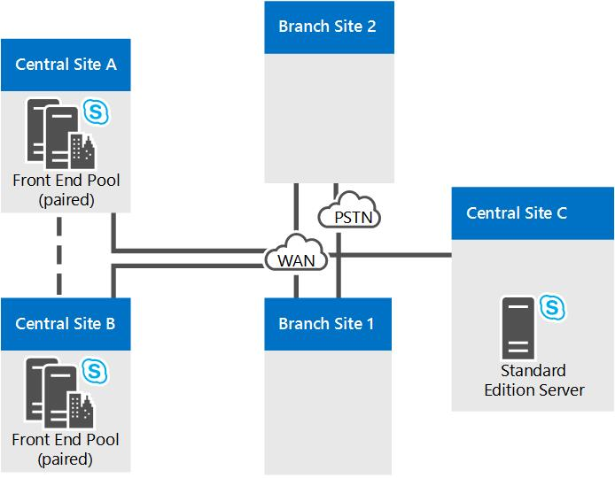

# Справочные топологии для Skype для бизнеса Server

Ссылки на топологии для Skype для бизнеса Server, включая схемы и решения, которые необходимо принять для крупных, средних и малых организаций.

Лучшая топология Skype для бизнеса Server зависит от размера организации, рабочих нагрузок, которые вы хотите развернуть, и ваших предпочтений для высокой доступности и стоимости инвестиций.

В этом разделе описаны три примера топологий ссылок, в том числе рассуждения о многих решениях, которые были приняты в каждой топологии.

## Топология ссылок для небольшой организации

Эталонная топология для небольших организаций показывает, как можно развернуть надежное и доступное решение, развернув только три Skype для бизнеса Server.

**Эталонная топология для небольших организаций**

- **Пара развернутых выпуск Standard серверов** Эта организация имеет 4000 пользователей на своем центральном сайте. Они развернули два выпуск Standard серверов и спарили их для обеспечения высокой доступности и аварийного восстановления. На каждом сервере находится 2000 пользователей, но сведения обо всех пользователях синхронизируются между двумя серверами. В случае отказа одного сервера администратор может переключить соответствующих пользователей на обслуживание другим сервером, с минимальным влиянием на работу пользователей. Дополнительные сведения о высокой доступности и функции аварийного восстановления в Skype для бизнеса Server см. в Skype для бизнеса Server [.](../../plan-your-deployment/high-availability-and-disaster-recovery/high-availability-and-disaster-recovery.md)

- **Рекомендуется использовать развертывание с пограничным сервером.** Хотя развертывание пограничного сервера не является обязательным, для внутреннего обмена мгновенными сообщениями, предоставления сведений о присутствии и конференций мы рекомендуем сделать это даже для развертываний малого размера. Вы можете увеличить инвестиции Skype для бизнеса Server путем развертывания edge Server для предоставления услуг пользователям, которые в настоящее время находятся за пределами брандмауэров организации. Ниже перечислены связанные с этим преимущества.

  - Собственные пользователи организации могут использовать Skype для бизнеса Server, если они работают из дома или находятся в пути.

  - Ваши пользователи смогут приглашать внешних пользователей для участия в собраниях.

  - Если у вас есть партнер, поставщик или клиентская организация, которая также Skype для бизнеса Server, вы можете сформировать федератные отношения с этой организацией. Затем Skype для бизнеса Server развертывание распознает пользователей из федераированной организации, что ведет к более тесному сотрудничеству.

  - Пользователи могут обмениваться мгновенными сообщениями с пользователями некоторых общедоступных служб обмена мгновенными сообщениями.

- **Жизнеспособность узла филиала.** В этой организации запущена пилотная программа Корпоративная голосовая связь функции Skype для бизнеса Server. Некоторые пользователи используют Skype для бизнеса Server в качестве единственного голосового решения. Некоторые из Корпоративная голосовая связь пользователей находятся на сайте филиала. Сайт филиала не имеет надежной связи с широкой сетью области (WAN) на центральном сайте, поэтому там развернуто устройство для ветвей. При сбое связи с глобальной сетью пользователи филиала смогут принимать и осуществлять вызовы (звонки в организации и по ТСОП), использовать функции голосовой почты и общаться с помощью двухсторонних мгновенных сообщений. В случае нарушения связи с глобальной сетью также будет доступна проверка подлинности пользователей. Дополнительные сведения см. в [Корпоративная голосовая связь Plan for Корпоративная голосовая связь в Skype для бизнеса Server.](../../plan-your-deployment/enterprise-voice-solution/enterprise-voice-resiliency.md)

- **Развертывание единой системы обмена сообщениями Exchange.** Эта эталонная топология включает Exchange единой системы обмена сообщениями, который запускается Microsoft Exchange Server, а не Skype для бизнеса Server.

- **Сервер Office Web Apps.** Рекомендуется развернуть сервер Office Web Apps или ферму серверов Office Web Apps в каждом организации, использующей веб-конференции. Office Веб-сервер приложений позволяет PowerPoint слайды, которые будут представлены на веб-конференциях..

## Топология ссылок для средней организации

Справочная топология высокой доступности и одним центром обработки данных предназначена для малых и средних организаций с одним центральным узлом. Топология на следующей схеме предназначена для организации, состоящей из 20000 пользователей.

**Справочная топология для средних по размеру организаций**

- **Поддержка большего числа пользователей за счет добавления дополнительных интерфейсных серверов.** Точная топология на данном рисунке содержит три интерфейсных сервера для поддержки 20000 пользователей. При наличии одного центрального узла и большего числа пользователей можно просто добавить в пул несколько интерфейсных серверов. Максимальное количество пользователей в пуле равно 80000 с двенадцатью интерфейсными серверами.

    Однако топология с одним узлом может поддерживать даже большее количество пользователей за счет добавления другого интерфейсного пула к узлу.

- **Можно добавить аварийное восстановление.** Для этой организации высокая доступность для Skype для бизнеса Server служб является необходимой функцией, но аварийное восстановление не является. Пул развернутых серверов front end обеспечивает высокую доступность.

    Если понадобится добавить возможность аварийного восстановления следует рассмотреть возможность организации другого центра обработки данных с добавлением в него другого интерфейсного пула и сопряжения этого интерфейсного пула с интерфейсным пулом в текущем центре обработки данных. Затем при возникновении сбоя в основном пуле администраторы могут перевести пользователей в резервный пул посредством отработки отказа.

- **Back End Servers являются зеркальными** Чтобы обеспечить более высокую доступность базовых функций пользователей, организация развернула зеркальную пару серверов заднего конца для каждого пула интерфейса.

- **Параметры базы данных сервера мониторинга.** Данная организация развернула сервер мониторинга, чтобы обеспечить качество вызовов корпоративной голосовой связи и аудио- и видеоконференций. Мониторинг развернут на каждом интерфейсном сервере, а база данных мониторинга совмещена с внутренними серверами. Следует упомянуть, что также поддерживаются топологии, в которых база данных мониторинга расположена на отдельном сервере.

- **Высокая доступность Edge Server** В этом примере организации с 20 000 пользователей достаточно одного edge Server для производительности. Однако для обеспечения высокой доступности они развернули пул из двух серверов edge servers.

- **Варианты развертывания узлов филиалов.** В этой топологии организация в качестве решения голосовой связи развернула решение Enterprise Voice. Сайт Branch Site 1 не имеет устойчивой связи с широкой сетью области (WAN) на центральном сайте, поэтому для обслуживания многих функций Skype для бизнеса Server на случай, если связь WAN с центральным сайтом будет развернута. У узла филиала 2 есть надежная связь по глобальной сети с центральным узлом, поэтому требуется только шлюз ТСОП. Развернутый шлюз ТСОП поддерживает обход сервера-посредника, поэтому в узле филиала 2 сервер-посредник не требуется. Дополнительные сведения см. в [Корпоративная голосовая связь Plan for Корпоративная голосовая связь в Skype для бизнеса Server.](../../plan-your-deployment/enterprise-voice-solution/enterprise-voice-resiliency.md)

- **Балансировка нагрузки DNS.** В пуле front End и в пуле Edge Server развернута балансировка нагрузки DNS для трафика SIP. Это устраняет необходимость в аппаратных средствах балансировки нагрузки для пограничных серверов и значительно упрощает настройку и обслуживание аппаратных средств балансировки нагрузки для других пулов, так как они требуются только для трафика HTTP. Дополнительные сведения см. в деле [балансировки нагрузки DNS.](../../plan-your-deployment/network-requirements/load-balancing.md#BKMK_DNSLoadBalancing)

- **Развертывание единой системы обмена сообщениями Exchange.** Эта эталонная топология включает Exchange единой системы обмена сообщениями, который запускается Microsoft Exchange Server, а не Skype для бизнеса Server.

- **Сервер Office Web Apps.** Рекомендуется развернуть сервер Office Web Apps или ферму серверов Office Web Apps в каждом организации, использующей веб-конференции. Сервер Office Web Apps делает возможность использование слайдов Powerpoint в веб-конференциях.

- **Вы можете добавлять Директоры.** Если эта организация хотела улучшить защиту от DoS-атак, она также могла развернуть пул Директоров. Директор — это отдельная необязательная роль сервера в Skype для бизнеса Server, которая не предоставляет учетные записи домашних пользователей или предоставляет службы присутствия или конференций. Он служит внутренним следующим хоп-сервером, на который входящий трафик SIP edge Server передается для внутренних серверов. Директор предварительно проводит проверку подлинности входящие запросы и перенаправляет их в домашний пул или сервер пользователя. Предварительная проверка подлинности в Директоре позволяет отклонять запросы от неизвестных для развертывания учетных записей пользователей. Директор помогает изолировать серверы переднего конца от вредоносных трафика, таких как атаки с отказом в обслуживании (DoS). Если сеть затоплена недействительным внешним трафиком при такой атаке, трафик заканчивается в Director.

- **System Center Рекомендуется диспетчер операций.** Рекомендуется отслеживать работоспособность развертывания Skype для бизнеса Server, чтобы обеспечить доступность служб для конечных пользователей. Вы можете использовать пакет System Center диспетчера операций для Skype для бизнеса, который доступен в качестве бесплатной загрузки из Microsoft. В пакете Skype для бизнеса управления можно получать оповещения в режиме реального времени при возникновения проблем, запускать синтетические транзакции для проверки функций Skype для бизнеса, получения отчетов о доступности службы и так далее. Это позволит упреждающее реагировать на неполадки в развертывании, прежде чем эти неполадки будут замечены пользователями.

## Топология ссылок для крупной организации

Эталонная топология для крупной организации с поддержкой нескольких центров обработки данных предназначена для организации любого размера с несколькими центральными сайтами. Конкретная топология, показанная на следующей схеме, предназначена для организации с 50000 пользователей — по 20000 пользователей на центральных сайтах A и B и 10000 пользователей на центральном сайте C и на сайтах филиалов. Тип топологии, показанный на этой схеме, подходит для организаций с любым количеством пользователей.

Помимо высокой доступности, предоставляемой пулами серверов переднего доступа, эта топология добавляет поддержку аварийного восстановления. Пулы переднего конца на центральных сайтах A и B спарились. Если один из этих пулов выйдет из строя, администратор сможет переместить службы для пострадавших пользователей в сопряженный пул на работающем сайте.

Эта топология показана на нескольких схемах, с обзором, за которым следует подробное описание центральных сайтов.

**Обзор эталонной топологии для крупных организаций с несколькими центрами обработки данных**

**Эталонная топология для крупных организаций: подробный вид центрального сайта А**

**Эталонная топология для крупных организаций: подробный вид центрального сайта B**

**Эталонная топология для крупных организаций: подробный вид центрального сайта C**

- **Для обеспечения аварийного восстановления спарются пулы переднего конца.** Пулы переднего конца на сайте A и сайте B в паре друг с другом, чтобы обеспечить поддержку аварийного восстановления. В случае сбоя пула на одном сайте администратор может сбой в работе над пользователями с этого сайта в парном пуле переднего конца на другом сайте с минимальным перерывом службы для пользователей. Каждый из двух интерфейсных пулов содержит шесть серверов, которых достаточно для всех 40000 пользователей обоих пулов в случае отработки отказа. Дополнительные сведения см. в [проекте Plan for high availability and disaster recovery in Skype для бизнеса Server.](../../plan-your-deployment/high-availability-and-disaster-recovery/high-availability-and-disaster-recovery.md)

- **Back End Servers являются зеркальными** Чтобы обеспечить более высокую доступность базовых функций пользователей, организация развернула зеркальную пару серверов заднего конца для каждого пула интерфейса. Это необязательная топология, и вместо этого можно развернуть один сервер back end. SQL кластеризация и группы доступности AlwaysOn также поддерживаются. Дополнительные сведения см. в [дополнительных сведениях](../../plan-your-deployment/high-availability-and-disaster-recovery/back-end-server.md)о высокой доступности back End Server в Skype для бизнеса Server.

- **Использование выпуск Standard сервера на сайте филиала.** Данная организация рассматривает сайт C как сайт филиала, поскольку в нем имеется всего 600 сотрудников. Однако эти пользователи проводят в своей среде много аудио- и видеоконференций. Если он был развернут в Skype для бизнеса Server как сайт филиала, средства массовой информации для этих конференций будут запускаться по всей широкой сети области (WAN) на центральный сайт, на который развернут сервер переднего конца. Чтобы избежать этой потенциальной нагрузки на пропускную способность, они установили пару выпуск Standard на этом сайте, на котором будут проходить эти конференции. И поскольку выпуск Standard серверы установлены там, Skype для бизнеса Server по определению считает его центральным сайтом, и он рассматривается как таковой в Topology Builder и средстве планирования.

    Для производительности выпуск Standard достаточно одного сервера, но организация развернула два сервера и совместит их, чтобы обеспечить высокую доступность в случае, если один сервер не будет работать.

    Хотя сайт В рассматривается как центральный сайт, там не требуется разворачивать пограничные серверы. В данном примере сайт В будет использовать пограничные серверы, развернутые на сайте А.

- **Мониторинг и архива** Эта организация развернула как мониторинг, так и архивативную деятельность. После развертывания мониторинг и архивация выполняются на каждом сервере переднего плана. Базы данных для этих функций могут быть размещены совместно с серверной базой данных или на отдельном сервере. В данной организации эти базы данных размещены на отдельном сервере на центральном сайте B. Базы данных получают данные мониторинга и архивации с серверов переднего плана на всех сайтах.

- **Варианты развертывания узлов филиалов.** На самом деле в этой организации более 50 сайтов филиалов, только два из которых показаны в подробных схемах. Сайт Branch Site 1 не имеет устойчивой WAN-ссылки на центральный сайт, поэтому для обеспечения телефонной службы развернуты бытовые устройства филиала в случае, если связь WAN с центральным сайтом будет отлаживаться. Сайт Branch Site 2, однако, имеет устойчивую WAN-связь, поэтому для этого требуется только шлюз с общедоступными переключаемой телефонной сетью (PSTN). Развернутый шлюз ТСОП поддерживает обход сервера-посредника, поэтому в узле филиала 2 сервер-посредник не требуется. Дополнительные сведения о том, что необходимо установить на сайте филиала, см. в Корпоративная голосовая связь плане устойчивости Skype для бизнеса Server [.](../../plan-your-deployment/enterprise-voice-solution/enterprise-voice-resiliency.md)

- **Распределение каналов SIP и сервер-посредник.** Обратите внимание, что на центральном сайте B сервер-посредник не размещается вместе с серверами переднего плана. Это объясняется тем, что для сайтов, использующих распределение каналов SIP, рекомендуется изолированный сервер-посредник. В большинстве других случаев мы рекомендуем размещать сервер-посредник вместе с серверами переднего плана. Сведения о топологиях серверов-посредников см. в разделе [Components and Topologies for Mediation Server](/previous-versions/office/lync-server-2013/lync-server-2013-components-and-topologies-for-mediation-server) документации по планированию.

- **Развертывание сохраняемого чата.** Данная организация развернула серверы, необходимые для поддержки сохраняемого чата. Было развернуто несколько серверов переднего плана сохраняемого чата, как для обработки нагрузки от множества пользователей в пуле, так и для обеспечения высокого уровня доступности. Также было развернуто соответствие для сохраняемого чата, а также хранилище сохраняемого чата и соответствие сохраняемого чата были размещены на разных серверах. Эти хранилища могли быть размещены вместе, и даже вместе с тыловым сервером, но данная организация выбрала раздельное размещение в целях обеспечения лучшей производительности.

    > [!NOTE]
    > Постоянный чат доступен в Skype для бизнеса Server 2015 г., но больше не поддерживается Skype для бизнеса Server 2019 г. Такая же функциональность доступна в Teams. Дополнительные сведения см. в ссылке Начало работы [с обновлением Microsoft Teams обновления.](/microsoftteams/upgrade-start-here) Если вам нужно использовать постоянный чат, вы можете либо перенести пользователей, требующих Teams, либо продолжить использование Skype для бизнеса Server 2015 г.

- **Балансировка нагрузки DNS.** В пуле переднего края и в пуле Edge Server используется балансировка нагрузки DNS. Это устраняет потребность в аппаратных балансировщиках нагрузки для внутреннего интерфейса пограничных серверов, а также значительно уменьшает время, затрачиваемое на настройку и обслуживание аппаратных балансировщиков нагрузки для других пулов, поскольку аппаратные балансировщики нагрузки нужны только для трафика HTTP. Дополнительные сведения см. в .. /.. /plan-your-deployment/network-requirements/load-balancing.md#BKMK_DNSLoadBalancing).

- **Развертывание единой системы обмена сообщениями Exchange.** Skype для бизнеса Server работает с локальной развертыванием Exchange единой системы обмена сообщениями и размещением Exchange единой системы обмена сообщениями. Центральный сайт A включает сервер Exchange единой системы обмена сообщениями, который выполняется Microsoft Exchange Server, а не Skype для бизнеса Server. Функциональность Exchange um для Skype для бизнеса Server выполняется в пуле переднего конца.

    Центральный сайт Б использует размещенный Exchange, поэтому функциональность сервера единой системы обмена сообщениями Exchange также размещенная.

    Сведения о Exchange единой системы  обмена сообщениями см. в Exchange интеграции единой системы обмена сообщениями и размещенный Exchange интеграции [единой](/previous-versions/office/lync-server-2013/lync-server-2013-hosted-exchange-unified-messaging-integration) системы обмена сообщениями в документации по планированию.

- **Сервер Office Web Apps.** Организациям, использующим веб-конференции, рекомендуется развернуть сервер или ферму серверов Office Web Apps. Ферму серверов Office Web Apps можно развернуть на одном сайте, обслуживающем трафик со всех сайтов, или на каждом сайте. Сервер Office Web Apps позволяет использовать в веб-конференциях слайды Powerpoint.

- **Можно добавить Директоры.** Если организация желает повысить защиту от атак типа "отказ в обслуживании", она может также развернуть пул Директоров. Директор — это отдельная необязательная роль сервера в Skype для бизнеса Server, которая не предоставляет учетные записи домашних пользователей или предоставляет службы присутствия или конференций. Он служит внутренним следующим хоп-сервером, на который входящий трафик SIP edge Server передается для внутренних серверов. Директор предварительно проводит проверку подлинности входящие запросы и перенаправляет их в домашний пул или сервер пользователя. Предварительная проверка подлинности в Директоре позволяет отклонять запросы от неизвестных для развертывания учетных записей пользователей. Директор помогает изолировать серверы переднего конца от вредоносных трафика, таких как атаки с отказом в обслуживании (DoS). Если сеть затоплена недействительным внешним трафиком при такой атаке, трафик заканчивается в Director.

- **System Center Рекомендуется диспетчер операций.** Рекомендуется отслеживать работоспособность развертывания Skype для бизнеса Server, чтобы обеспечить доступность служб для конечных пользователей. Вы можете использовать пакет System Center диспетчера операций для Skype для бизнеса, который доступен в качестве бесплатной загрузки из Microsoft. В пакете Skype для бизнеса управления можно получать оповещения в режиме реального времени при возникновения проблем, запускать синтетические транзакции для проверки функций Skype для бизнеса, получения отчетов о доступности службы и так далее. Это позволит упреждающее реагировать на неполадки в развертывании, прежде чем эти неполадки будут замечены пользователями.