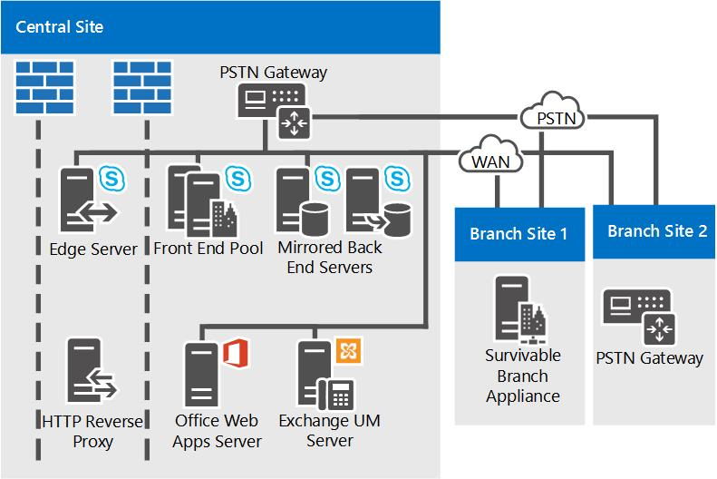

# Ссылка на топологии для Скайп для Business Server

Ссылка на топологии для Скайп Business Server, включая схемы и решения, принимаемые больших, средний, и небольших организаций.

Наиболее Скайп для топологии Business Server автоматически зависит от размера вашей организации, рабочей нагрузки, которую вы хотите развернуть и параметры для обеспечения высокой доступности и инвестиций.

В этом разделе рассматриваются три примера эталонных топологий и приводятся аргументы в пользу выбора каждой из них.

## Эталонная топология для небольшой организации

Эталонная топология для небольших организаций показывает, как можно развернуть надежное высокодоступное решение, используя только три сервера под управлением Скайп для Business Server.

**Эталонная топология для небольших организаций**

- **Пара развернуты серверы Standard Edition** В этом организации с 4 000 пользователей в их центрального сайта. Они развернуты два сервера Standard Edition и сопряжены друг с другом, чтобы включить высокой доступности и аварийного восстановления. Each server homes 2,000 users, but information about all users is synchronized between the two servers. If one goes down, an administrator can fail over those users to be served by the other server, with a minimum of disruption to users. Дополнительные сведения о высокой доступности и аварийного восстановления в Скайп Business Server в разделе [Планирование высокой доступности и аварийного восстановления в Скайп для Business Server](../../plan-your-deployment/high-availability-and-disaster-recovery/high-availability-and-disaster-recovery.md).

- **Рекомендуется использовать развертывание с пограничным сервером.** Хотя развертывание пограничного сервера не является обязательным, для внутреннего обмена мгновенными сообщениями, предоставления сведений о присутствии и конференций мы рекомендуем сделать это даже для развертываний малого размера. Вы можете развернуть вашей Скайп инвестиций Business Server путем развертывания пограничного сервера для предоставления службы для пользователей в настоящее время за пределами брандмауэров вашей организации. Вам будут доступны следующие преимущества:

  - Пользователи вашей организации можно использовать Скайп для функции Business Server, если они работают из дома или в выходной параметр в пути.

  - Ваши пользователи смогут приглашать внешних пользователей для участия в собраниях.

  - Если у вас есть партнеров, поставщиков или организация-клиент, который также использует Скайп для Business Server, можно было создавать федеративные отношения с этой организации. Вашей Скайп для развертывания Business Server будет затем распознает пользователей из этого федеративной организации, приводя к совместной работы.

  - Пользователи в организации могут обмениваться мгновенными сообщениями с пользователями некоторых общедоступных служб обмена мгновенными сообщениями.

- **Устойчивость работы сайта филиала.** В этом организации — это служба Пилотная программа функцию корпоративной голосовой связи Скайп для Business Server. Некоторые пользователи используют Скайп Business Server качестве решения для единственного голосовой связи. Некоторые из этих пилотных пользователей корпоративной голосовой связи, расположены на сайте филиала. Сайт филиала не нужно ссылка надежная глобальной сети (WAN) центральном узле, поэтому устройство для обеспечения связи в филиалах развертывается ли. При сбое связи по глобальной сети эта система позволяет пользователям на сайте филиала принимать и посылать вызовы (внутри организации и по ТСОП), пользоваться возможностями голосовой почты и обмениваться двусторонними мгновенными сообщениями. Кроме того, при нарушении связи по глобальной сети возможна проверка подлинности пользователей. Дополнительные сведения см. в разделе [Plan for Enterprise Voice resiliency in Skype for Business Server](../../plan-your-deployment/enterprise-voice-solution/enterprise-voice-resiliency.md).

- **Развертывание единой системы обмена сообщениями Exchange.** Этот пример топологии включает в себя сервер Exchange единой системе обмена СООБЩЕНИЯМИ, который выполняется Microsoft Exchange Server не Скайп для Business Server.

- **Сервер Office Web Apps.** В каждой организации, где проводятся веб-конференции, рекомендуется развернуть сервер Office Web Apps или ферму таких серверов. Сервер Office Web Apps позволяет демонстрировать на веб-конференциях слайды PowerPoint.

## Эталонная топология для средней организации

Эталонная топология высокой доступности с одним центром обработки данных предназначена для малых и средних организаций с одним центральным узлом. Топология, показанная на следующей схеме, предназначена для организации, состоящей из 20 000 пользователей.

**Справочная топология для средних по размеру организаций**

- **Поддержка большего числа пользователей за счет добавления дополнительных интерфейсных серверов.** Точная топология на данном рисунке содержит три интерфейсных сервера для поддержки 20 000 пользователей. При наличии одного центрального узла и большего числа пользователей можно просто добавить в пул несколько серверов переднего плана. Максимальное количество пользователей в пуле равно 80 000 с двенадцатью серверами переднего плана.

    Однако топология с одним узлом может поддерживать даже большее количество пользователей за счет добавления другого интерфейсного пула к узлу.

- **Можно добавить аварийное восстановление.** Для этой организации высокой доступности для их Скайп для служб Business Server является компонентом необходимые, но не является аварийного восстановления. Пул серверов переднего плана, они развернуты достигается высокая доступность.

    Если понадобится добавить возможность аварийного восстановления следует рассмотреть возможность организации другого центра обработки данных с добавлением в него другого интерфейсного пула и сопряжения этого интерфейсного пула с интерфейсным пулом в текущем центре обработки данных. Затем при возникновении сбоя в основном пуле администраторы могут перевести пользователей в резервный пул посредством отработки отказа.

- **Дублируются внутренними серверами** Для обеспечения более высокой доступности для основного пользовательского функций, организации развернут зеркальной парой серверов для каждого пула переднего плана внутренними серверами.

- **Параметры базы данных сервера мониторинга.** В этом организации развернут мониторинг для обеспечения качества вызовов корпоративной голосовой связи и A / V конференций. Функция мониторинга развернута на каждом сервере переднего плана, а база данных мониторинга выровнена с внутренними серверами. Поддерживаются также топологии, в которых база данных мониторинга расположена на отдельном сервере.

- **Высокая доступность пограничного сервера** В этом примере организации с 20 000 пользователей только один пограничного сервера достаточно для производительности. Однако для поддержания высокой доступности в этой организации развернут пул из двух пограничных серверов.

- **Варианты развертывания на сайте филиала.** Организации в Эта топология имеет корпоративной голосовой связи, развернутые в виде их решение для голосовой связи. Сайт филиала 1 имеет ссылка устойчивое глобальной сети (WAN) с центральным сайтом, имеет для обеспечения связи в филиалах развернут на обслуживание, что много Скайп компонентов Business Server на случай глобальной сети ссылка на центральный сайт выходит из строя. На сайте филиала 2 благодаря наличию отказоустойчивого канала связи по глобальной сети достаточно развернуть шлюз ТСОП. На этом сайте не требуется сервер-посредник, так как развернутый шлюз ТСОП поддерживает обход сервера-посредника. Дополнительные сведения см. в разделе [Plan for Enterprise Voice resiliency in Skype for Business Server](../../plan-your-deployment/enterprise-voice-solution/enterprise-voice-resiliency.md).

- **Балансировка нагрузки средствами DNS.** В интерфейсном пуле и пуле пограничных серверов развернута функция балансировки нагрузки средствами DNS для трафика по протоколу SIP. Она устраняет необходимость в аппаратных средствах балансировки нагрузки для пограничных серверов, а для других пулов значительно упрощает настройку и обслуживание этих аппаратных средств, так как они требуются только для трафика по протоколу HTTP. Для получения дополнительных сведений см (.. /.. / plan-your-deployment/network-requirements/load-balancing.md#BKMK_DNSLoadBalancing).

- **Развертывание единой системы обмена сообщениями Exchange.** Этот пример топологии включает в себя сервер Exchange единой системе обмена СООБЩЕНИЯМИ, который выполняется Microsoft Exchange Server не Скайп для Business Server.

- **Сервер Office Web Apps.**    В каждой организации, где проводятся веб-конференции, рекомендуется развернуть сервер Office Web Apps или ферму таких серверов. Сервер Office Web Apps позволяет демонстрировать на веб-конференциях слайды PowerPoint.

- **Вы можете добавлять директоры.** Если эта организация хотела улучшить защиту от DoS-атак, она также могла развернуть пул директоров. Директор — это отдельные, необязательно серверной роли в Скайп для Business Server, не номер домашнего учетных записей пользователей или предоставления услуг присутствия или конференц-связи. Служит в качестве внутреннего сервера следующего прыжка в который пограничный сервер направляет входящий трафик SIP, предназначенного для внутренних серверов. Директор выполняет предварительную проверку подлинности входящих запросов и перенаправляет пользователя домашнего пула или сервера. Предварительная проверка подлинности в директоре позволяет удалять запросы от учетных записей пользователей, не известных в развертывании. Директор защищает серверов переднего плана от вредоносного трафика, такие как атак типа "отказ в обслуживании" (DoS). Если распространяются с недопустимый внешнего трафика в такой атаки сетевой трафик заканчивается на директора.

- **Рекомендуется использовать System Center Operations Manager.** Мы рекомендуем мониторинга работоспособности Скайп для развертывания Business Server для обеспечения доступности службы для конечных пользователей. Пакет управления System Center Operations Manager можно использовать для Скайп для бизнеса, который доступен для бесплатной загрузки от корпорации Майкрософт. With the Skype for Business Management Pack, you can proactively get real-time alerts when issues occur, run synthetic transactions to test end-to-end Skype for Business functionality, get reports for service availability, and so on. Это позволяет реагировать на неполадки в развертывании до того, как они повлияют на работу конечных пользователей.

## Эталонная топология для крупной организации

Эталонная топология для крупной организации с поддержкой нескольких центров обработки данных предназначена для организации любого размера с несколькими центральными сайтами. Конкретная топология, показанная на следующей схеме, предназначена для организации с 50 000 пользователей — по 20 000 пользователей на центральных сайтах A и B и 10 000 пользователей на центральном сайте C и на сайтах филиалов. Тип топологии, показанный на этой схеме, подходит для организаций с любым количеством пользователей.

В дополнение к высокой доступности, предоставляемые пулы серверов переднего плана эта топология добавляет поддержку аварийного восстановления. Пулы переднего плана в центральные узлы A и B являются сочетании друг с другом. Если один из этих пулов выйдет из строя, администратор сможет переместить службы для пострадавших пользователей в сопряженный пул на работающем сайте.

Эта топология показана на нескольких схемах с обзором, за которым следует подробное описание центральных сайтов.

**Обзор эталонной топологии для крупных организаций с несколькими центрами обработки данных**

**Эталонная топология для крупных организаций: подробный вид центрального сайта А**

**Эталонная топология для крупных организаций: подробный вид центрального сайта B**

**Эталонная топология для крупных организаций: подробный вид центрального сайта C**

- **Чтобы включить аварийного восстановления сопоставляются пулов переднего плана.** Пулы переднего плана на сайт A и B сайта сопоставляются друг с другом, чтобы обеспечить поддержку аварийного восстановления. В случае сбоя пула на одном узле администратор при сбое пользователей из этого сайта в состав парного пула переднего плана на сайте, с помощью службы свободно для пользователей. Each of these two Front End pools has six servers, which is enough for all 40,000 users in both pools in case of failover. Для получения дополнительных сведений см. [Планирование высокой доступности и аварийного восстановления в Скайп для Business Server](../../plan-your-deployment/high-availability-and-disaster-recovery/high-availability-and-disaster-recovery.md).

- **Дублируются внутренними серверами** Для обеспечения более высокой доступности для основного пользовательского функций, организации развернут зеркальной парой серверов для каждого пула переднего плана внутренними серверами. Это необязательный топологии, и можно выполнить развертывание единого Тыловой сервер вместо этого. SQL clustering and AlwaysOn Availability groups are also supported. For more information, see [Back End Server high availability in Skype for Business Server](../../plan-your-deployment/high-availability-and-disaster-recovery/back-end-server.md).

- **С помощью сервера Standard Edition на сайте филиала.** This organization considers Site C as a branch site because it has only 600 employees. However, the users there have many A/V conferences among themselves. Развернутая в Скайп для Business Server как узел филиала, мультимедиа для таких конференций будет выполняться по глобальной сети (WAN) и из центрального сайта с сервером переднего плана развертывания. Чтобы избежать этой потенциальных нагрузки пропускной способности, установленного парой серверов Standard Edition на этом сайте, в котором будет размещаться эти конференции. Из-за установки серверов Standard Edition, Скайп для Business Server по определению учитывает центрального сайта и он обрабатывается таким образом, в построителе топологий и средство планирования.

    Обеспечения производительности достаточно может быть только один сервер Standard Edition, но организации развернуты два и сопряжены друг с другом для обеспечения высокой доступности, в случае, если на одном сервере происходит сбой.

    Хотя сайт В рассматривается как центральный сайт, там не требуется разворачивать пограничные серверы. В данном примере сайт В будет использовать пограничные серверы, развернутые на сайте А.

- **Мониторинг и Архивация** В этом организации развернут мониторинг и архивация. После развертывания мониторинг и архивация выполняются на каждом сервере переднего плана. Базы данных для этих функций могут быть размещены совместно с внутренней базой данных или на отдельном сервере. В данной организации эти базы данных размещены на отдельном сервере на центральном сайте B. Базы данных получают данные мониторинга и архивации с серверов переднего плана на всех сайтах.

- **Варианты развертывания на сайте филиала.** В этой организации в действительности более 50 сайтов филиалов; на подробных схемах показаны только два из них. Сайт филиала 1 не имеет устойчивое глобальной сети ссылка на центральном узле, поэтому они имеют для обеспечения связи в филиалах развернут для предоставления телефонной связи в случае, если глобальной сети ссылка на центральный сайт выходит из строя. На сайте филиала 2 благодаря наличию отказоустойчивого канала связи по глобальной сети достаточно развернуть шлюз ТСОП. На этом сайте не требуется сервер-посредник, так как развернутый шлюз ТСОП поддерживает обход сервера-посредника. О выборе компонентов для установки на сайте филиала см. раздел [Plan for Enterprise Voice resiliency in Skype for Business Server](../../plan-your-deployment/enterprise-voice-solution/enterprise-voice-resiliency.md).

- **Распределение каналов SIP и сервер-посредник.** Обратите внимание, что на центральном сайте B сервер-посредник не размещается вместе с серверами переднего плана. Это объясняется тем, что для сайтов, использующих распределение каналов SIP, рекомендуется изолированный сервер-посредник. В большинстве других случаев мы рекомендуем размещать сервер-посредник вместе с серверами переднего плана. Сведения о топологиях серверов-посредников см. в разделе [Components and Topologies for Mediation Server](https://technet.microsoft.com/library/71397168-36c3-4d21-b8ef-db6a751634ee.aspx) документации по планированию.

- **Развертывание сохраняемого чата.** Данная организация развернула серверы, необходимые для поддержки сохраняемого чата. Было развернуто несколько серверов переднего плана сохраняемого чата, как для обработки нагрузки от множества пользователей в пуле, так и для обеспечения высокой доступности. Также было развернуто соответствие для сохраняемого чата, а также хранилище сохраняемого чата и соответствие сохраняемого чата были размещены на разных серверах. Эти хранилища могли быть размещены вместе (и даже вместе с внутренним сервером), но данная организация выбрала раздельное размещение в целях обеспечения лучшей производительности.

    > [!NOTE]
    > Сохраняемый чат доступна в Скайп для Business Server 2015, но больше не поддерживается в Скайп для Business Server 2019. Те же функциональные возможности доступны в группах. Для получения дополнительных сведений см [Реализация из Скайп для бизнеса для групп Майкрософт](/microsoftteams/journey-skypeforbusiness-teams). Если необходимо использовать сохраняемого чата, возможны либо перенос пользователей, которым требуется эта функция групп, или для дальнейшего использования Скайп для Business Server 2015.

- **Балансировка нагрузки средствами DNS.** В интерфейсном пуле и пуле пограничных серверов применяется балансировка нагрузки средствами DNS. Она устраняет необходимость в аппаратных средствах балансировки нагрузки для пограничных серверов, а для других пулов значительно ускоряет настройку и обслуживание этих аппаратных средств, так как они требуются только для трафика по протоколу HTTP. Для получения дополнительных сведений см (.. /.. / plan-your-deployment/network-requirements/load-balancing.md#BKMK_DNSLoadBalancing).

- **Развертывание единой системы обмена сообщениями Exchange.** Скайп для Business Server для работы с оба локального развертывания из Exchange единой системы обмена сообщениями (UM), а на серверах Exchange единой системы обмена СООБЩЕНИЯМИ. Центральный сайт A включает в себя сервер Exchange единой системе обмена СООБЩЕНИЯМИ, который выполняется Microsoft Exchange Server не Скайп для Business Server. Функции обмена СООБЩЕНИЯМИ Exchange для Скайп для Business Server работает на пул переднего плана.

    Центральный сайт B использует размещенную систему Exchange, поэтому функциональность сервера единой системы обмена сообщениями Exchange также является размещенной.

    Для получения дополнительных сведений о Exchange единой системы обмена СООБЩЕНИЯМИ содержатся в документации по планированию [Exchange единой системы обмена сообщениями интеграции локальной](https://technet.microsoft.com/library/e7c63a71-2d99-4aa9-b649-36c1a431bdf1.aspx) и [Размещенной единой системы обмена сообщениями интеграции с Exchange](https://technet.microsoft.com/library/f4de0165-da3b-499e-98fc-28ddd0db02d5.aspx) .

- **Сервер Office Web Apps.** В каждой организации, где проводятся веб-конференции, рекомендуется развернуть сервер Office Web Apps или ферму таких серверов. Вы развертывание фермы сервера Office Web Apps, состоящей в одном узле, который обслуживает трафик со всех сайтов или его развертывание на каждом сайте. Сервер Office Web Apps позволяет демонстрировать на веб-конференциях слайды PowerPoint.

- **Можно добавить директоры.** Если организация желает повысить защиту от атак типа "отказ в обслуживании", она может также развернуть пул директоров. Директор — это отдельные, необязательно серверной роли в Скайп для Business Server, не номер домашнего учетных записей пользователей или предоставления услуг присутствия или конференц-связи. Служит в качестве внутреннего сервера следующего прыжка в который пограничный сервер направляет входящий трафик SIP, предназначенного для внутренних серверов. Директор выполняет предварительную проверку подлинности входящих запросов и перенаправляет пользователя домашнего пула или сервера. Предварительная проверка подлинности в директоре позволяет удалять запросы от учетных записей пользователей, не известных в развертывании. Директор защищает серверов переднего плана от вредоносного трафика, такие как атак типа "отказ в обслуживании" (DoS). Если распространяются с недопустимый внешнего трафика в такой атаки сетевой трафик заканчивается на директора.

- **Рекомендуется использовать System Center Operations Manager.** Мы рекомендуем мониторинга работоспособности Скайп для развертывания Business Server для обеспечения доступности службы для конечных пользователей. Пакет управления System Center Operations Manager можно использовать для Скайп для бизнеса, который доступен для бесплатной загрузки от корпорации Майкрософт. With the Skype for Business Management Pack, you can proactively get real-time alerts when issues occur, run synthetic transactions to test end-to-end Skype for Business functionality, get reports for service availability, and so on. This helps you to proactively respond to issues with your deployment before end-users experience them.

