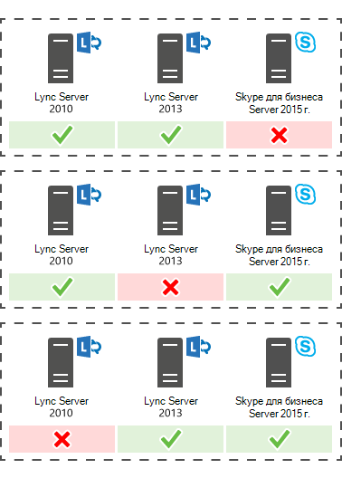

# План обновления до Skype для бизнеса Server 2015 г.
 
Сводка. Сведения о том, что следует учитывать при планировании обновления до Skype для бизнеса Server 2015 г. Скачайте бесплатную пробную Skype для бизнеса Server 2015 г. из Центра оценки Майкрософт по ссылке: [https://www.microsoft.com/evalcenter/evaluate-skype-for-business-server](https://www.microsoft.com/evalcenter/evaluate-skype-for-business-server) .
  
В рамках плана обновления до Skype для бизнеса Server 2015 г. используйте эту тему, чтобы понять рекомендуемые пути обновления до Skype для бизнеса Server 2015 г., как работает In-Place Upgrade, каковы поддерживаемые сценарии сосуществования и как выглядит процесс обновления.

> [!NOTE]
> Обновления на месте были доступны в Skype для бизнеса Server 2015 г., но больше не поддерживаются Skype для бизнеса Server 2019 г. Поддерживается совместное сосуществование, см. в Skype для бизнеса Server [2019](../../SfBServer2019/migration/migration-to-skype-for-business-server-2019.md) г. Дополнительные сведения.
  
## Рекомендуемые пути обновления Skype для бизнеса Server 2015 г.

 Чтобы обновить Lync Server 2013, Lync Server 2010 или Office Communications Server 2007 R2 до Skype для бизнеса Server 2015 г., используйте следующие пути обновления:
  
> [!CAUTION]
> In-Place обновления автоматически перемещает каталоги конференций с Lync Server 2013 Skype для бизнеса Server 2015. Однако, если вы планируете вручную перемещать каталоги конференций, очень важно использовать Skype для бизнеса Server 2015. Если вы попробуете использовать оболочку управления Lync Server 2013 для перемещения каталогов конференций с Lync Server 2013 на Skype для бизнеса Server 2015 г., может произойти потеря данных. Как правило, при работе с Skype для бизнеса Server 2015 г. в любом качестве следует использовать набор Skype для бизнеса Server 2015 г.  
  
|**Версия**|**Рекомендации**|
|:-----|:-----|
|Lync Server 2013    | Для обновления используйте Skype для бизнеса Server topology Builder и новую функцию In-Place обновления на каждом из серверов, связанных с пулом. см. в описании План обновления с [Lync Server 2013 до Skype для бизнеса Server 2015](upgrade.md#BKMK_PlanUpgradeFromLync2013) г. и обновление до Skype для бизнеса Server [2015](../deploy/upgrade-to-skype-for-business-server.md) г. для подробных действий.   |
|Lync Server 2010 + Lync Server 2013 (двойной режим)    |Сначала обновим Lync Server 2013, а затем Skype для бизнеса Server 2015 с помощью новой функции In-Place обновления. Однако, если топология является основной Lync Server 2010, вы также можете откатать компоненты Lync Server 2013 в Lync Server 2010, а затем обновиться непосредственно до Skype для бизнеса Server 2015. В этом случае вы не сможете воспользоваться преимуществами In-Place и использовать прямое сосуществование между Lync Server 2010 и Skype для бизнеса Server 2015. Tri-existence не поддерживается, но сосуществование поддерживается.    |
|Lync Server 2010    |Вывести новый пул Skype для бизнеса Server 2015 г., а затем перенести пользователей в этот новый пул. Затем можно списание старого пула Lync Server 2010. Обновление с Lync Server 2010 до Skype для бизнеса Server 2015 г. аналогично обновлению с Lync Server 2010 до Lync Server 2013. См. миграцию с [Lync Server 2010 на Lync Server 2013.](/previous-versions/office/lync-server-2013/migration-from-lync-server-2010-to-lync-server-2013)    |
|Office Communications Server 2007 R2    | Выберите один из двух вариантов:    Настройка новой среды Skype для бизнеса Server 2015 г.    Или если ваше оборудование и программное обеспечение соответствуют требованиям Skype для бизнеса Server 2015 г., переехав в Lync Server 2013, а затем Skype для бизнеса Server 2015 г., используя новую функцию In-Place Upgrade. Дополнительные сведения см. в Skype для бизнеса Server Server [2015](requirements-for-your-environment/server-requirements.md) и миграции с [Office Communications Server 2007 R2 на Lync Server 2013.](/previous-versions/office/lync-server-2013/migration-from-office-communications-server-2007-r2-to-lync-server-2013)    |
   
> [!NOTE]
> SQL Server 2014 г. поддерживается Skype для бизнеса Server 2015 г., но не поддерживается в Lync Server 2013. Если вы хотите обновить SQL Server 2012 г. до SQL Server 2014 г., пул сначала необходимо обновить до Skype для бизнеса Server 2015 г. с помощью метода In-Place Upgrade, как описано в этом документе. Затем можно обновить SQL Server 2012 г. SQL Server 2014 г. см. в SQL Server [2014](/sql/database-engine/install-windows/upgrade-sql-server?viewFallbackFrom=sql-server-2014)г. Дополнительные новости о требованиях к базе данных см. в Skype для бизнеса Server [2015 г.](requirements-for-your-environment/server-requirements.md) 
  
## План обновления с Lync Server 2013 до Skype для бизнеса Server 2015 г.

Вы можете обновить системы Lync Server 2013 до Skype для бизнеса Server 2015 с помощью новой функции In-Place обновления. Обновление на месте предоставляет решение одним щелчком мыши, которое обеспечивает поддержку сертификатов, компоненты сервера, обновляет локальные базы данных и устанавливает роли Skype для бизнеса Server 2015 г. Обновление на месте стремится сохранить существующие инвестиции в оборудование и сервер, что снижает общие затраты на развертывание Skype для бизнеса Server 2015 г.
  
> [!NOTE]
> In-Place обновления позволяет использовать одно и то же оборудование при обновлении до Skype для бизнеса Server. Однако повторное ее повторное оборудование не приводит к одному и той же производительности. Не следует ожидать, что нагрузки на производительность для Lync Server 2013 и Skype для бизнеса Server 2015 будут идентичными. 
  
> [!NOTE]
> In-Place обновления не поддерживает высокую доступность или аварийное восстановление для Skype для бизнеса Server. 
  
Обновление на месте предполагает отключение пула Lync Server 2013 и его обновление до Skype для бизнеса Server 2015 г. 
  
### Создание плана In-Place обновления

Сделайте план, который включает в себя:
  
1. Понимание текущей топологии.
    
    > [!NOTE]
    > Не забудьте удалить средство администрирования LRS для Lync Server 2013 перед запуском In-Place обновления. Средство администрирования LRS для Lync Server 2013 не может сосуществовать с Skype для бизнеса Server 2015 г. После запуска In-Place установите новый инструмент администрирования LRS. Дополнительные сведения см. в Skype для бизнеса Server [2015](https://go.microsoft.com/fwlink/?LinkID=544807) г.
  
2. Основной пул обновления.
    
3. Обновление баз данных архива и мониторинга или создание новых баз данных.
    
4. Метод In-Place обновления, который вы будете использовать: Автономный или Перемещение пользователей. В рамках Move Users также потребуется перенести глобальные каталоги конференций, связанные с основным пулом. 
    
5. План связи для пользователей с влиянием.
    
6. Резервный план в случае сбой обновления.
    
Все пользователи, которые находятся в основном пуле при обновлении, не смогут использовать службы до завершения обновления. Если у вас есть рабочий вторичный пул, вы можете не влиять на пользователей, перемещая их во вторичный пул перед обновлением. После обновления переместим пользователей обратно в основной пул.
  
### Методы обновления на месте

Существует два сценария для In-Place обновления: 
  
- Метод Move User, который не требует простоя для пользователей. 
    
- Автономный метод, который требует простоя.
    
Рекомендуется запланить обновление автономного метода во время окна обслуживания, и пользователи будут уведомлены о простое.
  
> [!NOTE]
> При обновлении парного пула на Lync Server 2013 необходимо обновить оба пула до Skype для бизнеса Server 2015 г. Не забудьте обновить второй пул сразу после обновления первого пула. При запуске одного пула Lync Server 2013 и запуска второго пула Skype для бизнеса Server 2015 г. параметры аварийного восстановления минимизируются. Например, если один пул запущен в 2013 г., а второй — 2015 г., и происходит катастрофа, вы можете испытать потерю данных, так как сбой пула не поддерживается в режиме аварийности, когда парные пулы не являются одной и той же версией. 
  
#### Метод автономного обновления на месте

Используйте этот метод, если вы не хотите перемещать пользователей между пулами пользователей. Во время обновления пользователи не смогут использовать службы Lync или Skype для бизнеса. 
  
На следующей схеме показан обзор этого процесса.
  

  
> [!NOTE]
> Если у вас есть парные пулы, не переплачивайте их перед обновлением. 
  
После обновления пула серверов необходимо завершить обновление всего пула. Skype для бизнеса Server не поддерживает обновление только части пула. 
  
#### Метод Move Users (без простоя пользователя)

Чтобы использовать этот метод, перед началом обновления вы перемещайте пользователей в другой пул. Во время обновления пользователи могут использовать службы Lync. После их перемещении в обновленный пул они могут использовать Skype для бизнеса. На следующей схеме показан обзор этого процесса.
  
> [!IMPORTANT]
> В рамках Move Users также потребуется перенести глобальные каталоги конференций, связанные с основным пулом. Конференц-конференции по номеру PSTN по-прежнему будут решать конференц-службы в обновляемом пуле, а не в парном пуле. Поэтому необходимо переместить каталоги конференций, если вы по-прежнему хотите, чтобы конференции PSTN, запланированные в пуле, были доступны во время обновления. 
  

  
#### Перемещение пользователей для обновления оборудования

 Если ваше оборудование не соответствует требованиям Server для Skype для бизнеса Server [2015 г.,](requirements-for-your-environment/server-requirements.md)установите новую среду Skype для бизнеса Server 2015 г. и переместите пользователей туда. На следующей схеме показан обзор этого процесса обновления с Lync Server 2010. 
  

  
### Процесс обновления на месте

 Обновление с Lync Server 2013 до Skype для бизнеса Server 2015 с помощью следующих действий:
  
1. Подыгрывка всех баз данных перед обновлением.
    
2. Убедитесь, что все службы, которые необходимо обновить, находятся в запущенных состояниях.
    
3. Обновление и публикация топологического файла с помощью строителя топологии.
    
4. Остановите все службы на всех серверах переднего конца.
    
5. Установка новых необходимых условий для Skype для бизнеса Server.
    
6. На каждом сервере переднего In-Place обновления.
    
7. После завершения обновления перезапустите все службы.
    
   - Для пула переднего конца перезапустите службы с помощью команды Start-CsPool.
    
   - Для серверов, не входив в серверы, используйте Start-CSWindowsService.
    
> [!NOTE]
>  Если вы не хотите обновлять существующие базы данных архивации и мониторинга, удалите зависимость перед обновлением топологии. Если вы хотите создать новые базы данных архива и мониторинга, во время обновления можно создать новый SQL и связать его с пулом. Вы можете найти действия по этому вопросу в разделе[Upgrade to Skype для бизнеса Server 2015](../deploy/upgrade-to-skype-for-business-server.md). > обновления на месте не поддерживает высокую доступность или аварийное восстановление для Skype для бизнеса Server. Чтобы не прерывать работу служб пользователей, используйте метод [Move Users (без](upgrade.md#bkmk_MoveUsersMethod) простоя пользователя) для обновления.> В процессе обновления xds-replica помещается в локализованную общую папку на диске с самым свободным пространством. Если этот диск будет удален позже, вы можете начать работать с такими вопросами, как не запускаемая служба.
  
### Порядок обновления

Обновить топологию изнутри наружу. Сначала обновите все пулы, а затем края серверов и, наконец, пул Центра управления (CMS). 
  
### Соображения проверки подлинности Kerberos

Если вы используете проверку подлинности Kerberos для веб-служб, необходимо перенаправить учетные записи Kerberos и сбросить пароль после завершения In-Place обновления. Чтобы узнать, как это сделать, см. в этой ленте [Настройка проверки подлинности Kerberos.](/previous-versions/office/lync-server-2013/lync-server-2013-setting-up-kerberos-authentication)
  
## Поддержка сосуществования с Lync Server 2013 и Lync Server 2010

Вы можете выполнить Skype для бизнеса Server 2015 в той же топологии, что и Lync Server 2013 или Lync Server 2010, но вы не можете иметь все три в одной топологии.
  
При совместном существовании между Lync Server 2010 и Lync Server 2013 рекомендуется обновить всю топологию до Lync Server 2013, а затем обновить до Skype для бизнеса Server 2015 с помощью In-Place Upgrade. Дополнительные сведения см. в [руб. Миграция с Lync Server 2010 на Lync Server 2013.](/previous-versions/office/lync-server-2013/migration-from-lync-server-2010-to-lync-server-2013)
  
Если топология в основном Lync Server 2010, откатите компоненты Lync Server 2013 в Lync Server 2010 перед обновлением топологии до Skype для бизнеса Server 2015 г. В этом случае вы теряете преимущество In-Place обновления и имеете топологию сосуществования между Lync Server 2010 и Skype для бизнеса Server 2015.
  
На следующей схеме показана поддержка сосуществования Skype для бизнеса Server 2015 с Lync Server 2013 и Lync Server 2010.
  

  
## Процесс обновления с помощью существующего устройства и сервера для ветвей в живых

Skype для бизнеса Server 2015 г. не поддерживает обновление In-Place устройства для выживших филиалов (SBA) или выживаемого сервера филиала (SBS).
  
Однако мы поддерживаем сосуществование центра обработки Skype для бизнеса Server с Lync Server 2010 или Lync Server 2013 SBA/SBS. 
  
При планировании In-Place обновления пула переднего плана Lync Server 2013 с связанной ветвью можно оставить существующих пользователей на SBA/SBS Lync Server 2013. Во время обновления пользователи SBA/SBS будут работать в режиме устойчивости и возвращаются к нормальной функциональности после завершения обновления. Дополнительные сведения об опыте пользователей в режиме устойчивости см. в [веб-сайте Branch-site resiliency features in Lync Server 2013.](/previous-versions/office/lync-server-2013/lync-server-2013-branch-site-resiliency-features)
  
При переносе топологии Lync Server 2010 в Skype для бизнеса Server 2015 г. SBA/SBS должна быть добавлена в топологию, аналогично миграции в Lync Server 2013. Для необходимых действий ознакомьтесь с возможностью подключения к пулу передней части [Lync Server 2013.](/previous-versions/office/lync-server-2013/lync-server-2013-connecting-survivable-branch-appliance-to-lync-server-2013-front-end-pool)
  
Для совместной работы тополилогий Lync Server 2010 и Lync Server 2013 в первую очередь выполняем рекомендации, сделанные в разделе "Поддержка сосуществования с Lync Server 2013 и Lync Server 2010".
  
## См. также

[Обновление до Skype для бизнеса Server 2015 г.](../deploy/upgrade-to-skype-for-business-server.md)
  
[Требования к окружающей среде для Skype для бизнеса Server 2015 г.](requirements-for-your-environment/environmental-requirements.md)
  
[Требования к серверу для Skype для бизнеса Server 2015 г.](requirements-for-your-environment/server-requirements.md)