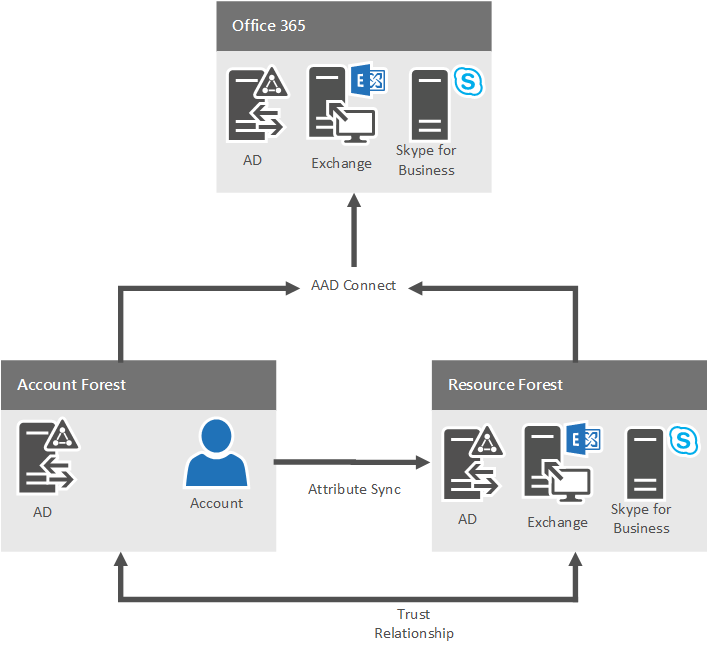
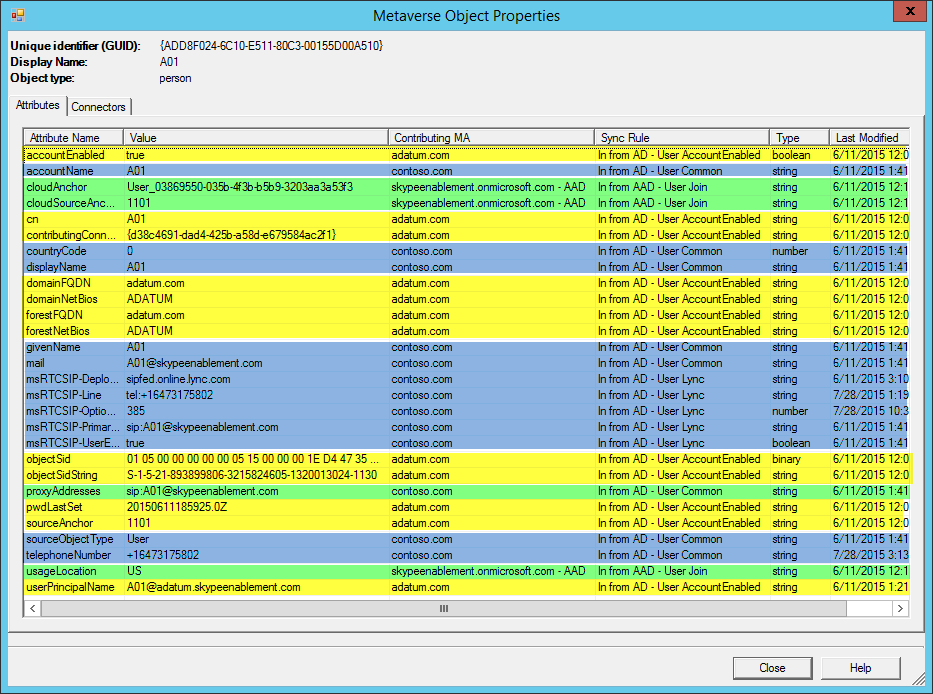

# Настройте среду нескольких лесов по гибридной среде Скайп для бизнесаConfigure a multi-forest environment for hybrid Skype for Business
 
В следующих разделах рекомендации по настройке среды с несколькими лесами в модель леса ресурса/пользователя для предоставления Скайп для бизнес-функции в гибридном сценарии.The following sections provide guidance on how to configure an environment that has multiple forests in a Resource/User forest model to provide Skype for Business functionality in a hybrid scenario. 
  

  
## Проверка топологии лесовValidate the Forest Topology

Поддерживаются многопользовательские леса. Учитывайте следующее.  Multiple user forests are supported. Keep the following in mind: 
  
- Для одного пользователя леса или леса развертывания нескольких пользователей должен быть в одном развертывании Скайп для Business Server.For either a single user forest or multiple user forest deployment, there must be a single deployment of Skype for Business Server.
    
- Поддерживаемые версии Lync Server и Скайп для сервера в гибридной конфигурации в разделе [требования к топологии](../../skype-for-business-hybrid-solutions/plan-hybrid-connectivity.md#BKMK_Topology) в [планировании гибридного подключения между Скайп Business Server и Скайп для бизнеса в Интернет](../../skype-for-business-hybrid-solutions/plan-hybrid-connectivity.md).For supported versions of Lync Server and Skype for Business Server in a hybrid configuration, see [Topology requirements](../../skype-for-business-hybrid-solutions/plan-hybrid-connectivity.md#BKMK_Topology) in [Plan hybrid connectivity between Skype for Business Server and Skype for Business Online](../../skype-for-business-hybrid-solutions/plan-hybrid-connectivity.md).
    
- Exchange Server может быть развернута в один или несколько лесов, которые может включать или не включать лес, содержащий Скайп для Business Server.Exchange Server can be deployed in one or more forests, which may or may not include the forest containing Skype for Business Server. Убедитесь, что вы применили последние накопительные пакеты обновления.Make sure you have applied the latest Cumulative Update.
    
- Дополнительные сведения о совместной работе с Exchange Server, в том числе ограничениях и критериях поддержки для различных комбинаций локальных и интернет-решений, см. в разделе [Поддержка функций](../../plan-your-deployment/integrate-with-exchange/integrate-with-exchange.md#feature_support) статьи [Plan to integrate Skype for Business and Exchange](../../plan-your-deployment/integrate-with-exchange/integrate-with-exchange.md).For details on co-existence with Exchange Server, including support criteria and limitations in various combinations of on-premises and online, see [Feature support](../../plan-your-deployment/integrate-with-exchange/integrate-with-exchange.md#feature_support) in [Plan to integrate Skype for Business and Exchange](../../plan-your-deployment/integrate-with-exchange/integrate-with-exchange.md).
    
Дополнительные сведения см. в разделе [Environmental requirements for Skype for Business Server 2015](../../plan-your-deployment/requirements-for-your-environment/environmental-requirements.md).For more information, please refer to [Environmental requirements for Skype for Business Server 2015](../../plan-your-deployment/requirements-for-your-environment/environmental-requirements.md).
  
## Рекомендации по размещению пользователейUser homing considerations

Скайп для бизнес-пользователей, размещенных на локальном может иметь Exchange, размещенные локально или через Интернет.Skype for Business users homed on premises can have Exchange homed on premises or online. Скайп для бизнеса в Интернет пользователей следует использовать Exchange Online для обеспечения оптимального взаимодействия; Однако это не требуется.Skype for Business Online users should use Exchange Online for an optimal experience; however, this is not required. Exchange при локальном не требуется для реализации Скайп для бизнеса в любом случае.Exchange on premises is not required to implement Skype for Business in either case.
  
## Настройка отношений доверия между лесамиConfigure Forest Trusts

Между лесом ресурсов и каждым из лесов пользователей должны быть установлены двусторонние транзитивные отношения доверия.The trusts required are two-way transitive trusts between the resource forest and each of the user forests. При наличии нескольких лесов пользователей для включения проверки подлинности между лесами важно включить режим "Маршрутизация суффикса имен" применительно к каждому из этих отношений доверия.If you have multiple user forests, to enable cross-forest authentication it is important that Name Suffix Routing is enabled for each of these forest trusts. Инструкции см. в разделе [Управление отношениями доверия между лесами](https://technet.microsoft.com/en-us/library/cc772440.aspx).For instructions, see [Managing Forest Trusts](https://technet.microsoft.com/en-us/library/cc772440.aspx). Если у вас есть Exchange Server, развернутые в другом лесу и предоставляет функциональные возможности для Скайп для бизнес-пользователей, леса, размещения Exchange необходимо обеспечить доверие размещение Скайп для Business Server.If you have Exchange Server deployed in an another forest and it provides functionality for Skype for Business users, the forest hosting Exchange must trust the forest hosting Skype for Business Server. К примеру если Exchange были развернуты в лесу, это эффективно означает, что в этой конфигурации требуется двусторонним доверием между учетной записи и Скайп для бизнеса лесов.For example, if Exchange were deployed in the account forest, this would effectively mean that a two-way trust between account and Skype for Business forests is required in that configuration.
  
## Синхронизация учетных записей в лесу, размещение Скайп для бизнесаSynchronize Accounts into the forest hosting Skype for Business

При Скайп for Business Server развертывается в одном лесу (леса ресурсов), но обеспечивает функциональные возможности для пользователей в один или несколько других лесов (лесах учетной записи), пользователи в других лесах должны быть представлены как объектов отключенных пользователей в лесу, где Скайп для Развернуть Business Server.When Skype for Business Server is deployed in one forest (a resource forest), but provides functionality to users in one or more other forests (account forests), users in the other forests must be represented as disabled user objects in the forest where Skype for Business Server is deployed. Продукта управления удостоверений, например Identity Manager должен быть развернута и настроена для подготовки и синхронизация пользователей из лесов учетной записи в лесу, где развернут Скайп для Business Server.An identity management product, such as Microsoft Identity Manager, needs to be deployed and configured to provision and synchronize the users from the account forests into the forest where Skype for Business Server is deployed. Пользователи должны быть синхронизированы в лесу, размещение Скайп для Business Server как объекты отключенных пользователей.Users must be synchronized into the forest hosting Skype for Business Server as disabled user objects. Пользователи не синхронизировать как контактных объектов Active Directory, поскольку подключение Azure Active Directory, не будут синхронизированы должным образом контакты в Azure AD для использования с Скайп.Users cannot be synchronized as Active Directory contact objects, because Azure Active Directory Connect will not properly synchronize contacts into Azure AD for use with Skype.
  
Вне зависимости от любого конфигурация с несколькими лесами леса, размещение Скайп для Business Server можно также предоставляют функциональные возможности для любого пользователей с включенной поддержкой, существующих в том же лесу.Regardless of any multi-forest configuration, the forest hosting Skype for Business Server can also provide functionality for any enabled users that exist in the same forest.
  
Для надлежащей синхронизации удостоверений требуется синхронизация следующих атрибутов.To get proper identity synchronization, the following attributes need to be synchronized: 
  
|**Леса пользователей****User Forests**|**Леса ресурсов****Resource Forests**|
|:-----|:-----|
|выбранный атрибут ссылки на учетную записьchosen account link attribute    |выбранный атрибут ссылки на учетную записьchosen account link attribute    |
|mail mail    |mail mail    |
|ProxyAddressesProxyAddresses    |ProxyAddressesProxyAddresses    |
|ObjectSIDObjectSID    |msRTCSIP-OriginatorSIDmsRTCSIP-OriginatorSID    |
   
[Выбранные атрибут ссылки учетной записи](https://azure.microsoft.com/documentation/articles/active-directory-aadconnect-design-concepts/) будет использоваться как источник привязки.The [chosen account link attribute](https://azure.microsoft.com/documentation/articles/active-directory-aadconnect-design-concepts/) will be used as the Source Anchor. При наличии различных и постоянные атрибут, который вы хотите использовать, можно сделать это, убедитесь, что изменение правила утверждения службы федерации Active Directory и выберите атрибут во время настройки подключения AAD.If you have a different and immutable attribute that you would prefer to use, you may do so, just be sure you edit the AD FS claims rule and select the attribute during the AAD Connect configuration.
  
Не выполнять синхронизацию между лесами UPN.Do not sync the UPN's between the forests. В результате испытаний было обнаружено, что имена субъектов-пользователей должны быть уникальными для каждого леса пользователей: одно и то же имя субъекта-пользователя не может быть назначено в разных лесах пользователей.We found during testing that we needed to use a unique UPN for each user forest, as you cannot use the same UPN across multiple forests. Поэтому следовало рассмотреть две возможности: с синхронизацией и без синхронизации имени субъекта-пользователя.As a result, we were presented with two possibilities, to synchronize the UPN or to not synchronize. 
  
- Если имя субъекта-пользователя из каждого леса пользователей не синхронизировано со связанным отключенным объектом в лесу ресурсов, единый вход не будет выполнен, по крайней мере с первой попытки (при условии, что пользователь выбрал сохранение пароля). Предполагается, что в клиенте SfB значения адреса SIP и имени субъекта-пользователя совпадают. Поскольку в данной ситуации применяется адрес SIP user@company.com, а для включенного объекта в лесу пользователей задано имя субъекта-пользователя user@contoso.company.com, при первой попытке входа произойдет сбой и появится запрос на ввод учетных данных пользователя. После ввода правильного/фактического имени субъекта-пользователя запрос на проверку подлинности будет выполнен с применением контроллеров доменов в лесу пользователей, и единый вход будет успешно завершен.If the unique UPN from each user forest was not synchronized to the associated disabled object in the resource forest, Single Sign-on would be broken for at least the initial sign-in attempt (assuming the user selected the option to save password). In the SfB client, we assume that the SIP/UPN values are the same. Since the SIP address in this scenario is user@company.com, but the UPN of the enabled object in the user forest is in fact user@contoso.company.com, the initial login attempt would fail and the user would be prompted to enter credentials. Upon entering their correct/actual UPN, the authentication request would be completed against the domain controllers in the user forest, and sign-in would be successful.
    
- Синхронизация имени субъекта-пользователя из каждого леса пользователей со связанным отключенным объектом в лесу ресурсов привела бы к сбою проверки подлинности AD FS. При применении правила сопоставления имя субъекта-пользователя было бы обнаружено на объекте в лесу ресурсов, однако проверка подлинности по этому объекту невозможна, так как он отключен.If the unique UPN from each user forest was synchronized to the associated disabled object in resource forest, AD FS authentication would fail. The matching rule would find the UPN on the object in the resource forest, which was disabled and could not be used for authentication. 
    
## Создание клиента Office 365Create an Office 365 tenant

После этого необходимо подготовить клиент Office 365 для работы в этом развертывании.You will next need to provision an Office 365 tenant to use with your deployment. Дополнительные сведения см. в разделе [Этапы подготовки Office 365](https://social.technet.microsoft.com/wiki/contents/articles/22808.office-365-provisioning-steps.aspx).For more information, please see [Office 365 Provisioning Steps](https://social.technet.microsoft.com/wiki/contents/articles/22808.office-365-provisioning-steps.aspx). 
  
## Настройка AD FSConfigure AD FS

После создания клиента потребуется настроить службы федерации Active Directory (AD FS) в каждом из лесов пользователей. При этом предполагается, что для каждого леса заданы уникальные адреса SIP и SMTP, а также имя субъекта-пользователя (UPN). AD FS не является обязательным компонентом; в данном случае он служит для реализации единого входа. В качестве альтернативы AD FS поддерживается также DirSync с синхронизацией паролей.Once you have a tenant, you will next need to configure Active Directory Federation Services (AD FS) ineach of the user forests. This assumes you have a unique SIP and SMTP address and User Principal Name (UPN) for each forest. AD FS is optional and is used here to get single-sign on. DirSync with Password Sync is also supported and can also be used in place of AD FS. 
  
Испытания проведены только для развертываний с совпадением SIP/SMTP и имен субъектов-пользователей. Несовпадение SIP/SMTP и имен субъектов-пользователей может привести к ухудшению функционирования, включая неполадки взаимодействия с Exchange и единого входа.Only deployments with matching SIP/SMTP and UPNs were tested. Not having matching SIP/SMTP/UPNs may result in reduced functionality, such as problems with Exchange integration and single-sign on. 
  
Если не использовать уникальные SIP/SMTP/UPN для пользователей из каждого леса, можно по-прежнему возникли неполадки единого входа (SSO) - независимо от того, где развернуты службы федерации Active Directory:Unless you use a unique SIP/SMTP/UPN for users from each forest, you can still run into Single Sign-on (SSO) problems - regardless of where AD FS is deployed: 
  
- Односторонние или двусторонние отношения доверия между лесами ресурсов/пользователей при развертывании фермы AD FS в каждом лесу пользователей; всем пользователям назначен один и тот же домен SIP/SMTP, но неповторяющиеся имена субъектов-пользователей для каждого леса пользователей.One-way or two-way trusts between resource/user forests with AD FS farm deployed in each user forest, all users share common SIP/SMTP domain but unique UPN for each user forest. 
    
- Двусторонние отношения доверия между лесами ресурсов/пользователей при развертывании фермы AD FS только в лесу ресурсов; всем пользователям назначен один и тот же домен SIP/SMTP, но неповторяющиеся имена субъектов-пользователей для каждого леса пользователей.Two-way trusts between resource/user forests with AD FS farm deployed only in resource forest, all users share common SIP/SMTP domain but unique UPN for each user forest. 
    
При размещении AD FS в каждом лесу пользователей и назначении уникальных адресов SIP/SMTP и имен субъектов пользователей для каждого леса обе неполадки устраняются. При попытке проверки подлинности поиск совпадений выполняется только в одном конкретном лесу пользователей. Это способствует бесперебойной проверке подлинности.By placing an AD FS farm in each user forest and using a unique SIP/SMTP/UPN for each forest, we resolve both issues. Only the accounts in that specific user forest would be searched and matched during authentication attempts. This will help provide a more seamless authentication process. 
  
Это будет стандартное развертывание Windows Server 2012 R2 AD FS и должен работать для продолжения.This will be a standard deployment of the Windows Server 2012 R2 AD FS and should be working before continuing. Для получения инструкций Узнайте, [как установить AD FS 2012 R2 для Office 365](https://blogs.technet.com/b/rmilne/archive/2014/04/28/how-to-install-adfs-2012-r2-for-office-365.aspx).For instructions, see [How To Install AD FS 2012 R2 For Office 365](https://blogs.technet.com/b/rmilne/archive/2014/04/28/how-to-install-adfs-2012-r2-for-office-365.aspx). 
  
После развертывания потребуется отредактировать правило утверждений, приведя его в соответствие с ранее выбранной привязкой к источнику. В AD FS MMC в разделе отношений доверия с проверяющей стороной щелкните "Microsoft Office 365 Identity Platform" правой кнопкой мыши и выберите команду редактирования правил утверждений. Откройте первое правило для редактирования и измените "ObjectSID" на "employeeNumber".Once deployed, you then have to edit the claims rule to match the Source Anchor selected earlier. In the AD FS MMC, under Relying Party Trusts, right-click Microsoft Office 365 Identity Platform and then click Edit Claim Rules. Edit the first rule and change ObjectSID to employeeNumber. 
  

  
## Настройка AAD ConnectConfigure AAD Connect

Объединение учетных записей из разных лесов, а также из лесов и Office 365 будет выполняться с помощью AAD Connect. В лесу ресурсов следует развернуть AAD Connect. Это необходимое условие синхронизации между несколькими лесами и Office 365, которая не поддерживается инструментом DirSync.AAD Connect will be used to merge the accounts between the different forests and between the forests and Office 365. You should deploy AAD Connect in the resource forest. It is required to be able to synchronize multiple forests and Office 365, which is not supported by Dirsync. 
  
В AAD Connect не выполняется синхронизация учетных записей между локальными лесами. Объекты, ранее синхронизированные между локальными лесами (средствами FIM или аналогичных программ), считываются с помощью соединителей AD. Затем с применением правил фильтрации создается единое представление соответствующего включенного и отключенного объекта в метавселенной; полученный объединенный объект реплицируется в Office 365.AAD Connect does not synchronize the accounts between on-premises forests. It uses AD connectors to read objects that are already synchronized across on-premises forests (by FIM or similar products). It then leverages filtering rules to create a single representation of both the matching enabled and disabled object in its metaverse, and then replicates that single, merged object into Office 365. 
  
По завершении объект в метавселенной, полученный в результате объединения средствами AAD Connect, выглядит приблизительно следующим образом:When finished and AAD Connect is merging, if you look at an object in the metaverse, you should see something similar to this: 
  

  
Атрибуты, выделенные зеленым цветом, получены из Office 365, желтым – из леса пользователей, синим – из леса ресурсов.The green highlighted attributes were merged from Office 365, the yellow are from the user forest and the blue are from the resource forest. 
  
Обратите внимание на то, что для тестового пользователя в AAD Connect распознаны атрибуты sourceAnchor и cloudSourceAnchor из объектов леса пользователей, леса ресурсов и Office 365; в данном случае отображается значение 1101, выбранное ранее для атрибута employeeNumber. Это позволило выполнить объединение и получить показанный выше объект.This is a test user, and you can see that AAD Connect has identified the sourceAnchor and the cloudSourceAnchor from the user and the resource forest objects and from Office 365, in our case 1101 which is the employeeNumber selected earlier. It then was able to merge this object into what you see above. 
  
Дополнительные сведения см. в разделе [Интеграция локальных удостоверений с Azure Active Directory](https://azure.microsoft.com/documentation/articles/active-directory-aadconnect/).For more information, see [Integrating your on-premises identities with Azure Active Directory](https://azure.microsoft.com/documentation/articles/active-directory-aadconnect/). 
  
При установке AAD преимущественно применяются значения по умолчанию.AAD Connect should be installed using mostly the defaults. Ниже указаны исключения.Except for the following steps: 
  
1.  Единого входа в - с уже развернуты службы федерации Active Directory и работу, выберите не заданSingle sign-in - with AD FS already deployed and working, select Do not configure
    
2. Подключение свои каталоги — Добавление всех доменовConnect your directories - add all of the domains 
    
3.  Определение пользователей в каталогах локального: выберите **удостоверения пользователей существовать в нескольких каталогах** и выберите атрибуты **ObjectSID** и **msExchangeMasterAccountSID**Identify users in on-premises directories: Select **User identities exist across multiple directories** and select **ObjectSID** and **msExchangeMasterAccountSID** attributes
    
4. Определение пользователей в Azure AD: привязки источника — Выбор атрибута выбора после прочтения [Выбор атрибута хороший sourceAnchor](https://azure.microsoft.com/documentation/articles/active-directory-aadconnect-design-concepts/), имя участника-пользователя - **userPrincipalName**Identify users in Azure AD: Source Anchor - Select the attribute you've chosen after reading [Selecting a good sourceAnchor attribute](https://azure.microsoft.com/documentation/articles/active-directory-aadconnect-design-concepts/), User Principal Name - **userPrincipalName**
    
5.  Дополнительные функции — выберите ли у вас есть гибридное развертывание Exchange развернут или нет.Optional features - select whether you have Exchange hybrid deployed or not.
    
    > [!NOTE]
    >  If you have only Exchange Online, there could be an issue with OAuth failures during autodiscover because of CNAME redirection.If you have only Exchange Online, there could be an issue with OAuth failures during autodiscover because of CNAME redirection. Чтобы исправить ошибку, необходимо задать URL-адреса автообнаружения Exchange, выполнив следующий командлет с Скайп для консоли Business Server:To correct this, you will need to set the Exchange Autodiscover URL by running the following cmdlet from the Skype for Business Server Management Shell:
  
    SET-CsOAuthConfiguration - ExchangeAutoDiscoverURLhttps://autodiscover-s.outlook.com/autodiscover/autodiscover.svcSet-CsOAuthConfiguration -ExchangeAutoDiscoverURL https://autodiscover-s.outlook.com/autodiscover/autodiscover.svc 
    
6.  Ферма AD FS: выберите **Использовать существующую ферму Windows Server 2012 R2 AD FS** и введите имя сервера AD FS.AD FS Farm: Select **Use an existing Windows Server 2012 R2 AD FS farm** and enter the name of the AD FS server.
    
7.  Завершите работу мастера и выполните необходимые проверки.Finish the wizard and perform the necessary validations.
    
## Настройка гибридного режима для Skype для бизнеса ServerConfigure Hybrid mode for Skype for Business Server

Следуйте рекомендациям по настройке Скайп для гибридных бизнеса.Follow the best practices for configuring Skype for Business hybrid. Дополнительные сведения о планировании см. в разделе [Планирование гибридного развертывания Skype для бизнеса Server 2015](https://technet.microsoft.com/en-us/library/jj205403.aspx); сведения о настройке см. в разделе [Настройка гибридного развертывания Skype для бизнеса Online](https://technet.microsoft.com/en-us/library/jj204669.aspx).For more planning information, see [Plan your hybrid deployment for Skype for Business Server 2015](https://technet.microsoft.com/en-us/library/jj205403.aspx), and for configuration information see [Configure hybrid with Skype for Business Online](https://technet.microsoft.com/en-us/library/jj204669.aspx). 
  
## Настройка гибридного режима для Exchange ServerConfigure hybrid mode for Exchange Server

При необходимости настройте гибридный режим для Exchange с учетом практических рекомендаций.If necessary, follow the best practices for configuring Exchange hybrid. Для получения дополнительных сведений см [Гибридные развертывания Exchange Server](https://technet.microsoft.com/en-us/library/jj200581%28v=exchg.150%29.aspx).For more information, see [Exchange Server Hybrid Deployments](https://technet.microsoft.com/en-us/library/jj200581%28v=exchg.150%29.aspx). 
  

