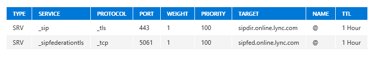

# <a name="configure-cloud-connector-integration-with-your-microsoft-365-or-office-365-organization"></a><span data-ttu-id="115ce-103">Настройка интеграции Cloud Connector с вашей организацией Microsoft 365 или Office 365</span><span class="sxs-lookup"><span data-stu-id="115ce-103">Configure Cloud Connector integration with your Microsoft 365 or Office 365 organization</span></span>

> [!Important] 
> <span data-ttu-id="115ce-104">Cloud Connector Edition выйдет 31 июля 2021 вместе со Skype для бизнеса Online.</span><span class="sxs-lookup"><span data-stu-id="115ce-104">Cloud Connector Edition will retire July 31, 2021 along with Skype for Business Online.</span></span> <span data-ttu-id="115ce-105">После обновления вашей организации до Teams Узнайте, как подключить локальную телефонную сеть к Teams с помощью [прямой маршрутизации](https://docs.microsoft.com/MicrosoftTeams/direct-routing-landing-page).</span><span class="sxs-lookup"><span data-stu-id="115ce-105">Once your organization has upgraded to Teams, learn how to connect your on-premises telephony network to Teams using [Direct Routing](https://docs.microsoft.com/MicrosoftTeams/direct-routing-landing-page).</span></span>

<span data-ttu-id="115ce-106">Узнайте, как настроить интеграцию Cloud Connector с вашей организацией Microsoft 365 или Office 365.</span><span class="sxs-lookup"><span data-stu-id="115ce-106">Learn how to configure Cloud Connector integration with your Microsoft 365 or Office 365 organization.</span></span>
  
<span data-ttu-id="115ce-107">После завершения установки Skype для бизнеса Cloud Connector Edition выполните действия, описанные в этом разделе, чтобы настроить развертывание и подключить его к вашей организации Microsoft 365 или Office 365.</span><span class="sxs-lookup"><span data-stu-id="115ce-107">Once the Skype for Business Cloud Connector Edition installation is complete, perform the steps in this section to configure your deployment and connect it to your Microsoft 365 or Office 365 organization.</span></span>
  
## <a name="configure-firewall-settings"></a><span data-ttu-id="115ce-108">Настройка параметров брандмауэра</span><span class="sxs-lookup"><span data-stu-id="115ce-108">Configure firewall settings</span></span>

<span data-ttu-id="115ce-109">Настройте параметры брандмауэра для внутреннего и внешнего параметров брандмауэра для сети периметра, чтобы открыть нужные порты, как описано в разделе [порты и протоколы](plan-skype-for-business-cloud-connector-edition.md#BKMB_Ports) в разделе [планирование использования Skype для бизнеса Cloud Connector Edition](plan-skype-for-business-cloud-connector-edition.md).</span><span class="sxs-lookup"><span data-stu-id="115ce-109">Configure the firewall settings for your internal and external firewall settings for you perimeter network to open the required ports as described in [Ports and protocols](plan-skype-for-business-cloud-connector-edition.md#BKMB_Ports) in [Plan for Skype for Business Cloud Connector Edition](plan-skype-for-business-cloud-connector-edition.md).</span></span>
  
## <a name="set-up-public-switched-telephone-network-pstn-gateways"></a><span data-ttu-id="115ce-110">Настройка шлюзов телефонной сети общего пользования (PSTN)</span><span class="sxs-lookup"><span data-stu-id="115ce-110">Set up Public Switched Telephone Network (PSTN) gateways</span></span>

<span data-ttu-id="115ce-111">Настройте магистрали для каждого шлюза PSTN, чтобы вернуться на серверы-посредники для всех устройств.</span><span class="sxs-lookup"><span data-stu-id="115ce-111">Set up trunks on each PSTN gateway to point back to Mediation Servers for all appliances.</span></span> <span data-ttu-id="115ce-112">Так как полное доменное имя пула одинаково для всех серверов в пуле, каждая магистраль должна указать на одно полное доменное имя сервера-посредника или IP-адрес вместо полного доменного имени пула серверов-посредников.</span><span class="sxs-lookup"><span data-stu-id="115ce-112">Because the pool FQDN is the same for all servers in the pool, each trunk should point to one Mediation Server FQDN or IP address instead of the Mediation Server pool FQDN.</span></span> <span data-ttu-id="115ce-113">Магистральные линии связи должны быть установлены с одинаковым приоритетом.</span><span class="sxs-lookup"><span data-stu-id="115ce-113">Trunks should be set in the same priority.</span></span>
  
<span data-ttu-id="115ce-114">Если между серверами-посредниками и шлюзами используется протокол TLS, необходимо настроить шлюзы и серверы-посредники так, чтобы они поддерживали MTLS следующим образом.</span><span class="sxs-lookup"><span data-stu-id="115ce-114">If you are using TLS between Mediation Servers and gateways, you will need to configure the gateways and Mediation Servers to support MTLS as follows:</span></span>
  
1. <span data-ttu-id="115ce-115">Экспортируйте корневой ЦС с компьютера Active Directory Cloud Connector.</span><span class="sxs-lookup"><span data-stu-id="115ce-115">Export the Root CA from the Cloud Connector Active Directory computer.</span></span>
    
2. <span data-ttu-id="115ce-116">Следуйте инструкциям поставщика шлюза PSTN для импорта корневого центра сертификации.</span><span class="sxs-lookup"><span data-stu-id="115ce-116">Follow the PSTN gateway vendor instructions for importing the Root CA.</span></span>
    
3. <span data-ttu-id="115ce-117">Импортируйте сертификат корневого центра сертификации для сертификата, выданного шлюзом, на серверах-посредниках.</span><span class="sxs-lookup"><span data-stu-id="115ce-117">Import the Root CA certificate for the certificate issued to your gateway on the Mediation Servers.</span></span> <span data-ttu-id="115ce-118">Если вам требуется получить SSL-сертификат для шлюза, это можно сделать с помощью службы центра сертификации, запущенной на компьютере Active Directory Cloud Connector, следующим образом:</span><span class="sxs-lookup"><span data-stu-id="115ce-118">If you need to obtain an SSL certificate for the gateway, you may do this using the Certificate Authority service running on the Cloud Connector Active Directory computer as follows:</span></span>
    
   - <span data-ttu-id="115ce-119">Измените существующий шаблон веб-сервера, чтобы разрешить регистрацию для пользователей, прошедших проверку подлинности, или создайте новый шаблон веб-сервера, чтобы настроить другие свойства и разрешить регистрацию для пользователей, прошедших проверку подлинности.</span><span class="sxs-lookup"><span data-stu-id="115ce-119">Modify the existing Web Server template to enable Authenticated users to enroll, or create a new Web Server template to configure other properties and enable Authenticated users to enroll.</span></span> <span data-ttu-id="115ce-120">Подробные инструкции приведены в статье [шаблоны сертификатов](https://technet.microsoft.com/library/cc730705.aspx).</span><span class="sxs-lookup"><span data-stu-id="115ce-120">For detailed instructions, see [Certificate Templates](https://technet.microsoft.com/library/cc730705.aspx).</span></span>
    
   - <span data-ttu-id="115ce-121">Запросите сертификат с помощью оснастки "сертификат", выбрав шаблон веб-сервера, который вы включили.</span><span class="sxs-lookup"><span data-stu-id="115ce-121">Request a certificate using Certificate snap-in selecting the Web Server template that you have enabled.</span></span> <span data-ttu-id="115ce-122">Не забудьте добавить общее имя в поле subject и DNS в альтернативное имя с полным доменным именем шлюза и подтверждение закрытого ключа, который должен экспортировать закрытый ключ, в разделе Параметры ключа.</span><span class="sxs-lookup"><span data-stu-id="115ce-122">Be sure to add Common name in Subject and DNS name in Alternative name with FQDN of the gateway, and confirm on the Private Key that Make private key exportable is selected under key options.</span></span> 
    
4. <span data-ttu-id="115ce-123">Экспортируйте SSL-сертификат с закрытым ключом и следуйте инструкциям поставщика шлюза PSTN для импорта сертификата.</span><span class="sxs-lookup"><span data-stu-id="115ce-123">Export the SSL certificate with Private key and follow the instructions from your PSTN gateway vendor for importing the certificate.</span></span>
    
## <a name="update-the-domain-for-your-tenant"></a><span data-ttu-id="115ce-124">Обновление домена для клиента</span><span class="sxs-lookup"><span data-stu-id="115ce-124">Update the domain for your tenant</span></span>

<span data-ttu-id="115ce-125">Убедитесь, что вы выполнили действия по обновлению домена в Microsoft 365 или Office 365, а также можете добавлять записи DNS.</span><span class="sxs-lookup"><span data-stu-id="115ce-125">Make sure that you've completed the steps to update your domain in Microsoft 365 or Office 365 and have the ability to add DNS records.</span></span> <span data-ttu-id="115ce-126">Для получения дополнительных сведений о настройке домена в Microsoft 365 или Office 365, ознакомьтесь со статьей [Добавление домена в microsoft 365 или office 365](https://support.office.com/article/Add-a-domain-to-Office-365-6383f56d-3d09-4dcb-9b41-b5f5a5efd611).</span><span class="sxs-lookup"><span data-stu-id="115ce-126">For more information about how to set up your domain in Microsoft 365 or Office 365, see [Add a domain to Microsoft 365 or Office 365](https://support.office.com/article/Add-a-domain-to-Office-365-6383f56d-3d09-4dcb-9b41-b5f5a5efd611).</span></span>
  
## <a name="add-dns-records-for-your-edge"></a><span data-ttu-id="115ce-127">Добавление записей DNS для пограничного сервера</span><span class="sxs-lookup"><span data-stu-id="115ce-127">Add DNS records for your Edge</span></span>

<span data-ttu-id="115ce-128">Добавьте следующие записи DNS в организацию Microsoft 365 или Office 365.</span><span class="sxs-lookup"><span data-stu-id="115ce-128">Add the following DNS records to your Microsoft 365 or Office 365 organization.</span></span> <span data-ttu-id="115ce-129">Сведения о том, как добавлять записи DNS, можно узнать [в статье Добавление и Редактирование настраиваемых записей DNS в Microsoft 365 или Office 365](https://support.office.com/article/Add-or-edit-custom-DNS-records-in-Office-365-AF00A516-DD39-4EDA-AF3E-1EAF686C8DC9?ui=en-US&amp;rs=en-US&amp;ad=US&amp;fromAR=1).</span><span class="sxs-lookup"><span data-stu-id="115ce-129">For information about how to add DNS records, see [Add or edit custom DNS records in Microsoft 365 or Office 365](https://support.office.com/article/Add-or-edit-custom-DNS-records-in-Office-365-AF00A516-DD39-4EDA-AF3E-1EAF686C8DC9?ui=en-US&amp;rs=en-US&amp;ad=US&amp;fromAR=1).</span></span>
  
1. <span data-ttu-id="115ce-130">Добавьте запись A DNS для пограничного доступа.</span><span class="sxs-lookup"><span data-stu-id="115ce-130">Add a DNS A record for Access Edge.</span></span>
    
2. <span data-ttu-id="115ce-131">Записи SRV будут автоматически созданы Microsoft 365 или Office 365 и скриптами развертывания.</span><span class="sxs-lookup"><span data-stu-id="115ce-131">SRV records will automatically be created by Microsoft 365 or Office 365 and the deployment scripts.</span></span> <span data-ttu-id="115ce-132">Убедитесь, что вы можете найти следующие две службы SIP на пограничном: \_ SIP и \_ сипфедератионтлс.</span><span class="sxs-lookup"><span data-stu-id="115ce-132">Confirm that you can look up the following two SIP services on the Edge: \_sip and \_sipfederationtls.</span></span>
    
     
  
## <a name="set-up-hybrid-connectivity-between-cloud-connector-edition-and-microsoft-365-or-office-365"></a><span data-ttu-id="115ce-134">Настройка гибридного подключения между Cloud Connector Edition и Microsoft 365 или Office 365</span><span class="sxs-lookup"><span data-stu-id="115ce-134">Set up hybrid connectivity between Cloud Connector Edition and Microsoft 365 or Office 365</span></span>

<span data-ttu-id="115ce-135">Чтобы настроить гибридное подключение между развертыванием Skype для бизнеса Cloud Connector Edition и вашей организацией Microsoft 365 или Office 365, выполните следующий командлет в удаленном сеансе PowerShell.</span><span class="sxs-lookup"><span data-stu-id="115ce-135">To configure hybrid connectivity between your Skype for Business Cloud Connector Edition deployment and your Microsoft 365 or Office 365 organization, run the following cmdlet in a remote PowerShell session.</span></span> <span data-ttu-id="115ce-136">Чтобы узнать, как установить удаленный сеанс PowerShell, ознакомьтесь со статьей: [Настройка компьютера для Windows PowerShell](https://technet.microsoft.com/library/dn362831%28v=ocs.15%29.aspx).</span><span class="sxs-lookup"><span data-stu-id="115ce-136">To learn how to establish a remote PowerShell session, see: [Set up your computer for Windows PowerShell](https://technet.microsoft.com/library/dn362831%28v=ocs.15%29.aspx).</span></span>
  
<span data-ttu-id="115ce-137">Командлет задает внешнее полное доменное имя пограничного сервера доступа.</span><span class="sxs-lookup"><span data-stu-id="115ce-137">The cmdlet sets the Access Edge external FQDN.</span></span> <span data-ttu-id="115ce-138">В первой команде \<External Access Edge FQDN\> для роли пограничного сервера доступа SIP должен быть указан один из них.</span><span class="sxs-lookup"><span data-stu-id="115ce-138">In the first of the commands, the \<External Access Edge FQDN\> should be the one for the SIP Access Edge role.</span></span> <span data-ttu-id="115ce-139">По умолчанию это должен быть AP. \<Domain Name\> .</span><span class="sxs-lookup"><span data-stu-id="115ce-139">By default, this should be ap.\<Domain Name\>.</span></span>
  
```powershell
Set-CsTenantHybridConfiguration -PeerDestination <External Access Edge FQDN> -UseOnPremDialPlan $false
Set-CsTenantFederationConfiguration -SharedSipAddressSpace $True
```

> [!NOTE]
> <span data-ttu-id="115ce-140">Внешнее полное доменное имя пограничного доступа, используемое для узла назначения, должно быть настроено на сайт PSTN, который будет использоваться только как резервный, если пользователь не назначен для сайта PSTN.</span><span class="sxs-lookup"><span data-stu-id="115ce-140">The External Access Edge FQDN used for Peer Destination should be set to a PSTN site that will only be used as a fallback in case a user isn't assigned to a PSTN site.</span></span> <span data-ttu-id="115ce-141">Дополнительные сведения см. [в разделе Развертывание одного сайта в Cloud Connector](deploy-a-single-site-in-cloud-connector.md) и [развертывание нескольких сайтов в Cloud Connector](deploy-multiple-sites-in-cloud-connector.md).</span><span class="sxs-lookup"><span data-stu-id="115ce-141">For more information, see [Deploy a single site in Cloud Connector](deploy-a-single-site-in-cloud-connector.md) and [Deploy multiple sites in Cloud Connector](deploy-multiple-sites-in-cloud-connector.md).</span></span> 
  
## <a name="set-up-pstn-gateways"></a><span data-ttu-id="115ce-142">Настройка шлюзов PSTN</span><span class="sxs-lookup"><span data-stu-id="115ce-142">Set up PSTN gateways</span></span>

<span data-ttu-id="115ce-143">Настройте магистрали для каждого шлюза PSTN, чтобы вернуться на серверы-посредники для всех устройств.</span><span class="sxs-lookup"><span data-stu-id="115ce-143">Set up trunks on each PSTN gateway to point back to Mediation Servers for all appliances.</span></span> <span data-ttu-id="115ce-144">Каждая магистраль должна указать на одно полное доменное имя сервера-посредника или IP-адрес, а не полное доменное имя пула серверов-посредников, так как полное доменное имя пула одинаково для всех серверов в пуле.</span><span class="sxs-lookup"><span data-stu-id="115ce-144">Each trunk should point to one Mediation Server FQDN or IP address instead of the Mediation Server pool FQDN because the pool FQDN is the same for all servers in the pool.</span></span> <span data-ttu-id="115ce-145">Магистральные линии связи должны быть установлены с одинаковым приоритетом.</span><span class="sxs-lookup"><span data-stu-id="115ce-145">Trunks should be set in the same priority.</span></span>
  
<span data-ttu-id="115ce-146">Если между серверами-посредниками и шлюзами используется протокол TLS, необходимо настроить шлюзы и серверы-посредники так, чтобы они поддерживали MTLS следующим образом.</span><span class="sxs-lookup"><span data-stu-id="115ce-146">If you are using TLS between Mediation Servers and gateways, you will need to configure the gateways and Mediation Servers to support MTLS as follows:</span></span>
  
1. <span data-ttu-id="115ce-147">Экспортируйте корневой ЦС с компьютера Active Directory Cloud Connector.</span><span class="sxs-lookup"><span data-stu-id="115ce-147">Export the Root CA from the Cloud Connector Active Directory computer.</span></span>
    
2. <span data-ttu-id="115ce-148">Следуйте инструкциям поставщика шлюза PSTN для импорта корневого центра сертификации.</span><span class="sxs-lookup"><span data-stu-id="115ce-148">Follow the PSTN gateway vendor instructions for importing the Root CA.</span></span>
    
3. <span data-ttu-id="115ce-149">Импортируйте сертификат корневого центра сертификации для сертификата, выданного шлюзом, на серверах-посредниках.</span><span class="sxs-lookup"><span data-stu-id="115ce-149">Import the Root CA certificate for the certificate issued to your gateway on the Mediation Servers.</span></span> <span data-ttu-id="115ce-150">Если вам требуется получить SSL-сертификат для шлюза, это можно сделать с помощью службы центра сертификации, запущенной на компьютере Active Directory Cloud Connector, следующим образом:</span><span class="sxs-lookup"><span data-stu-id="115ce-150">If you need to obtain an SSL certificate for the gateway, you may do this using the Certificate Authority service running on the Cloud Connector Active Directory computer as follows:</span></span>
    
   - <span data-ttu-id="115ce-151">Измените существующий шаблон веб-сервера, чтобы разрешить регистрацию для пользователей, прошедших проверку подлинности, или создайте новый шаблон веб-сервера, чтобы настроить другие свойства и разрешить регистрацию для пользователей, прошедших проверку подлинности.</span><span class="sxs-lookup"><span data-stu-id="115ce-151">Modify the existing Web Server template to enable Authenticated users to Enroll, or create a new Web Server template to configure other properties and enable Authenticated users to enroll.</span></span> <span data-ttu-id="115ce-152">Подробные инструкции приведены в статье [шаблоны сертификатов](https://technet.microsoft.com/library/cc730705.aspx).</span><span class="sxs-lookup"><span data-stu-id="115ce-152">For detailed instructions, see [Certificate Templates](https://technet.microsoft.com/library/cc730705.aspx).</span></span>
    
   - <span data-ttu-id="115ce-153">Запросите сертификат с помощью оснастки "сертификат", выбрав шаблон веб-сервера, который вы включили.</span><span class="sxs-lookup"><span data-stu-id="115ce-153">Request a certificate using Certificate snap-in selecting the Web Server template that you have enabled.</span></span> <span data-ttu-id="115ce-154">Не забудьте добавить общее имя в поле subject и DNS в альтернативное имя с полным доменным именем шлюза и подтверждение закрытого ключа, который должен экспортировать закрытый ключ, в разделе Параметры ключа.</span><span class="sxs-lookup"><span data-stu-id="115ce-154">Be sure to add Common name in Subject and DNS name in Alternative name with FQDN of the gateway, and confirm on the Private Key that Make private key exportable is selected under key options.</span></span> 
    
4. <span data-ttu-id="115ce-155">Экспортируйте SSL-сертификат с закрытым ключом и следуйте инструкциям поставщика шлюза PSTN для импорта сертификата.</span><span class="sxs-lookup"><span data-stu-id="115ce-155">Export the SSL certificate with Private key and follow the instructions from your PSTN gateway vendor for importing the certificate.</span></span>
    
5. <span data-ttu-id="115ce-156">Шлюзы PSTN на одном сайте PSTN должны подключаться только к серверам-посредникам на том же сайте.</span><span class="sxs-lookup"><span data-stu-id="115ce-156">PSTN gateway(s) in one PSTN site should only connect to the Mediation Server(s) in the same site.</span></span>
    
## <a name="set-up-your-users"></a><span data-ttu-id="115ce-157">Настройка пользователей</span><span class="sxs-lookup"><span data-stu-id="115ce-157">Set up your users</span></span>

<span data-ttu-id="115ce-158">Выполните вход в центр администрирования Microsoft 365, добавьте пользователей, которые будут включены для служб голосовой связи, и назначьте лицензию "или телефонную систему" в лицензию E3 этим пользователям.</span><span class="sxs-lookup"><span data-stu-id="115ce-158">Log in to the Microsoft 365 admin center, add the users that will be enabled for online voice services, and assign an E5 license or Phone System add-on to the E3 license to these users.</span></span> <span data-ttu-id="115ce-159">Для получения сведений о добавлении пользователей [в раздел Добавление пользователей в Microsoft 365 для бизнеса](https://support.office.com/article/Add-users-to-Office-365-for-business-435ccec3-09dd-4587-9ebd-2f3cad6bc2bc).</span><span class="sxs-lookup"><span data-stu-id="115ce-159">For information about adding users, see [Add users to Microsoft 365 for business](https://support.office.com/article/Add-users-to-Office-365-for-business-435ccec3-09dd-4587-9ebd-2f3cad6bc2bc).</span></span>
  
## <a name="enable-users-for-phone-system-voice-and-voicemail-services"></a><span data-ttu-id="115ce-160">Предоставление пользователям поддержки голосовой и голосовой почты телефонной системы</span><span class="sxs-lookup"><span data-stu-id="115ce-160">Enable users for Phone System voice and voicemail services</span></span>
 
<span data-ttu-id="115ce-161">После добавления пользователей в Microsoft 365 или Office 365 включите их учетные записи для служб голосовой связи телефонной системы, включая голосовую почту.</span><span class="sxs-lookup"><span data-stu-id="115ce-161">After adding your users to Microsoft 365 or Office 365, enable their accounts for Phone System voice services, including voicemail.</span></span> <span data-ttu-id="115ce-162">Чтобы включить эти возможности, необходимо войти в организацию Microsoft 365 или Office 365 с учетной записью, которая является ролью глобального администратора, и запустить удаленную оболочку PowerShell.</span><span class="sxs-lookup"><span data-stu-id="115ce-162">To enable these capabilities, you must log in to your Microsoft 365 or Office 365 organization with an account that is a Global Administrator role, and be able to run remote PowerShell.</span></span> <span data-ttu-id="115ce-163">Чтобы узнать, как установить удаленный сеанс PowerShell, ознакомьтесь со статьей: [Настройка компьютера для Windows PowerShell](https://technet.microsoft.com/library/dn362831%28v=ocs.15%29.aspx)</span><span class="sxs-lookup"><span data-stu-id="115ce-163">To learn how to establish a remote PowerShell session, see: [Set up your computer for Windows PowerShell](https://technet.microsoft.com/library/dn362831%28v=ocs.15%29.aspx)</span></span>
  
- <span data-ttu-id="115ce-164">Назначьте политику для пользователя и настройте номер рабочего телефона, указанный в параметре **Identity** :</span><span class="sxs-lookup"><span data-stu-id="115ce-164">Assign the policy to your user and configure the user's business voice phone number, which you specify with the value of the **Identity** parameter:</span></span>
    
  ```powershell
  Set-CsUser -Identity "<User name>" -EnterpriseVoiceEnabled $true -HostedVoiceMail $true -OnPremLineURI <tel:+phonenumber>
  ```

    > [!NOTE]
    > <span data-ttu-id="115ce-165">Удостоверение пользователя можно указать с помощью SIP-адреса пользователя, имени участника-пользователя (UPN) или отображаемого имени Active Directory пользователя (например, "Bob Kelly").</span><span class="sxs-lookup"><span data-stu-id="115ce-165">A user identity can be specified using the user's SIP address, user principal name (UPN), or the user's Active Directory display name (for example, "Bob Kelly").</span></span> <span data-ttu-id="115ce-166">Символ звездочки ( \* ) также можно использовать с отображаемым именем в качестве удостоверения пользователя.</span><span class="sxs-lookup"><span data-stu-id="115ce-166">The asterisk (\*) character can also be used with the Display Name as the user Identity.</span></span> <span data-ttu-id="115ce-167">Например, идентификатор " \* Smith" возвращает всех пользователей с отображаемым именем, заканчивающимся строковым значением "Smith".</span><span class="sxs-lookup"><span data-stu-id="115ce-167">For example, the Identity "\*Smith" returns all the users who have a display name that ends with the string value "Smith".</span></span>
  
<span data-ttu-id="115ce-168">Затем можно убедиться, что пользователи добавлены и включены с помощью следующего скрипта:</span><span class="sxs-lookup"><span data-stu-id="115ce-168">You can then verify that the users were added and enabled using the following script:</span></span>
  
```powershell
# Input the user name you want to verify
$user = Get-CsOnlineUser <User name>

# For a hybrid user, the value of $user.EnterpriseVoiceEnabled should be True
$user.EnterpriseVoiceEnabled

# For a hybrid user, the value of $user.HostedVoiceMail should be True
$user.HostedVoiceMail

# For a hybrid user, the value of $user.VoicePolicy should be "HybridVoice"
$user.VoicePolicy
```

<span data-ttu-id="115ce-169">Необходимо решить, будут ли пользователи выполнять международные звонки.</span><span class="sxs-lookup"><span data-stu-id="115ce-169">You'll need to decide whether your users should be able to make international calls.</span></span> <span data-ttu-id="115ce-170">По умолчанию международный звонок включен.</span><span class="sxs-lookup"><span data-stu-id="115ce-170">By default, international calling is enabled.</span></span> <span data-ttu-id="115ce-171">Вы можете отключить или включить поддержку международных звонков для пользователей с помощью центра администрирования Skype для бизнеса Online.</span><span class="sxs-lookup"><span data-stu-id="115ce-171">You can disable or enable users for international dialing using the online Skype for Business admin center.</span></span>
  
<span data-ttu-id="115ce-172">Чтобы отключить международные звонки для отдельных пользователей, выполните следующий командлет в Skype для бизнеса Online PowerShell:</span><span class="sxs-lookup"><span data-stu-id="115ce-172">To disable international calling on a per user basis, run the following cmdlet in Skype for Business Online PowerShell:</span></span>
  
```powershell
Grant-CsVoiceRoutingPolicy -PolicyName InternationalCallsDisallowed -Identity $user
```

<span data-ttu-id="115ce-173">Чтобы повторно включить международный звонок на уровне пользователя после его отключения, выполните тот же командлет, но измените значение для **PolicyName** на *интернатионалкаллсалловед*  .</span><span class="sxs-lookup"><span data-stu-id="115ce-173">To re-enable international calling on a per user basis after it has been disabled, run the same cmdlet, but change the value for **PolicyName** to *InternationalCallsAllowed*  .</span></span>
  
## <a name="assign-users-to-pstn-sites"></a><span data-ttu-id="115ce-174">Назначение пользователей сайтам PSTN</span><span class="sxs-lookup"><span data-stu-id="115ce-174">Assign users to PSTN sites</span></span>

<span data-ttu-id="115ce-175">Используйте удаленную консоль PowerShell клиента, чтобы назначить сайт пользователям, даже если вы развернули только один сайт.</span><span class="sxs-lookup"><span data-stu-id="115ce-175">Use tenant remote PowerShell to assign a site to users even if you only deployed a single site.</span></span> <span data-ttu-id="115ce-176">Чтобы узнать, как установить удаленный сеанс PowerShell, ознакомьтесь со статьей: [Настройка компьютера для Windows PowerShell](https://technet.microsoft.com/library/dn362831%28v=ocs.15%29.aspx).</span><span class="sxs-lookup"><span data-stu-id="115ce-176">To learn how to establish a remote PowerShell session, see: [Set up your computer for Windows PowerShell](https://technet.microsoft.com/library/dn362831%28v=ocs.15%29.aspx).</span></span>
  
```powershell
# Set the site to users
Set-CsUserPstnSettings -Identity <User Name> -HybridPstnSite <PSTN Site Name>

# Review the site setting for a user
Get-CsUserPstnSettings -Identity <User Name> 

# See all the user settings in one tenant
Get-CsOnlineUser | Get-CsUserPstnSettings
```

> [!NOTE]
> <span data-ttu-id="115ce-177">Если пользователю не назначено ни одного сайта PSTN, гибридное подключение между развертыванием Skype для бизнеса Cloud Connector Edition и вашей организацией Microsoft 365 или Office 365 будет использоваться по умолчанию на уровне клиента (одноранговый узел), чтобы можно было выполнить вызовы.</span><span class="sxs-lookup"><span data-stu-id="115ce-177">If no PSTN site is assigned to a user, hybrid connectivity between your Skype for Business Cloud Connector Edition deployment and your Microsoft 365 or Office 365 organization will fall back to use the tenant level default one (Peer Destination) so that calls can be completed.</span></span> 
  
## <a name="configure-online-hybrid-mediation-server-settings"></a><span data-ttu-id="115ce-178">Настройка параметров сервера гибридного гибридного сервера-посредника</span><span class="sxs-lookup"><span data-stu-id="115ce-178">Configure online hybrid Mediation Server Settings</span></span>
<span data-ttu-id="115ce-179"><a name="BKMK_ConfigureMediationServer"> </a></span><span class="sxs-lookup"><span data-stu-id="115ce-179"><a name="BKMK_ConfigureMediationServer"> </a></span></span>

<span data-ttu-id="115ce-180">Когда звонок P2P эскалируется на конференцию PSTN, сервер конференций Skype для бизнеса Online отправляет приглашение на сервер-посредник Cloud Connector.</span><span class="sxs-lookup"><span data-stu-id="115ce-180">When a P2P call is escalated to a PSTN conference, the Skype for Business Online conferencing server will send an invite to the Cloud Connector Mediation Server.</span></span> <span data-ttu-id="115ce-181">Чтобы обеспечить успешное перенаправление этого приглашения в Microsoft 365 или Office 365, необходимо настроить параметр в сетевом клиенте для каждого сервера-посредника Cloud Connector следующим образом:</span><span class="sxs-lookup"><span data-stu-id="115ce-181">To ensure that Microsoft 365 or Office 365 can route this invite successfully, you need to configure a setting in your online tenant for each Cloud Connector Mediation Server as follows:</span></span> 
  
1. <span data-ttu-id="115ce-182">Создайте пользователя в центре администрирования Microsoft 365.</span><span class="sxs-lookup"><span data-stu-id="115ce-182">Create a user in the Microsoft 365 admin center.</span></span> <span data-ttu-id="115ce-183">Используйте любое нужное имя пользователя, например "MediationServer1".</span><span class="sxs-lookup"><span data-stu-id="115ce-183">Use any user name you want, such as "MediationServer1."</span></span>
    
    <span data-ttu-id="115ce-184">Использование домена SIP по умолчанию для Cloud Connector (первый домен SIP в ini-файле) в качестве домена пользователя.</span><span class="sxs-lookup"><span data-stu-id="115ce-184">Use the default SIP domain of Cloud Connector (the first SIP domain in the .ini file) as the user domain.</span></span>
    
    <span data-ttu-id="115ce-185">Обратите внимание, что назначение лицензии необходимо только для распространения пользователей в каталоге Skype для бизнеса Online.</span><span class="sxs-lookup"><span data-stu-id="115ce-185">Please note that license assignment is only required for the user propagation into the Skype for Business online directory.</span></span> <span data-ttu-id="115ce-186">Назначьте для созданной учетной записи лицензию Microsoft 365 или Office 365 (например, "ошибка 1"), а затем убедитесь, что учетные записи пользователей правильно настроены в каталоге Skype для бизнеса Online, выполнив следующий командлет, а затем удалите лицензию из этой учетной записи.</span><span class="sxs-lookup"><span data-stu-id="115ce-186">Assign a Microsoft 365 or Office 365 license (such as E5) to the account you create, allow up to one hour for the changes to propagate,verify the user accounts has been provisioned correctly to the Skype for Business online directory by running following cmdlet, then remove the license from this account.</span></span>
    ```powershell
   Get-CsOnlineUser -Identity <UserPrincipalName>
   ```
    
2. <span data-ttu-id="115ce-187">Запустите удаленный сеанс PowerShell Azure AD с помощью глобальных учетных данных или учетных данных администратора пользователя, а затем выполните следующий командлет, чтобы настроить отдел для учетной записи пользователя Azure AD, настроенной на шаге 1, на "Хибридмедиатионсервер":</span><span class="sxs-lookup"><span data-stu-id="115ce-187">Start a tenant Azure AD remote PowerShell session using your global or user admin credentials, and then run the following cmdlet to set the department for the Azure AD user account configured in step 1 to "HybridMediationServer":</span></span>

   ```powershell
   Set-MsolUser -UserPrincipalName <UserPrincipalName> -Department "HybridMediationServer"
   ```

3. <span data-ttu-id="115ce-188">Запустите удаленный сеанс PowerShell для клиента Skype для бизнеса, используя учетные данные администратора клиента Skype для бизнеса, а затем выполните следующий командлет, чтобы установить для учетной записи сервера-посредника и полного доменного имени пограничного сервера имя учетной записи пользователя, заменив \<DisplayName\> Отображаемое имя пользователя на учетную запись, созданную на этапе 1:</span><span class="sxs-lookup"><span data-stu-id="115ce-188">Start a tenant Skype for Business remote PowerShell session using your Skype for Business tenant admin credentials, and then run the following cmdlet to set the Mediation Server and Edge Server FQDN to that user account, replacing \<DisplayName\> with the Display Name of the user for the account you created in step 1:</span></span>
    
   ```powershell
   Set-CsHybridMediationServer -Identity <DisplayName> -Fqdn <MediationServerFQDN> -AccessProxyExternalFqdn <EdgeServerExternalFQDN>
   ```

    <span data-ttu-id="115ce-189">В качестве параметра Identity укажите отображаемое имя учетной записи пользователя, созданной для этого сервера-посредника.</span><span class="sxs-lookup"><span data-stu-id="115ce-189">For Identity, use the Display Name of the user account you created for this Mediation Server.</span></span>
    
    <span data-ttu-id="115ce-190">Для  *медиатионсерверфкдн*  используйте внутреннее полное доменное имя, определенное для сервера-посредника.</span><span class="sxs-lookup"><span data-stu-id="115ce-190">For  *MediationServerFQDN*  , use the internal FQDN defined for your Mediation Server.</span></span>
    
    <span data-ttu-id="115ce-191">Для  *еджесерверекстерналфкдн*  используйте внешнее полное доменное имя, определенное для прокси-сервера доступа пограничного сервера.</span><span class="sxs-lookup"><span data-stu-id="115ce-191">For  *EdgeServerExternalFQDN*  , use the external FQDN defined for Edge Server Access Proxy.</span></span> <span data-ttu-id="115ce-192">При наличии нескольких сайтов PSTN Cloud Connector выберите полное доменное имя прокси-сервера доступа пограничного сервера, назначенное сайту, на котором находится сервер-посредник.</span><span class="sxs-lookup"><span data-stu-id="115ce-192">If there are multiple Cloud Connector PSTN sites, choose the Edge Server Access Proxy FQDN assigned to the site where the Mediation Server is located.</span></span>
    
4. <span data-ttu-id="115ce-193">При наличии нескольких серверов-посредников Cloud Connector (с несколькими сайтами, HA) повторите предыдущие действия для каждого из них.</span><span class="sxs-lookup"><span data-stu-id="115ce-193">If there are multiple Cloud Connector Mediation Servers (multiple-site, HA), please repeat the previous steps for each of them.</span></span>
    
