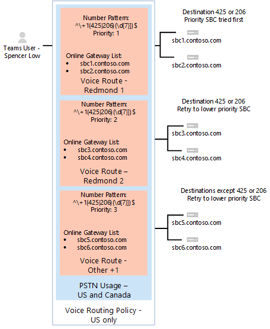

# <a name="configure-direct-routing"></a><span data-ttu-id="8a72e-103">Настройка прямой маршрутизации</span><span class="sxs-lookup"><span data-stu-id="8a72e-103">Configure Direct Routing</span></span>

  > [!NOTE]
  > <span data-ttu-id="8a72e-104">Это предварительного выпуска Microsoft телефонной системы прямой маршрутизации.</span><span class="sxs-lookup"><span data-stu-id="8a72e-104">This is a preview release of Microsoft Phone System Direct Routing.</span></span>  <span data-ttu-id="8a72e-105">Документация и функциональные возможности продуктов могут быть изменены.</span><span class="sxs-lookup"><span data-stu-id="8a72e-105">Product functionality and documentation are subject to change.</span></span>

<span data-ttu-id="8a72e-106">Если вы еще не сделали прочитайте [Планирование прямой маршрутизации](plan-direct-routing.md) наличие необходимых компонентов и просмотреть другие действия необходимо выполнить перед настройкой сети Microsoft телефонной системой.</span><span class="sxs-lookup"><span data-stu-id="8a72e-106">If you have not already done so, read [Plan Direct Routing](plan-direct-routing.md) for prerequisites and to review  other steps you’ll need to take before you configure your Microsoft Phone System network.</span></span> 

  > [!NOTE]
  > <span data-ttu-id="8a72e-107">В этом документе содержится информация для ИТ-специалистов.</span><span class="sxs-lookup"><span data-stu-id="8a72e-107">This document is intended for IT professionals.</span></span>  

<span data-ttu-id="8a72e-108">В этой статье описывается настройка прямой маршрутизации Microsoft телефонной системы.</span><span class="sxs-lookup"><span data-stu-id="8a72e-108">This article describes how to configure Microsoft Phone System Direct Routing.</span></span> <span data-ttu-id="8a72e-109">Описывается, как связать поддерживаемые пограничный контроллер сеансов (SBC) для прямой маршрутизации и способы настройки групп Майкрософт пользователям использовать прямой маршрутизации для подключения к общедоступной переключения телефонной сети общего пользования (PSTN).</span><span class="sxs-lookup"><span data-stu-id="8a72e-109">It details how to pair a supported Session Border Controller (SBC) to Direct Routing and how to configure Microsoft Teams users to use Direct Routing to connect to the Public Switched Telephone Network (PSTN).</span></span> <span data-ttu-id="8a72e-110">Для выполнения действий, описанных в данной статье, администраторы должны знакомы с командлеты PowerShell.</span><span class="sxs-lookup"><span data-stu-id="8a72e-110">To complete the steps explained in this article, administrators need some familiarity with PowerShell cmdlets.</span></span> <span data-ttu-id="8a72e-111">Дополнительные сведения об использовании PowerShell в разделе [Настройка компьютера для Windows PowerShell](https://technet.microsoft.com/library/dn362831.aspx).</span><span class="sxs-lookup"><span data-stu-id="8a72e-111">For more information about using PowerShell, see [Set up your computer for Windows PowerShell](https://technet.microsoft.com/library/dn362831.aspx).</span></span> 

<span data-ttu-id="8a72e-112">Рекомендуется, чтобы подтвердить, что пограничного контроллера Сеансов уже настроен соответствии с рекомендациями по своему поставщику SBC:</span><span class="sxs-lookup"><span data-stu-id="8a72e-112">We recommend that you confirm that your SBC has already been configured as recommended by your SBC vendor's:</span></span> 

- <span data-ttu-id="8a72e-113">Документация по развертыванию AudioCodes</span><span class="sxs-lookup"><span data-stu-id="8a72e-113">AudioCodes deployment documentation</span></span> 
- <span data-ttu-id="8a72e-114">Документация по развертыванию ленты</span><span class="sxs-lookup"><span data-stu-id="8a72e-114">Ribbon deployment documentation</span></span>

<span data-ttu-id="8a72e-115">Можно настроить телефонной системой Microsoft и пользователи могли использовать прямой маршрутизации, а затем настроить группами Майкрософт как предпочитаемый вызывающего клиента, выполнив следующие действия:</span><span class="sxs-lookup"><span data-stu-id="8a72e-115">You can configure your Microsoft Phone System and enable  users to use Direct Routing, then set up Microsoft Teams as the preferred calling client by completing the following procedures:</span></span> 

- [<span data-ttu-id="8a72e-116">Пары SBC с телефонной системы Microsoft и проверки связывания</span><span class="sxs-lookup"><span data-stu-id="8a72e-116">Pair the SBC with a Microsoft Phone System and validate the pairing</span></span>](#pair-the-sbc-to-direct-routing-service-of-phone-system)
- [<span data-ttu-id="8a72e-117">Включение пользователей для службы напрямую маршрутизации</span><span class="sxs-lookup"><span data-stu-id="8a72e-117">Enable users for Direct Routing Service</span></span>](#enable-users-for-direct-routing-service)
- [<span data-ttu-id="8a72e-118">Убедитесь, что группами Майкрософт является предпочтительным вызывающего клиента для пользователей</span><span class="sxs-lookup"><span data-stu-id="8a72e-118">Ensure that Microsoft Teams is the preferred calling client for the users</span></span>](#set-microsoft-teams-as-the-preferred-calling-client-for-the-users) 

## <a name="pair-the-sbc-to-direct-routing-service-of-phone-system"></a><span data-ttu-id="8a72e-119">Пары SBC для направления маршрутизации службы телефонной системой</span><span class="sxs-lookup"><span data-stu-id="8a72e-119">Pair the SBC to Direct Routing Service of Phone System</span></span> 

<span data-ttu-id="8a72e-120">Ниже приведены три основных действия можно подключиться или пары SBC интерфейс прямой маршрутизации.</span><span class="sxs-lookup"><span data-stu-id="8a72e-120">The following are the three high-level steps to let you connect, or pair, the SBC to the Direct Routing interface:</span></span> 

- <span data-ttu-id="8a72e-121">Подключение к центру администрирования **Скайп для бизнеса в Интернет** , с помощью PowerShell</span><span class="sxs-lookup"><span data-stu-id="8a72e-121">Connect to **Skype for Business Online** admin center using PowerShell</span></span> 
- <span data-ttu-id="8a72e-122">Пара SBC</span><span class="sxs-lookup"><span data-stu-id="8a72e-122">Pair the SBC</span></span> 
- <span data-ttu-id="8a72e-123">Проверка сопоставления</span><span class="sxs-lookup"><span data-stu-id="8a72e-123">Validate the pairing</span></span> 

### <a name="connect-to--skype-for-business-online-by-using-powershell"></a><span data-ttu-id="8a72e-124">Подключение к Скайп для бизнеса в Интернет с помощью PowerShell</span><span class="sxs-lookup"><span data-stu-id="8a72e-124">Connect to  Skype for Business Online by using PowerShell</span></span> 

<span data-ttu-id="8a72e-125">Можно использовать сеанс PowerShell, подключенных к клиенту связать SBC интерфейс прямой маршрутизации.</span><span class="sxs-lookup"><span data-stu-id="8a72e-125">You can use a PowerShell session connected to the tenant to pair the SBC to the Direct Routing interface.</span></span> <span data-ttu-id="8a72e-126">Чтобы открыть сеанс PowerShell, выполните действия, указанные в [Настройка компьютера для Windows PowerShell](https://technet.microsoft.com/library/dn362831.aspx).</span><span class="sxs-lookup"><span data-stu-id="8a72e-126">To open a PowerShell session, please follow the steps outlined in [Set up your computer for Windows PowerShell](https://technet.microsoft.com/library/dn362831.aspx).</span></span> 
 
<span data-ttu-id="8a72e-127">После создания удаленного сеанса PowerShell, проверьте, что вы видите команды для управления SBC.</span><span class="sxs-lookup"><span data-stu-id="8a72e-127">After you establish a remote PowerShell session, please validate that you can see the commands to manage the SBC.</span></span> <span data-ttu-id="8a72e-128">Для проверки команды, введите или копирование и вставка в следующем в сеанс PowerShell и нажмите клавишу ВВОД:</span><span class="sxs-lookup"><span data-stu-id="8a72e-128">To validate the commands, type or copy/paste in the following in the PowerShell session and press Enter:</span></span> 

```
gcm *onlinePSTNGateway*
```

<span data-ttu-id="8a72e-129">Команда вернет четыре функций, которые будут позволяют управлять их изготовителей.</span><span class="sxs-lookup"><span data-stu-id="8a72e-129">Your command will return the four functions shown here that will let you manage the SBCs.</span></span> 

<pre>
CommandType    Name                       Version    Source 
-----------    ----                       -------    ------ 
Function       Get-CsOnlinePSTNGateway    1.0        tmp_v5fiu1no.wxt 
Function       New-CsOnlinePSTNGateway    1.0        tmp_v5fiu1no.wxt 
Function       Remove-CsOnlinePSTNGateway 1.0        tmp_v5fiu1no.wxt 
Function       Set-CsOnlinePSTNGateway    1.0        tmp_v5fiu1no.wxt
</pre>   


### <a name="pair-the-sbc-to-the-tenant"></a><span data-ttu-id="8a72e-130">Пара SBC к клиенту</span><span class="sxs-lookup"><span data-stu-id="8a72e-130">Pair the SBC to the tenant</span></span> 

<span data-ttu-id="8a72e-131">Связать SBC к клиенту в сеанс PowerShell введите следующую команду и нажмите клавишу ВВОД:</span><span class="sxs-lookup"><span data-stu-id="8a72e-131">To pair the SBC to the tenant, in the PowerShell session type the following and press Enter:</span></span> 

```
New-CsOnlinePSTNGateway -Fqdn <SBC FQDN> -SipSignallingPort <SBC SIP Port> -MaxConcurrentSessions <Max Concurrent Sessions the SBC can handle> -Enabled $true 
```
  > [!NOTE]
  > 1. <span data-ttu-id="8a72e-132">Мы настоятельно рекомендуем Установка ограничения для SBC, с помощью сведений, можно найти в документации по SBC.</span><span class="sxs-lookup"><span data-stu-id="8a72e-132">We highly recommend setting a limit for the SBC, using information that can be found in the SBC documentation.</span></span> <span data-ttu-id="8a72e-133">Ограничение запустит уведомление, если SBC был создан на уровне мощности.</span><span class="sxs-lookup"><span data-stu-id="8a72e-133">The limit will trigger a notification if SBC is at the capacity level.</span></span>
  > 2. <span data-ttu-id="8a72e-134">Вы можете только обеспечить SBC с полным доменным ИМЕНЕМ, где домен часть имени соответствует одной из доменов, зарегистрированных в клиенту, за исключением \*. onmicrosoft.com.</span><span class="sxs-lookup"><span data-stu-id="8a72e-134">You can only pair the SBC with FQDN, where the domain portion of the name matches one of the domains registered in your tenant, except \*.onmicrosoft.com.</span></span> <span data-ttu-id="8a72e-135">С помощью \*. omicrosoft.com доменных имен не поддерживается для имен SBC полное доменное имя.</span><span class="sxs-lookup"><span data-stu-id="8a72e-135">Using \*.omicrosoft.com domain names is not supported for the SBC FQDN names.</span></span> <span data-ttu-id="8a72e-136">Например, если у вас есть два доменных имен:</span><span class="sxs-lookup"><span data-stu-id="8a72e-136">For example, if you have two domain names:</span></span><br/><br/>
  > <span data-ttu-id="8a72e-137">**ABC**.xyz</span><span class="sxs-lookup"><span data-stu-id="8a72e-137">**abc**.xyz</span></span><br/><span data-ttu-id="8a72e-138">**ABC**. onmicrosoft.com</span><span class="sxs-lookup"><span data-stu-id="8a72e-138">**abc**.onmicrosoft.com</span></span><br/><br/>
  > <span data-ttu-id="8a72e-139">Для имени SBC можно использовать имя sbc.abc.xyz.</span><span class="sxs-lookup"><span data-stu-id="8a72e-139">For the SBC name, you can use the name sbc.abc.xyz.</span></span> <span data-ttu-id="8a72e-140">При попытке связать SBC с именем sbc.xyz.abc, система не позволит вам, как домен не принадлежит этот клиент.</span><span class="sxs-lookup"><span data-stu-id="8a72e-140">If you try to pair the SBC with a name sbc.xyz.abc, the system will not let you, as the domain is not owned by this tenant.</span></span>

```
New-CsOnlinePSTNGateway -Identity sbc.contoso.com -Enabled $true -SipSignallingPort 5067 -MaxConcurrentSessions 100 
```
<span data-ttu-id="8a72e-141">Возвращает:</span><span class="sxs-lookup"><span data-stu-id="8a72e-141">Returns:</span></span>
<pre>
Identity              : sbc.contoso.com 
Fqdn                  : sbc.contoso.com 
SipSignallingPort     : 5067 
FailoverTimeSeconds   : 10 
ForwardCallHistory    : False 
ForwardPai            : False 
SendSipOptions        : True 
MaxConcurrentSessions : 100 
Enabled               : True   
</pre>
<span data-ttu-id="8a72e-142">Доступны дополнительные методы, которые могут быть заданы во время связывания.</span><span class="sxs-lookup"><span data-stu-id="8a72e-142">There are additional options that can be set during the pairing.</span></span> <span data-ttu-id="8a72e-143">В предыдущем примере тем не менее, минимально необходимые параметры показаны.</span><span class="sxs-lookup"><span data-stu-id="8a72e-143">In the previous example, however, only the minimum required parameters are shown.</span></span> 
 
<span data-ttu-id="8a72e-144">В следующей таблице перечислены дополнительные параметры, которые можно использовать в настройке параметров для *New-CsOnlinePstnGateway*.</span><span class="sxs-lookup"><span data-stu-id="8a72e-144">The following table lists the additional parameters that you can use in setting parameters for *New-CsOnlinePstnGateway*.</span></span> 

|<span data-ttu-id="8a72e-145">Обязательно?</span><span class="sxs-lookup"><span data-stu-id="8a72e-145">Required?</span></span>|<span data-ttu-id="8a72e-146">Имя</span><span class="sxs-lookup"><span data-stu-id="8a72e-146">Name</span></span>|<span data-ttu-id="8a72e-147">Описание</span><span class="sxs-lookup"><span data-stu-id="8a72e-147">Description</span></span>|<span data-ttu-id="8a72e-148">"Default" (По умолчанию)</span><span class="sxs-lookup"><span data-stu-id="8a72e-148">Default</span></span>|<span data-ttu-id="8a72e-149">Возможные значения</span><span class="sxs-lookup"><span data-stu-id="8a72e-149">Possible values</span></span>|<span data-ttu-id="8a72e-150">Тип и ограничения</span><span class="sxs-lookup"><span data-stu-id="8a72e-150">Type and restrictions</span></span>|
|:-----|:-----|:-----|:-----|:-----|:-----|
|<span data-ttu-id="8a72e-151">Да</span><span class="sxs-lookup"><span data-stu-id="8a72e-151">Yes</span></span>|<span data-ttu-id="8a72e-152">Полное доменное имя</span><span class="sxs-lookup"><span data-stu-id="8a72e-152">FQDN</span></span>|<span data-ttu-id="8a72e-153">Полное ДОМЕННОЕ имя пограничного контроллера Сеансов</span><span class="sxs-lookup"><span data-stu-id="8a72e-153">The FQDN name of the SBC</span></span> |<span data-ttu-id="8a72e-154">Нет</span><span class="sxs-lookup"><span data-stu-id="8a72e-154">None</span></span>|<span data-ttu-id="8a72e-155">Имя NoneFQDN, ограничение 63 символов</span><span class="sxs-lookup"><span data-stu-id="8a72e-155">NoneFQDN name, limit 63 characters</span></span>|<span data-ttu-id="8a72e-156">Строка, список разрешенных и запрещенных символов на [соглашениях об именовании в Active Directory для компьютеров, доменов, сайты и подразделениями](https://support.microsoft.com/en-us/help/909264)</span><span class="sxs-lookup"><span data-stu-id="8a72e-156">String,  list of allowed and disallowed characters on [Naming conventions in Active Directory for computers, domains, sites, and OUs](https://support.microsoft.com/en-us/help/909264)</span></span>|
|<span data-ttu-id="8a72e-157">Нет</span><span class="sxs-lookup"><span data-stu-id="8a72e-157">No</span></span>|<span data-ttu-id="8a72e-158">MediaBypass</span><span class="sxs-lookup"><span data-stu-id="8a72e-158">MediaBypass</span></span> |<span data-ttu-id="8a72e-159">Параметр зарезервирован для будущего использования.</span><span class="sxs-lookup"><span data-stu-id="8a72e-159">The parameter reserved for future use.</span></span> <span data-ttu-id="8a72e-160">Параметра, указанное для SBC поддерживает обход сервера-посредника и администратор хочет его использования.</span><span class="sxs-lookup"><span data-stu-id="8a72e-160">Parameter indicated of the SBC supports Media Bypass and the administrator wants to use it.</span></span>|<span data-ttu-id="8a72e-161">Нет</span><span class="sxs-lookup"><span data-stu-id="8a72e-161">None</span></span>|<span data-ttu-id="8a72e-162">True</span><span class="sxs-lookup"><span data-stu-id="8a72e-162">True</span></span><br/><span data-ttu-id="8a72e-163">False</span><span class="sxs-lookup"><span data-stu-id="8a72e-163">False</span></span>|<span data-ttu-id="8a72e-164">Логическое</span><span class="sxs-lookup"><span data-stu-id="8a72e-164">Boolean</span></span>|
|<span data-ttu-id="8a72e-165">Да</span><span class="sxs-lookup"><span data-stu-id="8a72e-165">Yes</span></span>|<span data-ttu-id="8a72e-166">SipSignallingPort</span><span class="sxs-lookup"><span data-stu-id="8a72e-166">SipSignallingPort</span></span> |<span data-ttu-id="8a72e-167">Прослушивающий порт, используемый для взаимодействия со службами прямой маршрутизации с помощью протокола безопасности TLS (Transport Layer).</span><span class="sxs-lookup"><span data-stu-id="8a72e-167">Listening port used for communicating with Direct Routing services by using the Transport Layer Security (TLS) protocol.</span></span>|<span data-ttu-id="8a72e-168">Нет</span><span class="sxs-lookup"><span data-stu-id="8a72e-168">None</span></span>|<span data-ttu-id="8a72e-169">Любой порт</span><span class="sxs-lookup"><span data-stu-id="8a72e-169">Any port</span></span>|<span data-ttu-id="8a72e-170">от 0 до 65535</span><span class="sxs-lookup"><span data-stu-id="8a72e-170">0 to 65535</span></span> |
|<span data-ttu-id="8a72e-171">Нет</span><span class="sxs-lookup"><span data-stu-id="8a72e-171">No</span></span>|<span data-ttu-id="8a72e-172">FailoverTimeSeconds</span><span class="sxs-lookup"><span data-stu-id="8a72e-172">FailoverTimeSeconds</span></span> |<span data-ttu-id="8a72e-173">Если задано значение 10 (значение по умолчанию), исходящие вызовы, которые не отвечает в течение 10 секунд шлюз направляются Далее доступные линии связи; Если нет дополнительных магистралей, звонок автоматически удаляются.</span><span class="sxs-lookup"><span data-stu-id="8a72e-173">When set to 10 (default value), outbound calls that are not answered by the gateway within 10 seconds are routed to the next available trunk; if there are no additional trunks, then the call is automatically dropped.</span></span> <span data-ttu-id="8a72e-174">В организации с низкой скоростью сети и ответа шлюза это может приводить к сбросу вызовов без необходимости.</span><span class="sxs-lookup"><span data-stu-id="8a72e-174">In an organization with slow networks and gateway responses, that could potentially result in calls being dropped unnecessarily.</span></span> <span data-ttu-id="8a72e-175">Значение по умолчанию — 10.</span><span class="sxs-lookup"><span data-stu-id="8a72e-175">The default value is 10.</span></span>|<span data-ttu-id="8a72e-176">10</span><span class="sxs-lookup"><span data-stu-id="8a72e-176">10</span></span>|<span data-ttu-id="8a72e-177">Число</span><span class="sxs-lookup"><span data-stu-id="8a72e-177">Number</span></span>|<span data-ttu-id="8a72e-178">Int</span><span class="sxs-lookup"><span data-stu-id="8a72e-178">Int</span></span>|
|<span data-ttu-id="8a72e-179">Нет</span><span class="sxs-lookup"><span data-stu-id="8a72e-179">No</span></span>|<span data-ttu-id="8a72e-180">ForwardCallHistory</span><span class="sxs-lookup"><span data-stu-id="8a72e-180">ForwardCallHistory</span></span> |<span data-ttu-id="8a72e-181">Означает, будет ли переадресовываться по магистральному каналу сведения о журнале звонков.</span><span class="sxs-lookup"><span data-stu-id="8a72e-181">Indicates whether call history information will be forwarded through the trunk.</span></span> <span data-ttu-id="8a72e-182">Если этот параметр включен, прокси-сервер Office 365 ТСОП отправляет два заголовки: сведений журнала и ссылается по.</span><span class="sxs-lookup"><span data-stu-id="8a72e-182">If enabled, the Office 365 PSTN Proxy sends two headers: History-info and Referred-By.</span></span> <span data-ttu-id="8a72e-183">Значение по умолчанию — **False** ($False).</span><span class="sxs-lookup"><span data-stu-id="8a72e-183">The default value is **False** ($False).</span></span> |<span data-ttu-id="8a72e-184">False</span><span class="sxs-lookup"><span data-stu-id="8a72e-184">False</span></span>|<span data-ttu-id="8a72e-185">True</span><span class="sxs-lookup"><span data-stu-id="8a72e-185">True</span></span><br/><span data-ttu-id="8a72e-186">False</span><span class="sxs-lookup"><span data-stu-id="8a72e-186">False</span></span>|<span data-ttu-id="8a72e-187">Логическое</span><span class="sxs-lookup"><span data-stu-id="8a72e-187">Boolean</span></span>|
|<span data-ttu-id="8a72e-188">Нет</span><span class="sxs-lookup"><span data-stu-id="8a72e-188">No</span></span>|<span data-ttu-id="8a72e-189">ForwardPAI</span><span class="sxs-lookup"><span data-stu-id="8a72e-189">ForwardPAI</span></span>|<span data-ttu-id="8a72e-190">Указывает, будет ли переадресовываться заголовок P-Asserted-Identity (PAI) одновременно с вызовом.</span><span class="sxs-lookup"><span data-stu-id="8a72e-190">Indicates whether the P-Asserted-Identity (PAI) header will be forwarded along with the call.</span></span> <span data-ttu-id="8a72e-191">Заголовок PAI позволяет проверить личность звонящего.</span><span class="sxs-lookup"><span data-stu-id="8a72e-191">The PAI header provides a way to verify the identity of the caller.</span></span> <span data-ttu-id="8a72e-192">Значение по умолчанию — **False** ($False).</span><span class="sxs-lookup"><span data-stu-id="8a72e-192">The default value is **False** ($False).</span></span>|<span data-ttu-id="8a72e-193">False</span><span class="sxs-lookup"><span data-stu-id="8a72e-193">False</span></span>|<span data-ttu-id="8a72e-194">True</span><span class="sxs-lookup"><span data-stu-id="8a72e-194">True</span></span><br/><span data-ttu-id="8a72e-195">False</span><span class="sxs-lookup"><span data-stu-id="8a72e-195">False</span></span>|<span data-ttu-id="8a72e-196">Логическое</span><span class="sxs-lookup"><span data-stu-id="8a72e-196">Boolean</span></span>|
|<span data-ttu-id="8a72e-197">Нет</span><span class="sxs-lookup"><span data-stu-id="8a72e-197">No</span></span>|<span data-ttu-id="8a72e-198">SendSIPOptions</span><span class="sxs-lookup"><span data-stu-id="8a72e-198">SendSIPOptions</span></span> |<span data-ttu-id="8a72e-199">Определяет, если SBC будет или не будет отправлять параметры SIP.</span><span class="sxs-lookup"><span data-stu-id="8a72e-199">Defines if an SBC will or will not send the SIP options.</span></span> <span data-ttu-id="8a72e-200">Если этот параметр отключен, SBC будут исключены из системы мониторинга и оповещений.</span><span class="sxs-lookup"><span data-stu-id="8a72e-200">If disabled, the SBC will be excluded from Monitoring and Alerting system.</span></span> <span data-ttu-id="8a72e-201">Настоятельно рекомендуется включить параметры SIP.</span><span class="sxs-lookup"><span data-stu-id="8a72e-201">We highly recommend that you enable SIP options.</span></span> <span data-ttu-id="8a72e-202">Значение по умолчанию — **True**.</span><span class="sxs-lookup"><span data-stu-id="8a72e-202">Default value is **True**.</span></span> |<span data-ttu-id="8a72e-203">True</span><span class="sxs-lookup"><span data-stu-id="8a72e-203">True</span></span>|<span data-ttu-id="8a72e-204">True</span><span class="sxs-lookup"><span data-stu-id="8a72e-204">True</span></span><br/><span data-ttu-id="8a72e-205">False</span><span class="sxs-lookup"><span data-stu-id="8a72e-205">False</span></span>|<span data-ttu-id="8a72e-206">Логическое</span><span class="sxs-lookup"><span data-stu-id="8a72e-206">Boolean</span></span>|
|<span data-ttu-id="8a72e-207">Нет</span><span class="sxs-lookup"><span data-stu-id="8a72e-207">No</span></span>|<span data-ttu-id="8a72e-208">MaxConcurrentSessions</span><span class="sxs-lookup"><span data-stu-id="8a72e-208">MaxConcurrentSessions</span></span> |<span data-ttu-id="8a72e-209">Используемый предупреждения системы.</span><span class="sxs-lookup"><span data-stu-id="8a72e-209">Used by alerting system.</span></span> <span data-ttu-id="8a72e-210">Если любое значение, предупреждения системы будет создать оповещение для администратора клиента, если количество одновременных сеансов является 90% или выше, чем это значение.</span><span class="sxs-lookup"><span data-stu-id="8a72e-210">When any value is set, the alerting system will generate an alert to the tenant administrator when the number of concurrent session is 90% or higher than this value.</span></span> <span data-ttu-id="8a72e-211">Если параметр не задан, оповещения не создаются.</span><span class="sxs-lookup"><span data-stu-id="8a72e-211">If parameter is not set, the alerts are not generated.</span></span> <span data-ttu-id="8a72e-212">Тем не менее система мониторинга сообщает количество одновременных сеансов каждые 24 часа.</span><span class="sxs-lookup"><span data-stu-id="8a72e-212">However, the monitoring system will report number of concurrent session every 24 hours.</span></span> |<span data-ttu-id="8a72e-213">NULL</span><span class="sxs-lookup"><span data-stu-id="8a72e-213">Null</span></span>|<span data-ttu-id="8a72e-214">NULL</span><span class="sxs-lookup"><span data-stu-id="8a72e-214">Null</span></span><br/><span data-ttu-id="8a72e-215">1 до 100 000</span><span class="sxs-lookup"><span data-stu-id="8a72e-215">1 to 100,000</span></span> ||
|<span data-ttu-id="8a72e-216">Нет</span><span class="sxs-lookup"><span data-stu-id="8a72e-216">No</span></span>|<span data-ttu-id="8a72e-217">Включено \*</span><span class="sxs-lookup"><span data-stu-id="8a72e-217">Enabled\*</span></span>|<span data-ttu-id="8a72e-218">Используется для включения этой SBC для исходящих звонков.</span><span class="sxs-lookup"><span data-stu-id="8a72e-218">Used to enable this SBC for outbound calls.</span></span> <span data-ttu-id="8a72e-219">Можно использовать для временно удалить SBC в процессе обновления или во время обслуживания.</span><span class="sxs-lookup"><span data-stu-id="8a72e-219">Can be used to temporarily remove the SBC, while it is being updated or during maintenance.</span></span> |<span data-ttu-id="8a72e-220">False</span><span class="sxs-lookup"><span data-stu-id="8a72e-220">False</span></span>|<span data-ttu-id="8a72e-221">True</span><span class="sxs-lookup"><span data-stu-id="8a72e-221">True</span></span><br/><span data-ttu-id="8a72e-222">False</span><span class="sxs-lookup"><span data-stu-id="8a72e-222">False</span></span>|<span data-ttu-id="8a72e-223">Логическое</span><span class="sxs-lookup"><span data-stu-id="8a72e-223">Boolean</span></span>|
 
### <a name="verify-the-sbc-pairing"></a><span data-ttu-id="8a72e-224">Проверка подключения к SBC</span><span class="sxs-lookup"><span data-stu-id="8a72e-224">Verify the SBC pairing</span></span> 

<span data-ttu-id="8a72e-225">Проверьте подключение:</span><span class="sxs-lookup"><span data-stu-id="8a72e-225">Verify the connection:</span></span> 
- <span data-ttu-id="8a72e-226">Проверьте, если в списке парного SBC будет SBC.</span><span class="sxs-lookup"><span data-stu-id="8a72e-226">Check if the SBC is on the list of paired SBCs.</span></span> 
- <span data-ttu-id="8a72e-227">Проверка параметров SIP.</span><span class="sxs-lookup"><span data-stu-id="8a72e-227">Validate SIP Options.</span></span> 
 
#### <a name="validate-if-sbc-is-on-the-list-of-paired-sbcs"></a><span data-ttu-id="8a72e-228">Проверить, если SBC находится в списке парного их изготовителей</span><span class="sxs-lookup"><span data-stu-id="8a72e-228">Validate if SBC is on the list of paired SBCs</span></span> 

<span data-ttu-id="8a72e-229">По окончании пары SBC проверки SBC присутствует в списке парного их изготовителей, выполнив следующую команду в удаленный сеанс PowerShell:`Get-CSOnlinePSTNGateway`</span><span class="sxs-lookup"><span data-stu-id="8a72e-229">After you pair the SBC, validate that the SBC is present in the list of paired SBCs by running the following command  in a remote PowerShell session: `Get-CSOnlinePSTNGateway`</span></span>

<span data-ttu-id="8a72e-230">Парного шлюза следует отображаются в списке, как показано в следующем примере и убедитесь, что параметр *Enabled* значение **True**.</span><span class="sxs-lookup"><span data-stu-id="8a72e-230">The paired gateway should appear in the list as shown in the example below, and verify that the parameter *Enabled* displays the value **True**.</span></span> <span data-ttu-id="8a72e-231">Введите:</span><span class="sxs-lookup"><span data-stu-id="8a72e-231">Enter:</span></span>

```
Get-CsOnlinePSTNGateway -Identity sbc.contoso.com  
```
<span data-ttu-id="8a72e-232">Которая возвращает:</span><span class="sxs-lookup"><span data-stu-id="8a72e-232">Which returns:</span></span>
<pre>
Identity              : sbc.contoso.com  
Fqdn                  : sbc.contoso.com 
SipSignallingPort     : 5067 
CodecPriority         : SILKWB,SILKNB,PCMU,PCMA 
ExcludedCodecs        :  
FailoverTimeSeconds   : 10 
ForwardCallHistory    : False 
ForwardPai            : False 
SendSipOptions        : True 
MaxConcurrentSessions : 100 
Enabled               : True 
</pre>

#### <a name="validate-sip-options-flow"></a><span data-ttu-id="8a72e-233">Проверка потока SIP-параметры</span><span class="sxs-lookup"><span data-stu-id="8a72e-233">Validate SIP Options flow</span></span> 

<span data-ttu-id="8a72e-234">Для проверки связывания с помощью параметров исходящей SIP, с помощью интерфейса управления SBC и увидеть, что SBC получите 200 OK ответ на исходящие параметры.</span><span class="sxs-lookup"><span data-stu-id="8a72e-234">To validate the pairing using outgoing SIP Options, use the SBC management interface and see that the SBC get 200 OK responses to the outgoing OPTIONS.</span></span>
  
<span data-ttu-id="8a72e-235">При прямой маршрутизации видит входящие параметры, он будет запущен процесс исходящей параметры отправки SBC полное доменное имя, настроенных в поле Заголовок контакт входящего сообщения, параметры.</span><span class="sxs-lookup"><span data-stu-id="8a72e-235">When Direct Routing sees incoming OPTIONS, it will start sending outgoing options to the SBC FQDN configured in the Contact header field in the incoming OPTIONS message.</span></span> 

<span data-ttu-id="8a72e-236">Для проверки связывания с помощью параметров входящих SIP, с помощью интерфейса управления SBC и увидеть, что SBC получает ответ на параметры сообщения, поступающие из прямой маршрутизации и что код ответа 200 OK.</span><span class="sxs-lookup"><span data-stu-id="8a72e-236">To validate the pairing using incoming SIP Options, use the SBC management interface and see that the SBC gets reply on the OPTIONS messages coming in from Direct Routing and that the response code is 200 OK.</span></span>  

## <a name="enable-users-for-direct-routing-service"></a><span data-ttu-id="8a72e-237">Включение пользователей для службы напрямую маршрутизации</span><span class="sxs-lookup"><span data-stu-id="8a72e-237">Enable users for Direct Routing Service</span></span> 

<span data-ttu-id="8a72e-238">Когда вы готовы к Включение пользователей для службы напрямую маршрутизации, выполните следующие действия:</span><span class="sxs-lookup"><span data-stu-id="8a72e-238">When you are ready to enable users for the Direct Routing Service, follow these steps:</span></span> 

1. <span data-ttu-id="8a72e-239">Создание пользователя в Office 365 и назначьте лицензии на систему телефона.</span><span class="sxs-lookup"><span data-stu-id="8a72e-239">Create a user in Office 365 and assign a phone system license.</span></span> 
2. <span data-ttu-id="8a72e-240">Убедитесь, что пользователь размещенный в Скайп для бизнеса в Интернет.</span><span class="sxs-lookup"><span data-stu-id="8a72e-240">Ensure that the user is homed in Skype for Business Online.</span></span> 
3. <span data-ttu-id="8a72e-241">Настройте номер телефона и включение корпоративной голосовой связи и голосовую почту.</span><span class="sxs-lookup"><span data-stu-id="8a72e-241">Configure the phone number and enable enterprise voice and voicemail.</span></span> 
4. <span data-ttu-id="8a72e-242">Настройка маршрутизации голосовых вызовов.</span><span class="sxs-lookup"><span data-stu-id="8a72e-242">Configure voice routing.</span></span> <span data-ttu-id="8a72e-243">Маршрут проверяется автоматически.</span><span class="sxs-lookup"><span data-stu-id="8a72e-243">The route is automatically validated.</span></span>  

### <a name="create-a-user-in-office-365-and-assign-the-license"></a><span data-ttu-id="8a72e-244">Создание пользователя в Office 365 и назначьте лицензии</span><span class="sxs-lookup"><span data-stu-id="8a72e-244">Create a user in Office 365 and assign the license</span></span> 

<span data-ttu-id="8a72e-245">Существует два варианта для создания нового пользователя в Office 365.</span><span class="sxs-lookup"><span data-stu-id="8a72e-245">There are two options for creating a new user in Office 365.</span></span> <span data-ttu-id="8a72e-246">Тем не менее рекомендуется выбрать и использовать один из вариантов, чтобы избежать проблем с маршрутизацией вашей организации:</span><span class="sxs-lookup"><span data-stu-id="8a72e-246">However, we recommend that your organization select and use one option to avoid routing issues:</span></span> 

- <span data-ttu-id="8a72e-247">Создание пользователя в локальной службе Active Directory и синхронизация пользователей в облако.</span><span class="sxs-lookup"><span data-stu-id="8a72e-247">Create the user in on-premise Active Directory and sync the user to the cloud.</span></span> <span data-ttu-id="8a72e-248">В разделе [Интеграция на локальную каталогов с помощью Azure Active Directory](https://docs.microsoft.com/en-us/azure/active-directory/connect/active-directory-aadconnect).</span><span class="sxs-lookup"><span data-stu-id="8a72e-248">See [Integrate your on-premises directories with Azure Active Directory](https://docs.microsoft.com/en-us/azure/active-directory/connect/active-directory-aadconnect).</span></span>  
- <span data-ttu-id="8a72e-249">Создание пользователя непосредственно в портал администратора Office 365.</span><span class="sxs-lookup"><span data-stu-id="8a72e-249">Create the user directly in the Office 365 Administrator Portal.</span></span> <span data-ttu-id="8a72e-250">В разделе [Добавление пользователей по отдельности или набором для Office 365 — помощь администратора](https://support.office.com/en-us/article/Add-users-individually-or-in-bulk-to-Office-365-Admin-Help-1970f7d6-03b5-442f-b385-5880b9c256ec).</span><span class="sxs-lookup"><span data-stu-id="8a72e-250">See [Add users individually or in bulk to Office 365 - Admin Help](https://support.office.com/en-us/article/Add-users-individually-or-in-bulk-to-Office-365-Admin-Help-1970f7d6-03b5-442f-b385-5880b9c256ec).</span></span> 

  <span data-ttu-id="8a72e-251">При построении в системе, существует с Скайп для бизнеса 2015 или Lync 2010 или 2013 локальной только поддерживаемые параметр — для создания пользователя в локальной службе Active Directory и синхронизации пользователей в облаке (вариант 1).</span><span class="sxs-lookup"><span data-stu-id="8a72e-251">If you build the system that co-exists with Skype for Business 2015 or Lync 2010/2013 on-premises, the only supported option is to create the user in on-premises Active Directory and sync the user to the cloud (Option 1).</span></span> 

<span data-ttu-id="8a72e-252">Необходимые лицензии:</span><span class="sxs-lookup"><span data-stu-id="8a72e-252">Required licenses:</span></span> 

- <span data-ttu-id="8a72e-253">Office 365 для предприятий E3 (включая SfB Plan2, Exchange Plan2 или группам) телефона системы</span><span class="sxs-lookup"><span data-stu-id="8a72e-253">Office 365 Enterprise E3 (including SfB Plan2, Exchange Plan2, and Teams) + Phone System</span></span>  
- <span data-ttu-id="8a72e-254">Office 365 корпоративный E5 (включая SfB Plan2, Exchange Plan2, групп и телефонной системой)</span><span class="sxs-lookup"><span data-stu-id="8a72e-254">Office 365 Enterprise E5  (including SfB Plan2, Exchange Plan2, Teams, and Phone System)</span></span> 

<span data-ttu-id="8a72e-255">Необязательный лицензии:</span><span class="sxs-lookup"><span data-stu-id="8a72e-255">Optional licenses:</span></span> 

- <span data-ttu-id="8a72e-256">Вызов плана</span><span class="sxs-lookup"><span data-stu-id="8a72e-256">Calling Plan</span></span> 
- <span data-ttu-id="8a72e-257">Аудиоконференции</span><span class="sxs-lookup"><span data-stu-id="8a72e-257">Audio Conferencing</span></span> 

### <a name="ensure-that-the-user-is-homed-in-skype-for-business-online"></a><span data-ttu-id="8a72e-258">Пользователь является, размещенными в Скайп для бизнеса в Интернет</span><span class="sxs-lookup"><span data-stu-id="8a72e-258">Ensure that the user is homed in Skype for Business Online</span></span> 

<span data-ttu-id="8a72e-259">Прямое маршрутизации требует от пользователя быть размещен в Скайп для бизнеса в Интернет.</span><span class="sxs-lookup"><span data-stu-id="8a72e-259">Direct Routing requires the user to be homed in Skype for Business Online.</span></span> <span data-ttu-id="8a72e-260">Вы можете проверить, посмотрев параметр RegistrarPool.</span><span class="sxs-lookup"><span data-stu-id="8a72e-260">You can check this by looking at the RegistrarPool parameter.</span></span> <span data-ttu-id="8a72e-261">Он должен иметь значение в домене infra.lync.com.</span><span class="sxs-lookup"><span data-stu-id="8a72e-261">It needs to have a value in the infra.lync.com domain.</span></span>

1. <span data-ttu-id="8a72e-262">Подключение к удаленной оболочки PowerShell.</span><span class="sxs-lookup"><span data-stu-id="8a72e-262">Connect to remote PowerShell.</span></span>
2. <span data-ttu-id="8a72e-263">Введите команду:</span><span class="sxs-lookup"><span data-stu-id="8a72e-263">Issue the command:</span></span> 

```
Get-CsOnlineUser -Identity "<User name>" | fl RegistrarPool
``` 

### <a name="configure-the-phone-number-and-enable-enterprise-voice-and-voicemail"></a><span data-ttu-id="8a72e-264">Настройка номер телефона и включение корпоративной голосовой связи и голосовая почта</span><span class="sxs-lookup"><span data-stu-id="8a72e-264">Configure the phone number and enable enterprise voice and voicemail</span></span> 

<span data-ttu-id="8a72e-265">После создания пользователя и назначена лицензия, следующим шагом является настройка их номер телефона и голосовую почту.</span><span class="sxs-lookup"><span data-stu-id="8a72e-265">After you have created the user and assigned a license, the next step is to configure their phone number and voicemail.</span></span> <span data-ttu-id="8a72e-266">Это можно сделать в одном шаге.</span><span class="sxs-lookup"><span data-stu-id="8a72e-266">This can be done in one step.</span></span> 

<span data-ttu-id="8a72e-267">Чтобы добавить номер телефона и включить для голосовой почты:</span><span class="sxs-lookup"><span data-stu-id="8a72e-267">To add the phone number and enable for voicemail:</span></span>
 
1. <span data-ttu-id="8a72e-268">Подключение удаленного сеанса PowerShell.</span><span class="sxs-lookup"><span data-stu-id="8a72e-268">Connect to a remote PowerShell session.</span></span> 
2. <span data-ttu-id="8a72e-269">Введите команду:</span><span class="sxs-lookup"><span data-stu-id="8a72e-269">Enter the command:</span></span> 
    
```
Set-CsUser -Identity "<User name>" -EnterpriseVoiceEnabled $true -HostedVoiceMail $true -OnPremLineURI tel:+ phone number
```

<span data-ttu-id="8a72e-270">Например чтобы добавить номер телефона для пользователя «Иван низкий», необходимо ввести следующее:</span><span class="sxs-lookup"><span data-stu-id="8a72e-270">For example, to add a phone number for user “Spencer Low,” you would enter the following:</span></span> 

```
Set-CsUser - “Spencer Low" -OnPremLineURI tel:+14255388797 -EnterpriseVoiceEnabled $true -HostedVoiceMail $true
```

<span data-ttu-id="8a72e-271">Номер телефона должен быть настроен как полный номер телефона E.164 с код страны.</span><span class="sxs-lookup"><span data-stu-id="8a72e-271">The phone number used has to be configured as a full E.164 phone number with country code.</span></span> 

  > [!NOTE]
  > <span data-ttu-id="8a72e-272">Если номер телефона пользователя управляется локально, используется для настройки номер телефона пользователя в локальной Скайп для бизнеса командную консоль или панель управления.</span><span class="sxs-lookup"><span data-stu-id="8a72e-272">If the user’s phone number is managed on premises, use on-premises Skype for Business Management Shell or Control Panel to configure the user's phone number.</span></span> 

### <a name="configure-voice-routing"></a><span data-ttu-id="8a72e-273">Настройка маршрутизации голосовой связи</span><span class="sxs-lookup"><span data-stu-id="8a72e-273">Configure Voice Routing</span></span> 

<span data-ttu-id="8a72e-274">Microsoft телефонной системой имеет маршрутизации механизм, позволяющий звонка для отправки определенных SBC на основе:</span><span class="sxs-lookup"><span data-stu-id="8a72e-274">Microsoft Phone System has a routing mechanism that allows a call to be sent to a specific SBC based on:</span></span> 

- <span data-ttu-id="8a72e-275">Вызов шаблон номера</span><span class="sxs-lookup"><span data-stu-id="8a72e-275">Called number pattern</span></span> 
- <span data-ttu-id="8a72e-276">Вызов шаблон номера + определенного пользователя, который делает вызов</span><span class="sxs-lookup"><span data-stu-id="8a72e-276">Called number pattern + Specific User who makes the call</span></span>
 
<span data-ttu-id="8a72e-277">SBC могут быть обозначены как активных и резервного копирования.</span><span class="sxs-lookup"><span data-stu-id="8a72e-277">SBCs can be designated as active and backup.</span></span> <span data-ttu-id="8a72e-278">Который означает, что при недоступности SBC, настроенный как активных этот шаблон номера или шаблон номера + определенного пользователя, а затем звонки будут перенаправляться к резервного копирования SBC.</span><span class="sxs-lookup"><span data-stu-id="8a72e-278">That means when the SBC that is configured as active for this number pattern, or number pattern + specific user, is not available, then the calls will be routed to a backup SBC.</span></span>
 
<span data-ttu-id="8a72e-279">Маршрутизация звонков состоит из следующих элементов:</span><span class="sxs-lookup"><span data-stu-id="8a72e-279">Call routing is made up of the following elements:</span></span> 
- <span data-ttu-id="8a72e-280">Политика маршрутизации голосовой связи — контейнер для использования ТСОП; можно назначить пользователю или нескольким пользователям</span><span class="sxs-lookup"><span data-stu-id="8a72e-280">Voice Routing Policy – container for PSTN Usages; can be assigned to a user or to multiple users</span></span> 
- <span data-ttu-id="8a72e-281">Режимы работы с ТСОП — контейнер для маршрутов голосовых вызовов и использования ТСОП; можно совместно в различные политики маршрутизации голосовой связи</span><span class="sxs-lookup"><span data-stu-id="8a72e-281">PSTN Usages – container for Voice Routes and PSTN Usages; can be shared in different Voice Routing Policies</span></span> 
- <span data-ttu-id="8a72e-282">Маршруты – шаблон номера и набор Online шлюзы ТСОП, используемый для вызовов, где номер соответствует шаблону голосовой связи</span><span class="sxs-lookup"><span data-stu-id="8a72e-282">Voice Routes – number pattern and set of Online PSTN Gateways to use for calls where calling number matches the pattern</span></span> 
- <span data-ttu-id="8a72e-283">Online шлюза ТСОП - указатель в SBC, также хранится конфигурация, которая применяется при звонок с помощью SBC, например переадресации P-Asserted-Identity (PAI) или предпочитаемое кодеков; можно добавить в маршрутов голосовых вызовов</span><span class="sxs-lookup"><span data-stu-id="8a72e-283">Online PSTN Gateway - pointer at SBC, also stores the configuration that is applied when call is placed via the SBC, such as forward P-Asserted-Identity (PAI) or Preferred Codecs; can be added to Voice Routes</span></span> 

#### <a name="creating-a-voice-routing-policy-with-one-pstn-usage"></a><span data-ttu-id="8a72e-284">Создание политики маршрутизации голосовых данных с помощью одного работы с ТСОП</span><span class="sxs-lookup"><span data-stu-id="8a72e-284">Creating a voice routing policy with one PSTN Usage</span></span> 

<span data-ttu-id="8a72e-285">На следующей схеме показана два примера политики маршрутизации голосовых данных в поток вызовов.</span><span class="sxs-lookup"><span data-stu-id="8a72e-285">The following diagram shows two examples of voice routing policies in call flow.</span></span>

<span data-ttu-id="8a72e-286">**Вызова потока 1 (слева):** Если пользователь совершает вызов +1 425 XXX XX XX или +1 206 XXX XX XX, звонок перенаправляется в SBC sbc1<span></span>. contoso.biz или sbc2<span></span>. contoso.biz.</span><span class="sxs-lookup"><span data-stu-id="8a72e-286">**Call Flow 1 (on the left):** If a user makes a call to  +1 425 XXX XX XX or +1 206 XXX XX XX, the call is routed  to SBC sbc1<span></span>.contoso.biz or sbc2<span></span>.contoso.biz.</span></span> <span data-ttu-id="8a72e-287">Если ни один из sbc1<span></span>. contoso.biz, ни sbc2<span></span>. contoso.biz доступны, вызов отклоняется.</span><span class="sxs-lookup"><span data-stu-id="8a72e-287">If neither sbc1<span></span>.contoso.biz nor sbc2<span></span>.contoso.biz are available, the call is dropped.</span></span> 

<span data-ttu-id="8a72e-288">**Вызова поток 2 (справа):** Если пользователь совершает вызов +1 425 XXX XX XX или +1 206 XXX XX XX, вызов сначала перенаправляется в SBC sbc1<span></span>. contoso.biz или sbc2<span></span>. contoso.biz.</span><span class="sxs-lookup"><span data-stu-id="8a72e-288">**Call Flow 2 (on the right):** If a user makes a call to  +1 425 XXX XX XX or +1 206 XXX XX XX, the call is first routed to SBC sbc1<span></span>.contoso.biz or sbc2<span></span>.contoso.biz.</span></span> <span data-ttu-id="8a72e-289">Если ни один из SBC, предпринята попытка маршрут с низким приоритетом (sbc3<span></span>. contoso.biz и sbc4<span></span>. contoso.biz).</span><span class="sxs-lookup"><span data-stu-id="8a72e-289">If neither SBC is available, the route with lower priority will be tried (sbc3<span></span>.contoso.biz and sbc4<span></span>.contoso.biz).</span></span> <span data-ttu-id="8a72e-290">Если ни один из их изготовителей недоступен, вызов отклоняется.</span><span class="sxs-lookup"><span data-stu-id="8a72e-290">If none of the SBCs are available, the call is dropped.</span></span> 


<span data-ttu-id="8a72e-292">В обоих примерах пока маршрута голосовых вызовов назначается приоритеты, их изготовителей в маршруты проверяются в случайном порядке.</span><span class="sxs-lookup"><span data-stu-id="8a72e-292">In both examples, while the Voice Route is assigned priorities, the SBCs in the routes are tried in random order.</span></span>

  > [!NOTE]
  > <span data-ttu-id="8a72e-293">Если у пользователя также нет лицензии Майкрософт вызов планирование, звонков на любое число, кроме номеров, соответствующих шаблонов + +1 425 XXX XX XX или +1 206 XXX XX XX в пример конфигурации удаляются.</span><span class="sxs-lookup"><span data-stu-id="8a72e-293">Unless the user also has a Microsoft Calling Plan license, calls to any number except numbers matching the patterns + +1 425 XXX XX XX or +1 206 XXX XX XX in the example configuration are dropped.</span></span> <span data-ttu-id="8a72e-294">Если у пользователя есть вызов планирование лицензии, звонок автоматически маршрутизируются в соответствии с политики в планирование вызов Microsoft.</span><span class="sxs-lookup"><span data-stu-id="8a72e-294">If the user has a Calling Plan license, the call is automatically routed according to the policies of  the Microsoft Calling Plan.</span></span> 

<span data-ttu-id="8a72e-295">Планирование вызов Microsoft автоматически в качестве последнего маршрута применяется ко всем пользователям с лицензией Microsoft вызов планирование и не требует дополнительных вызовов конфигурации маршрутизации.</span><span class="sxs-lookup"><span data-stu-id="8a72e-295">The Microsoft Calling Plan applies automatically as the last route to all users with the Microsoft Calling Plan license and does not require additional call routing configuration.</span></span>

<span data-ttu-id="8a72e-296">В примере показано на следующей схеме голосового маршрута добавляется для направления вызовов на всех других США и Канада номер (вызовы, которые будут входить называемое шаблон номера + 1 XXX XXX XX XX).</span><span class="sxs-lookup"><span data-stu-id="8a72e-296">In the example shown in the following diagram, a voice route is added to send calls to all other US and Canadian number (calls that go to called number pattern +1 XXX XXX XX XX).</span></span>


<span data-ttu-id="8a72e-298">Если пользователь имеет обе лицензии (Microsoft телефонной системой и вызов планирование Microsoft), для всех других вызовов используется автоматический маршрут.</span><span class="sxs-lookup"><span data-stu-id="8a72e-298">For all other calls, if a user has both licenses (Microsoft Phone System and Microsoft Calling Plan), Automatic Route is used.</span></span> <span data-ttu-id="8a72e-299">Если ничего не соответствует шаблоны номеров в созданное администратором online маршруты голосовой связи, маршрут с помощью вызова планирование Microsoft.</span><span class="sxs-lookup"><span data-stu-id="8a72e-299">If nothing matches the number patterns in the administrator-created online voice routes, route via Microsoft Calling Plan.</span></span>

<span data-ttu-id="8a72e-300">Если у пользователя есть только телефонной системой Microsoft, вызов отклоняется из-за соответствующие правила.</span><span class="sxs-lookup"><span data-stu-id="8a72e-300">If the user has only Microsoft Phone System, the call is dropped because no matching rules are available.</span></span>

  > [!NOTE]
  > <span data-ttu-id="8a72e-301">Значение приоритета для маршрута «Другие + 1» не имеет значения, таким образом, как это делается только один маршрут, который соответствует шаблону + 1 XXX XXX XX XX.</span><span class="sxs-lookup"><span data-stu-id="8a72e-301">The Priority value for route “Other +1” doesn’t matter in this case, as there is only one route that matches the pattern +1 XXX XXX XX XX.</span></span> <span data-ttu-id="8a72e-302">Если пользователь выполняет запрос 89 89 567 324 + 1 и sbc5.contoso.biz и sbc6.contoso.biz недоступны, вызов отклоняется.</span><span class="sxs-lookup"><span data-stu-id="8a72e-302">If a user makes a call to +1 324 567 89 89 and both sbc5.contoso.biz and sbc6.contoso.biz are unavailable, the call is dropped.</span></span>

<span data-ttu-id="8a72e-303">В следующей таблице обобщаются конфигурации, используя три маршруты голосовой связи.</span><span class="sxs-lookup"><span data-stu-id="8a72e-303">The following table summarizes the configuration using three voice routes.</span></span> <span data-ttu-id="8a72e-304">В этом примере все три маршруты являются частью одной работы с ТСОП «"Мне Нравится" и Canada».</span><span class="sxs-lookup"><span data-stu-id="8a72e-304">In this example, all three routes are part of the same PSTN Usage “US and Canada”.</span></span>

|<span data-ttu-id="8a72e-305">**Использование ТСОП**</span><span class="sxs-lookup"><span data-stu-id="8a72e-305">**PSTN usage**</span></span>|<span data-ttu-id="8a72e-306">**Маршрут голосовых вызовов**</span><span class="sxs-lookup"><span data-stu-id="8a72e-306">**Voice route**</span></span>|<span data-ttu-id="8a72e-307">**Шаблон номеров**</span><span class="sxs-lookup"><span data-stu-id="8a72e-307">**Number pattern**</span></span>|<span data-ttu-id="8a72e-308">**Приоритет**</span><span class="sxs-lookup"><span data-stu-id="8a72e-308">**Priority**</span></span>|<span data-ttu-id="8a72e-309">**SBC**</span><span class="sxs-lookup"><span data-stu-id="8a72e-309">**SBC**</span></span>|<span data-ttu-id="8a72e-310">**Описание**</span><span class="sxs-lookup"><span data-stu-id="8a72e-310">**Description**</span></span>|
|:-----|:-----|:-----|:-----|:-----|:-----|
|<span data-ttu-id="8a72e-311">"Мне НРАВИТСЯ" только</span><span class="sxs-lookup"><span data-stu-id="8a72e-311">US only</span></span>|<span data-ttu-id="8a72e-312">«Redmond 1»</span><span class="sxs-lookup"><span data-stu-id="8a72e-312">“Redmond 1”</span></span>|<span data-ttu-id="8a72e-313">^\\+ 1 (425\|206)(\d{7})$</span><span class="sxs-lookup"><span data-stu-id="8a72e-313">^\\+1(425\|206)(\d{7})$</span></span>|<span data-ttu-id="8a72e-314">1</span><span class="sxs-lookup"><span data-stu-id="8a72e-314">1</span></span>|<span data-ttu-id="8a72e-315">sbc1<span></span>. contoso.biz</span><span class="sxs-lookup"><span data-stu-id="8a72e-315">sbc1<span></span>.contoso.biz</span></span><br/><span data-ttu-id="8a72e-316">sbc2<span></span>. contoso.biz</span><span class="sxs-lookup"><span data-stu-id="8a72e-316">sbc2<span></span>.contoso.biz</span></span>|<span data-ttu-id="8a72e-317">Active маршрута для вызываемого номера +1 425 XXX XX XX или +1 206 XXX XX XX</span><span class="sxs-lookup"><span data-stu-id="8a72e-317">Active route for called numbers +1 425 XXX XX XX or +1 206 XXX XX XX</span></span>|
|<span data-ttu-id="8a72e-318">"Мне НРАВИТСЯ" только</span><span class="sxs-lookup"><span data-stu-id="8a72e-318">US only</span></span>|<span data-ttu-id="8a72e-319">«Redmond 2»</span><span class="sxs-lookup"><span data-stu-id="8a72e-319">“Redmond 2”</span></span>|<span data-ttu-id="8a72e-320">^\\+ 1 (425\|206)(\d{7})$</span><span class="sxs-lookup"><span data-stu-id="8a72e-320">^\\+1(425\|206)(\d{7})$</span></span>|<span data-ttu-id="8a72e-321">2</span><span class="sxs-lookup"><span data-stu-id="8a72e-321">2</span></span>|<span data-ttu-id="8a72e-322">sbc3<span></span>. contoso.biz</span><span class="sxs-lookup"><span data-stu-id="8a72e-322">sbc3<span></span>.contoso.biz</span></span><br/><span data-ttu-id="8a72e-323">sbc4<span></span>. contoso.biz</span><span class="sxs-lookup"><span data-stu-id="8a72e-323">sbc4<span></span>.contoso.biz</span></span>|<span data-ttu-id="8a72e-324">Резервного копирования маршрута для вызываемого номера +1 425 XXX XX XX или +1 206 XXX XX XX</span><span class="sxs-lookup"><span data-stu-id="8a72e-324">Backup route for called numbers +1 425 XXX XX XX or +1 206 XXX XX XX</span></span>|
|<span data-ttu-id="8a72e-325">"Мне НРАВИТСЯ" только</span><span class="sxs-lookup"><span data-stu-id="8a72e-325">US only</span></span>|<span data-ttu-id="8a72e-326">«Другие + 1»</span><span class="sxs-lookup"><span data-stu-id="8a72e-326">"Other +1”</span></span>|<span data-ttu-id="8a72e-327">^\\+ 1 (\d{10}) $</span><span class="sxs-lookup"><span data-stu-id="8a72e-327">^\\+1(\d{10})$</span></span>|<span data-ttu-id="8a72e-328">3</span><span class="sxs-lookup"><span data-stu-id="8a72e-328">3</span></span>|<span data-ttu-id="8a72e-329">sbc5<span></span>. contoso.biz</span><span class="sxs-lookup"><span data-stu-id="8a72e-329">sbc5<span></span>.contoso.biz</span></span><br/><span data-ttu-id="8a72e-330">sbc6<span></span>. contoso.biz</span><span class="sxs-lookup"><span data-stu-id="8a72e-330">sbc6<span></span>.contoso.biz</span></span>|<span data-ttu-id="8a72e-331">Маршрут для вызываемого номера + 1 XXX XXX XX XX (за исключением +1 425 XXX XX XX или +1 206 XXX XX XX)</span><span class="sxs-lookup"><span data-stu-id="8a72e-331">Route for called numbers +1 XXX XXX XX XX (except +1 425 XXX XX XX or +1 206 XXX XX XX)</span></span>|
|||||||

<span data-ttu-id="8a72e-332">Всех маршрутов, связанных с работы с ТСОП «"Мне Нравится" и Canada» и об использовании PSTN связан с политики маршрутизации голосовой связи «Только для США».</span><span class="sxs-lookup"><span data-stu-id="8a72e-332">All routes are associated with the PSTN Usage “US and Canada” and the PSTN Usage is associated with the Voice Routing Policy “US Only.”</span></span> <span data-ttu-id="8a72e-333">В этом примере назначается пользователю Spencer Low политику маршрутизации голосовых вызовов.</span><span class="sxs-lookup"><span data-stu-id="8a72e-333">In this example, the voice routing policy is assigned to user Spencer Low.</span></span>

#### <a name="examples-of-call-routes"></a><span data-ttu-id="8a72e-334">Примеры маршрутов звонков</span><span class="sxs-lookup"><span data-stu-id="8a72e-334">Examples of call routes</span></span>

<span data-ttu-id="8a72e-335">В следующем примере мы показываем, как Настройка политики маршрутизации, использования ТСОП и маршрутов и назначить политику для пользователя.</span><span class="sxs-lookup"><span data-stu-id="8a72e-335">In the following example,  we demonstrate how to configure Routes, PSTN Usages, and Routing policies, and we assign the policy to the user.</span></span>

<span data-ttu-id="8a72e-336">**Шаг 1:** Создание работы с ТСОП «США и Канада.»</span><span class="sxs-lookup"><span data-stu-id="8a72e-336">**Step 1:** Create the PSTN Usage “US and Canada.”</span></span>

<span data-ttu-id="8a72e-337">В поле Скайп для сеанса удаленной оболочки PowerShell бизнеса введите:</span><span class="sxs-lookup"><span data-stu-id="8a72e-337">In a  Skype for Business Remote PowerShell session, type:</span></span>

```
Set-CsOnlinePstnUsage  -Identity Global -Usage @{Add="US and Canada"}
```

<span data-ttu-id="8a72e-338">Проверка создания посредством ввода данных об использовании.</span><span class="sxs-lookup"><span data-stu-id="8a72e-338">Validate that the usage was created by entering:</span></span> 
```
Get-CSOnlinePSTNUsage
``` 
<span data-ttu-id="8a72e-339">Которого возвращается список имен, которые может усекаться:</span><span class="sxs-lookup"><span data-stu-id="8a72e-339">Which returns a list of names that may be truncated:</span></span>
```
  Identity  : Global
  Usage     : {testusage, US and Canada, International, karlUsage. . .}
```
<span data-ttu-id="8a72e-340">В приведенном ниже примере можно увидеть результат выполнения команды PowerShell *`(Get-CSOnlinePSTNUsage).usage`* Отображение полного названия (не сокращается).</span><span class="sxs-lookup"><span data-stu-id="8a72e-340">In the example below, you can see the result of the running the PowerShell command *`(Get-CSOnlinePSTNUsage).usage`* to display full names (not truncated).</span></span>    
<pre>
 testusage
 US and Canada
 International
 karlUsage
 New test env
 Tallinn Lab Sonus
 karlUsage2
 Unrestricted
 Two trunks
</pre>

<span data-ttu-id="8a72e-341">**Шаг 2:** В сеанс PowerShell в Скайп для бизнеса в Интернет, создайте три маршрутов: Redmond 1, Redmond 2 и других + 1, как описано в предыдущей таблице.</span><span class="sxs-lookup"><span data-stu-id="8a72e-341">**Step 2:** In a PowerShell session in Skype for Business Online, create three routes: Redmond 1, Redmond 2, and Other+1, as detailed in the previous table.</span></span> 

<span data-ttu-id="8a72e-342">Чтобы создать маршрут «Redmond 1», введите:</span><span class="sxs-lookup"><span data-stu-id="8a72e-342">To create the “Redmond 1” route, enter:</span></span>

  ```
  New-CsOnlineVoiceRoute -Identity "Redmond 1" -NumberPattern "^+1(425|206)
  (\d{7})$" -OnlinePstnGatewayList sbc1.contoso.biz, sbc2.contoso.biz -Priority 1 -OnlinePstnUsages "US and Canada"
  ```

<span data-ttu-id="8a72e-343">Которая возвращает:</span><span class="sxs-lookup"><span data-stu-id="8a72e-343">Which returns:</span></span>
<pre>
Identity                : Redmond 1
Priority            : 1
Description         :
NumberPattern       : ^\+1(425|206) (\d{7})$
OnlinePstnUsages    : {US and Canada}
OnlinePstnGatewayList   : {sbc1.contoso.biz, sbc2.contoso.biz}
Name            : Redmond 1
SuppressCallerId    :
AlternateCallerId   :
</pre>
<span data-ttu-id="8a72e-344">Чтобы создать маршрут Redmond 2, введите:</span><span class="sxs-lookup"><span data-stu-id="8a72e-344">To create the Redmond 2 route, enter:</span></span>

```
New-CsOnlineVoiceRoute -Identity "Redmond 2" -NumberPattern "^\+1(425|206)
(\d{7})$" -OnlinePstnGatewayList sbc3.contoso.biz, sbc4.contoso.biz -Priority 2 -OnlinePstnUsages "US and Canada"
```

<span data-ttu-id="8a72e-345">Чтобы создать маршрутом + 1, введите:</span><span class="sxs-lookup"><span data-stu-id="8a72e-345">To create the Other +1 route, enter:</span></span>

```
New-CsOnlineVoiceRoute -Identity "Other +1" -NumberPattern "^\\+1(\d{10})$"
-OnlinePstnGatewayList sbc5.contoso.biz, sbc6.contoso.biz -OnlinePstnUsages "US and Canada"
```

  > [!CAUTION]
  > <span data-ttu-id="8a72e-346">Убедитесь в том, что регулярное выражение в качестве атрибута переменной NumberPattern является допустимым выражением.</span><span class="sxs-lookup"><span data-stu-id="8a72e-346">Make sure that your regular expression in the NumberPattern attribute is a valid expression.</span></span> <span data-ttu-id="8a72e-347">Вы можете проверить ее с помощью этой веб-сайта:[https://www.regexpal.com](https://www.regexpal.com)</span><span class="sxs-lookup"><span data-stu-id="8a72e-347">You can test it using this website: [https://www.regexpal.com](https://www.regexpal.com)</span></span>

<span data-ttu-id="8a72e-348">В некоторых случаях нет необходимости все вызовы направляются в одном SBC; Используйте - переменной NumberPattern «. \*»</span><span class="sxs-lookup"><span data-stu-id="8a72e-348">In some cases there is a need to route all calls to the same SBC; please use -NumberPattern “.\*”</span></span>

- <span data-ttu-id="8a72e-349">Маршрутизировать вызовы все же SBC</span><span class="sxs-lookup"><span data-stu-id="8a72e-349">Route all calls to same SBC</span></span>

    ```
    Set-CsOnlineVoiceRoute -id "Redmond 1" -NumberPattern ".*" 
     -OnlinePstnGatewayList sbc1.contoso.biz
    ```

<span data-ttu-id="8a72e-350">Проверьте, что правильно настроены маршрут, выполнив `Get-CSOnlineVoiceRoute` команду Powershell с помощью параметров, как показано:</span><span class="sxs-lookup"><span data-stu-id="8a72e-350">Validate that you’ve correctly configured the route by running the `Get-CSOnlineVoiceRoute` Powershell command using options as shown:</span></span> 

```
New-CsOnlineVoiceRoute | Where-Object {($_.priority -eq 1) -or ($_.priority -eq 2) or ($_.priority -eq 4) -Identity "Redmond 1" -NumberPattern "^\+1(425|206) (\d{7})$" -OnlinePstnGatewayList sbc1.contoso.biz, sbc2.contoso.biz -Priority 1 -OnlinePstnUsages "US and Canada"
```
<span data-ttu-id="8a72e-351">Которого должен возвращать:</span><span class="sxs-lookup"><span data-stu-id="8a72e-351">Which should return:</span></span>
<pre>
Identity            : Redmond 1 
Priority            : 1
Description     : 
NumberPattern       : ^\+1(425|206) (\d{7})$
OnlinePstnUsages    : {US and Canada}    
OnlinePstnGatewayList   : {sbc1.contoso.biz, sbc2.contoso.biz}
Name            : Redmond 1
Identity        : Redmond 2 
Priority            : 2
Description     : 
NumberPattern       : ^\+1(425|206) (\d{7})$
OnlinePstnUsages    : {US and Canada}    
OnlinePstnGatewayList   : {sbc3.contoso.biz, sbc4.contoso.biz}
Name            : Redmond 2
    
Identity        : Other +1 
Priority            : 4
Description     : 
NumberPattern       : ^\\+1(\d{10})$
OnlinePstnUsages    : {US and Canada}    
OnlinePstnGatewayList   : {sbc5.contoso.biz, sbc6.contoso.biz}
Name            : Other +1
</pre>

<span data-ttu-id="8a72e-352">В примере, маршрут «Другие + 1» автоматически была назначена приоритет.</span><span class="sxs-lookup"><span data-stu-id="8a72e-352">In the example, the route “Other +1” was automatically assigned priority.</span></span> 

<span data-ttu-id="8a72e-353">**Шаг 3:** Создание политики маршрутизации голосовой связи «"мне НРАВИТСЯ" только» и добавить в политику работы с ТСОП «США и Канада.»</span><span class="sxs-lookup"><span data-stu-id="8a72e-353">**Step 3:** Create a Voice Routing Policy  “US Only” and add to the policy the PSTN Usage “US and Canada.”</span></span>

<span data-ttu-id="8a72e-354">В сеанс PowerShell в Скайп для бизнеса в Интернет введите следующую команду:</span><span class="sxs-lookup"><span data-stu-id="8a72e-354">In a PowerShell session in Skype for Business Online, type:</span></span>

```
New-CsOnlineVoiceRoutingPolicy "US Only" -OnlinePstnUsages "US and Canada"
```

<span data-ttu-id="8a72e-355">В этом примере показан результат.</span><span class="sxs-lookup"><span data-stu-id="8a72e-355">The result is shown in this example:</span></span>

<pre>
Identity        : Tag:US only
OnlinePstnUsages    : {US and Canada}
Description         :
RouteType           : BYOT
</pre>

<span data-ttu-id="8a72e-356">**Шаг 4:** Предоставление пользователю Спенс Low политику маршрутизации голосовой связи с помощью PowerShell.</span><span class="sxs-lookup"><span data-stu-id="8a72e-356">**Step 4:** Grant to user Spence Low a voice routing policy by using PowerShell.</span></span>

- <span data-ttu-id="8a72e-357">В сеанс Powershell в Скайп для бизнеса в Интернет введите следующую команду:</span><span class="sxs-lookup"><span data-stu-id="8a72e-357">In a Powershell session in Skype for Business Online, type:</span></span>

    ```Grant-CsOnlineVoiceRoutingPolicy -Identity "Spencer Low" -PolicyName "US Only"```

- <span data-ttu-id="8a72e-358">Проверка назначения политики, введя следующую команду:</span><span class="sxs-lookup"><span data-stu-id="8a72e-358">Validate the policy assignment by entering this command:</span></span>

```
Get-CsOnlineUser "Spencer Low" | select OnlineVoiceRoutingPolicy
```
<span data-ttu-id="8a72e-359">Которая возвращает:</span><span class="sxs-lookup"><span data-stu-id="8a72e-359">Which returns:</span></span>
<pre>
    OnlineVoiceRoutingPolicy
    ---------------------
    US Only
</pre>

#### <a name="creating-a-voice-routing-policy-with-several-pstn-usages"></a><span data-ttu-id="8a72e-360">Создание политики маршрутизации голосовой связи с несколькими случаев использования PSTN</span><span class="sxs-lookup"><span data-stu-id="8a72e-360">Creating a Voice Routing Policy with several PSTN Usages</span></span>

<span data-ttu-id="8a72e-361">Политику маршрутизации голосовой связи, созданную ранее допускает только вызовы на телефонные номера в США и Канада — Если не лицензии Майкрософт вызов планирование также назначается пользователю.</span><span class="sxs-lookup"><span data-stu-id="8a72e-361">The Voice Routing Policy created previously only allows calls to phone numbers in the US and Canada--unless the Microsoft Calling Plan license is also assigned to the user.</span></span>

<span data-ttu-id="8a72e-362">В этом примере создаются политики маршрутизации голосовой связи «Без ограничений».</span><span class="sxs-lookup"><span data-stu-id="8a72e-362">In the example that follows, you can create the Voice Routing Policy “No Restrictions.”</span></span> <span data-ttu-id="8a72e-363">Политики повторно использует режим работы с ТСОП «"Мне Нравится" и Canada» создан в предыдущем примере, а также новые работы с ТСОП «International».</span><span class="sxs-lookup"><span data-stu-id="8a72e-363">The policy reuses the PSTN Usage “US and Canada” created in the previous example, as well as the new PSTN Usage “International.”</span></span> 

<span data-ttu-id="8a72e-364">Это направляет все вызовы для их изготовителей sbc2<span></span>. contoso.biz и sbc5<span></span>. contoso.biz.</span><span class="sxs-lookup"><span data-stu-id="8a72e-364">This routes all other calls to the SBCs sbc2<span></span>.contoso.biz and sbc5<span></span>.contoso.biz.</span></span> <span data-ttu-id="8a72e-365">Представлены примеры назначить нет ограничения и политики "мне Нравится" только для пользователя «Иван низкий» пользователя «John Woods».</span><span class="sxs-lookup"><span data-stu-id="8a72e-365">The examples that are shown assign US Only policy to user “Spencer Low,” and No Restrictions to the user “John Woods.”</span></span>

<span data-ttu-id="8a72e-366">Spencer Low — допускается только в США и Канада числа звонков.</span><span class="sxs-lookup"><span data-stu-id="8a72e-366">Spencer Low – Calls allowed only to US and Canadian numbers.</span></span> <span data-ttu-id="8a72e-367">При вызове диапазон номеров Redmond, необходимо использовать определенный набор SBC.</span><span class="sxs-lookup"><span data-stu-id="8a72e-367">When calling to Redmond number range, the specific set of SBC must be used.</span></span> <span data-ttu-id="8a72e-368">Номера не в США не будут направляться, если вызов планирование лицензия назначена для пользователя.</span><span class="sxs-lookup"><span data-stu-id="8a72e-368">Non-US numbers will not be routed unless the Calling Plan license is assigned to the user.</span></span>

<span data-ttu-id="8a72e-369">Джон Вудз – звонки могут любое число.</span><span class="sxs-lookup"><span data-stu-id="8a72e-369">John Woods – Calls allowed to any number.</span></span> <span data-ttu-id="8a72e-370">При вызове диапазон номеров Redmond, необходимо использовать определенный набор SBC.</span><span class="sxs-lookup"><span data-stu-id="8a72e-370">When calling to Redmond number range, the specific set of SBC must be used.</span></span> <span data-ttu-id="8a72e-371">Не в США номера будут направляться через sbc2<span></span>. contoso.biz и sbc5<span></span>. contoso.biz.</span><span class="sxs-lookup"><span data-stu-id="8a72e-371">Non-US numbers will be routed via sbc2<span></span>.contoso.biz and sbc5<span></span>.contoso.biz.</span></span>



<span data-ttu-id="8a72e-373">Если пользователь имеет обе лицензии (Microsoft телефонной системой и вызов планирование Microsoft), для всех других вызовов используется автоматический маршрут.</span><span class="sxs-lookup"><span data-stu-id="8a72e-373">For all other calls, if a user has both licenses (Microsoft Phone System and Microsoft Calling Plan), Automatic Route is used.</span></span> <span data-ttu-id="8a72e-374">Если ничего не соответствует шаблоны номеров в созданное администратором online маршруты голосовой связи, маршрут с помощью вызова планирование Microsoft.</span><span class="sxs-lookup"><span data-stu-id="8a72e-374">If nothing matches the number patterns in the administrator-created online voice routes, route via Microsoft Calling Plan.</span></span>

<span data-ttu-id="8a72e-375">Если у пользователя есть только телефонной системой Microsoft, вызов отклоняется из-за соответствующие правила.</span><span class="sxs-lookup"><span data-stu-id="8a72e-375">If the user has only Microsoft Phone System, the call is dropped because no matching rules are available.</span></span>


<span data-ttu-id="8a72e-377">В следующей таблице перечислены маршрутизации сообщений об использовании «Без ограничения» политики и маршруты голосовой связи.</span><span class="sxs-lookup"><span data-stu-id="8a72e-377">The following table  summarizes routing policy “No Restrictions” usage designations and voice routes.</span></span> 

|<span data-ttu-id="8a72e-378">**Использование ТСОП**</span><span class="sxs-lookup"><span data-stu-id="8a72e-378">**PSTN usage**</span></span>|<span data-ttu-id="8a72e-379">**Маршрут голосовых вызовов**</span><span class="sxs-lookup"><span data-stu-id="8a72e-379">**Voice route**</span></span>|<span data-ttu-id="8a72e-380">**Шаблон номеров**</span><span class="sxs-lookup"><span data-stu-id="8a72e-380">**Number pattern**</span></span>|<span data-ttu-id="8a72e-381">**Приоритет**</span><span class="sxs-lookup"><span data-stu-id="8a72e-381">**Priority**</span></span>|<span data-ttu-id="8a72e-382">**SBC**</span><span class="sxs-lookup"><span data-stu-id="8a72e-382">**SBC**</span></span>|<span data-ttu-id="8a72e-383">**Описание**</span><span class="sxs-lookup"><span data-stu-id="8a72e-383">**Description**</span></span>|
|:-----|:-----|:-----|:-----|:-----|:-----|
|<span data-ttu-id="8a72e-384">"Мне НРАВИТСЯ" только</span><span class="sxs-lookup"><span data-stu-id="8a72e-384">US Only</span></span>|<span data-ttu-id="8a72e-385">«Redmond 1»</span><span class="sxs-lookup"><span data-stu-id="8a72e-385">“Redmond 1”</span></span>|<span data-ttu-id="8a72e-386">^ + 1 (425\|206)(\d{7})$</span><span class="sxs-lookup"><span data-stu-id="8a72e-386">^+1(425\|206)(\d{7})$</span></span>|<span data-ttu-id="8a72e-387">1</span><span class="sxs-lookup"><span data-stu-id="8a72e-387">1</span></span>|<span data-ttu-id="8a72e-388">sbc1<span></span>. contoso.biz</span><span class="sxs-lookup"><span data-stu-id="8a72e-388">sbc1<span></span>.contoso.biz</span></span><br/><span data-ttu-id="8a72e-389">sbc2<span></span>. contoso.biz</span><span class="sxs-lookup"><span data-stu-id="8a72e-389">sbc2<span></span>.contoso.biz</span></span>|<span data-ttu-id="8a72e-390">Active маршрута для вызываемого номера +1 425 XXX XX XX или +1 206 XXX XX XX</span><span class="sxs-lookup"><span data-stu-id="8a72e-390">Active route for callee numbers +1 425 XXX XX XX or +1 206 XXX XX XX</span></span>|
|<span data-ttu-id="8a72e-391">"Мне НРАВИТСЯ" только</span><span class="sxs-lookup"><span data-stu-id="8a72e-391">US Only</span></span>|<span data-ttu-id="8a72e-392">«Redmond 2»</span><span class="sxs-lookup"><span data-stu-id="8a72e-392">“Redmond 2”</span></span>|<span data-ttu-id="8a72e-393">^ + 1 (425\|206)(\d{7})$</span><span class="sxs-lookup"><span data-stu-id="8a72e-393">^+1(425\|206)(\d{7})$</span></span>|<span data-ttu-id="8a72e-394">2</span><span class="sxs-lookup"><span data-stu-id="8a72e-394">2</span></span>|<span data-ttu-id="8a72e-395">sbc3<span></span>. contoso.biz</span><span class="sxs-lookup"><span data-stu-id="8a72e-395">sbc3<span></span>.contoso.biz</span></span><br/><span data-ttu-id="8a72e-396">sbc4<span></span>. contoso.biz</span><span class="sxs-lookup"><span data-stu-id="8a72e-396">sbc4<span></span>.contoso.biz</span></span>|<span data-ttu-id="8a72e-397">Резервного копирования маршрута для вызываемого номера +1 425 XXX XX XX или +1 206 XXX XX XX</span><span class="sxs-lookup"><span data-stu-id="8a72e-397">Backup route for callee numbers +1 425 XXX XX XX or +1 206 XXX XX XX</span></span>|
|<span data-ttu-id="8a72e-398">"Мне НРАВИТСЯ" только</span><span class="sxs-lookup"><span data-stu-id="8a72e-398">US Only</span></span>|<span data-ttu-id="8a72e-399">«Другие + 1»</span><span class="sxs-lookup"><span data-stu-id="8a72e-399">“Other +1”</span></span>|<span data-ttu-id="8a72e-400">^ + 1 (\d{10}) $</span><span class="sxs-lookup"><span data-stu-id="8a72e-400">^+1(\d{10})$</span></span>|<span data-ttu-id="8a72e-401">3</span><span class="sxs-lookup"><span data-stu-id="8a72e-401">3</span></span>|<span data-ttu-id="8a72e-402">sbc5<span></span>. contoso.biz</span><span class="sxs-lookup"><span data-stu-id="8a72e-402">sbc5<span></span>.contoso.biz</span></span><br/><span data-ttu-id="8a72e-403">sbc6<span></span>. contoso.biz</span><span class="sxs-lookup"><span data-stu-id="8a72e-403">sbc6<span></span>.contoso.biz</span></span>|<span data-ttu-id="8a72e-404">Маршрут для вызываемого номера + 1 XXX XXX XX XX (за исключением +1 425 XXX XX XX или +1 206 XXX XX XX)</span><span class="sxs-lookup"><span data-stu-id="8a72e-404">Route for callee numbers +1 XXX XXX XX XX (except +1 425 XXX XX XX or +1 206 XXX XX XX)</span></span>|
|<span data-ttu-id="8a72e-405">International</span><span class="sxs-lookup"><span data-stu-id="8a72e-405">International</span></span>|<span data-ttu-id="8a72e-406">International</span><span class="sxs-lookup"><span data-stu-id="8a72e-406">International</span></span>|<span data-ttu-id="8a72e-407">\d+</span><span class="sxs-lookup"><span data-stu-id="8a72e-407">\d+</span></span>|<span data-ttu-id="8a72e-408">4</span><span class="sxs-lookup"><span data-stu-id="8a72e-408">4</span></span>|<span data-ttu-id="8a72e-409">sbc2<span></span>. contoso.biz</span><span class="sxs-lookup"><span data-stu-id="8a72e-409">sbc2<span></span>.contoso.biz</span></span><br/><span data-ttu-id="8a72e-410">sbc5<span></span>. contoso.biz</span><span class="sxs-lookup"><span data-stu-id="8a72e-410">sbc5<span></span>.contoso.biz</span></span>|<span data-ttu-id="8a72e-411">Маршрут для любой шаблон номера</span><span class="sxs-lookup"><span data-stu-id="8a72e-411">Route for any number pattern</span></span> |


  > [!NOTE]
  > - <span data-ttu-id="8a72e-412">Порядок использования ТСОП в политики маршрутизации голосовой связи крайне важна.</span><span class="sxs-lookup"><span data-stu-id="8a72e-412">The order of PSTN Usages in Voice Routing Policies is critical.</span></span> <span data-ttu-id="8a72e-413">Примеры использования применяются в порядке, а если совпадение найдено при первом использовании, затем другие режимы работы с никогда не применяются.</span><span class="sxs-lookup"><span data-stu-id="8a72e-413">The usages are applied in order, and if a match is found in the first usage, then other usages are never evaluated.</span></span> <span data-ttu-id="8a72e-414">Режим работы с ТСОП «International» должны быть введены после работы с ТСОП «"мне НРАВИТСЯ" только.»</span><span class="sxs-lookup"><span data-stu-id="8a72e-414">The PSTN Usage “International” must be placed after the PSTN Usage “US Only.”</span></span> <span data-ttu-id="8a72e-415">Чтобы изменить порядок использования ТСОП, запустите `Set-CSOnlineRouteRoutingPolicy` команды.</span><span class="sxs-lookup"><span data-stu-id="8a72e-415">To change the order of the PSTN Usages, please run the `Set-CSOnlineRouteRoutingPolicy` command.</span></span> <br/><span data-ttu-id="8a72e-416">Например, чтобы изменить порядок «США и Канады» выполните первый и «Международный» секунды в порядке, обратном порядку:</span><span class="sxs-lookup"><span data-stu-id="8a72e-416">For example, to change the order from “US and Canada” first and “International” second to the reverse order run:</span></span><br/>   `Set-CsOnlineVoiceRoutingPolicy -id tag:"no Restrictions" -OnlinePstnUsages @{Replace="International", "US and Canada"}`
 > - <span data-ttu-id="8a72e-417">Автоматически назначаются приоритет маршруты голосовой связи «International» и «Другие + 1».</span><span class="sxs-lookup"><span data-stu-id="8a72e-417">The priority for  “Other +1” and “International” Voice routes are assigned automatically.</span></span> <span data-ttu-id="8a72e-418">Они не имеет значения, поскольку они имеют более низкими приоритетами чем «Redmond 1» и «Redmond 2».</span><span class="sxs-lookup"><span data-stu-id="8a72e-418">They don’t matter as long as they have lower priorities than “Redmond 1” and “Redmond 2.”</span></span>

#### <a name="example-of-voice-routing-policy-for-user-john-woods"></a><span data-ttu-id="8a72e-419">Пример политики маршрутизации голосовой связи для пользователя John Woods</span><span class="sxs-lookup"><span data-stu-id="8a72e-419">Example of Voice Routing Policy for user John Woods</span></span>

<span data-ttu-id="8a72e-420">Политики маршрутизации «Нет ограничений,» голосовой маршрут «International» голосовой связи действия по созданию работы с ТСОП «International», и назначение пользователя «John Woods» выглядят следующим образом.</span><span class="sxs-lookup"><span data-stu-id="8a72e-420">The steps to create PSTN Usage “International”, voice route “International,” Voice Routing Policy “No Restrictions,” and then assigning it to the user “John Woods” are as follows.</span></span>


1.  <span data-ttu-id="8a72e-421">Во-первых создайте работы с ТСОП «International».</span><span class="sxs-lookup"><span data-stu-id="8a72e-421">First, create the PSTN Usage “International."</span></span> <span data-ttu-id="8a72e-422">В удаленный сеанс PowerShell в Скайп для бизнеса в Интернет введите:</span><span class="sxs-lookup"><span data-stu-id="8a72e-422">In a remote PowerShell session in Skype for Business Online, enter:</span></span>

  ```
  Set-CsOnlinePstnUsage  -Identity Global -Usage @{Add="International"}
  ```

2.  <span data-ttu-id="8a72e-423">Создайте новый маршрут голосовой связи «International».</span><span class="sxs-lookup"><span data-stu-id="8a72e-423">Next, create the new voice route “International.”</span></span>

  ```
  New-CsOnlineVoiceRoute -Identity "International" -NumberPattern "\d+" -OnlinePstnGatewayList sbc2.contoso.biz, sbc5.contoso.biz -OnlinePstnUsages "International"
  ```
  <span data-ttu-id="8a72e-424">Которая возвращает:</span><span class="sxs-lookup"><span data-stu-id="8a72e-424">Which returns:</span></span>

  <pre>
  Identity                  : International 
  Priority                      : 5
  Description                   : 
  NumberPattern                 : \d+
  OnlinePstnUsages          : {International}    
  OnlinePstnGatewayList           : {sbc2.contoso.biz, sbc5.contoso.biz}
  Name                            : International
  SupressCallerId           :
  AlternateCallerId         :
</pre>
3.  <span data-ttu-id="8a72e-425">Создайте политику маршрутизации голосовой связи «Без ограничений».</span><span class="sxs-lookup"><span data-stu-id="8a72e-425">Next, create a Voice Routing Policy “No Restrictions”.</span></span> <span data-ttu-id="8a72e-426">Режим работы с ТСОП «Redmond 1» и «Redmond» используются повторно в политике маршрутизации голосовой связи, чтобы сохранить специальная обработка звонков на номер «+1 425 XXX XX XX» и «+1 206 XXX XX XX» как на локальном или локальный.</span><span class="sxs-lookup"><span data-stu-id="8a72e-426">The PSTN Usage “Redmond 1” and “Redmond “ are reused in this voice routing policy to preserve special handling for calls to number “+1 425 XXX XX XX” and “+1 206 XXX XX XX” as local or on-premise calls.</span></span>

```
New-CsOnlineVoiceRoutingPolicy "No Restrictions" -OnlinePstnUsages "US and Canada", ”International”
```

    Take note of the order of PSTN Usages:

    a. If a call made to number “+1425 XXX XX XX” with the usages configured as in the following example, the call follows the route set in “US and Canada” usage and the special routing logic is applied. That is, the call is routed using  sbc1<span></span>.contoso.biz and sbc2<span></span>.contoso.biz first, and then  sbc3<span></span>.contoso.biz and sbc4<span></span>.contoso.biz as the backup routes. 

    b.  If “International” PSTN usage is before “US and Canada,” calls to + 1425 XXX XX XX are routed to sbc2<span></span>.contoso.biz and sbc5<span></span>.contoso.biz as part of the routing logic. Enter the command:

    ```New-CsOnlineVoiceRoutingPolicy "No Restrictions" -OnlinePstnUsages "US and Canada", ”International”```

   <span data-ttu-id="8a72e-427">Которая возвращает</span><span class="sxs-lookup"><span data-stu-id="8a72e-427">Which returns</span></span>

  <pre>
   Identity     : International 
   OnlinePstnUsages     : {US and Canada, International}     
   Description      :  
   RouteType        : BYOT
  </pre>

4.  <span data-ttu-id="8a72e-428">Назначение политики маршрутизации голосовой связи для пользователя «John Woods» с помощью следующей команды.</span><span class="sxs-lookup"><span data-stu-id="8a72e-428">Assign the voice routing policy to the user “John Woods” using the following command.</span></span>

  ```
  Grant-CsOnlineVoiceRoutingPolicy -Identity "John Woods" -PolicyName "No Restrictions”
  ```

  <span data-ttu-id="8a72e-429">Затем проверьте назначения, с помощью команды:</span><span class="sxs-lookup"><span data-stu-id="8a72e-429">Then verify the assignment using the command:</span></span>   

  ```
  Get CsOnlineUser “John Woods” | Select OnlineVoiceRoutingPolicy
  ```
  <span data-ttu-id="8a72e-430">Которая возвращает:</span><span class="sxs-lookup"><span data-stu-id="8a72e-430">Which returns:</span></span>

<pre>
    OnlineVoiceRoutingPolicy
    ------------------------
    No Restrictions
</pre>

<span data-ttu-id="8a72e-431">Результатом будет неограниченный политика голосовой связи, применяются к вызовам, Джон Вудз и выполним логику маршрутизации вызовов для США, Канада и международных звонков.</span><span class="sxs-lookup"><span data-stu-id="8a72e-431">The result is that the voice policy applied to John Woods’ calls are unrestricted, and will follow the logic of call routing available for US, Canada, and International calling.</span></span>

## <a name="enable-calling-for-microsoft-teams"></a><span data-ttu-id="8a72e-432">Включить вызовы для групп Майкрософт</span><span class="sxs-lookup"><span data-stu-id="8a72e-432">Enable Calling for Microsoft Teams</span></span>

<span data-ttu-id="8a72e-433">Прежде чем пользователь видит вкладке звонки в группами Майкрософт, необходимо включить частной телефонной для клиента в группах Майкрософт.</span><span class="sxs-lookup"><span data-stu-id="8a72e-433">Before a user can see the Calls tab in Microsoft Teams, you need to enable private calling for the tenant in Microsoft Teams.</span></span> <span data-ttu-id="8a72e-434">Для этого выполните следующие действия:</span><span class="sxs-lookup"><span data-stu-id="8a72e-434">To do this:</span></span>

1.  <span data-ttu-id="8a72e-435">Войдите в качестве администратора клиента в центре администрирования Office 365.</span><span class="sxs-lookup"><span data-stu-id="8a72e-435">Sign in as tenant administrator on the Office 365 Admin center.</span></span>
2.  <span data-ttu-id="8a72e-436">**Параметры и служб и надстроек** и выберите **Группами Майкрософт**.</span><span class="sxs-lookup"><span data-stu-id="8a72e-436">Go to **Settings and Services and add-ins** and select **Microsoft Teams**.</span></span> 
3.  <span data-ttu-id="8a72e-437">Разверните узел **звонков и собраний** и убедитесь, что **вызов разрешить закрытый** **на**.</span><span class="sxs-lookup"><span data-stu-id="8a72e-437">Expand **Calls and meetings** and verify that **Allow private calling** is **On**.</span></span>

    

## <a name="set-microsoft-teams-as-the-preferred-calling-client-for-the-users"></a><span data-ttu-id="8a72e-439">Установка группами Майкрософт по предпочитаемый вызывающего клиента для пользователей</span><span class="sxs-lookup"><span data-stu-id="8a72e-439">Set Microsoft Teams as the preferred calling client for the users</span></span>

<span data-ttu-id="8a72e-440">Прямое маршрутизации будет маршрутизировать вызовы только группами Майкрософт, поэтому необходимо убедитесь в том, что группами Майкрософт, является предпочтительным вызывающего клиента для пользователей.</span><span class="sxs-lookup"><span data-stu-id="8a72e-440">Direct Routing will route calls only to Microsoft Teams, so you need to make sure that Microsoft Teams is the preferred calling client for the users.</span></span> <span data-ttu-id="8a72e-441">Осуществляется с помощью TeamsCallingPolicy и TeamsInteropPolicy.</span><span class="sxs-lookup"><span data-stu-id="8a72e-441">This is controlled by the TeamsCallingPolicy and the TeamsInteropPolicy.</span></span> 

1. <span data-ttu-id="8a72e-442">Во-первых используйте следующий командлет в удаленный сеанс PowerShell в Скайп для бизнеса в Интернет центра администрирования для просмотра какие политики пользователя были назначены.</span><span class="sxs-lookup"><span data-stu-id="8a72e-442">First, use the following cmdlet in a remote PowerShell session in the Skype for Business Online admin center to see which policies the user has been assigned.</span></span> 

  ```
  Get-CsOnlineUser -identity <User Name> | fl *teams*
  ```
 
2. <span data-ttu-id="8a72e-443">Далее просмотрите экземпляры разные политики.</span><span class="sxs-lookup"><span data-stu-id="8a72e-443">Next, review the different policy instances.</span></span> 

  ```
  Get-CsTeamsCallingPolicy
  ``` 
<span data-ttu-id="8a72e-444"> и </span><span class="sxs-lookup"><span data-stu-id="8a72e-444">and</span></span>

  ```
  Get-CsTeamsInteropPolicy
  ``` 

<span data-ttu-id="8a72e-445">Перед группами Майкрософт пользователи могут использовать службу, существуют дополнительные действия, которые необходимо выполнить, чтобы применить политику вызова и разрешить вызовы.</span><span class="sxs-lookup"><span data-stu-id="8a72e-445">Before Microsoft Teams users can use the service, there are additional steps you may need to take to apply the calling policy and allow calls.</span></span>

### <a name="teams-calling-policy"></a><span data-ttu-id="8a72e-446">Политика звонков групп</span><span class="sxs-lookup"><span data-stu-id="8a72e-446">Teams Calling Policy</span></span>

<span data-ttu-id="8a72e-447">Вам нужно убедитесь в том, что у пользователя есть TeamsCallingPolicy с AllowCalling = True.</span><span class="sxs-lookup"><span data-stu-id="8a72e-447">You need to make sure that the user has a TeamsCallingPolicy with AllowCalling = True.</span></span> <span data-ttu-id="8a72e-448">Эта политика может быть глобальной политики клиента или определенной политики, предоставленные пользователю.</span><span class="sxs-lookup"><span data-stu-id="8a72e-448">This policy can either be the Global policy in your tenant or a specific policy granted to the user.</span></span> <span data-ttu-id="8a72e-449">Если вам потребуется предоставить пользователю определенной политики, может использовать командлет:</span><span class="sxs-lookup"><span data-stu-id="8a72e-449">If you need to grant a user a specific policy, you can use the cmdlet:</span></span>

```
Grant-CsTeamsCallingPolicy -PolicyName <policy> -Identity <User Name>
```

### <a name="teams-interop-policy"></a><span data-ttu-id="8a72e-450">Политики взаимодействия групп</span><span class="sxs-lookup"><span data-stu-id="8a72e-450">Teams Interop Policy</span></span>

<span data-ttu-id="8a72e-451">Убедитесь в том, что у пользователя есть к равной группами Майкрософт предпочитаемый клиента.</span><span class="sxs-lookup"><span data-stu-id="8a72e-451">Make sure that the user has the preferred calling client to set to Microsoft Teams.</span></span> <span data-ttu-id="8a72e-452">Это может выполняться двумя способами:</span><span class="sxs-lookup"><span data-stu-id="8a72e-452">This can be done in two ways:</span></span>

- <span data-ttu-id="8a72e-453">Пользователь задает предпочтительную вызывающего клиента в клиенте группами Майкрософт.</span><span class="sxs-lookup"><span data-stu-id="8a72e-453">The user sets the preferred calling client in the Microsoft Teams client.</span></span>
- <span data-ttu-id="8a72e-454">Пользователь назначена политика, которая задает предпочтительную вызывающего клиента.</span><span class="sxs-lookup"><span data-stu-id="8a72e-454">The user has been assigned a policy that sets the preferred calling client.</span></span>

<span data-ttu-id="8a72e-455">Чтобы назначить политику, которая устанавливает группами Майкрософт в качестве предпочитаемого вызывающего клиента, убедитесь в том, что пользователю предоставляется политики с CallingDefaultClient = группами.</span><span class="sxs-lookup"><span data-stu-id="8a72e-455">To assign a policy that sets Microsoft Teams as the preferred calling client, make sure that the user is granted a policy with CallingDefaultClient = Teams.</span></span> <span data-ttu-id="8a72e-456">Ниже показан пример командлета.</span><span class="sxs-lookup"><span data-stu-id="8a72e-456">An example cmdlet is shown below:</span></span>

```
Grant-CsTeamsInteropPolicy -PolicyName DisallowOverrideCallingTeamsChatTeams -Identity “<User Name>”
```

## <a name="see-also"></a><span data-ttu-id="8a72e-457">См. также</span><span class="sxs-lookup"><span data-stu-id="8a72e-457">See also</span></span>

[<span data-ttu-id="8a72e-458">Планирование прямой маршрутизации</span><span class="sxs-lookup"><span data-stu-id="8a72e-458">Plan Direct Routing</span></span>](plan-direct-routing.md)
