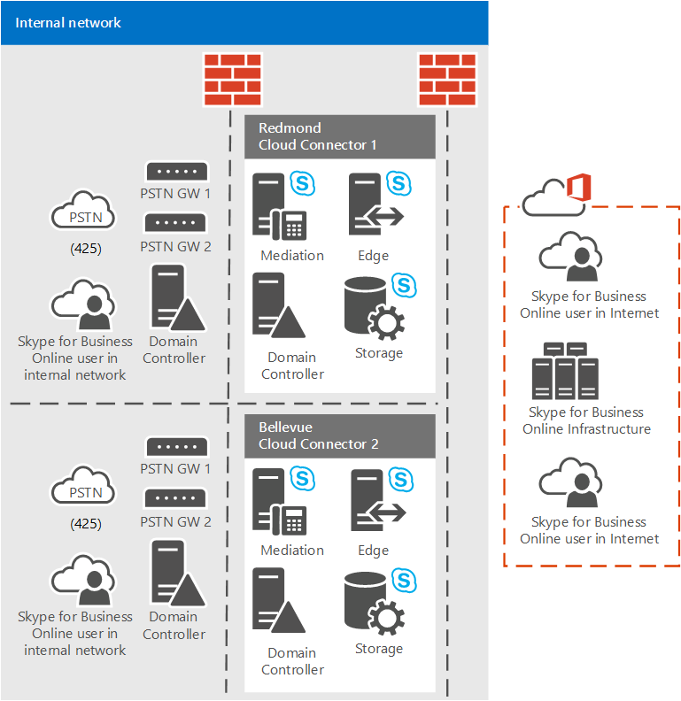

# Планирование узлов ТСОП Cloud Connector Edition
 
Прочтите этот раздел, чтобы узнать о планировании сайтов облачных соединителя Edition ТСОП для обеспечения маршрутизации вызовов эффективным и экономичным.
  
В этом разделе описывается, что нужно знать об облаке соединителя Edition и вызвать маршрутизации, можно планировать на сайтах PSTN соединителя облачных. PSTN сайтов состоит из устройств для облачных соединителя, развернут в ту же папку, используя типичные шлюзы ТСОП, подключенных к ним. В этом разделе рассматривается настройка топологии сайтов облачных соединитель для убедитесь, что на сайтах облачных соединителя может обрабатывать входящие и исходящие маршрутизации для всех пользователей, назначенные узлу большинство стоимость эффективным и эффективного способом. Дополнительные сведения об облаке соединителя и преимущества сайтов PSTN быть прочтите статью [Plan for Скайп облаке соединитель для выпуска для бизнеса](plan-skype-for-business-cloud-connector-edition.md). 
  
## Узлы ТСОП Cloud Connector и маршрутизация вызовов

Облако PSTN соединителя сайты, конструкцию топологии, созданные для предотвращения ненужных междугородние и между Страна тарифы и убедитесь, что исходящих экстренные вызовы направляются соответствующие линии связи. Чтобы обеспечить экономичную и эффективную маршрутизацию вызовов, включая звонки в службы экстренной помощи, необходимо тщательно спланировать узлы ТСОП и назначение пользователей каждому из них. 
  
В рамках планирования Cloud Connector необходимо обсудить с операторами, где размещаются ваши офисы и пользователи и где завершаются магистрали ТСОП. Для работы с вашей связи, чтобы определить, как экстренные вызовы маршрутизируются и затем использовать полученные сведения для определения сайтов PSTN соединителя облачных и назначение пользователей на соответствующие веб-сайты. Например, магистрали, подключенные к центру обработки данных, в котором развертывается узел ТСОП, должны быть настроены для обработки как внутренней, так и внешней маршрутизации для всех номеров, назначенных пользователям этого узла. 
  
Устройство для каждого соединителя облаке могут быть подключены несколько шлюзов IP, IP-УАТС или пограничных контроллеров сеансов (SBC). Так как telco магистральных линий связи (PRI или SIP-магистралей) подключен шлюзов и УАТС, устройств для соединителя облачных логически подключены к магистральных линий связи ТСОП для входящих и исходящих вызовов. При использовании Cloud Connector и локального подключения к ТСОП вы получаете магистраль и связанные с ней телефонные номера от местного оператора. Если у вас крупное предприятие, то операторов может быть несколько, особенно если офисы компании находятся в разных городах, регионах или странах. Так как телефонный номер принадлежит оператору, он отвечает за обработку экстренных звонков.
  
Скайп для бизнеса в Интернет одинаково обрабатывает все устройства облачных соединителя на сайте и будет маршрутизации исходящих вызовов на основе вращением соединителя облачных устройства на том же сайте. Каждый экземпляр Cloud Connector в узле коммутируется с одним и тем же набором магистралей ТСОП (с полносвязной топологией). Так как каждый пользователь связан с ТСОП соединителя облака сайта, любые исходящего звонка из этого пользователя (обычный или экстренных) будет назначен одному из устройства облачных соединителя на сайте PSTN, он связал с. 
  
Cloud Connector осуществляет статическую маршрутизацию вызовов в IP-шлюзы, IP-УАТС, контроллеры SBC или прямые магистрали ТСОП. Cloud Connector пока не может выполнять динамическую маршрутизацию в магистраль на основе назначения (для маршрутизации по принципу наименьшей стоимости) или на основе источника (для статических или динамических экстренных вызовов). Входящие вызовы не представляют проблемы, так как могут поступать только из магистрали, с которой связан номер. Исходящие вызовы, тем не менее, можно перейти к любой соединителя облачных устройства для обеспечения связи на сайте (и, магистралях PSTN, подключенного к устройство для этого соединителя облачных) которого может привести к нежелательных звонков. Кроме того экстренных вызовов не проходит через, если сайта PSTN соединителя облачных растягивается для центров обработки данных с помощью различных кодов области или связи.
  
## Пример

В следующем примере показано, как сгруппировать магистральных линий связи сайтов ТСОП и назначение пользователей на веб-сайты. Предполагается, что в компании Contoso выполняются указанные ниже условия.
  
- Имеется четыре пользователя:   
    
  - пользователь А в Редмонде, штат Вашингтон (США);
    
  - пользователь Б в Белвью, штат Вашингтон (США);
    
  - пользователь В в Сентрейлии, штат Вашингтон (США);
    
  - Пользователь D в Портленд OR (США)
    
- Оператор A предоставляет номера телефонов, а магистралей в:
    
  - Редмонд (код города 425);
    
  - Белвью (код города 425);
    
  - Сентрейлия (код города 360).
    
- Оператор B предоставляет номера телефонов, а магистралей в:
    
  -  Портленд (код города 503).
    
Так как пользователь А в Редмонде и пользователь Б в Белвью находятся недалеко друг от друга и имеют один и тот же код города (425), оператор А должен иметь возможность принять экстренный звонок от пользователя А в Редмонде через магистраль в Белвью.   
  
Следовательно пользователи A и B и магистралях облачных соединитель для беллвью (США) и Redmond, скорее всего можно на том же сайте PSTN как показано на следующей схеме. Экстренные звонки от пользователей в одном из этих офисов могут маршрутизироваться в магистрали в другом офисе. Тем не менее, следует проверять у своего оператора, который будет работать.
  

  
Рассмотрим еще один пример.
  
- Пользователь В в Сентрейлии, номер которого предоставляется оператором А (код города 360), находится в двух часах езды от пользователей в Белвью и Редмонде, также обслуживаемых оператором А, но имеющих другой код города (425).  
    
    Таким образом даже в том случае, если вызов поступает из поставщика A, существует возможность вызова исходящие от пользователя B в код города Москва 425 транспортной вызовах маршрутизации программного обеспечения в код города Centralia 360 может отклонить входящий аварийного. В этом случае крайне важна, убедитесь, что оператор, облако соединителя и ее связанный магистральных линий связи на веб-сайтах Centralia ТСОП можно обрабатывать вызовы через расстояния и код города.
    
- Пользователь D в Портленд использует номер и линии связи, предоставляемых B поставщика, поэтому маловероятно, что B поставщика будет иметь экстренных вызовов из номер телефона, который является владельцем поставщика а. Поэтому пользователь D и устройство для облачных соединителя и связанные магистралей в Портленд будет обязательно должна находиться на другом сайте ТСОП.
    

