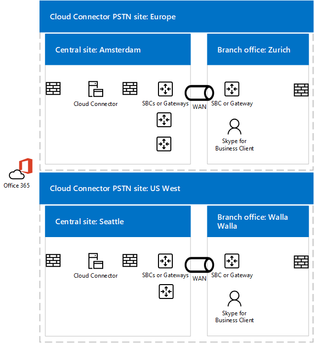

# Планирование обхода сервера-посредника в Cloud Connector Edition
 
В этом разделе рассматриваются вопросы планирования реализации обхода мультимедиа в Cloud Connector Edition версии 2.0 и более поздних версий. Дополнительные сведения о развертывании обхода мультимедиа см. в подсети "Развертывание обхода [мультимедиа" в Cloud Connector Edition.](deploy-media-bypass-in-cloud-connector.md)
  
Обход мультимедиа позволяет клиенту отправлять мультимедиа напрямую на следующий прыжок PSTN (шлюз или пограничный контроллер сеансов) и исключить компонент Cloud Connector Edition из пути мультимедиа.
  
Обход мультимедиа может улучшить качество голосовой связи, уменьшая задержку, вероятность потери пакетов и количество точек возможного сбоя. Устранение обработки мультимедиа для обходных вызовов снижает нагрузку на Cloud Connector, что обеспечивает большее количество одновременно обрабатывающих вызовов и может повысить масштабируемость. 
  
 Освободив Cloud Connector от задач обработки мультимедиа, можно уменьшить число устройств Cloud Connector, необходимых инфраструктуре, поэтому следует по возможности включить обход мультимедиа.
  
## Влияние обхода мультимедиа на пути мультимедиа и сигналов

Несмотря на то, что сигналы проходит один и тот же путь с обходом мультимедиа или без него, поток мультимедиа будет отличаться. На следующих схемах покажите схемы мультимедиа и сигналов в topologies с обходом мультимедиа и без него. 
  
Например, в следующей топологии, которая не использует обход мультимедиа, клиент Skype для бизнеса отправляет вызов STN на внешний номер, сигнал SIP передается в Microsoft 365 или Office 365, который направляет сигнальный трафик в соответствии с политикой голосовой связи конечных пользователей. Для пользователей Cloud Connector политика голосовой связи направляет сигнальный трафик на пограничный сервер Cloud Connector, который затем направляет сигнальный трафик на пограничный контроллер сеансов STN (SBC) или шлюз через сервер-посредник Cloud Connector. Мультимедиа передается из клиента Skype для бизнеса на сервер-посредник Cloud Connector, а затем на SBC или шлюз, как показано на следующей схеме:
  
**Пути мультимедиа и сигналов без обхода мультимедиа**

  
Входящий вызов из STN использует тот же путь сигнала в обратном направлении. Для внутренних пользователей мультимедиа по-прежнему будут перетекать между клиентом Skype для бизнеса и сервером-посредником Cloud Connector, а затем SBC или шлюзом.
  
В следующей топологии с обходом мультимедиа сигналы используют тот же путь, но мультимедиа проходит напрямую между клиентом Skype для бизнеса и SBC или шлюзом, как показано на следующей схеме:
  
**Пути мультимедиа и сигналов с обходом мультимедиа**

  
## Сценарий с несколькими сайтами и обход мультимедиа

Обход мультимедиа также полезен при предоставлении услуг телефонии нескольким сайтам с помощью одного устройства Cloud Connector. Так как Cloud Connector не может перенаправление вызовов на основе номеров источника или назначения, большинство предприятий развертывают SBC или шлюз за Cloud Connector для принятия решений по маршруту. Обход мультимедиа в этом сценарии устраняет переход между клиентом и центральным SBC или шлюзом, как показано на следующей схеме:
  
**Многоэтапное приложение**

  
1. Трафик SIP проходит от пользователя в Цюрихе до Microsoft 365 или Office 365.
    
2. Затем трафик передается на устройство Cloud Connector в Амстердаме, как указано в политике маршрутки голосовой связи пользователя.
    
3. Устройство Cloud Connector в Амстердаме отправляет трафик SIP на центральный шлюз в Амстердаме.
    
4. Центральный шлюз в Амстердаме принимает соответствующие решения по маршруту, а затем отправляет трафик на SBC или шлюз в Амстердаме, а мультимедиа проходит непосредственно между клиентом Skype для бизнеса и SBC или шлюзом в Амстердаме.
    
   Этот подход позволяет обслуживать больше пользователей в одном развертывании Cloud Connector, где Cloud Connector централизован. Хотя Cloud Connector исключен из пути мультимедиа, в централизованном многоэтапном сценарии мультимедиа все равно могут проходить через WAN дважды, что необходимо для прохождения через централизованный SBC или шлюз.
  
Если клиент находится за пределами корпоративной сети, размещая исходящие вызовы, трафик мультимедиа проходит через серверы-посредники и серверы-посредники Cloud Connector и WAN-соединение между Амстердамом и Амстердамом, как показано на следующей схеме:
  

  
## Поддерживаемые клиенты для обхода мультимедиа

При первом выпуске обхода мультимедиа единственным поддерживаемым клиентом является клиент Windows Skype для бизнеса 2016, который входит в состав приложений Microsoft 365 для предприятий версии 16.0.7870.2020 или более новой. Клиенты могут использовать любой канал: текущий, отложенный или отложенный первый выпуск. 
  
> [!NOTE]
> Если вы используете клиентские VPN-решения в сочетании с клиентом Skype для бизнеса, обход мультимедиа поддерживается только при использовании конфигурации VPN с раздельным туннелированием. 
  
Дополнительные сведения о каналах выпуска см. в обзоре каналов обновления для [приложений Microsoft 365 для предприятий.](https://support.office.com/article/Overview-of-update-channels-for-Office-365-ProPlus-9ccf0f13-28ff-4975-9bd2-7e4ea2fefef4?ui=en-US&amp;rs=en-US&amp;ad=US)
  
Текущую версию выпуска клиентов в разных каналах см. в сведениях о выпуске обновлений приложений [Microsoft 365 для предприятий.](https://docs.microsoft.com/officeupdates/release-notes-office365-proplus) 
  
## Вопросы емкости Cloud Connector с обходом мультимедиа

Без обхода сервера-посредника и в зависимости от оборудования устройство Cloud Connector может обрабатывать от 50 до 500 одновременных вызовов, для которых требуется, чтобы мультимедиа проходит через сервер-посредник. Дополнительные сведения см. в [выпуске Plan for Skype for Business Cloud Connector Edition.](https://technet.microsoft.com/library/mt605227.aspx) 
  
Если обход сервера-посредника включен, внутренние клиенты поддерживаемой версии не используют сервер-посредник, поэтому число внутренних клиентов может значительно увеличиться. 
  
Как уже было отмечено выше, внешние клиенты или неподтвердимые клиенты будут использовать серверы Cloud Connector Edge и серверы-посредники для мультимедиа. При расчете того, сколько устройств Cloud Connector должно быть размещено на сайте, необходимо учитывать трафик от внешних пользователей и пользователей на неподтверченных клиентах.
  
## Cloud Connector поддерживает режим "Всегда обходить"

Cloud Connector поддерживает только режим "Всегда обходить". В локальной среде существует два варианта: всегда обходить и использовать сведения о сайте и регионе.
  
Всегда обходить означает, что будет предпринята попытка обхода мультимедиа для всех вызовов STN с внутренними клиентами в качестве источника или точки назначения. Чтобы определить, является ли клиент внутренним или внешним, используется веб-сайт на виртуальной машине сервера-посредника. Если клиент может связаться с сайтом, он считается внутренним и используется обход мультимедиа. Если клиенту не удается связаться с сайтом (например, клиент находится в домашней сети), обход мультимедиа не используется. 
  
Для always Bypass требуется ненастраиваемое подключение между пользователями и шлюзами STN на сайте STN. 
  
Дополнительные сведения см. в [выпуске Plan for Skype for Business Cloud Connector Edition.](https://technet.microsoft.com/library/mt605227.aspx) 
  
Например, на приведенной ниже схеме пользователи Из Европы должны быть хорошо подключены к трем пограничным контроллерам сеансов (SBCs) в Амстердаме, а пользователи с западной части США должны быть хорошо подключены к двум пограничным контроллерам сеансов в Сиэтле. Правильное подключение означает, что они расположены на тех же сетевых сайтах, что и SBCs или шлюзы, или по каналам WAN с соответствующей пропускной способностью.
  

  
> [!NOTE]
> Если пользователь из Цюриха перемещается в офис в Сиэтле и вы хотите использовать внутреннюю сеть для доставки трафика мультимедиа между пользователем и шлюзами в Европе (а не через Интернет), необходимо убедиться, что офисы в Сиэтле и Амстердаме, где расположены европейские SBCs или шлюзы, имеют достаточное подключение. 
  
## Кодеки, используемые в обходе мультимедиа

При включенном обходе мультимедиа трафик мультимедиа между клиентом и SBC или шлюзом использует кодек G.711. 
  
## См. также

[Развертывание обхода мультимедиа в Cloud Connector Edition](deploy-media-bypass-in-cloud-connector.md)
