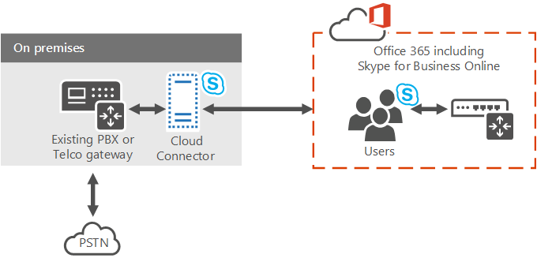

# <a name="plan-for-skype-for-business-cloud-connector-edition"></a>Планирование Skype для бизнеса Cloud Connector Edition

> [!Important]
> Cloud Connector Edition завершится 31 июля 2021 г. вместе с Skype для бизнеса Online. После обновления организации Teams, узнайте, как подключить локальной телефонной сети к Teams с помощью прямой [маршрутизации](/MicrosoftTeams/direct-routing-landing-page).

Найдите сведения о Skype для бизнеса Cloud Connector Edition, набор упакованных виртуальных машин (виртуальных машин), которые реализуют локальное подключение PSTN с телефонная система (Cloud PBX).

Cloud Connector Edition может быть правильным решением для организации, если у вас еще нет существующего Lync Server или Skype для бизнеса Server развертывания. Если вы все еще изучаете, какое решение телефонная система для вашего бизнеса, см. в [веб-сайте Microsoft telephony solutions.](/microsoftteams/cloud-voice-landing-page)

В этом документе описываются требования к cloud Connector Edition и поддерживаемые топологии, а также помогают планировать развертывание Cloud Connector Edition. Не забудьте прочитать эту статью перед настройкой среды облачного соединители. Когда вы будете готовы к развертыванию и настройке cloud Connector Edition, см. статью Настройка и [управление Skype для бизнеса Cloud Connector Edition.](configure-skype-for-business-cloud-connector-edition.md)

Cloud Connector Edition 2.1 теперь доступен. Если вы еще не обновлены до 2.1, см. в руб. Обновление до новой версии [облачного соединитетеля.](upgrade-to-a-new-version-of-cloud-connector.md) Файл установки можно найти в [https://aka.ms/CloudConnectorInstaller](https://aka.ms/CloudConnectorInstaller) .

> [!NOTE]
> Корпорация Майкрософт поддерживает предыдущую версию Cloud Connector Edition в течение 60 дней после выпуска новой версии. Корпорация Майкрософт будет поддерживать версию 2.0.1 в течение 60 дней после выпуска 2.1, чтобы у вас было время на обновление. Все версии, предшествующие 2.0.1, больше не поддерживаются.

Cloud Connector Edition — это гибридное предложение, состоящее из набора упакованных виртуальных машин (виртуальных машин), реализующих локальное подключение к PSTN с телефонная система. Развертывание минимальной топологии Skype для бизнеса Server в виртуализированной среде позволяет пользователям в вашей организации, размещающихся в облаке, получать PBX-службы из облака Майкрософт, но подключение к PSTN обеспечивается через существующую локализованную голосовую инфраструктуру.



Так как cloud Connector позволяет интегрировать телефонная система-службы с существующей средой телефонии, например, PBX, аналоговыми устройствами и центрами вызовов, вы можете реализовать поэтапную миграцию из существующего решения телефонии в телефонная система.

Например, предположим, что в вашей компании есть сложный центр обработки вызовов с определенными функциональными возможностями, телефонная система не предоставляется. Вы можете оставить пользователей Центра обработки вызовов существующим решением, но переместить других пользователей в телефонная система.

Cloud Connector обеспечит маршрутику между пользователями, которые будут работать в помещениях и в Интернете, и вы можете использовать собственный поставщик PSTN с помощью телефонная система.

При планировании развертывания Cloud Connector Edition рассмотрим следующее:

- Чтобы использовать облачные решения голосового подключения, необходимо зарегистрироваться в организации Microsoft 365 или Office 365, которая включает телефонная система. Если у вас еще нет Microsoft 365 или Office 365 организации, вы можете узнать, как зарегистрироваться здесь: [Microsoft 365 для бизнеса](https://products.office.com/business/office). Обратите внимание, что вам потребуется зарегистрироваться для плана, который включает Skype для бизнеса Online.

- Чтобы зарегистрировать устройства облачного соединителя с помощью службы Skype для бизнеса Online, а также запустить различные cmdlets, cloud Connector 2.0 и более поздней Microsoft 365 или Office 365 учетную запись с правами администратора Skype для бизнеса клиента. Для версий Облачного соединитетеля до 2.0 требуется специальная учетная запись Microsoft 365 или Office 365 с правами глобального администратора клиента.

- Cloud Connector не требует полного локального Skype для бизнеса Server развертывания.

    В настоящее время cloud Connector не может сосуществовать с Lync или Skype для бизнеса локального сервера. Если вы хотите переместить существующие Lync или Skype для бизнеса пользователей в Microsoft 365 и продолжать предоставлять пользователям локальной телефонии, телефонная система с локальной связью с помощью существующего Skype для бизнеса Server развертывания. Дополнительные сведения см. в телефонная система [решение (Cloud PBX)](/microsoftteams/cloud-voice-landing-page) и планирование телефонная система с локальной [подключением PSTN в Skype для бизнеса Server](plan-phone-system-with-on-premises-pstn-connectivity.md).

- Если у вас было предыдущее развертывание Skype для бизнеса или Lync Server, и вы расширили схему, вам не нужно очищать схему для развертывания облачного соединитель, если вы удалили все компоненты Skype для бизнеса или Lync Server из среды.

- Ваши пользователи находятся в интернете.

- Если в организации настроена синхронизация каталогов (DirSync), необходимо сначала создать все учетные записи пользователей, запланированных для гибридного голоса, в локальном развертывании, а затем синхронизировать их с облаком.

- При необходимости вы можете сохранить текущий переносчик PSTN.

- Если вы хотите предоставить диалоговое подключение пользователям, принимающим в Облачном соединителене, вы можете приобрести лицензию на проведение телефонных подключений pSTN или оплатить при работе с предложением аудиоконференций от Корпорации Майкрософт.

- Лицензия на аудиоконференцию (или оплата по мере предложения) также требуется для эскалации вызовов. Если Skype для бизнеса получает вызов от внешнего пользователя PSTN и хочет добавить к этому вызову еще одного участника (перенаправить вызов на конференцию), эскалация будет выполняться с помощью службы конференции Microsoft Audio Conferencing.

- Cloud Connector 2.0 и более поздний блок теперь поддерживает обход мультимедиа. Обход мультимедиа позволяет клиенту отправлять средства массовой информации непосредственно в общественную телефонную сеть (PSTN) в следующем переходе — шлюзе или пограничном контроллере сеанса (SBC) и исключить компонент Cloud Connector Edition из пути мультимедиа. Дополнительные сведения см. в [выпуске Plan for media bypass in Cloud Connector Edition.](plan-for-media-bypass-in-cloud-connector-edition.md)

- Cloud Connector 2.1 и более позднее поддерживает мониторинг облачного соединитетеля с помощью пакета управления операциями (OMS). Дополнительные сведения см. в руководстве Monitor Cloud Connector с помощью пакета управления операциями [(OMS)](monitor-cloud-connector-using-operations-management-suite-oms.md)

- Облачный соединитатель доступен во всех странах, где Office 365 корпоративный E5.

Содержание

- [Компоненты Cloud Connector Edition](plan-skype-for-business-cloud-connector-edition.md#BKMK_Components)

- [Topologies Cloud Connector Edition](plan-skype-for-business-cloud-connector-edition.md#BKMK_Topologies)

- [Требования к развертыванию](plan-skype-for-business-cloud-connector-edition.md#BKMK_Requirements)

- [Сведения, которые необходимо собрать перед развертыванием](plan-skype-for-business-cloud-connector-edition.md#BKMK_PlanDeployment)

- [Набор соображений по планированию](plan-skype-for-business-cloud-connector-edition.md#BKMK_DailPlan)

- [Соображения высокой доступности](plan-skype-for-business-cloud-connector-edition.md#BKMK_HA)

- [Поток мультимедиа Cloud Connector](plan-skype-for-business-cloud-connector-edition.md#BKMK_MediaFlow)

- [Мониторинг и устранение неполадок](plan-skype-for-business-cloud-connector-edition.md#BKMK_Monitor)

- [Дополнительные сведения](plan-skype-for-business-cloud-connector-edition.md#BKMK_MoreInfo)

## <a name="cloud-connector-edition-components"></a>Компоненты Cloud Connector Edition
<a name="BKMK_Components"> </a>

В cloud Connector Edition развертывается набор упакованных VMs, которые содержат минимальную топологию Skype для бизнеса Server, состоящую из компонента Edge, компонента-посредника и роли Центра управления (CMS). Также установят контроллер домена, необходимый для внутреннего функционирования облачного соединителя. Эти службы настроены на гибридную с вашей Microsoft 365 или Office 365, которая включает Skype для бизнеса online-службы.


Компоненты облачного соединитетеля предоставляют следующие функции:

- **Компонент Edge** — связь между локальной топологией и сетевыми службами проходит через компонент Edge, который включает следующие компоненты:

  - **Access Edge** — обеспечивает маршрутику SIP между локальной развертыванием и Skype для бизнеса Online.

  - **Media Relay** — обеспечивает маршрутику мультимедиа между компонентом-посредником и другими конечными точками мультимедиа.

  - **Проверка подлинности** в средствах массовой информации / MRAS — создает маркеры для доступа к ретранслятору мультимедиа.

- **Исходящие маршруты** — обеспечивает балансировку нагрузки голосового трафика между шлюзами или SBCs, подключенными к устройству cloud Connector. Вызовы будут разделены между всеми шлюзами или SBCs, подключенными к устройству облачного соединителю.

    Обеспечивает маршрутику шлюзов на основе политик. Поддерживаются только глобальные политики, основанные на номерах PSTN назначения (исходящие).

- **Роль Центра управления (CMS)** — включает хранилище конфигурации для компонентов топологии, включая передачу файлов CMS.

- Реплика Центрального магазина управления **(CMS)** — синхронизирует сведения о конфигурации глобального cmS DB на сервере ролей CMS.

- **Контроллер домена** — служба домена Active Directory Active Directory для хранения всех глобальных параметров и групп, необходимых для развертывания компонентов Облачного соединитетеля. Для каждого устройства cloud Connector будет создан один лес. Контроллер домена не должен иметь никаких подключений к производственному Active Directory. Службы Active Directory включают:

  - Доменные службы Active Directory

  - Службы сертификатов Active Directory для выпуска внутренних сертификатов

- **Компонент-посредник** — реализует протокол сопоставления шлюзов SIP и media Skype для бизнеса шлюзов PSTN. Включает реплику CMS, которая синхронизирует конфигурацию из глобальной базы данных CMS.

## <a name="cloud-connector-edition-topologies"></a>Topologies Cloud Connector Edition
<a name="BKMK_Topologies"> </a>

Для целей этого обсуждения мы будем ссылаться на сайты PSTN. Сайт PSTN — это сочетание устройств cloud Connector, развернутых в том же расположении, и с общими шлюзами PSTN, подключенными к ним. Сайты PSTN позволяют:

- Предоставление подключения к шлюзам, которые ближе всего к вашим пользователям.

- Разрешить масштабируемость, развернув несколько устройств облачного соединитела на одном или нескольких сайтах PSTN.

- Разрешить высокую доступность, развернув несколько устройств облачного соединитела на одном сайте PSTN.

В этом разделе вводится PSTN-сайты. Дополнительные сведения о планировании сайтов PSTN см. в сайте [Plan for Cloud Connector Edition PSTN.](plan-for-cloud-connector-edition-pstn-sites.md)

Можно развернуть следующие топологии облачного соединитела:

- Одно устройство Cloud Connector Edition на сайте PSTN. Эта топология рекомендуется для целей оценки только потому, что она не обеспечивает высокую доступность.

- Несколько устройств cloud Connector Edition на сайте PSTN для обеспечения высокой доступности.

- Несколько сайтов PSTN с несколькими устройствами Cloud Connector Edition для обеспечения масштабируемости с высокой доступностью. Можно развернуть до 200 сайтов.

При планировании топологии рассмотрите следующие вопросы:

- С облачным соединитетелем 2.0 и более поздним подключением один сайт PSTN может иметь до 16 устройств облачного соединитела. Предыдущие версии поддерживают до четырех устройств на сайте.

- Существует два типа конфигураций оборудования, протестированная с помощью облачного соединитетеля:

  - Более крупная версия способна обрабатывать большие объемы одновременных вызовов и поддерживается во всех типах производственных сред.

  - Более малая версия предназначена для работы на нижнем оборудовании и может использоваться для целей оценки или для сайтов с низкими объемами вызовов. При развертывании более маленькой версии облачного соединиттеля необходимо помнить о требованиях к оборудованию производственного класса (например, к двойным поставкам питания).

- Если у вас есть версия облачного соединиттеля 2.0 или более поздней версии и развернута максимальная конфигурация 16 устройств (с большим оборудованием), то ваш сайт PSTN может обрабатывать до 8000 одновременных вызовов. Если развернуть небольшую версию, поддерживаемый лимит составляет 800.

    Кроме того, необходимо посвятить некоторые устройства для высокой доступности. Минимальная рекомендация в том, что один прибор должен быть зарезервирован для высокой доступности.

  - В версии 2 при развертывании конфигурации 15+1 сайт PSTN может обрабатывать до 7500 одновременных вызовов.

  - Если у вас есть более раная версия и развернута максимальная конфигурация 3 + 1 (с большим оборудованием), то ваш сайт PSTN может обрабатывать до 1500 одновременных вызовов. Если развернуть небольшую версию, поддерживается ограничение 150.

-  Если на сайте PSTN требуется больше вызовов, можно развернуть дополнительные сайты PSTN в том же расположении.

> [!NOTE]
> Если не отмечено, диаграммы и примеры ниже предполагают использование более крупной версии облачного соединитетеля.

### <a name="single-cloud-connector-appliance-within-a-single-pstn-site"></a>Устройство Единого облачного соединитела в одном сайте PSTN

На следующей схеме показан единый прибор Cloud Connector Edition на одном сайте PSTN. Обратите внимание, что cloud Connector состоит из четырех VMs, установленных на одной физической хост-машине, которая находится в сети периметра в целях безопасности.


### <a name="multiple-cloud-connector-appliances-within-a-single-pstn-site"></a>Несколько устройств облачного соединитела в одном сайте PSTN

 Для масштабируемости и высокой доступности можно выбрать несколько выпусков облачных соединителен в одном сайте PSTN, как показано на следующей схеме. Примите во внимание следующее:

- Звонки распространяются в случайном порядке между облачными соединитетелями в одном пуле.

- В целях планирования емкости необходимо учитывать возможность обработки нагрузки, если один или несколько облачных соединитетелей отключены, исходя из следующих вычислений:

  - **N+1 полей.** Для более крупной версии облачного соединитетеля N+1 окна поддерживают 500 вызовов N одновременно с \* доступностью 99,8%.

    Для более маленькой версии облачного соединитетеля окна N+1 поддерживают 50 вызовов N с одновременной доступностью \* 99,8%.

  - **N+2 полей.** Для более крупной версии облачного соединитетеля N+2 поля поддерживают 500 вызовов N одновременно с \* доступностью 99,9%.

    Для более маленькой версии облачного соединитетеля N+2 окна поддерживают 50 вызовов N с одновременной доступностью \* 99,9%.


### <a name="multiple-pstn-sites-with-one-or-more-cloud-connectors-per-site"></a>Несколько сайтов PSTN с одним или несколькими соединитетелями облака на каждый сайт

Вы также можете выбрать, чтобы на каждом сайте было несколько сайтов PSTN с одним или несколькими выпусками облачных соединители. Если ваш сайт PSTN достигает предела одновременных вызовов, вы можете добавить другой сайт PSTN для обработки нагрузки.

Несколько сайтов PSTN также позволяют обеспечить подключение к шлюзам, которые ближе всего к вашим пользователям. Например, предположим, что у вас есть шлюзы PSTN в Сиэтле и Амстердаме. Вы можете развернуть два веб-сайта PSTN — один в Сиэтле, один — в Амстердаме— и назначить пользователям использовать ближайший к ним сайт PSTN. Пользователи из Сиэтла будут перенастроен на сайт и шлюзы PSTN Сиэтла, а пользователи в Амстердаме будут перенастроены на сайт и шлюзы PSTN в Амстердаме:


## <a name="requirements-for-deployment"></a>Требования к развертыванию
<a name="BKMK_Requirements"> </a>

Перед развертыванием Cloud Connector Edition убедитесь, что у вас есть следующие условия для среды:

- **Для хост-машины —** VMs cloud Connector должны быть развернуты на выделенном оборудовании, Windows Server 2012 R2 Datacenter edition (английский язык) с включенной Hyper-V роли.

    Для версии 2.0 и более поздней версии сетевые карты хост-компьютера, привязанные к коммутатору Skype для бизнеса Corpnet, должны иметь IP-адрес, настроенный в той же подсети, что и корпоративные сетевые машины cloud Connector.

- Для версий 2.1 и более поздней версии устройство-платформа .NET Framework 4.6.1 или более позднее.

- **Для виртуальных машин —** A Windows Server 2012 R2 ISO (English) image (.iso). IsO будет преобразовано в VHD для виртуальных машин, которые будут работать Skype для бизнеса Cloud Connector Edition.

- Необходимое оборудование для поддержки установки 4 VMs для каждого выпуска облачного соединителя в развертывании. Рекомендуется использовать следующие конфигурации:

  - 64-битный двойной процессор, шесть ядер (12 реальных ядер), 2,50 гигагерца (ГГц) или более

  - 64 гигабайт (ГБ) оперативной памяти ECC

  - Четыре 600 ГБ (или лучше) 10K RPM 128M Кэш SAS 6 Гбит/с дисков, настроенных в конфигурации RAID 5

  - Три сетевых адаптеров высокой пропускной способности RJ45 с высокой пропускной способностью 1 Гбит/с

- Если вы решите развернуть небольшую версию Cloud Connector Edition, которая поддерживает до 50 одновременных вызовов, вам потребуется следующее оборудование:

  - Четырехъядерный ядер Intel i7 4790 с графикой Intel 4600 (не требуется высококлассная графика)

  - 32 ГБ DDR3-1600 без ECC

  - 2. 1 TB 7200RPM SATA III (6 Гбит/с) в RAID 0

  - 2: 1 Гбит/с Ethernet (RJ45)

- Если прокси-сервер требуется на хост-машине для просмотра Интернета, необходимо внести следующие изменения конфигурации:

  - Чтобы обойти прокси-сервер, укажите параметры Прокси WinHTTP, установленные на прокси-сервере, и список обхода, включая "192.168.213". \* сеть, используемая службами управления облачными подключениями и Skype для бизнеса подсети Corpnet, как определено в CloudConnector.ini файле. В противном случае подключение к управлению сбой и предотвратить развертывание и автоматическое восстановление облачного соединительной системы. Ниже приводится пример команды конфигурации winhttp: netsh winhttp set proxy "10.10.10.175:8080" bypass-list=" \* .local;1. \* ; 172.20. \* ;192.168.218. \* \<local\> "

  - Укажите параметры прокси на компьютер, а не на пользователя. В противном случае загрузки облачного соединитетеля не удастся. Вы можете указать параметры прокси на машину с изменением реестра или с параметром групповой политики следующим образом:

  - **Реестр:** HKEY_LOCAL_MACHINE\SOFTWARE\Policies\Microsoft\Windows\CurrentVersion\Internet Settings] dword ProxySettingsPerUser: 0000000

  - **Групповой политики:** Компьютерные административные шаблоны Windows Internet Explorer: создание параметров прокси на компьютер \> \> \> (а не на пользователя)

- Квалифицированный PBX/Trunk или квалифицированный SBC/Gateway (рекомендуется использовать не менее двух шлюзов).

    Cloud Connector поддерживает те же пограничные контроллеры сеанса (SBCs), которые сертифицированы для Skype для бизнеса. Дополнительные сведения см. в [telephony Infrastructure for Skype для бизнеса.](../../../SfbPartnerCertification/certification/infra-gateways.md)

- Учетная запись администратора локального сервера с разрешениями на установку и настройку Hyper-V на серверах хост-серверов. Учетная запись должна иметь разрешения администратора на локальном сервере, Hyper-V установлена и настроена.

- Во время развертывания вам будет предложено создать учетную запись администратора домена с разрешениями на создание и публикацию топологии в домене Cloud Connector.

- Внешние записи DNS, которые определяются в CloudConnector.ini, включенных в пакет установки:

  - Внешняя запись DNS для службы edge доступа компонента Edge; например, ap. \<Domain Name\> . Для каждого сайта PSTN требуется одна запись. Эта запись должна содержать IP-адреса всех краев для этого сайта.

- Организация Microsoft 365 или Office 365 со всеми созданными записями DNS и SRV.

    > [!IMPORTANT]
    > При интеграции клиента с Cloud Connector Edition использование суффикса домена по умолчанию .onmicrosoft.com в качестве домена SIP для организации не поддерживается. > нельзя использовать глоток.\<Domain Name\> как имя прокси-интерфейса edge Access облачного соединитетеля, так как эта запись DNS используется Microsoft 365 и Office 365.

- Сертификат для внешнего края, полученный из государственного органа сертификации (CA).

- Правила брандмауэра для допуска трафика через необходимые порты завершены.

- Подключение к Интернету для хост-машины и VMs. Cloud Connector загружает некоторые программы из Интернета; Поэтому необходимо предоставить сведения о шлюзе и сервере DNS, чтобы хост-машина и VMs облачного соединитела могли подключаться к Интернету и скачивать необходимое программное обеспечение.

- Удаленный модуль PowerShell клиента, установленный на хост-машине.

- Учетные Skype для бизнеса администратора для удаленного запуска PowerShell.

    > [!IMPORTANT]
    > Учетная запись администратора не должна иметь многофакторную проверку подлинности.

> [!NOTE]
> Развертывание облачного соединиттеля поддерживается только на Microsoft Hyper-V виртуализированной платформе. Другие платформы, такие как VMware и Amazon Web Services, не поддерживаются.

> [!NOTE]
> Минимальное руководство по оборудованию для запуска облачного соединитетеля основано на базовой емкости оборудования (ядрах, МГц, гигабайтах и т. д.) с некоторым буфером для размещения нематериальных нарушений производительности, зарытых в архитектуре любого компьютера. Корпорация Майкрософт наихудшая проверка нагрузки на доступное на коммерческой основе оборудование, чтобы выполнить минимальное руководство. Проверяется качество мультимедиа и производительность системы. У партнеров по устройству официальных подключений к облачным подключениям Майкрософт есть определенные аппаратные реализации облачного соединитетеля, на которых они независимо протестировали производительность, и они отвечают требованиям к нагрузке и качеству своего оборудования.

> [!NOTE]
> Устройства, производимые аудиокодами и Sonus, имеют измененный код и работают на Windows серверов стандартного выпуска. Эти устройства поддерживаются.

## <a name="information-you-need-to-gather-before-deployment"></a>Сведения, которые необходимо собрать перед развертыванием
<a name="BKMK_PlanDeployment"> </a>

Прежде чем приступить к развертыванию, необходимо определить размер развертывания, служивские SIP-домены и сведения о конфигурации для каждого веб-сайта PSTN, который планируется развернуть. Для начала необходимо:

- Определите все домены SIP, которые будут обслуживаться этим развертыванием на основе SIP-URL,которые используются в вашей компании.

- Определите количество сайтов PSTN, которые необходимо развернуть.

- Убедитесь, что у вас есть оборудование, необходимое для поддержки четырех VMs, которые будут устанавливаться для каждого выпуска облачного соединителя.

Для каждого веб-сайта PSTN, который планируется развернуть, необходимо:

- Создание имен для всех компонентов в каждом устройстве облачного соединитела (см. в руб. [Определение параметров развертывания).](plan-skype-for-business-cloud-connector-edition.md#BKMK_SiteParams)

- Определение диапазонов портов (см. [порты и протоколы).](plan-skype-for-business-cloud-connector-edition.md#BKMB_Ports)

- Создание внешних записей DNS для компонента Edge (см. [требования к развертыванию).](plan-skype-for-business-cloud-connector-edition.md#BKMK_Requirements)

- Определение требований сертификата к компоненту Edge (см. [в справке).](plan-skype-for-business-cloud-connector-edition.md#BKMK_Certs)

### <a name="ports-and-protocols"></a>Порты и протоколы
<a name="BKMB_Ports"> </a>

При определении диапазонов портов мультимедиа следует помнить о следующих действиях:

- Клиенты всегда используют диапазон портов от 50000 до 50019 для трафика мультимедиа— этот диапазон заранее заранее заданной в Skype для бизнеса Online и не может быть изменен.

- Компонент-посредник по умолчанию будет использовать диапазон портов от 49 152 до 57 500 для трафика мультимедиа. Однако подключение устанавливается с помощью внутреннего брандмауэра, и по соображениям безопасности этот диапазон портов можно ограничить в топологии. Для каждого вызова потребуется до четырех портов. Если требуется ограничить количество портов между компонентом-посредником и шлюзом PSTN, необходимо также настроить соответствующий диапазон портов на шлюзе.

- Необходимо развернуть облачный соединитатель в сети периметра. Это означает, что у вас будет два брандмауэра:

  - Первый брандмауэр является внешним между интернетом и сетью периметра.

  - Второй брандмауэр является внутренним между сетью периметра и внутренней сетью.

    Ваши клиенты могут быть в Интернете или во внутренней сети:

  - Клиенты в Интернете подключаются к вашему PSTN через внешний брандмауэр через компонент Edge.

  - Клиенты внутренней сети будут подключаться через внутренний брандмауэр к компоненту-посреднику в сети периметра, который соединит трафик с шлюзом SBC или PSTN.

    Это означает, что необходимо открыть порты в обоих брандмауэрах.

В следующих таблицах описываются диапазоны портов и портов для внешних и внутренних брандмауэров.

В этой таблице показаны диапазоны портов и портов для включения связи между клиентами во внутренней сети и компонентом-посредником:

**Внутренний брандмауэр**


|**IP-адрес источника**|**Конечный IP-адрес**|**Порт источника**|**Порт назначения**|
|:-----|:-----|:-----|:-----|
|Компонент посредничества облачного соединитела  <br/> |Шлюз SBC/PSTN  <br/> |Любой  <br/> |TCP 5060\*\*  <br/> |
|Шлюз SBC/PSTN  <br/> |Компонент посредничества облачного соединитела  <br/> |Любой  <br/> |TCP 5068/ TLS 5067  <br/> |
|Компонент посредничества облачного соединитела  <br/> |Шлюз SBC/PSTN  <br/> |UDP 49 152 - 57 500  <br/> |Любые\*\*\*  <br/> |
|Шлюз SBC/PSTN  <br/> |Компонент посредничества облачного соединитела  <br/> |Любые\*\*\*  <br/> |UDP 49 152 - 57 500  <br/> |
|Компонент посредничества облачного соединитела  <br/> |Внутренние клиенты.  <br/> |TCP 49 152 - 57 500\*  <br/> |TCP 50 000-50 019  <br/> (необязательно)  <br/> |
|Компонент посредничества облачного соединитела  <br/> |Внутренние клиенты.  <br/> |UDP 49 152 - 57 500\*  <br/> |UDP 50 000-50 019  <br/> |
|Внутренние клиенты.  <br/> |Компонент посредничества облачного соединитела  <br/> |TCP 50 000-50 019  <br/> |TCP 49 152 - 57 500\*  <br/> |
|Внутренние клиенты.  <br/> |Компонент посредничества облачного соединитела  <br/> |UDP 50 000-50 019  <br/> |UDP 49 152 -57 500\*  <br/> |

\* Это диапазон портов по умолчанию для компонента Mediation. Для оптимального потока вызовов требуется четыре порта на один вызов.

\*\* Этот порт должен быть настроен на шлюзе SBC/PSTN; Пример 5060. Вы можете настроить другие порты на шлюзе SBC/PSTN.

\*\*\* Обратите внимание, что вы также можете ограничить диапазон портов на SBC/Gateway, если это разрешено производителем SBC/Gateway.

В целях безопасности можно ограничить диапазон портов для компонента-посредника с помощью [cmdlet Set-CsMediationServer.](/powershell/module/skype/set-csmediationserver?)

Например, следующая команда ограничивает количество портов, которые компонент-посредник будет использовать для трафика мультимедиа, до 50 000 — 51 000 для аудио (в и из). Компонент Mediation сможет обрабатывать 250 одновременных вызовов с помощью этой конфигурации. Обратите внимание, что этот диапазон также может потребоваться ограничить в шлюзе SBC/PSTN:

```powershell
Set-CSMediationServer -Identity MediationServer:mspool.contoso.com -AudioPortStart 50000 - AudioPortCount 1000
```

Чтобы получить имя компонента-посредника и увидеть порты по умолчанию, можно использовать cmdlet [Get-CsService](/powershell/module/skype/get-csservice?) следующим образом:

```powershell
Get-CsService -MediationServer | Select-Object Identity, AudioPortStart, AudioPortCount
```

В следующей таблице показаны диапазоны портов и портов для включения связи между компонентом Cloud Connector Edge с внешним брандмауэром. В этой таблице показана минимальная рекомендация.

В этом случае весь медиа-трафик в Интернет будет поступать по краю Online следующим образом: конечный пункт пользователя-- \> Online \> Edge--Cloud Connector Edge:

**Внешний брандмауэр — минимальная конфигурация**


|**IP-адрес источника**|**Конечный IP-адрес**|**Исходный порт**|**Порт назначения**|
|:-----|:-----|:-----|:-----|
|Любой  <br/> |Внешний интерфейс Cloud Connector Edge  <br/> |Любой  <br/> |TCP (MTLS) 5061  <br/> |
|Внешний интерфейс Cloud Connector Edge  <br/> |Любой  <br/> |Любой  <br/> |TCP (MTLS) 5061  <br/> |
|Внешний интерфейс Cloud Connector Edge  <br/> |Любой  <br/> |Любой  <br/> |TCP 80  <br/> |
|Внешний интерфейс Cloud Connector Edge  <br/> |Любой  <br/> |Любой  <br/> |UDP 53  <br/> |
|Внешний интерфейс Cloud Connector Edge  <br/> |Любой  <br/> |Любой  <br/> |TCP 53  <br/> |
|Внешний интерфейс Cloud Connector Edge  <br/> |Любой  <br/> |UDP 3478;  <br/> |UDP 3478;  <br/> |
|Любой  <br/> |Внешний интерфейс Cloud Connector Edge  <br/> |TCP 50 000-59 999  <br/> |TCP 443  <br/> |
|Любой  <br/> |Внешний интерфейс Cloud Connector Edge  <br/> |UDP 3478;  <br/> |UDP 3478;  <br/> |
|Внешний интерфейс Cloud Connector Edge  <br/> |Любой  <br/> |TCP 50 000-59 999  <br/> |TCP 443  <br/> |

В следующей таблице показаны диапазоны портов и портов для включения связи между компонентом Cloud Connector Edge и внешним брандмауэром. В этой таблице показано рекомендуемое решение.

В этом случае весь трафик мультимедиа для конечных точечно-подключений в Интернете может перетекать непосредственно в компонент Cloud Connector Edge. Путь мультимедиа будет пользовательской конечный пункт — \> cloud Connector Edge.

> [!NOTE]
> Это решение не будет работать, если конечный пункт пользователя находится за симметричным NAT.

**Внешний брандмауэр — рекомендуемая конфигурация**


|**IP-адрес источника**|**Конечный IP-адрес**|**Порт источника**|**Порт назначения**|
|:-----|:-----|:-----|:-----|
|Любой  <br/> |Внешний интерфейс Cloud Connector Edge  <br/> |Любой  <br/> |TCP (MTLS) 5061  <br/> |
|Внешний интерфейс Cloud Connector Edge  <br/> |Любой  <br/> |Любой  <br/> |TCP (MTLS) 5061  <br/> |
|Внешний интерфейс Cloud Connector Edge  <br/> |Любой  <br/> |Любой  <br/> |TCP 80  <br/> |
|Внешний интерфейс Cloud Connector Edge  <br/> |Любой  <br/> |Любой  <br/> |UDP 53  <br/> |
|Внешний интерфейс Cloud Connector Edge  <br/> |Любой  <br/> |Любой  <br/> |TCP 53  <br/> |
|Внешний интерфейс Cloud Connector Edge  <br/> |Любой  <br/> |TCP 50 000-59 999  <br/> |Любой  <br/> |
|Внешний интерфейс Cloud Connector Edge  <br/> |Любой  <br/> |UDP 3478; UDP 50 000-59 999  <br/> |Любой  <br/> |
|Любой  <br/> |Внешний интерфейс Cloud Connector Edge  <br/> |Любой  <br/> |TCP 443; TCP 50 000-59 999  <br/> |
|Любой  <br/> |Внешний интерфейс Cloud Connector Edge  <br/> |Любой  <br/> |UDP 3478; UDP от 50 000 до 59 999  <br/> |

### <a name="host-internet-connectivity-requirements"></a>Требования к подключению к Хост-Интернету
<a name="BKMB_Ports"> </a>

Хост-машина должна иметь возможность достигать внешних ресурсов для успешной установки, обновления и управления облачным соединитетелем. В следующей таблице показаны пункты назначения и порты, необходимые между хост-машиной и внешними ресурсами.

|Направление  <br/> |Исходный IP-адрес  <br/> |Конечный IP-адрес  <br/> |Порт источника  <br/> |Порт назначения  <br/> |Протокол  <br/> |Назначение  <br/> |
|:-----|:-----|:-----|:-----|:-----|:-----|:-----|
|Исходящий  <br/> |Cloud Connector host IPs  <br/> |любой  <br/> |любой  <br/> |53  <br/> |TCP/UDP  <br/> |DNS  <br/> |
|Исходящий  <br/> |Cloud Connector host IPs  <br/> |любой  <br/> |любой  <br/> |80, 443  <br/> |TCP  <br/> |Список отзыва сертификатов (CRL)  <br/> |
|Исходящий  <br/> |Cloud Connector host IPs  <br/> |любой  <br/> |любой  <br/> |80, 443  <br/> |TCP  <br/> |Обновление облачного соединитетеля  <br/> Skype для бизнеса Online  <br/> Администратор PowerShell  <br/> Центр обновления Windows  <br/> |

Если требуются более строгие правила, обратитесь к следующим URL-адресам списка допуска:

- [URL-адреса списка отзывов](https://support.office.com/article/Office-365-URLs-and-IP-address-ranges-8548a211-3fe7-47cb-abb1-355ea5aa88a2) сертификатов [в Office 365 URL-адресах и диапазонах IP-адресов](https://support.office.com/article/Office-365-URLs-and-IP-address-ranges-8548a211-3fe7-47cb-abb1-355ea5aa88a2?ui=en-US&amp;rs=en-US&amp;ad=US)

- Windows Обновление. [Управление дополнительными Windows параметров обновления](/windows/deployment/update/waas-wu-settings)

- Skype для бизнеса Online Admin PowerShell: \* .online.lync.com

    Если для этого назначения требуется исключение прокси-сервера, его необходимо добавить в список обхода WinHTTP.

- Обновление облачного соединитетеля: [Центр загрузки](https://aka.ms/CloudConnectorInstaller) [https://go.microsoft.com](https://go.microsoft.com) , и [https://download.microsoft.com](https://download.microsoft.com)

### <a name="dns-name-resolution-for-the-edge-component"></a>Разрешение имен DNS для компонента Edge
<a name="BKMB_Ports"> </a>

Компонент Edge должен устранить внешние имена Microsoft 365 или Office 365 и внутренние имена других компонентов Облачного соединитела.

Каждый компонент Edge — это компьютер с несколькими домами с внешними и внутренними интерфейсами. Cloud Connector развертывает DNS-серверы в компоненте контроллера домена в сети периметра. Вы можете указать edge Server на DNS Server в периметре для всех разрешений имен, но необходимо включить DNS-сервер Cloud Connector для разрешения внешних имен, установив зону DNS, содержащую одну или несколько записей DNS A для внешних запросов, которые ссылаются на имена с другими общедоступными DNS-серверами.

В .ini файле, если вы установите имя FQDN для шлюзов из того же доменного пространства, что и домен SIP, в периметре DNS Server будет создана авторитетная зона для этого домена SIP. Если edge Server указывается на этот DNS Server для решения имен, edge никогда не разрешит _sipfederationtls.\<yourdomain\> Запись DNS, которая необходима для потока вызовов. В этом случае Корпорация Майкрософт рекомендует предоставить DNS Server внешнему интерфейсу Edge для разрешения поисков имен в Интернете, и каждый компонент Edge должен использовать файл HOST для решения других имен компонентов облачного соединителя на IP-адреса.

> [!NOTE]
> В целях безопасности рекомендуется не указать DNS-сервер Cloud Connector на внутренние серверы в производственном домене для разрешения имен.

### <a name="determine-deployment-parameters"></a>Определение параметров развертывания
<a name="BKMK_SiteParams"> </a>

Сначала необходимо определить следующие общие параметры развертывания:


|**Элемент**|**Описание**|**Примечания**|
|:-----|:-----|:-----|
|Домены SIP  <br/> |SIP URI используется пользователями компании. Уделяем все домены SIP, которые будут обслуживаться этим развертыванием. Вы можете иметь несколько доменов SIP.  <br/> ||
|Количество сайтов PSTN  <br/> |Количество сайтов PSTN, которые вы будете развертывать.  <br/> ||

Для каждого веб-сайта PSTN, который планируется развернуть, необходимо собрать следующую информацию перед началом развертывания. Эти сведения необходимо предоставить при обновлении CloudConnector.ini файла.

При настройке данных шлюза помните следующее:

- Если у вас есть только один шлюз, удалите раздел в .ini для второго шлюза. Если шлюзов более двух, следуйте существующему формату, чтобы добавить новые.

- Убедитесь, что IP-адрес и порт шлюза (s) являются правильными.

- Чтобы поддерживать ha уровня шлюза PSTN, храните вторичный шлюз или добавьте дополнительные шлюзы.

(Необязательный) Чтобы ограничить исходящие номера вызовов, обновите значение LocalRoute.


|**Параметры сайта**|**Описание**|**Примечания**|
|:-----|:-----|:-----|
|Доменное имя виртуальной машины  <br/> |Доменное имя для внутренних компонентов cloud Connector. Этот домен должен быть отличается от производственного домена. Имя должно быть одинаковым для всех устройств облачного соединитела.  <br/> Имя в .ini файле: "VirtualMachineDomain"  <br/> |Предпочтительным является домен .local.  <br/> |
|Имя контроллера домена Cloud Connector  <br/> |Имя контроллера домена.  <br/> Имя в .ini файле: "ServerName"  <br/> |Должно быть 15 символов или меньше. Введите только имя Netbios.  <br/> |
|Маска контроллера домена Cloud Connector IP/subnet  <br/> |IP-адрес контроллера домена.  <br/> Имя в .ini файле: "IP"  <br/> ||
|Microsoft 365 или Office 365 веб-службы FQDNs  <br/> |Должно быть по умолчанию в большинстве случаев для всемирного Microsoft 365 или Office 365 экземпляра.  <br/> Имя в .ini файле: "OnlineSipFederationFqdn"  <br/> ||
|Имя сайта  <br/> |Skype для бизнеса сайта; например, Сиэтл.  <br/> Имя в .ini файле: "SiteName"  <br/> Для выпуска 1.4.1 и более поздней версии имя сайта должно быть разным для каждого сайта, а имя должно соответствовать сайту PSTN, если оно существует, определенному в Microsoft 365 или Office 365. Обратите внимание, что сайты PSTN будут автоматически создаваться при регистрации первого устройства на сайте.  <br/> ||
|HardwareType  <br/> Выпуск 1.4.1 и более поздний  <br/> |Тип оборудования. Normal — значение по умолчанию. Можно также установить минимальный уровень.  <br/> ||
|код страны;  <br/> |Код страны для набора.  <br/> Имя в .ini файле: "CountryCode"  <br/> ||
|Город  <br/> |City (необязательный).  <br/> Имя в .ini файле: "Город"  <br/> ||
|Состояние  <br/> |Состояние (необязательный).  <br/> Имя в .ini файле: "State"  <br/> ||
|Ip-адрес Base VM  <br/> |IP-адрес временной базовой виртуальной машины, которая будет использоваться для создания VHDX для всех виртуальных машин облачного соединитела. Этот IP-адрес должен быть в том же периметре корпоративной сетевой подсети, который определен на следующем шаге и требует доступа к Интернету. Обязательно определите корпоративный шлюз по умолчанию и DNS, которые можно маршрутить в Интернете.  <br/> Имя в .ini файле: "BaseVMIP"  <br/> ||
|WSUSServer  <br/> WSUSStatusServer  <br/> Выпуск 1.4.1 и более поздний  <br/> |Адрес веб-Windows Server Update Services (WSUS) — интрасети-сервера для хозяйского обновления из Microsoft Update.  <br/> Если WSUS не требуется, можно оставить пустым.  <br/> ||
|Маска subnet для внутренней сети  <br/> |Cloud Connector настраивает IP-сеть для внутренней связи между компонентами Cloud Connector. Edge также необходимо подключать к другой подсети, которая позволяет подключаться к Интернету.  <br/> Имя в .ini файле: "CorpnetIPPrefixLength" в статье "Параметры для пула сети VM"  <br/> ||
|Маска subnet для внешней сети  <br/> |Для внешней сети компонента Edge.  <br/> Имя в .ini файле: "InternetIPPrefix" в статье "Параметры для пула сети VM"  <br/> ||
|Имя переключателя для внутренней сети  <br/> |Имя коммутатора, который будет использоваться для внутренней сети облачного соединитела.  <br/> В большинстве случаев можно использовать предложенное по умолчанию значение.  <br/> Имя в .ini файле: "CorpnetSwitchName" в статье "Параметры для пула сети VM"  <br/> ||
|Переключение имени для внешней сети  <br/> |Имя коммутатора, который будет использоваться для внешней сети облачных соединители.  <br/> В большинстве случаев можно использовать предложенное по умолчанию значение.  <br/> Имя в .ini файле: "InternetSwitchName" в статье "Параметры для пула сети VM"  <br/> ||
|Шлюз по умолчанию для внутренней сети  <br/> |Этот шлюз должен предоставлять доступ к Интернету (для интернета также требуется настройка DNS-сервера) и будет настроен на внутренние интерфейсы компонентов облачного соединитела.  <br/> Имя в .ini файле: "CorpnetDefaultGateway" в статье "Параметры для пула сети VM"  <br/> ||
|Шлюз по умолчанию для внешнего интерфейса компонента Edge  <br/> |Будет настроен на внешний интерфейс компонента Edge.  <br/> Имя в .ini файле: "InternetDefaultGateway" в статье "Параметры для пула сети VM"  <br/> ||
|DNS-сервер для внутренней сети  <br/> |Будет настроен на внутренний интерфейс временного VM. Необходимо предоставить разрешение имен для имен в Интернете. Без предоставления DNS-сервера подключение к Интернету завершится сбой и развертывание не завершится.  <br/> Имя в .ini файле: "CorpnetDNSIPAddress" в статье "Параметры для пула сети VM"  <br/> ||
|DNS Server для внешнего интерфейса компонента Edge  <br/> |Будет настроен на внешний интерфейс Edge.  <br/> Имя в .ini файле: "InternetDNSIPAddress" в статье "Параметры для пула сети VM"  <br/> ||
|Имя коммутатора управления  <br/> |Переключатель управления — это временный переключатель, который будет создан автоматически и будет использоваться для настройки облачного соединителю во время развертывания. Он будет отключен автоматически после развертывания. Она должна быть другой подсети от любых других сетей, используемых в Cloud Connector.  <br/> В большинстве случаев можно использовать предложенное по умолчанию значение.  <br/> Имя в .ini: "ManagementSwitchName" в статье "Параметры для пула сети VM"  <br/> ||
|Маска подсети управления  <br/> |Подсеть управления — это временная подсеть, которая будет создана автоматически и будет использоваться для настройки облачного соединителю во время развертывания. Он будет удален автоматически после развертывания. Она должна быть другой подсети от любых других сетей, используемых в Cloud Connector.  <br/> Имена в .ini файле: "ManagementIPPrefix" и "ManagementIPPrefixLength" в статье "Параметры для пула сети VM"  <br/> ||
|Машина Центра управления (CMS)  <br/> |Единый FQDN, используемый для центра управления магазином (CMS). Доменное имя AD будет использоваться для создания FQDN.  <br/> Имя в .ini файле: "ServerName" в статье "Параметры для первичной центральной службы управления"  <br/> |Должно быть 15 символов или меньше. Введите только имя Netbios.  <br/> (ИМЯ пула CMS = Имя сервера)  <br/> |
|IP-адрес CMS Machine  <br/> |IP-адрес CMS Server (внутренняя сеть периметра).  <br/> Имя в файле INI: "IP" в статье "Параметры для первичной центральной службы управления"  <br/> ||
|Имя share file  <br/> |Имя share file, которое будет создано на сервере CMS для Skype для бизнеса репликации (например, CmsFileStore).  <br/> В большинстве случаев можно использовать предложенное по умолчанию значение.  <br/> Имя в .ini файле: "CmsFileStore" в статье "Параметры для первичной центральной службы управления  <br/> ||
|Имя пула компонентов-посредников  <br/> |Компонент Pool Name of Mediation. Введите только имя Netbios. Доменное имя AD будет использоваться для создания FQDN.  <br/> Имя в .ini файле: "PoolName" в статье "Параметры для пула серверов-посредников"  <br/> |Должно быть 15 символов или меньше. Введите только имя Netbios.  <br/> |
|Имя компонента-посредника  <br/> |Имя компонента компонента-посредника 1. Введите только имя Netbios. Доменное имя AD будет использоваться для создания FQDN.  <br/> Имя в .ini файле: "ServerName" в статье "Параметры для пула серверов-посредников"  <br/> |Должно быть 15 символов или меньше. Введите только имя Netbios.  <br/> |
|IP-адрес компьютера-компонента-посредника  <br/> |Внутренний IP-адрес corpnet для компонента-посредника (внутренняя сеть периметра).  <br/> Имя в .ini: "IP" в статье "Параметры для пула серверов-посредников"  <br/> ||
|Внутреннее имя пула edge  <br/> |Компонент Pool Name of Edge. Введите только имя Netbios. Доменное имя AD будет использоваться для создания FQDN.  <br/> Имя в .ini: "InternalPoolName" в статье "Параметры для пула edge Servers"  <br/> |Должно быть 15 символов или меньше. Введите только имя Netbios.  <br/> |
|Внутреннее имя Edge Server  <br/> |Компонент Имя компонента Edge. Введите только имя Netbios. Доменное имя AD будет использоваться для создания FQDN.  <br/> Имя в .ini файле: "InternalServerName" в статье "Параметры для пула edge Servers"  <br/> |Должно быть 15 символов или меньше. Введите только имя Netbios.  <br/> |
|Внутренний IP-адрес edge server  <br/> |Ip-адрес внутренней сети периметра компонента Edge для связи с другими компонентами облачного соединиттеля.  <br/> Имя в .ini файле: "InternalServerIPs" в статье "Параметры для пула edge Servers"  <br/> ||
|Внешнее имя пула доступа  <br/> |Имя края доступа; например, AP. Это имя должно соответствовать имени, предоставленного сертификату SSL. Введите только имя Netbios. Доменное имя SIP будет использоваться для создания FQDN. Для всех компонентов Edge в пуле будет использоваться одно внешнее имя пула. Для каждого сайта PSTN требуется один пул edge Access.  <br/> Имя в .ini файле: "ExternalSIPPoolName" в статье "Параметры для пула edge Servers"  <br/> |Должно быть 15 символов или меньше. Введите только имя Netbios.  <br/> "SIP" зарезервирован и поэтому не может использоваться в качестве имени.  <br/> Сгенерированное имя FQDN должно соответствовать имени, предоставленного для сертификата SSL.  <br/> |
|Внешний IP-адрес края доступа  <br/> |Внешний IP-адрес компонента Edge — либо общедоступный IP, если нет NAT, либо переведенный IP (укажите оба адреса при наличии карты).  <br/> Имя в .ini файле: "ExternalSIPIPs" в статье "Параметры для пула edge Servers"  <br/> ||
|Имя ретрансляции мультимедиа  <br/> |Имя края ретрансляции аудио-видео мультимедиа; например, MR. Одно внешнее имя пула будет использоваться для всех компонентов Edge в пуле. Для каждого сайта PSTN требуется один пул ретрансляторов edge media.  <br/> Имя в .ini файле: "ExternalMRFQDNPoolName" в статье "Параметры для пула edge Servers"  <br/> |Должно быть 15 символов или меньше. Введите только имя Netbios.  <br/> |
|Внешний IP-адрес края ретрансляции мультимедиа  <br/> |В настоящее время поддерживается только один IP-адрес, так что это будет тот же IP, что и Access Edge, общедоступный или на карте IP (укажите оба адреса при нажатии карты). Может быть таким же адресом, как и внешний IP-адрес компоненты Edge. Обратите внимание, что если edge стоит за NAT, необходимо также указать значение для следующего параметра.  <br/> Имя в .ini файле: "ExternalMRIPs" в статье "Параметры для пула edge Servers"  <br/> ||
|Внешний IP-адрес края ретрансляции мультимедиа (если edge находится за NAT)  <br/> |Если ваш край стоит за NAT, необходимо также указать общедоступный адрес устройства NAT.  <br/> Имя в .ini файле: "ExternalMRPublicIPs" в статье "Параметры для пула edge Servers"  <br/> ||
|Голосовой шлюз 1 Make and Model  <br/> |Укажите макет и модель шлюза SBC/Voice. Обратите внимание, что вы можете подключить магистраль устройства или SIP из списка тестовых устройств по [https://technet.Microsoft.com/UCOIP](../../../SfbPartnerCertification/certification/overview.md) .  <br/> ||
|Голосовой шлюз 2 Make and Model (скопируйте эту строку, если у вас более 2 шлюзов)  <br/> |Укажите макет и модель шлюза голосовой почты. Обратите внимание, что вы можете подключить устройство из списка тестовых устройств по [https://technet.Microsoft.com/UCOIP](../../../SfbPartnerCertification/certification/overview.md) .  <br/> ||
|Имя голосового шлюза 1  <br/> |Используется для создания машины FQDN с доменом AD. Требуется, если TLS будет использоваться между компонентом-посредником и голосовым шлюзом. Если вы не планируете использовать FQDN, например, TLS не требуется или голосовой шлюз не поддерживает подключение с помощью FQDN (только IP) — укажите.  <br/> ||
|Имя голосового шлюза 2 (скопируйте эту строку, если у вас более 2 шлюзов)  <br/> |Используется для создания машины FQDN с доменом AD. Требуется, если TLS будет использоваться между компонентом-посредником и голосовым шлюзом. Если вы не планируете использовать FQDN, например, TLS не требуется или голосовой шлюз не поддерживает подключение с помощью FQDN (только IP) — укажите.  <br/> ||
|IP-адрес голосового шлюза 1  <br/> |IP-адрес голосового шлюза.  <br/> ||
|IP-адрес голосового шлюза 2 (скопируйте эту строку, если у вас более 2 шлюзов)  <br/> |IP-адрес голосового шлюза.  <br/> ||
|Голосовой шлюз 1 Порт # (скопируйте эту строку, если у вас более 2 шлюзов)  <br/> |Порт, который магистраль SIP шлюза голосового шлюза будет прослушивать, например, 5060.  <br/> ||
|Порт голосового шлюза 2 #  <br/> |Порт, который магистраль SIP шлюза голосового шлюза будет прослушивать, например, 5060.  <br/> ||
|Протокол голосового шлюза 1 для трафика SIP  <br/> |TCP или TLS.  <br/> ||
|Протокол голосового шлюза 2 для трафика SIP (скопируйте эту строку, если у вас более 2 шлюзов)  <br/> |TCP или TLS.  <br/> ||
|Диапазон внешних портов мультимедиа для трафика в компонент Edge и из него  <br/> |Диапазон порта TCP/UDP для трафика мультимедиа в внешний интерфейс края и из него. Должно всегда начинаться от 50 000. Дополнительные сведения можно найти в "Портах и протоколах".  <br/> |50000 - 59 999  <br/> |
|Диапазон порта мультимедиа для связи с компонентом Mediation с помощью внутреннего брандмауэра  <br/> |Диапазон порта UDP, который компонент-посредник будет использовать для связи с клиентами и шлюзами (рекомендация 4 порта на вызов).  <br/> ||
|Диапазон порта мультимедиа для связи с клиентом Skype для бизнеса с помощью внутреннего брандмауэра  <br/> |В целях планирования изменить невозможно. Порты необходимо открывать во внутреннем брандмауэре для связи между Skype для бизнеса клиентами во внутренней сети и с компонентом-посредником.  <br/> |50 000- 50 019  <br/> |
|Пароль общего сертификата  <br/> |Должно быть предоставлено в сценарии.  <br/> ||
|Сейф Пароль администратора режима  <br/> Только версия 1.4.2  <br/> |Сейф администратора режима для внутреннего домена CC.  <br/> ||
|Пароль администратора домена Cloud Connector  <br/> Только версия 1.4.2  <br/> |Пароль для администратора домена облачного соединитела (отличается от производственного домена). Имя пользователя — Администратор. Вы не можете изменить имя пользователя.  <br/> ||
|Пароль администратора виртуальных машин  <br/> Только версия 1.4.2  <br/> |Используется для настройки сети управления во время развертывания.  <br/> Имя пользователя — Администратор. Вы не можете изменить имя пользователя.  <br/> ||
|CABackupFile  <br/> Версия 2.0 и более поздние версии  <br/> |Используется для сохранения службы сертификации с сервера Active Directory в файл при развертывании нескольких устройств на сайте Cloud Connector. Обязательно используйте один и тот же пароль для всех устройств на одном сайте Cloud Connector, чтобы успешно импортировать файл резервного копирования ca для нового добавленного устройства.  <br/> ||
|CCEService  <br/> Версия 2.0 и более поздние версии  <br/> |Используется для службы управления облачным соединитетелем; требуется доступ к каталогу сайтов Cloud Connector. Обязательно используйте один и тот же пароль для всех устройств на одном веб-сайте Cloud Connector.  <br/> ||
|Microsoft 365 или Office 365 администратора клиента  <br/> | Учетная запись используется облачным соединитетелем для обновления и управления настройками клиента для облачного соединитетеля: <br/>  Версия 2.0 и более поздние: учетные данные для Microsoft 365 или Office 365 учетной записи с правами администратора Skype для бизнеса администратора. <br/>  Версии, предшествующие 2.0. Учетные данные для Microsoft 365 или Office 365 учетной записи с правами глобального администратора клиента. <br/> ||
|Включить поддержку REFER  <br/> |Это определит, включена ли поддержка SIP REFER или отключена в конфигурации магистрали в IP/PBX. Значение по умолчанию — True. Если ip/PBX Gateway поддерживает поддержку REFER, оставьте это как True. Если этого не происходит, это значение необходимо изменить на False. Если вы не уверены, поддерживает ли шлюз REFER, см. в IP-PBXs [Qualified и Gateways.](../../../SfbPartnerCertification/certification/infra-gateways.md)   <br/> ||
|EnableFastFailoverTimer  <br/> Версия 2.0 и более поздние версии  <br/> |При значении по умолчанию "True", если исходящие вызовы не будут отвечать шлюзом в течение 10 секунд, они будут на маршруте к следующему доступному шлюзу; если дополнительных магистральных магистрали нет, вызов будет автоматически отброшен.  <br/> Однако в организации с медленными сетями и ответами шлюза или в случае, когда процесс создания вызовов занимает более 10 секунд, это может привести к излишнему отброшению вызовов.  <br/> При размещении звонков в некоторые страны, например ОАЭ или Афганистан, процесс создания вызовов может занять более 10 секунд. Если вы столкнулись с подобными вопросами, необходимо изменить значение на False. Не забудьте изменить соответствующий параметр на подключенных SBC или Gateway.  <br/> Значение может быть True или False. Значение по умолчанию — True.  <br/> ||
|ForwardCallHistory  <br/> Версия 2.0 и более поздние версии  <br/> | Этот параметр используется для включающего заглавных параметров SIP, используемых для сообщения начального вызывающего в сценариях одновременного звонка, переадпорта вызовов и передачи вызовов. Настройка параметра True включит два загона SIP: <br/>  History-Info <br/>  Referred-By <br/>  Заголовка History-Info используется для ретаргетинга запросов SIP и "обеспечить(ы) стандартный механизм захвата сведений о истории запросов, чтобы включить широкий спектр служб для сетей и конечных пользователей"[(RFC 4244 - Раздел 1.1](http://www.ietf.org/rfc/rfc4244.txt)). Для магистральных интерфейсов облачного соединительных устройств это используется в сценариях одновременного звонка и переададки вызовов.  <br/>  Значение может быть True или False. Значение по умолчанию — False. <br/> ||
|Forward PAI  <br/> Версия 2.0 и более поздние версии  <br/> |PAI — это частное расширение SIP, которое позволяет SIP-серверам утверждать удостоверение пользователей, удостоверяющих подлинность. Для поставщика магистральных магистральных служб SIP PAI может использоваться для целей выставления счета, если History-Info и Referred-By не присутствуют. Когда в конфигурации включена настройка Forward P-Asserted-Identity, сервер-посредник будет перенаправлить заглавные полосы PAI с SIP Tel URI из облачного соединитетеля в магистраль &amp; SIP. Сервер-посредник будет перенаправлищать заглавные полосы PAI с номерами E.164, полученными только в &amp; магистрали SIP, в облачный соединитатель. Сервер-посредник также перенаправлен любые заглавные данные конфиденциальности, полученные в любом направлении. Если SIP-запрос, отправленный сервером-посредником, включает заглавный загон конфиденциальности формы - "Конфиденциальность: id" в сочетании с загонщиком PAI, то заявленное удостоверение должно храниться в закрытом доступе за пределами домена доверия сети.  <br/> Значение может быть True или False. Значение по умолчанию — False.  <br/> ||

### <a name="certificate-requirements"></a>Требования к сертификатам
<a name="BKMK_Certs"> </a>

Каждый компонент Edge требует сертификата от органа государственной сертификации. Сертификаты должны иметь экспортируемый закрытый ключ для копирования между компонентами Edge. Чтобы соответствовать требованиям сертификата, необходимо выбрать между следующими вариантами и предоставить для сертификата имя субъекта (SN) и альтернативное имя субъекта (SAN).

 **Если у вас есть один домен SIP:**

- **Вариант 1.** Имя субъекта должно содержать имя пула, назначенное компонентам Edge. Обратите внимание, что имя субъекта нельзя sip.sipdomain.com, так как это имя зарезервировано для компонента Skype для бизнеса Edge. San должен содержать sip.sipdomain.com и имя пула edge доступа:

  ```console
  SN = accessedgepoolnameforsite1.sipdomain.com, SAN = sip.sipdomain.com,
  acessedgepoolnameforsite1.sipdomain.com
  ```

- **Вариант 2.** Если вы хотите использовать единый сертификат wildcard на всех развернутых серверах пула Edge, то вместо имени пула Edge в сертификате можно использовать запись SAN под диктовки .sipdomain.com вместо имени пула \* Edge в сертификате. Имя субъекта может быть именем пула edge доступа любого из развернутых пулов Edge:

  ```console
  SN = accessedgepoolnameforsite1.sipdomain.com, SAN = sip.sipdomain.com, SAN = *.sipdomain.com
  ```

> [!NOTE]
> Не следует создавать внешнюю запись DNS для \<sipdomain\> SIP. . com, так как это имя принадлежит Microsoft 365 или Office 365 развертыванию.

> [!NOTE]
> Если вы хотите использовать единый сертификат для всех пулов Edge, развернутых в вашей организации, и не можете использовать сертификат под диктовки, как определено в варианте 2, необходимо включить FQDN для всех развернутых пулов Edge в имя SAN в сертификате.

 **Если у вас несколько доменов SIP:**

Вам потребуется добавить sip.sipdomain.com для каждого домена SIP и имя пулов edge доступа для каждого домена (это может быть один физический пул, но с разными именами). Ниже приведен пример записей SN и SAN в сценарии нескольких SIP-доменов:

- **Вариант 1.** Имя субъекта должно содержать имя пула, назначенное для компонентов Edge. Обратите внимание, что имя субъекта нельзя sip.sipdomain.com, так как это имя зарезервировано для компонента Skype для бизнеса Edge. San должен содержать sip.sipdomain.com и имя пула edge доступа:

  ```console
  SN = accessedgepoolnameforsite1.sipdomain1.com, SAN = sip.sipdomain1.com, sip.sipdomain2.com,
  acessedgepoolnameforsite1.sipdomain1.com
  ```

- <strong>Вариант 2.</strong> Если вы хотите использовать единый сертификат wildcard на всех развернутых серверах пула Edge, то вместо имени пула Edge в сертификате можно использовать запись SAN под диктовки .sipdomain.com вместо имени пула \* Edge в сертификате. Имя субъекта может быть именем пула edge доступа любого из развернутых пулов Edge:

  ```console
  SN = accessedgepoolnameforsite1.sipdomain.com, SAN = sip.sipdomain1.com, sip.sipdomain2.com,
  SAN = *.sipdomain1.com
  ```

> [!NOTE]
> Не следует создавать внешнюю запись DNS для \<sipdomain\> SIP. . com, так как это имя принадлежит Microsoft 365 или Office 365 развертыванию.

Для целей развертывания можно использовать следующую таблицу:

|**Вариант**|**Описание**|**Примечания**|
|:-----|:-----|:-----|
|Какой вариант будет применяться для развертывания?  <br/> |Вариант 1 или 2  <br/> ||
|SN  <br/> |Предоставление SN для сертификата  <br/> ||
|SAN  <br/> |Предоставляет san для сертификата  <br/> ||

Если вы используете TLS между шлюзом и сервером-посредником, вам потребуется получить корневой сертификат или цепочку полного сертификата для сертификата, назначенного шлюзу.

## <a name="dial-plan-considerations"></a>Набор соображений по планированию
<a name="BKMK_DailPlan"> </a>

Cloud Connector требует использования онлайн-набора телефонных номеров. Дополнительные сведения о настройке онлайн-набора телефонных номеров см. в [статью "Что такое наборные планы"?](/microsoftteams/what-are-dial-plans) 
  
## <a name="high-availability-considerations"></a>Соображения высокой доступности
<a name="BKMK_HA"> </a>

При развертывании Cloud Connector Edition для высокой доступности развертывается по крайней мере два устройства, которые выступают в качестве резервного копирования друг для друга. Каждый прибор состоит из четырех компонентов: Edge, Mediation, Central Management Store (CMS) и контроллера домена.

В общем случае, если один компонент в устройстве сойдется, Cloud Connector Edition может продолжать обрабатывать вызовы, но необходимо учитывать следующее:

- **Аспекты компонентов компонента mediation, CMS и контроллера домена**

    Предположим, что компонент CMS или контроллера домена в одном устройстве идет вниз. Устройство по-прежнему может обрабатывать входящие и исходящие вызовы, но если перезапустить компонент-посредник, когда контроллер домена или компонент CMS недоступны, посредник не будет работать. То же самое относится и к перезапуску компонента CMS при спуске контроллера домена.

    **Рекомендация:** Перед перезапуском компонентов проверьте доступность других компонентов в устройстве.

- **Аспекты компоненты edge**

    Если компонент Edge в одном устройстве не доступен, поведение входящие и исходящие вызовы будут отличаться следующим образом:

  - **Исходящие вызовы**— вызов от пользователя в Интернете в сеть PSTN.

    Механизм распределения вызовов в облаке определит, что один компонент Edge не работает, и перенараспределит все вызовы на другой прибор, чтобы исходящие вызовы были успешными.

  - **Входящий вызов**— вызов из сети PSTN пользователю, который находится либо в локальной сети, либо в Интернете.

     Если компонент Edge устройства, который получил вызов, не работает, входящие вызовы к этому устройству не будут успешными, так как компонент-посредник не может перенаправить вызов на компонент Edge в другом устройстве.

    **Рекомендация:** На месте имеется система мониторинга. После выявления неисправности компонента Edge отключай все компоненты в устройстве, где компонент Edge не доступен.

## <a name="cloud-connector-media-flow"></a>Поток мультимедиа Cloud Connector
<a name="BKMK_MediaFlow"> </a>

На следующих схемах описывается поток исходящие и входящие вызовы через Cloud Connector Edition. Это полезная информация для понимания того, как устанавливается подключение.

На первой схеме внутренний пользователь помещает исходящие вызовы следующим образом:

1. Dave, пользователь, который находится в Интернете, но теперь находится во внутренней сети, помещает вызов внешнему пользователю PSTN.

2. Маршруты трафика SIP для Skype для бизнеса Online.

3. Skype для бизнеса В Интернете выполняется обратный просмотр номера номера. Обратный просмотр номера не удается, так как этот номер не принадлежит кому-либо в Skype для бизнеса организации.

4. Вызов перенапрано в компонент Edge (поток SIP и media сначала через Online Edge; Носители будут переходить к компоненту-посреднику через внутренний брандмауэр).

5. Если маршрут существует, компонент Edge передает трафик компоненту-посреднику в сети периметра.

6. Компонент-посредник отправляет трафик в шлюз PSTN.


На следующей схеме внутренний пользователь получает входящий вызов следующим образом:

1. Шлюз PSTN получает вызов для пользователя Dave, который находится в сети, но теперь находится во внутренней сети.

2. Трафик SIP перенаправливается в компонент Mediation.

3. Компонент-посредник отправляет трафик SIP в компонент Edge, а затем отправляется в Skype для бизнеса Online.

4. Skype для бизнеса В Интернете выполняется обратный просмотр номера и обнаруживается, что это пользователь Dave.

5. Сигнал SIP идет ко всем точкам присутствия Дэйва.

6. Трафик мультимедиа будет установлен между шлюзом и компонентом-посредником, а также между компонентом-посредником и конечным пунктом.


## <a name="monitoring-and-troubleshooting"></a>Мониторинг и устранение неполадок
<a name="BKMK_Monitor"> </a>

Механизм мониторинга и устранения неполадок устанавливается автоматически с каждым устройством Cloud Connector. Механизм обнаруживает следующие события:

- Одна или несколько виртуальных машин устройства Облачного соединиттеля не подключены к внутреннему или интернет-виртуальному переключательу.

- Один или несколько виртуальных машин устройства облачного соединитела находятся в сохраненных или остановленных состояниях.

- Службы, которые не работают.

  Если обнаружено одно из следующих событий, весь прибор Cloud Connector осушен и помечен как автономный, чтобы предотвратить попытку установить вызовы неисправного устройства. Функции автоматического восстановления облачного соединителю впоследствии восстановят службы и пометят устройство как он-лайн. Если автоматическое восстановление по какой-либо причине не удается, см. в руб. [Устранение неполадок в развертывании облачного соединитетеля.](troubleshoot-your-cloud-connector-deployment.md)

  - На виртуальной машине Центра управления:

     - Skype для бизнеса Агент репликатора

     - Skype для бизнеса Агент репликатора

  - На виртуальной машине сервера-посредника:

     - Skype для бизнеса Агент репликатора

     - Skype для бизнеса Server Посредничество

  - На виртуальной машине Edge Server

     - Skype для бизнеса Агент репликатора

     -  Skype для бизнеса Server Край доступа

     - Skype для бизнеса Server Аудио/видео edge

     - Skype для бизнеса Server Проверка подлинности аудио и видео

     - Skype для бизнеса Server Преимущество веб-конференций

- Входящие правила Windows брандмауэра для "CS RTCSRV" на edge, "CS RTCMEDSRV" на сервере-посреднике отключены.

Cloud Connector 2.1 и более позднее поддерживает мониторинг облачного соединитетеля с помощью пакета управления операциями (OMS). Дополнительные сведения см. в руководстве Monitor Cloud Connector с помощью пакета управления операциями [(OMS)](monitor-cloud-connector-using-operations-management-suite-oms.md)

## <a name="for-more-information"></a>Дополнительные сведения
<a name="BKMK_MoreInfo"> </a>

Дополнительные сведения см. в указанных ниже статьях.

- [Решения Майкрософт для телефонии](/microsoftteams/cloud-voice-landing-page)

- [Настройка и управление Skype для бизнеса Cloud Connector Edition](configure-skype-for-business-cloud-connector-edition.md)

- [Планирование обхода сервера-посредника в Cloud Connector Edition](plan-for-media-bypass-in-cloud-connector-edition.md)

- [Развертывание обхода мультимедиа в cloud Connector Edition](deploy-media-bypass-in-cloud-connector.md)
