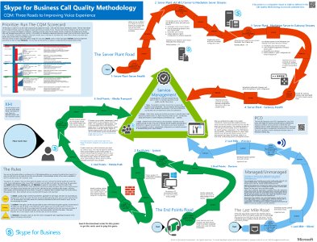

# Technical diagrams for Skype for Business Server

**Сводка:** Просматривайте эти плакаты по мере необходимости при планировании, внедрении и управлении Skype для бизнеса Server.

Эти ресурсы доступны в форматах Visio (.vsdx) (Visio 2015) и PDF. Сведения о печати документов можно найти в статье [Советы по печати плакатов крупного формата](technical-diagrams.md#tips).

Для просмотра этих файлов может потребоваться дополнительное программное обеспечение. Дополнительные сведения см. в следующей таблице.

|Тип файла|Программное обеспечение|
|:--- |:--- |
|.vsd |Visio 2010, Visio 2013 или [бесплатное средство просмотра Visio](https://go.microsoft.com/fwlink/p/?LinkId=393676)   Если используется средство просмотра Visio, щелкните правой кнопкой мыши VSD-ссылку, выберите пункт **Сохранить объект как**, сохраните файл на свой компьютер, затем откройте сохраненный файл. |
|.pdf |Любое средство просмотра PDF-файлов, например [Adobe Reader](https://go.microsoft.com/fwlink/p/?LinkId=393675) |
|.zip |Любая служебная программа для сжатия файлов. В Windows 7 или более поздних версий имеются собственные программы для открытия этих файлов. |

## Плакаты

Эти плакаты подробно изменяют определенную техническую область и предназначены для использования с соответствующими статьями или контентом, доступным в центре загрузки.

Дополнительные сведения об использовании Microsoft Teams можно найти в разделе [архитектура IT в Microsoft Teams и плакатные решения для телефонной связи](https://docs.microsoft.com/MicrosoftTeams/teams-architecture-solutions-posters).

|Название|Описание|
|:---|:---|
|**Рабочие нагрузки протоколов Skype для бизнеса Server**   [Версия PDF](https://go.microsoft.com/fwlink/p/?LinkId=550989) (оптимально для мобильных устройств и планшетных компьютеров)   [Версия Visio](https://go.microsoft.com/fwlink/p/?LinkId=550991) (оптимально для пользователей с Visio) |Загрузив этот плакат, вы сможете лучше понять требования серверов и клиентов Skype для бизнеса на различных уровнях сложности обслуживания.    Размер: 11 на 17 дюймов (несколько страниц в удобном формате для печати на большинстве офисных принтеров)     Этот плакат создан с помощью Visio 2015. Никакие изменения с учетом специфики среды не требуются. |
|**Методология качества вызовов Skype для бизнеса**   [Версия для PDF-файлов](https://go.microsoft.com/fwlink/p/?LinkId=617899)   [Версия Visio](https://go.microsoft.com/fwlink/p/?LinkId=617900) (оптимально для пользователей с Visio) |Загрузите этот плакат, чтобы узнать о ККМ, методологии качества связи для Skype для бизнеса Server 2015, который поможет вам находить и устранять проблемы, влияющие на качество связи и взаимодействие с пользователем для реализаций, которые включают в себя возможности корпоративного голосовой связи.     На [странице сведения о загрузке](https://go.microsoft.com/fwlink/p/?LinkId=617898) вы можете получить доступ к печатаемым картам и правилам, если вы хотите воспроизводить ее как игру на доске. Используйте этот плакат с [системой показателей ККМ](https://go.microsoft.com/fwlink/p/?LinkId=617904).    Размер: 34 х 44 дюйма     Этот плакат создан с помощью Visio 2015. Никакие изменения с учетом специфики среды не требуются. |
|**Голосовые решения Skype для бизнеса**      [Версия PDF](https://go.microsoft.com/fwlink/?linkid=869123) (оптимально для мобильных устройств и планшетных компьютеров)   [Версия Visio](https://go.microsoft.com/fwlink/?linkid=869124) (оптимально для пользователей с Visio) |Microsoft поддерживает различные варианты, позволяющие пользователям звонить на стационарные телефоныные и мобильные телефоны через общедоступную телефонную сеть (PSTN), если у них есть учетные записи в Office 365 в Skype для бизнеса Online или в локальной версии Skype для бизнеса. Развертывание сервера 2015. На этом плакате приведены различные предложения для голосовой связи от Microsoft, а также инструкции по выбору наиболее подходящего варианта с учетом текущего состояния организации и ее планов на будущее.     Размер: 34 х 44 дюйма    Этот плакат создан с помощью Visio 2015. Никакие изменения с учетом специфики среды не требуются. |
|**Модели архитектуры Skype для бизнеса**      [Версия PDF](https://go.microsoft.com/fwlink/?linkid=869125) (оптимально для мобильных устройств и планшетных компьютеров)   [Версия Visio](https://go.microsoft.com/fwlink/?linkid=869126) (оптимально для пользователей с Visio) |Эта серия плакатов предназначена для слушателей ИТ-специалистов, чтобы привлечь внимание к различным основным архитектурным моделям, благодаря которым можно использовать Skype для бизнеса Online и Skype для бизнеса Server 2015 в локальной среде. Начните с какой-либо конфигурации, которая лучше всего подходит для вашей организации и для будущих планов. При необходимости вы можете перейти на другую модель. Например, может возникнуть необходимость интеграции с Exchange и SharePoint или решением, которое использует преимущества облачной УАТС Microsoft.    Размер: 11 х 17 дюйма    Этот плакат создан с помощью Visio 2010. Никакие изменения с учетом специфики среды не требуются. |

## Визуальные активы

Если вы хотите создать собственные схемы топологии Visio с помощью новых символов Skype для бизнеса, [Скачайте наборы элементов](https://go.microsoft.com/fwlink/p/?LinkId=550985).

## Советы по печати плакатов большого формата

Если у вас имеется плоттер, плакаты большого формата можно распечатывать в полный размер. При отсутствии плоттера выполните следующие действия, чтобы распечатать плакаты на листах меньшего формата, например 11 x 17 дюймов. При печати плаката большого формата на листе меньшего размера его текст, скорее всего, будет трудно или невозможно прочитать.

### Печать плакатов на листах меньшего формата

1. Откройте файл плаката в Visio.
2. В меню **Файл** выберите пункт **Параметры страницы**.
3. На вкладке **Настройка печати**, в разделе **Бумага принтера**, выберите размер бумаги, на которой требуется выполнить печать.
4. На вкладке **Настройка печати**, в разделе **Масштаб**, выберите **Вписать**, затем введите значение **1 лист в ширину Х 1 лист в высоту**.
5. На вкладке **Размер страницы** выберите **Изменять размеры по содержимому**, затем нажмите **OK**.
6. В меню **Файл** выберите пункт **Печать**.
