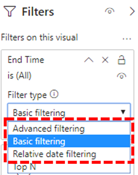

# Установка соединителя качества звонка (Майкрософт Power BI для использования шаблонов запросов на панель мониторинга качества звонка

Перед использованием шаблонов запросов Power BI (PBIX-файлов) для панели мониторинга качества звонка (CQD) Microsoft Teams необходимо установить соединитель качества звонка (Майкрософт) для Power BI, используя файл *MicrosoftCallQuality.pqx,* включенный в [загрузку](https://github.com/MicrosoftDocs/OfficeDocs-SkypeForBusiness/blob/live/Teams/downloads/CQD-Power-BI-query-templates.zip?raw=true).

Сведения об Power BI шаблонах можно найти в Power BI для анализа данных [CQD](CQD-Power-BI-query-templates.md) для Teams.

Убедитесь, что у вас есть права [доступа к CQD-данным](./turning-on-and-using-call-quality-dashboard.md#assign-admin-roles-for-access-to-cqd) для доступа к Power BI отчетов.

> [!NOTE]
> Соединитель качества звонка (Майкрософт) поддерживает directQuery только в Power BI; Режим импорта не поддерживается. 

## Установка

Процесс установки пользовательского соединителя и настройки безопасности для его использования подробно описан в документации [Power BI.](/power-bi/desktop-connector-extensibility) Для простоты краткое объяснение:

1. Проверьте, есть ли на компьютере папка Документы *\[ \] \\ Power BI Desktop \\ настраиваемые соединители.* Если нет, создайте эту папку. 1

2. Скачайте файл соединитела *\* (MEZ-* или *\* PQX-файл)* и поместите его в каталог *Пользовательские* соединитетели.

3. **Если файл соединитетеля является *\* MEZ-файлом,*** вам также потребуется настроить параметры безопасности, как описано в документации по настройке [пользовательского соединитела.](/power-bi/desktop-connector-extensibility#data-extension-security)

Если выпущена новая версия соединитела Microsoft Call Quality, замените старый файл соединитела в каталоге Настраиваемые *соединитетели* новым файлом.

## Установка

Чтобы создать отчет и выполнить запросы, необходимо сначала подключиться к источнику данных CQD. Чтобы подключиться, выполните следующие действия:

1. На вкладке Главная Power BI Desktop кнопку *Получить данные*.

    

2. На *этом этапе* должно появиться окно Получить данные. Перейдите *в веб-службы*, затем выберите *Microsoft Call Quality (бета-версия)* и *нажмите* Подключение .

    

3. Вам будет предложено войти далее. Используйте те же учетные данные, что и для панели мониторинга качества звонка. 2

4. В следующем запросе будет предложено выбрать один из двух режимов подключения *к данным.* Выберите *DirectQuery и* нажмите *ОК*.

5. Наконец, вам будет предложено в итоге от показана вся модель данных для панели мониторинга качества звонка. На этом этапе данные не будут видны, только модель данных для CQD. Чтобы *завершить настройку,* выберите загрузить.

6. На этом Power BI загрузит модель данных в правую часть окна. В противном случае страница останется пустой, а запросы не будут загружены по умолчанию. Чтобы создать **запрос** и вернуть данные, перезапрос см. ниже в окте Создание запросов.

Если какие-либо из шагов в ходе настройки не были четкими, более подробное описание процесса можно найти в кратком кратком описании: Подключение к данным в [Power BI Desktop.](/power-bi/desktop-quickstart-connect-to-data)

## Запросы на создание

После завершения настройки вы увидите названия нескольких сотен измерений и мер, загруженных *в* области Поля. Создавать фактические запросы на этом сайте очень просто: достаточно выбрать необходимые измерения и меры, а затем перетащить их на страницу. Вот более подробное объяснение с простым примером:

1. В области Визуализации выберите визуализацию, которая вам *нужна.* На странице должна появиться пустая версия визуализации. В этом примере мы будем использовать визуализацию *Таблица.*

    

2. Определите, какие измерения и меры (обозначаются символом агрегирования по имени), которые вы хотите использовать в запросе, а затем выберите их вручную и перетащите в черную визуализацию. Кроме того, перетащите их в *поле Значения* под вариантами визуализации.

    

    > [!IMPORTANT]
    > Для выполнения любого запроса необходима информационная панель качества звонка. Неудача добавления меры в запрос приведет к сбою запроса.

3. Затем выберите нужные размеры и перетащите их  в область Фильтры этого визуального поля в области *Фильтры.* Соединителя качества звонка (Майкрософт) в настоящее время поддерживает базовую фильтрацию *(выбор* значений из списка возможных значений измерений), расширенный фильтр (вручную укажите  значения и  опернды для фильтрации, как по аналогии с панелью мониторинга качества звонка) и относительную фильтрацию дат *(доступно* только для измерений Время окончания и Время начала).  Фильтрация по верхнему *n* не поддерживается панелью мониторинга качества звонка.

    

    > [!IMPORTANT]
    > Фильтры поддерживаются только при применении к измерениям. Фильтрация по значениям измерений не поддерживается на панели мониторинга качества звонка.

4. Наконец, на *вкладке Формат* в области *Визуализации выберите* стиль и формат запроса.

    > [!NOTE]
    > Для запуска запросов на панель мониторинга качества звонка требуется по крайней мере один показатель. Если запрос не загружается, убедитесь, что в запрос включена мера.

## Создание отчета drillthrough

[Drillthrough в Power BI](/power-bi/desktop-drillthrough) позволяет создавать отфильтрованные отчеты, которые можно быстро фильтровать, используя значения других отчетов в качестве контекста. После того как вы узнаете, как создать свой первый запрос с помощью соединитетеля качества звонка (Майкрософт), процесс drillthrough будет еще проще.

1. Создайте еще одну страницу отчета, а затем добавьте на нее запросы.

2. Выберите измерение, используемое в качестве фильтра drillthrough, и перетащите его в поле *Drillthrough (Drillthrough)* в области *Visualizations* (Визуализации).

    

3. **Ну вот\!** Теперь любой другой запрос на другой странице, использующей это измерение, теперь может пролиться на эту страницу, автоматически применив значение измерения drillthrough в качестве фильтра.

    

В отличие от панели мониторинга качества Power BI поддерживает непо последовательное дрели. Если запрос содержит необходимое измерение, он может перебираться на любую другую страницу.

### Лучшие методики

Запросы на качество звонка (Майкрософт) должны быть разработаны с учетом функций drillthrough. Вместо того чтобы загружать сразу все данные, а затем нарезку фильтрами, начните с более общих запросов с низкой емкостью и отфильтруйте их до запросов с высокой емкостью. Например, при попытке диагностировать подсети, в которых чаще всего возникает проблема с качеством, необходимо сначала определить регионы и страны, в которых возникла проблема, а затем идентифицировать подсети в этом регионе или стране. Шаблоны соединители "Качество звонка" разработаны таким образом, чтобы действовать в качестве примера.

## Ограничения

Несмотря на использование Power BI, не все функции Power BI поддерживаются соединитетелем качества звонка (Майкрософт) либо из-за ограничений модели данных панели мониторинга качества звонка, либо для соединитеров DirectQuery в целом. В списке ниже приведены некоторые более интересные ограничения Соединитела, но этот список не следует считать исчерпывающим:

1. **Вычисляемая колонка —** Соединители DirectQuery в целом имеют ограниченную поддержку вычисляемых столбцов в Power BI. Некоторые вычисляемые столбцы могут работать с соединитетелем, так как они являются исключениями. Как правило, вычисляются столбцы не работают.

2. **Агрегаты —** Модель данных панели мониторинга качества звонка построена на модели куба, то есть агрегаты уже поддерживаются в виде мер. Попытка вручную добавить агрегаты для разных измерений или изменить тип агрегирования меры не будет работать с соединитетелем, и обычно это приведет к ошибке.

3. **Настраиваемые визуальные эффекты —** Хотя соединительность Microsoft Call Quality работает с разнообразными визуальными эффектами, мы не можем гарантировать совместимость со всеми визуальными визуальными эффектами. Многие настраиваемые визуальные эффекты зависят от использования вычисляемого столбца или импортируемых данных, ни одна из которых не поддерживается соединительными линиями DirectQuery.

4. **Ссылки на** кэш Power BI в настоящее время не поддерживают ссылки на кэшные данные от соединитела DirectQuery. Любая попытка ссылки на результаты запроса приведет к новому запросу.

5. **Относительная фильтрация данных —** Поддерживается соединитетелем Качества звонка (Майкрософт),  но только с измерениями Время начала и *Время* окончания. Измерение *Date* может быть очевидным для относительной фильтрации дат, но *date* не сохраняется как объект даты и поэтому не поддерживает относительную фильтрацию дат в Power BI.

6. **Запросы только для измерений—** В настоящее время не поддерживаются соединитетелем качества звонка (Майкрософт). При создании визуализации с тремя или более измерениями без измерений данные столбца транспонются. Чтобы избежать этого, всегда включите в визуализации хотя бы одно измерение (например, "Месяц год"). Планируется, что эта проблема будет решена в предстоящем выпуске соединительной соединительной связи "Качество звонка Майкрософт" для Power BI.

7. **облако сообщества для государственных организаций (GCC) —** Для клиентов в среде GCC качество звонка (Майкрософт) будет работать только при использовании Power BI Desktop звонка. Соединителю качества звонка (Майкрософт) в настоящее время не соответствует служба Power BI для GCC клиентов.

Большинство из этих проблем являются ограничениями на разработку соединительные линии DirectQuery в Power BI или являются базовыми для модели данных CQD.

## Устранение неполадок

### Я пытаюсь использовать столбец Дата в качестве среза даты. Как только я преобразую тип данных этого столбца в "Дата", я получаю сообщение об ошибке

> **Не удалось загрузить** данные для этого визуального : ошибка OLE DB или ODBC: [Expression.Error] Не удалось сложить выражение с источником данных. Попробуйте более простое выражение.

Срезы дат не поддерживаются соединителом качества звонка (Майкрософт). Чтобы указать диапазон дат, применив к отчету два фильтра, определяющие меньшее и большее даты.

Кроме того, если даты, которые вы хотите просмотреть, являются последними, применим относительный фильтр дат, чтобы отфильтровать только данные за последние N дней,недель/месяцев.

## Коды ошибок

Поскольку соединителю качества звонка (Майкрософт) для Power BI меньше ограничений, чем в веб-приложении с точки зрения типов запросов, которые можно создать, иногда при создании запросов может возникнуть ряд ошибок. Если вы получили сообщение об ошибке типа "CQDError. RunQuery — ошибка выполнения запроса" со ссылкой на список ниже с номером ErrorType, предоставленным для устранения возможной проблемы с запросом. Ниже ются наиболее распространенные коды типов ошибок, которые могут возникнуть с соединитетелем CQD Power BI:

- **Ошибка Тип ошибки 1. Ошибка структуры запроса:** Ошибка структуры запроса обычно вызвана тем, что соединителю не удается построить правильно отформатированный запрос. Чаще всего это происходит при использовании неподсвеченных функций, как указано в указанных выше ограничениях. Убедитесь, что в запросе не используется вычисляемый столбец или визуальный эффект.

  - **Тип ошибки 2. Ошибка создания запроса:** Ошибка построения запроса вызвана тем, что соединитектор качества звонка (Майкрософт) не может правильно оценить запрос, который вы создаете. Чаще всего это происходит при использовании неподсвеченных функций, как указано в указанных выше ограничениях. Убедитесь, что в запросе не используется вычисляемый столбец или визуальный эффект.

  - **Тип ошибки 5. Время выполнения:** Время выполнения запроса достигло максимально возможного времени выполнения, прежде чем он отсроет. Попробуйте добавить другие фильтры в запрос, чтобы ограничить область его действия. Сужение диапазона данных часто является наиболее эффективным способом достижения этой цели.

  - **Тип ошибки 7. Ошибка "Нет измерений":** Запросы панели мониторинга качества звонка требуют меры для работы. Убедитесь, что запрос содержит меру. Меры в соединиторе качества звонка (Майкрософт) обозначаются символом агрегирования (суммы) перед их именем.

Если вы столкнулись с дополнительными ошибками вне этой области, сообщите об этом группе мониторинга качества звонка, чтобы мы могли помочь устранить проблему и при необходимости обновить документацию.

## Сноски

**1** Некоторые процессы и приложения (например, OneDrive) могут привести к изменению корневой папки Документы. Убедитесь, что *Power BI Desktop \\ настраиваемые соединитетели* находится в текущей корневой папке Документы.

**2** Учетные данные для входа,  которые вы используете для панели мониторинга качества звонка, не должны быть одинаковыми учетными данными, которые вы используете для входа в Power BI Desktop приложения.

## Вопросы и ответы

### Когда соедините Power BI будет обновлен с состоянием "Бета"?

Несмотря на тег Beta (Бета-версия), microsoft Call Quality (Beta) connector for Power BI — это первая версия "выпуска" соединителю, которая была официально подписана командой Power BI, чтобы отразить это. На момент первоначального выпуска соединитела группа Power BI не могла предоставить поддержку и более широкую сертификацию, но была готова проверить безопасность, подлинность и общие функции соединитера качества звонка (Майкрософт). В ближайшее время мы планируем вложить средства в microsoft Call Quality connector для Power BI связи.

### Почему соединитектор выглядит медленнее по сравнению с панелью мониторинга качества звонка в браузере? Что можно сделать для повышения производительности?

Производительность запросов для различных шаблонов на самом деле одинаковы как в браузере, так и в соединители.  Как и любое другое приложение, Power BI добавляет к производительности проверку подлинности и время отрисовки. Кроме того, разница заключается в количестве одновременно запускаемого запроса. Так как в версии панели мониторинга качества звонка в браузере были менее хорошо разработанные параметры визуализации и наглядной визуализации, большинство наших отчетов оказались доступны только для загрузки 2–3 запросов за раз. С другой стороны, в шаблонах соединителок часто отображается более 20 запросов одновременно. Если вы хотите создавать отчеты с такой же скоростью, как и старые, попробуйте создать отчеты не более чем с 2–3 запросами на вкладку.

Дополнительные сведения см. в следующих статьях:

- [Руководство по оптимизации для Power BI](/power-bi/guidance/power-bi-optimization)
- [Руководство по модели DirectQuery](/power-bi/guidance/directquery-model-guidance)

### Я постоянно нажимаю на ограничение в 10 000 строк при запуске запросов. Как получить соединителя более 10 000 строк?

Ограничение в 10 000 строк фактически указывается в конце API и предназначено для существенного повышения производительности и снижения риска ошибок выполнения запросов, связанных с низкими условиями памяти.

Вместо того чтобы пытаться увеличить количество строк результатов, лучше изменить структуру отчетов в соответствии с лучшими методиками соединителя. Шаблоны, которые мы включили, предназначены для демонстрации этих лучших методик. По возможности начните с общих градиторий с более низкими масштабами, такими как "Месяц", "Год", "Дата", "Регион", "Страна" и т. д. После этого вы сможете получить все более емкие измерения. Хорошим примером этого рабочего процесса является Location-Enhanced отчеты helpdesk и Location-Enhanced.

## Статьи по теме

[Используйте Power BI для анализа данных CQD для Teams](CQD-Power-BI-query-templates.md)
