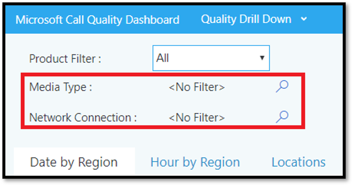

# <a name="data-and-reports-in-call-quality-dashboard-cqd"></a>Данные и отчеты на панели мониторинга качества звонков (CQD)

Microsoft Call Quality Dashboard (CQD) использует веб-канал данных практически в реальном времени (NRT). Записи звонков доступны в CQD в течение 30 минут после завершения вызова. Записи вызовов из конвейера NRT доступны только в течение нескольких месяцев, прежде чем они будут удалены из набора данных.

## <a name="many-ways-to-access-cqd-data"></a>Множество способов доступа к данным CQD

Доступ к данным CQD можно получить несколькими разными способами. Выберите наиболее подходящий вариант:

|&nbsp;|&nbsp;|
|---|---|
|Центр администрирования Teams [(https://admin.teams.microsoft.com)](https://admin.teams.microsoft.com)|Данные CQD включаются на странице "Пользователи" в Центре администрирования Teams, где отображаются наиболее распространенные данные, необходимые в удобном для чтения формате. Вы не можете настроить данные CQD, которые находятся в разделе **"Пользователи"**.|
|Портал CQD [(https://cqd.teams.microsoft.com)](https://cqd.teams.microsoft.com)|Надежные сводные и подробные отчеты, соответствующие большинству потребностей, с фильтрацией детализации. Отчеты также можно настроить на портале CQD. <br><br>Получите два [шаблона отчетов CQD](#import-the-cqd-report-templates) , которые помогут анализировать данные на портале CQD.|
|Power BI|Используйте прямые запросы для просмотра данных CQD в Power BI с помощью [настраиваемых шаблонов Power BI](CQD-Power-BI-query-templates.md). [Скачайте шаблоны запросов Power BI для CQD](https://www.microsoft.com/download/details.aspx?id=102291).<br><br>Вы также можете [использовать REST API для доступа к данным CQD через](/skypeforbusiness/management-tools/call-quality-dashboard/data-api) Power BI. Используйте этот метод, если вы хотите скачать данные CQD, чтобы работать с ним в автономном режиме. Преимущество использования этого метода — повышение производительности, особенно полезно для больших наборов данных, которые не используются в Power BI, когда вы подключены к сети.|
|API Graph|Доступ к данным о качестве звонков самостоятельно с помощью [API Graph](/graph/api/resources/callrecords-api-overview). Это самый сложный метод, но он обеспечивает максимальное управление и гибкость при анализе данных о качестве звонков. Например, если вам нужно присоединить его к другим данным для вашей организации, можно использовать API Graph для создания модели данных и включения данных качества звонков.|

## <a name="import-the-cqd-report-templates"></a>Импорт шаблонов отчетов CQD

Скачайте два [проверенных шаблона отчетов CQD](https://aka.ms/qertemplates) (все сети и управляемые сети), чтобы быстро приступить к работе с CQD. Шаблон "Все сети", оптимизированный для работы со стандартным файлом данных, можно использовать при сборе и отправке сведений о сборке в CQD, как описано в следующем разделе.

**Импорт шаблонов (. CQDX) в CQD**:

1. В CQD выберите **"Подробные отчеты** " в меню в верхней части страницы.

2. На панели слева выберите " **Импорт"**. Перейдите к первому шаблону CQDX и выберите " **Открыть"**.

3. После отправки шаблона во всплывающем окне отобразится сообщение "Импорт отчета выполнен успешно".

4. Повторите шаги 2 и 3 для второго шаблона CQD.

   > [!NOTE]
   > Каждый пользователь должен импортировать шаблоны CQD в свой экземпляр CQD.

## <a name="euii-data"></a>Данные EUII

В целях соответствия требованиям данные, идентифицируемые пользователем (EUII), (также известные как личные сведения или персональные данные), хранятся только в течение 28 дней. По мере того как данные NRT пересекают 28-дневный знак, поля, содержащие EUII, очищаются, что приводит к очистке данных NRT без EUII. Поля, содержащие данные EUII:

- Полный IP-адрес
- Mac-контроль доступа (MAC)
- Идентификатор базового набора служб (BSSID)
- URI протокола Инициации сеанса (SIP) (только Skype для бизнеса)
- Имя участника-пользователя (UPN)
- Имя конечной точки компьютера
- Подробные отзывы пользователей
- Идентификатор объекта (идентификатор объекта Active Directory пользователя конечной точки)
- Номер телефона
- Удостоверение автосекретаря
- Удостоверение очереди вызовов
- Имя устройства Видеоконференции (VTC)
- Сведения об устройстве видеоконференции (VTC)

### <a name="admin-roles-with-and-without-euii-access"></a>Администратор ролей с доступом EUII и без нее

Эти [роли RBAC](/azure/role-based-access-control/overview) **ИМЕЮТ** доступ к EUII:

- Глобальные Администратор
- Служба Teams Администратор
- Teams Communications Администратор
- Инженер поддержки по коммуникациям Teams
- Глобальный читатель
- Skype для бизнеса Администратор

Эти роли RBAC **не имеют доступа** к EUII:

- Читатель отчетов
- Специалист службы поддержки связи Teams

## <a name="date-controls"></a>Элементы управления датой

CQD поддерживает следующие типы последовательного тренда:

- 5 дней
- 7 дней
- 30 дней
- 60 дней
- 90 дней

Параметр "Дата URL-адреса" принимает поле "День". В отчетах о скользяных днях в качестве последнего дня тренда используются даты, указанные в формате YYYY-MM-DD. Параметр даты URL-адреса "00" указывает "сегодня".

|Url|Дата окончания тренда "Скользящий день"|
|:---|:---|
|<span>\<cqdv3>https:///spd/#/Dashboard/\<reportid>/2019-02/</span>|Текущий день февраля 2019 г.|
|<span>\<cqdv3>https:///spd/#/Dashboard/\<reportid>/2019-02-15/</span>|15 февраля 2019 г.|
|<span>\<cqdv3>https:///spd/#/Dashboard/\<reportid>/00/</span>|Текущий день|

По умолчанию текущий день месяца используется в качестве последнего дня тренда "Скользящий день".

## <a name="data-available-in-cqd-reports"></a>Данные, доступные в отчетах CQD

Для управления качеством звонков в организации может потребоваться сводка по умолчанию и подробные отчеты CQD. При необходимости можно создавать [пользовательские отчеты](#create-custom-detailed-reports).

Если вы хотите использовать Power BI для анализа данных CQD, ознакомьтесь со сведениями об использовании [Power BI для анализа данных CQD для Teams](CQD-Power-BI-query-templates.md).

|Компонент|Сводные отчеты|Подробные отчеты|
|:---|:---|:---|
|Метрика общего доступа к приложениям|Нет|Да|
|Поддержка сведений о сборке клиентов|Да|Да|
|Поддержка сведений о конечной точке клиента|Только в cqd.teams.microsoft.com <span><span/>|Только в cqd.teams.microsoft.com <span><span/>|
|Поддержка детализации анализа|Нет|Да|
|Метрики надежности мультимедиа|Нет|Да|
|Встроенные отчеты|Да|Да|
|Общие отчеты|Да|Да|
|Набор отчетов для каждого пользователя|Нет|Да|
|Настройка набора отчетов (добавление, удаление, изменение отчетов)|Нет|Да|
|Метрики демонстрации экрана на основе видео|Нет|Да|
|Метрики видео|Нет|Да|
|Объем доступных данных|Последние 12 месяцев|Последние 12 месяцев|
|Данные Microsoft Teams|Да|Да|

### <a name="select-product-data-to-see-in-reports"></a>Выбор данных продукта для просмотра в отчетах

В сводных и Location-Enhanced отчетов можно использовать раскрывающийся список "Фильтр продуктов", чтобы отобразить все данные о продукте, только данные Microsoft Teams или только Skype для бизнеса Online.

> [!div class="mx-imgBorder"]
> 

В подробных отчетах измерение **Is Teams** можно использовать для фильтрации данных по Microsoft Teams или Skype для бизнеса Online.

## <a name="summary-reports"></a>Сводные отчеты

Это отчеты, которые вы увидите на панели мониторинга CQD при первом входе в CQD. Они позволяют быстро просмотреть тенденции качества с помощью ежедневных, ежемесячных и табличных отчетов, чтобы помочь определить подсети с низким качеством.

|Вкладку|Описание|
|---|---|
|Общее качество звонков|Статистическая обработка остальных трех вкладок.|
|Сервер — клиент|Сведения о потоках между серверными и клиентскими конечными точками.|
|Клиент — клиент|Сведения о потоках между двумя конечными точками клиента.|
|Соглашение об уровне обслуживания качества голосовой связи|Сведения о звонках, включенных в соглашение об уровне обслуживания Skype для бизнеса качества [голосовой связи](https://go.microsoft.com/fwlink/p/?linkid=846252).|

### <a name="overall-call-quality-tab"></a>Вкладка "Общее качество звонка"

Используйте данные на этой вкладке для оценки состояния качества звонков и тенденций на основе количества потоков и низкого процента. Условные обозначения в правом верхнем углу показывают, какой цвет и визуальные элементы представляют эти метрики.

> [!div class="mx-imgBorder"]
> 

Потоки классифицируются в трех группах: Good, Poor и Unclassified. Существуют также вычисляемые значения *"Плохой процент*", которые дают отношение потоков, классифицированных как "плохо", к общему классифицированному счетчику потоков. Так *как poor % = Poor streams/(Poor streams+ Good streams) \* 100*, на удовлетворительный *процент* не влияет наличие нескольких неклассифицированных потоков. Сведения о том, что классифицирует поток как плохой или хороший, см. в разделе "Классификация потоков [" на панели мониторинга качества звонков](stream-classification-in-call-quality-dashboard.md).

Используйте шкалу слева для измерения значений количества потоков.

> [!div class="mx-imgBorder"]
> 

Используйте шкалу справа для измерения значений "Плохой процент".

> [!div class="mx-imgBorder"]
> 

Вы также можете получить фактические числовые значения, наведя указатель мыши на панель.

> [!NOTE]
> В следующем примере используется очень небольшой выборка набора данных, и значения нереалистичны для фактического развертывания.

> [!div class="mx-imgBorder"]
> 

Общий объем потока помогает определить, насколько релевантны вычисляемые проценты низкого качества. Чем меньше объем общих потоков, тем менее надежными являются сообщаемые удовлетворительные процентные значения.

### <a name="server-client-tab-and-client-client-tabs"></a>Server-Client и Client-Client вкладок

Эти две вкладки предоставляют сведения о потоках, которые выполняли в сценариях подключения конечной точки к конечной точке. Вкладка Server-Client состоит из четырех свертываемых разделов, представляющих четыре сценария, в которых будут передаваться потоки мультимедиа.

- Проводная внутренняя
- Проводная за пределами
- Wi-Fi inside
- Wi-Fi за пределами

Аналогично, вкладка Client-Client содержит пять свертываемых разделов:

- Проводная внутренняя — проводная внутри
- Проводная внутренняя — проводная за пределами
- Проводная за пределами — проводная за пределами
- Проводная внутренняя — Wi-Fi внутри
- Проводная внутренняя — Wi-Fi за пределами

#### <a name="inside-versus-outside"></a>Внутренние и внешние

CQD классифицирует поток как  "Внутри" или *"* Вне", используя сведения о сборке, если он существует. Конечные точки каждого потока связаны с адресом подсети. Если подсеть находится в списке подсетей, помеченных InsideCorp в переданных сведениях о здании, она *считается inside.* Если сведения о сборке еще не отправлены, inside Test всегда классифицирует потоки как *внешние*.

В сценарии inside test для Server-Client только конечная точка клиента. Так как серверы всегда находятся вне точки зрения пользователя, это не учитывается в тесте.

#### <a name="wired-versus-wifi"></a>Проводная связь и Wi-Fi

Как указано в именах, критерии классификации основаны на типе клиентских подключений. Сервер всегда проводной и не включается в вычисление. В заданном потоке, если одна из двух конечных точек подключена к сети Wi-Fi, CQD классифицирует ее как Wi-Fi.

> [!NOTE]
> При использовании потока, если одна из двух конечных точек подключена к сети Wi-Fi, она классифицируется как Wi-Fi в CQD.

## <a name="tenant-data-information"></a>Сведения о данных клиента

Панель мониторинга "Сводные отчеты CQD" содержит  страницу отправки данных клиента, доступ к странице  с помощью выбора "Отправка данных клиента" в меню параметров в правом верхнем углу. Эта страница используется для отправки администраторами собственных сведений, таких как:

- Карта IP-адреса и географической информации.
- Карта каждого беспроводного AP и его MAC-адреса.
- Карта конечной точки с конечной точкой Make/Model/Type и т. д.

Рекомендуется отправить данные клиента, здания и расположения, чтобы CQD могли включать эти сведения в отчеты. Если вы еще не отправили эти данные, прочтите статью ["Отправка клиента и сборка данных"](CQD-upload-tenant-building-data.md).

## <a name="detailed-reports"></a>Подробные отчеты

|Имя|Описание|
|---|---|
|Location-Enhanced отчетов|Показывает тенденции качества на основе сведений о расположении. Этот отчет отображается только в том случае, если [вы отправили данные клиента](CQD-upload-tenant-building-data.md).|
|Отчеты о надежности|Включает в себя аудио, видео, демонстрацию экрана на основе видео (VBSS) и отчеты об общем доступе к приложениям.|
|Отчеты о качестве взаимодействия|Качество и надежность звука для всех клиентов и устройств, включая комнаты для собраний. Эти отчеты являются "неудовлетворительной" версией скачиваемых шаблонов [CQD](https://aka.ms/QERtemplates), в которых основное внимание уделяется ключевым областям для анализа качества и надежности звука.|
|Отчеты о детализации качества|Детализация: дата по регионам, расположениям, подсетям, часам и пользователям.|
|Отчеты о детализации сбоев|Детализация: дата по регионам, расположениям, подсетям, часам и пользователям.|
|Оценка отчетов о звонках|Анализ оценок  вызовов пользователей по региону, расположению или пользователю. Содержит подробные отзывы.|
|Отчеты службы технической поддержки|Отчеты службы технической поддержки анализют данные о звонках и собраниях для отдельных пользователей, групп пользователей или всех пользователей. Включив данные сборки и EUII, эти отчеты помогают выявлять возможные системные проблемы на основе расположения сети, сведений о конференции, устройств или встроенного ПО.|
|Отчеты о версиях клиентов|Сводка по версии клиента: просмотр количества сеансов и пользователей для каждой версии клиентского приложения<br><br>Версия клиента по пользователю: просмотр имен пользователей для каждой версии клиентского приложения <br><br>Предварительно созданные фильтры для типа продукта и клиента помогают сосредоточиться на версиях для определенных клиентов.|
|Отчеты о конечных точках|Показывает качество звонков по конечным точкам компьютера (сборка компьютера и модель). Эти отчеты включают сборку данных, если вы их отправили.|

## <a name="create-custom-detailed-reports"></a>Создание настраиваемых подробных отчетов

Если отчеты CQD по умолчанию не соответствуют вашим потребностям, используйте эти инструкции для создания пользовательского отчета. Или (по январю 2020 г.) [используйте Power BI для отчетов CQD ](cqd-power-bi-query-templates.md).

В  раскрывающемся списке\) \(отчетов в верхней части экрана, отображаемом при входе на экран "Сводные отчеты", выберите "Подробные отчеты" и нажмите кнопку **"Создать"**. Нажмите **кнопку "** Изменить" в отчете, чтобы просмотреть Редактор запросов. В основе каждого отчета лежит запрос, обращенный к кубу. В отчете наглядно представлены данные, возвращенные в результате запроса. Эта Редактор запросов помогает редактировать эти запросы и параметры отображения отчета.

> [!IMPORTANT]
> Диапазон сети можно использовать для представления суперсети (сочетание нескольких подсетей с одним префиксом маршрутизации). Все новые сборки будут проверяться на наличие перекрывающихся диапазонов. Если вы ранее отправили файл сборки, скачайте текущий файл и повторно отправьте его, чтобы выявить перекрытия и устранить проблему перед повторной отправкой. Любое перекрытие ранее отправленных файлов может привести к неправильному сопоставлению подсетей со зданиями в отчетах. Некоторые реализации VPN не содержат точный отчет о подсети. При добавлении подсети VPN в файл сборки вместо одной записи для подсети рекомендуется добавлять отдельные записи для каждого адреса в подсети VPN в виде отдельной 32-разрядной сети. Каждая строка может иметь одинаковые метаданные здания. Например, вместо одной строки для 172.16.18.0/24 у вас должно быть 256 строк с одной строкой для каждого адреса в диапазоне от 172.16.18.0/32 до 172.16.18.255/32 включительно.
>
> Столбец VPN является необязательным и по умолчанию имеет значение 0.  Если для столбца VPN задано значение 1, подсеть, представленная этой строкой, будет полностью развернута в соответствии со всеми IP-адресами в подсети.  Используйте эту функцию с осторожностью и только для подсетей VPN, так как полное расширение этих подсетей отрицательно повлияет на время выполнения запросов, связанных со сборкой данных.

Наведите указатель мыши на линейчатые диаграммы и линии тренда в отчете, чтобы отобразить подробные значения. В отчете с фокусом отобразится меню действий: **"** Изменить", **"** Клонировать", **"Удалить****", "** Скачать" и **"Экспортировать дерево отчетов"**.

## <a name="query-filters"></a>Фильтры запросов

Фильтры запросов реализуются с помощью Редактор запросов в CQD. Эти фильтры используются для уменьшения количества записей, возвращаемых CQD, тем самым минимизируя общий размер отчета и время запроса. Это особенно полезно для фильтрации неуправляемых сетей. Фильтры, перечисленные в следующей таблице, используют регулярные выражения (RegEx).

|Filter.|Описание|Пример фильтра запросов CQD|
|---|---|---|
|Пустые значения отсутствуют|Некоторые фильтры не могут фильтровать пустые значения. Чтобы отфильтровать пустые значения вручную, используйте пустое выражение и задайте для фильтра значение Equals или Not Equals в зависимости от ваших потребностей.|Second Building Name \<\> \^\\s\*\$|
|Исключение общих подсетей|Без допустимого файла сборки для разделения управляемых и неуправляемых сетей домашние сети будут включены в отчеты. Эти домашние подсети находятся вне области ИТ-управления и могут быть быстро исключены из отчета. Распространенными подсетями, как определено в этом руководстве, являются 10.0.0.0, 192.168.1.0 и 192.168.0.0.|Вторая подсеть \<\> 10.0.0.0 \|192.168.0.0 \|192.168.1.0|
|Только для просмотра|Используется для фильтрации отчета по управляемому (внутри) или неуправляемому (за пределами). Управляемый шаблон CQD уже предварительно настроен с этими фильтрами.|Second Inside Corp = Inside|

## <a name="report-filters"></a>Фильтры отчетов

Используйте фильтры отчетов CQD, чтобы сузить фокус исследований. Используйте фильтры отчетов, добавив фильтр в отрисованный отчет в Редактор запросов или непосредственно в отчете. Следующие фильтры отчетов используются в шаблонах [CQD](https://aka.ms/QERtemplates).

|Filter.|Описание|Пример фильтра отчета CQD|
|---|---|---|
|Month|Начните с года, а затем месяца.|2017-10|
|Алфавитном|Фильтры для любых алфавитных символов.|[a-z]|
|Числовые|Фильтры для любых числовых символов.|[0-9]|
|Процент|Фильтры для процента.|([3-9]\\.)\| ([3-9])\| ([1-9][0-9])|

### <a name="drill-down-filters"></a>Фильтры детализации

Отчеты CQD имеют несколько фильтров детализации, которые являются мощными инструментами для сужения фокуса на исследованиях качества звонков. При выборе поля детализации отчет автоматически открывает соответствующую вкладку и фильтрует выбранное значение. Если на этой вкладке есть собственные поля детализации и выбран один из них, применяются оба набора фильтров, постепенно сужая результирующий набор данных.


#### <a name="adding-and-editing-drill-down-fields"></a>Добавление и изменение полей детализации

При редактировании отчета можно указать собственные поля детализации с помощью Редактор запросов.

Для начала щелкните **...** для отчета, который вы хотите изменить, а затем выберите "Изменить **"**.


Выберите измерение в списке слева от Редактор запросов. Затем щелкните раскрывающийся список под меткой **"** Перейти к" и выберите вкладку и группу расширителя, к которым нужно выполнить детализацию. Примечание. В настоящее время функции детализации работают только при переходе на разные вкладки. Поддержка детализации до определенного расширителя будет добавлена позже. Наконец, нажмите **кнопку "** Закрыть", чтобы сохранить изменения в измерении, а затем нажмите кнопку "Сохранить", чтобы сохранить и закрыть Редактор запросов.


### <a name="multi-select-filters"></a>Фильтры с несколькими выборами

Помимо функций детализации, CQD также поддерживает указание фильтров с несколькими значениями (ИЛИ-фильтрами).

Чтобы выбрать несколько значений фильтра, начните с добавления нового фильтра в отчет. Щелкните **+** рядом **с меткой "** Фильтры", введите имя измерения, которое вы хотите использовать, и нажмите кнопку **"Добавить"**.


Затем щелкните **"Поиск"** (значок лупы рядом с новым фильтром). Вы увидите текстовое поле и ряд параметров, включая **"Выбрать все"** и " **Инверт"**. Введите значение и щелкните " **Поиск** " рядом с полем для поиска. Кроме того, оставьте текстовое поле пустым и нажмите кнопку **"** Поиск", чтобы просмотреть до первых 100 параметров.

```powershell
/filter/[AllStreams].[Second Tenant Id]\|[YOUR TENANT ID HERE]
```

Пример.


### <a name="dashboard-level-filters"></a>Фильтры уровня панели мониторинга

В некоторые отчеты CQD добавлены фильтры уровня панели мониторинга, что упрощает фильтрацию по общим параметрам. Эти фильтры отображаются за пределами обычных вкладок отчета и непосредственно под фильтром "Продукт", и применяются ко всем фильтрам на панели мониторинга.



```powershell
/filter/[AllStreams].[Is Teams]|[TRUE | FALSE]
```

### <a name="url-filters"></a>Фильтры URL-адресов

CQD поддерживает добавление фильтров в URL-адрес. Это упрощает предоставление общего доступа к CQD-запросу или создание закладки для него. Вы можете определить параметры в URL-адресе, такие как "Месяц тенденций", идентификатор клиента или язык. Вы также можете добавить фильтры уровня продукта или панели мониторинга в URL-адрес.
Исключение федеративных данных из отчетов CQD полезно при исправлении управляемых зданий или сетей, в которых федеративные конечные точки могут влиять на отчеты.

Чтобы добавить фильтр, добавьте следующий код в конец URL-адреса:

```console
/filter/[AllStreams].[Second Tenant Id]\|[YOUR TENANT ID HERE]
```

Пример.

`https://cqd.teams.microsoft.com/cqd/#/1234567/2018-08/filter/[AllStreams].[Second Tenant Id]|[TENANTID]`

Чтобы добавить фильтр уровня панели мониторинга к URL-адресу, этот фильтр должен существовать в CQD как фильтр уровня продукта или панели мониторинга. Добавьте эти фильтры в URL-адрес после месяца тренда и до параметров URL-адреса:

`filter/DATA_MODEL_NAME|VALUE`

Например, чтобы применить значение фильтра продуктов Microsoft Teams, необходимо добавить следующее:

`filter/[AllStreams].[Is%20Teams]|[True]`

Весь URL-адрес будет выглядеть примерно так:

`https://cqd.teams.microsoft.com/spd/#/Dashboard/2624085/2018-9/filter/[AllStreams].[Is%20Teams]|[True]`

Чтобы применить фильтры URL-адресов со значениями с несколькими выборами, разделите каждое значение символом канала (|) . Например:

`filter/[AllStreams].[Media%20Type]|[Video]|[Audio]|[VBSS]`

Если указать недопустимое имя или значение, фильтр URL-адресов применяться не будет.

Фильтр URL-адресов можно использовать для фильтрации каждого отчета по определенному измерению. Наиболее распространенные фильтры URL-адресов используются для фильтрации отчетов, чтобы исключить телеметрию федеративного участника или сосредоточиться только на Teams или Skype для бизнеса Online. Исключение федеративных данных из отчетов CQD полезно при исправлении управляемых зданий или сетей, в которых федеративные конечные точки могут влиять на отчеты.

|Filter.|Описание|Пример фильтра запросов CQD|
|---|---|---|
|Пустые значения отсутствуют|Некоторые фильтры не могут фильтровать пустые значения. Чтобы отфильтровать пустые значения вручную, используйте пустое выражение и задайте для фильтра значение Equals или Not Equals в зависимости от ваших потребностей.|Second Building Name \<\> \^\\s\*\$|
|Исключение общих подсетей|Без допустимого файла сборки для разделения управляемых и неуправляемых сетей домашние сети будут включены в отчеты. Эти домашние подсети находятся вне области ИТ-управления и могут быть быстро исключены из отчета. Распространенными подсетями, как определено в этой статье, являются 10.0.0.0, 192.168.1.0 и 192.168.0.0.|Вторая подсеть \<\> 10.0.0.0 \|192.168.0.0 \|192.168.1.0|
|Только для просмотра|Используется для фильтрации отчета по управляемому (внутри) или неуправляемому (за пределами). Управляемый шаблон CQD уже предварительно настроен с этими фильтрами.|Second Inside Corp = Inside|

#### <a name="how-to-find-your-tenant-id"></a>Как найти идентификатор клиента

Идентификатор клиента в CQD соответствует идентификатору каталога в Azure. Если вы не знаете свой идентификатор каталога, его можно найти в портал Azure:

1. Войдите в microsoft портал Azure:<https://portal.azure.com>

2. Выберите **Azure Active Directory**.

3. В **разделе "Управление**" выберите **"Свойства"**. Идентификатор клиента находится в поле **"Идентификатор каталога** ".

Идентификатор клиента также можно найти с помощью PowerShell:

```powershell
Login-AzureRmAccount
```

## <a name="comparing-teams-and-skype-for-business-cqd-data"></a>Сравнение данных Teams и Skype для бизнеса CQD

При просмотре данных могут возникать различия в данных между Teams и Skype для бизнеса. По некоторым причинам:

- Различия в механизмах обеспечения производительности и надежности:
  - Teams имеет автоматическое повторное подключение и быстрое перемещение. Skype для бизнеса нет.
  - Teams имеет динамическое управление пропускной способностью. Skype для бизнеса нет.
- Различия в [диапазонах IP-адресов](Office-365-URLs-IP-address-ranges.md) между Teams и Skype для бизнеса. Диапазоны IP-адресов Teams являются более новыми, что может вызвать проблемы с подключением в брандмауэре.

## <a name="related-topics"></a>См. также

[Улучшение и мониторинг качества звонков для Teams](monitor-call-quality-qos.md)

[Что такое CQD?](CQD-what-is-call-quality-dashboard.md)

[Настройка панели мониторинга качества звонков (CQD)](turning-on-and-using-call-quality-dashboard.md)

[Отправка данных о клиенте и сборке](CQD-upload-tenant-building-data.md)

[Управление качеством звонков и собраний с помощью CQD](quality-of-experience-review-guide.md)

[Измерения и меры, доступные в CQD](dimensions-and-measures-available-in-call-quality-dashboard.md)

[Классификация потоков в CQD](stream-classification-in-call-quality-dashboard.md)

[Анализ данных CQD с помощью Power BI](CQD-Power-BI-query-templates.md)
