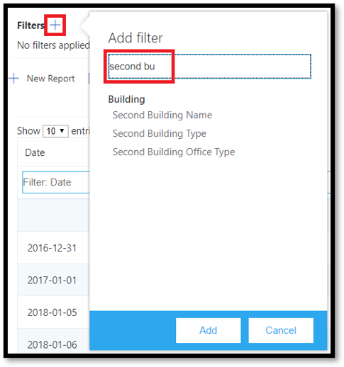

# <a name="data-and-reports-in-call-quality-dashboard-cqd"></a>Данные и отчеты на панели мониторинга качества звонка (CQD)

Панель мониторинга качества звонка (Microsoft) использует веб-канал данных NRT в режиме реального времени. Записи об звонках доступны в CQD в течение 30 минут после окончания звонка. Записи вызовов из каналов NRT доступны только в течение нескольких месяцев, прежде чем они будут удалены из набора данных. 


## <a name="many-ways-to-access-cqd-data"></a>Множество способов доступа к данным CQD

Вы можете получить доступ к данным CQD в разных направлениях. Выберите наиболее подбираемую из них:

|  |  |
|---------|---------|
|Teams центре администрирования [ https://admin.teams.microsoft.com) (](https://admin.teams.microsoft.com)    | Данные CQD отображаются  на странице Пользователи в Центре администрирования Teams, где отображаются наиболее распространенные данные, необходимые в удобном для чтения формате. Вы не можете настроить CQD-данные, которые находятся в области **Пользователи**.  |
|Портал CQD [( https://cqd.teams.microsoft.com) ](https://cqd.teams.microsoft.com)     | Надежные сводные и подробные отчеты, которые соответствуют большинству потребностей с помощью фильтрации детализации. Вы также можете настроить отчеты на портале CQD. <br><br>Получите два [шаблона отчетов CQD,](#import-the-cqd-report-templates) которые помогут вам анализировать данные на портале CQD.       |
|Power BI     | Используйте прямые запросы для просмотра данных CQD в Power BI с помощью [настраиваемых Power BI шаблонов.](CQD-Power-BI-query-templates.md) [Скачайте Power BI запросов для CQD](https://github.com/MicrosoftDocs/OfficeDocs-SkypeForBusiness/blob/live/Teams/downloads/CQD-Power-BI-query-templates.zip?raw=true).<br><br>API REST также можно использовать для [доступа к данным CQD](/skypeforbusiness/management-tools/call-quality-dashboard/data-api) с помощью Power BI. Используйте этот метод, если вы хотите скачать CQD-данные, чтобы работать с данными в автономном режиме. Преимущество этого метода заключается в более производительности, особенно при работе с большими наборами данных, которые Power BI в сети.       |
|API Graph     | Самостоятельное использование API Graph [качества присоединения к звонкам.](/graph/api/resources/callrecords-api-overview?view=graph-rest-beta) Это самый сложный способ, но он обеспечивает наиболее полный контроль и гибкость при анализе данных о качестве звонка. Например, если вам нужно присоединиться к нему с другими данными для организации, можно использовать API Graph для создания модели данных и включения в нее данных о качестве звонка.        |

## <a name="import-the-cqd-report-templates"></a>Импорт шаблонов отчетов CQD

Скачайте [два подбираемых](https://aka.ms/qertemplates) шаблона отчетов CQD ("Все сети" и "Управляемые сети"), чтобы быстро прибавить к скорости работы с CQD. Шаблон Все сети, оптимизированный для работы со файлом данных о здании, можно использовать при сборе и отправке сведений о здании в CQD, как описано в следующем разделе.

**Чтобы импортировать шаблоны (. CQDX) в CQD**

1. В CQD выберите **Подробные отчеты** в меню в верхней части страницы.

2. В левой области выберите **импорт**. Перейдите к первому шаблону CQDX и выберите **открыть**.

3. После добавления шаблона во всплывающее окно отобразит сообщение "Успешно импортировать отчет". 

4. Повторите шаги 2 и 3 для второго шаблона CQD.

   > [!NOTE]
   > Каждый пользователь должен импортировать шаблоны CQD в свой экземпляр CQD. 


## <a name="euii-data"></a>Данные EUII

По соображениям соответствия требованиям личные сведения конечных пользователей (EUII) (также известные как личные сведения или личные сведения) хранятся только в течение 28 дней. По мере того как данные NRT пересекают 28-дневную отметку, поля, содержащие euII, очищаются, в результате чего данные NRT без EUII будут отсвечены. Поля, которые содержат данные EUII:

- Полный IP-адрес
- Адрес средства управления доступом к мультимедиа (MAC)
- Идентификатор базового набора служб (BSSID)
- URI протокола SIP (только Skype для бизнеса сеанса)
- Имя участника-пользователя (UPN)
- Имя конечной точки компьютера
- Орфографические отзывы пользователей
- ИД объекта (ИД объекта Active Directory пользователя конечной точки)

### <a name="admin-roles-with-and-without-euii-access"></a>Роли администраторов с доступом к EUII и без него

У [этих ролей RBAC](/azure/role-based-access-control/overview) **есть** доступ к EUII:
- Глобальный администратор
- Teams Администратор служб
- Teams Администратор связи
- Инженер поддержки по коммуникациям Teams
- Global Reader
- Skype для бизнеса Администратора

У этих ролей RBAC **нет** доступа к EUII:
- Читатель отчетов
- Teams Специалист службы поддержки связи


## <a name="date-controls"></a>Элементы управления датой

CQD поддерживает следующие типы тенденций:

- 5 дней
- 7 дней
- 30 дней
- 60 дней
- 90 дней

Параметр "Дата URL-адреса" принимает поле "День". В отчетах по дням в качестве последнего дня тренда используются даты, указанные в формате ММ-ММ-ДД. Параметр Дата URL-адреса "00" означает "сегодня".

|URL| Дата окончания тренда "Скользящий день"|
|:---|:---|
|<span>https:// <cqdv3> /spd/#/Dashboard/ <reportid> /2019-02/</span>   |Текущий день февраля 2019 г.|
|<span>https:// <cqdv3> /spd/#/Dashboard/ <reportid> /2019-02-15/</span>|15 февраля 2019 г.|
|<span>https:// <cqdv3> /spd/#/Dashboard/ <reportid> /00/</span>        |"Текущий день"|
|||

По умолчанию текущий день месяца используется в качестве последнего дня тренда на текущий день.


## <a name="data-available-in-cqd-reports"></a>Данные, доступные в отчетах CQD

Для управления качеством звонка в организации может потребоваться только сводный отчет по умолчанию и подробные отчеты CQD. При необходимости вы можете создавать [настраиваемые отчеты.](#create-custom-detailed-reports) 

Если вы хотите использовать Power BI для анализа данных CQD, прочитайте статью Использование Power BI для анализа [данных CQD для Teams.](CQD-Power-BI-query-templates.md)

|Функция|Сводные отчеты|Подробные отчеты|
|:--- |:--- |:--- |
|Показатель общего доступа к приложениям | Нет | Да |
|Поддержка сведений о здании клиента | Да | Да |
|Поддержка сведений о конечной точке клиента | Только в <span> cqd.teams.microsoft.com<span/> | Только в <span> cqd.teams.microsoft.com<span/> |
|Поддержка drill down analysis   | Нет   | Да   |
|Показатели надежности мультимедиа   | Нет   | Да   |
|Заме желтая отчетность   | Да   | Да   |
|Обзор отчетов   | Да   | Да   |
|Набор отчетов для каждого пользователя   | Нет   | Да   |
|Настройка набора отчетов (добавление, удаление, изменение отчетов)   | Нет   | Да   |
|Показатели общего доступа к экрану с видео   | Нет   | Да   |
|Метрик видео   | Нет   | Да   |
|Объем доступных данных   | Последние 12 месяцев   | Последние 12 месяцев   |
|Microsoft Teams данных   | Да   | Да   |
| | | |


 
### <a name="select-product-data-to-see-in-reports"></a>Выберите данные о продукте, чтобы отобрать их в отчетах

В сводных и Location-Enhanced отчетах можно использовать  в Skype для бизнеса фильтре продуктов все данные о продукте, только Microsoft Teams данные или только Skype для бизнеса в Интернете.

> [!div class="mx-imgBorder"]
> 
  
В области Подробные отчеты можно использовать измерение Is **Teams** для фильтрации данных по Microsoft Teams или Skype для бизнеса Online.

## <a name="summary-reports"></a>Сводные отчеты

Это отчеты, которые вы увидите на панели мониторинга CQD при первом входе в CQD. Они дают возможность быстро и быстро определить тенденции качества с помощью ежедневных, ежемесячных отчетов и отчетов по таблицам, чтобы выявить подсети с неудовлетворительной качеством. 

| Вкладку | Описание |
|---------|---------|
|Общее качество звонка     | Агрегировать остальные 3 вкладки.       |
|Сервер — клиент     |Сведения о потоках между сервером и конечными точками клиента.        |
|Клиент — клиент     |Сведения о потоках между двумя конечными точками клиента.        |
|SLA о качестве голосовой почты     |Сведения о звонках, включенных в SLA Skype для бизнеса качества [голосовой почты](https://go.microsoft.com/fwlink/p/?linkid=846252).        |

### <a name="overall-call-quality-tab"></a>Вкладка "Общее качество звонка"

Данные на этой вкладке используются для оценки состояния и тенденций качества звонка на основе подсчета потоков и низкого процента. Легенда в правом верхнем углу показывает, какие цвета и визуальные элементы представляют эти показатели.

> [!div class="mx-imgBorder"]
> 
  
Потоки классифицируются по трем группам: "Хорошее", "Плохое" и "Неклассифицировано". Кроме того, вычисляются значения *Poor %,* которые дают  отношение потоков, классифицированных как неудовлетворительные, к общему классифицированным потокам. Поскольку *Poor % = Poor streams/ (Poor streams+ Good streams) * 100,* на poor *%* не влияет наличие нескольких неклассифицированных потоков.  Чтобы узнать, что классифицирует поток как неудовлетворительный или хороший, см. классификацию потока на панели мониторинга [качества звонка.](stream-classification-in-call-quality-dashboard.md)
  
Используйте шкалу слева для измерения значений потока.

> [!div class="mx-imgBorder"]
> 
  
Используйте шкалу справа для измерения значений % низкого качества.

> [!div class="mx-imgBorder"]
> 
  
Вы также можете получить фактические числические значения, наведите указатель мыши на отбивку.
  
> [!NOTE]
> В примере ниже приводится очень небольшой выборка данных, значения в которых нереальна для фактического развертывания.

> [!div class="mx-imgBorder"]
> 
  
Общий объем потоков помогает определить, насколько релевантны вычисленные проценты низкого качества. Чем меньше общий объем потоков, тем менее надежными являются процентные значения "Неудовлетворительные".
  
### <a name="server-client-tab-and-client-client-tabs"></a>Server-Client и Client-Client вкладок

Эти две вкладки предоставляют подробные сведения о потоках, которые были в их сценариях "конечная точка-конечная точка". Вкладка Server-Client имеет четыре раздела, которые представляют четыре сценария потока мультимедиа.
  
- Проводная внутренняя
- Проводные внешние
- Wi-Fi Inside
- Wi-Fi Outside

Аналогично на вкладке Client-Client есть пять разделов, которые можно collapsible:

- Wired Inside — Wired Inside
- Wired Inside — Wired Outside
- Wired Outside — Wired Outside
- Wired Inside — Wi-Fi Inside
- Проводная внутренняя — Wi-Fi Outside

#### <a name="inside-versus-outside"></a>Внутри и снаружи

CQD классифицирует  поток как внутренний или внешний с *использованием* сведений о здании, если он существует. Конечные точки каждого потока связаны с адресом подсети. Если подсеть находится в списке подсетей, помеченных InsideCorp в добавленных данных о здании, то она считается *внутренней.* Если сведения о здании еще не были добавлены, то Inside Test всегда классифицирует потоки как *внешние*. 

Внутренняя проверка для Server-Client только рассматривает конечную точку клиента. Так как серверы всегда находятся за пределами точки зрения пользователя, это не учитывается в тесте.
  
#### <a name="wired-versus-wifi"></a>Проводные и Wi-Fi

Как указано в названиях, условия классификации основаны на типе клиентских подключений. Сервер всегда проводной и не включается в расчет. Если одна из двух конечных точек в потоке подключена к сети Wi-Fi, то CQD классифицирует ее как Wi-Fi.

> [!NOTE]
> Если одна из двух конечных точек подключена к сети Wi-Fi, то поток классифицируется как Wi-Fi в CQD.
  
  
## <a name="tenant-data-information"></a>Сведения о клиенте

Панель мониторинга CQD Summary Reports (Сводные отчеты CQD) содержит страницу tenant **Data Upload,** доступную с помощью Upload **tenant Data Upload** в меню параметров в правом верхнем углу. Эта страница используется администраторами для отправки собственных сведений, таких как:

- Карта IP-адреса и географических данных.
- Карта каждого беспроводного API и его адреса MAC.
- Карта конечной точки с конечной точкой Make/Model/Type и т. д.
  
Мы рекомендуем добавить данные о клиенте, здании и расположении, чтобы служба CQD включила эти сведения в отчеты. Если вы еще не загрузили эти данные, ознакомьтесь с данными Upload [и здания.](CQD-upload-tenant-building-data.md) 


## <a name="detailed-reports"></a>Подробные отчеты

| Имя | Описание |
|---------|---------|
|Location-Enhanced отчетов     |Отображает тенденции качества на основе сведений о расположении. Этот отчет отображается только в том случае, если вы [загрузили данные клиента.](CQD-upload-tenant-building-data.md)        |
|Отчеты о надежности     |Включает аудио- и видеофайл, видеообнабь (VBSS) и отчеты об общего доступе к приложениям.        |
|Отчеты о качестве работы     |Качество и надежность звука для всех клиентов и устройств, включая комнаты для собраний. Эти отчеты являются "ненадежной" версией скачиваемых шаблонов [CQD,](https://aka.ms/QERtemplates)в которых основное внимание уделяется основным областям для анализа качества и надежности звука.         |
|Drill Down Reports (Отчеты о качестве)     | Даты и времени: по регионам, расположениям, подсетям, часам и пользователям.        |
|Отчеты о сбоях в области "Отчеты о сбоях     | Даты и времени: по регионам, расположениям, подсетям, часам и пользователям.        |
|Оценить отчеты о звонках     |Анализируйте оценки вызовов пользователей по регионам, местоположению или по пользователям. Содержит подробные отзывы.         |
|Отчеты службы поддержки     |В отчетах службы поддержки анализ данных о звонках и собраниях для отдельных пользователей, групп пользователей и всех пользователей. Включив данные о здании и euII, эти отчеты помогают выявить возможные системные проблемы с учетом расположения в сети, сведений о конференции, устройств или программного обеспечения.         |
|Отчеты о версии клиента     |Сводка версии клиента: просмотр подсчета сеансов и пользователей для каждой версии клиентского приложения<br><br>Версия клиента для пользователя: просмотр имен пользователей для каждой версии клиентского приложения <br><br>Встроенные фильтры для типа продукта и клиента помогают фокусировать версии на определенных клиентах.         |
|Отчеты конечных точек     |Показывает качество звонка по конечным точкам компьютера (модели и модели компьютера). Эти отчеты включают данные о здании, если вы их загрузили.         |


## <a name="create-custom-detailed-reports"></a>Создание пользовательских подробных отчетов

Если отчеты CQD по умолчанию вам не соответствуют, воспользуйтесь этими инструкциями, чтобы создать настраиваемый отчет. Или (с января 2020 г.) вместо Power BI [CQD. ](cqd-power-bi-query-templates.md)

В списке отчетов в верхней части экрана, отображаемого при входе в систему, на экране Сводные отчеты выберите Подробные отчеты, а затем \( —  \) **Новые**.  Нажмите **кнопку** Изменить в отчете, чтобы увидеть редактор запросов. В основе каждого отчета лежит запрос, обращенный к кубу. В отчете наглядно представлены данные, возвращенные в результате запроса. Редактор запросов помогает редактировать эти запросы и параметры отображения отчета.

> [!IMPORTANT]
> Диапазон сети можно использовать для представления суперсети (сочетания нескольких подсетей с одним префиксом маршрутизации). Все добавленные в новое здание будут проверяться на наличие перекрывающихся диапазонов. Если вы ранее уже загрузили файл здания, скачайте текущий файл и повторно загрузите его, чтобы выявить перекрытия и устранить проблему перед повторной отправкой. Любое перекрытие ранее добавленных файлов может привести к неправильному сопоставлению подсетей со зданиями в отчетах. Некоторые реализация VPN не сообщают точные сведения о подсети. При добавлении в файл здания подсети VPN вместо одной записи для подсети рекомендуется добавлять отдельные записи для каждого адреса в подсети VPN в качестве отдельной 32-битной сети. Каждая строка может иметь одинаковые метаданные здания. Например, вместо одной строки для 172.16.18.0/24 у вас должно быть 256 строк с одной строкой для каждого адреса между 172.16.18.0/32 и 172.16.18.255/32 включительно.
>
> Столбец VPN необязателен и по умолчанию имеет значение 0.  Если для столбца VPN за установлено значение 1, подсеть, представленная этой строкой, будет полностью расширита в соответствие со всеми IP-адресами в подсети.  Используйте этот способ не только для подсетей VPN, так как полное расширение этих подсетей отрицательно скажется на времени запроса для запросов, связанных со созданием данных.

Чтобы отобразить подробные значения, на указателе на линиховые диаграммы и линии тренда в отчете. В отчете, в фокусе будет меню действий: **Изменить**, **Клонировать**, **Удалить**, **Скачать** и **Экспорт дерева отчетов**.


## <a name="query-filters"></a>Фильтры запросов

Фильтры запросов реализуются с помощью редактора запросов в CQD. Эти фильтры используются для уменьшения количества записей, возвращаемого CQD, что позволяет свести к минимуму общий размер отчета и время запроса. Это особенно полезно при фильтрации неудаляемой сети. В фильтрах, перечисленных в таблице ниже, используются регулярные выражения (RegEx).


| Filter.         | Описание          | Пример фильтра запросов CQD      |
|----------------|----------------------|-------------------------------|
| Пустых значений нет   | В некоторых фильтрах нет возможности фильтрации пустых значений. Чтобы отфильтровать пустые значения вручную, используйте пустое выражение и установите для фильтра значение Равно или Не равно в зависимости от потребностей.      | Second Building Name \<\> \^ \\ s\*\$                       |
| Исключение общих подсетей | Если не использовать допустимый файл здания для разных управляемых сетей, домашние сети будут включены в отчеты. Эти домашние подсети не контролируются ИТ-сайтом и могут быть быстро исключены из отчета. Обычные подсети, как определено в этом руководстве, — 10.0.0.0, 192.168.1.0 и 192.168.0.0. | Second Subnet \<\> 10.0.0.0 \| 192.168.0.0 \| 192.168.1.0 |
| Только просмотр внутри  | Используется для фильтрации отчета по управляемым (внутри) или неуправляемой (за пределами). Управляемый шаблон CQD уже предварительно сконфигурировали с этими фильтрами.       | Second Inside Corp = Inside        |

## <a name="report-filters"></a>Фильтры отчета

Используйте фильтры отчетов CQD, чтобы сузить фокус исследований. Используйте фильтры отчета, добавив фильтр к отрисованной отчету в редакторе запросов или непосредственно в отчете. Следующие фильтры отчетов используются во всех шаблонах [CQD.](https://aka.ms/QERtemplates)


| Filter.     | Описание                            | Пример фильтра отчета CQD         |
|------------|----------------------------------------|-----------------------------------|
| Month      | Начните с года, а затем месяца. | 2017-10                           |
| Алфавитном | Фильтрует любые буквы. | [a-z]                             |
| Числовые    | Фильтрует любые числимые символы.    | [0-9]                             |
| Процент | Фильтры для процентного процента.              | ([3–9] \\ .) \| ([3–9]) \| ([1-9][0-9]) |


### <a name="drill-down-filters"></a>Фильтры для фильтрации

В отчетах CQD есть несколько фильтров для фильтрации, которые являются инструментами для сужение фокуса исследования качества звонка. Если выбрать поле для фильтрации, отчет автоматически откроет соответствующую вкладку и отфильтрует выбранное значение. Если на этой вкладке есть отдельные поля для фильтрации и выбрано одно из них, применяются оба набора фильтров, что постепенно сужает полученный набор данных.


#### <a name="adding-and-editing-drill-down-fields"></a>Добавление и редактирование полей drill-down

При редактировании отчета можно указать собственные поля для уточнения данных с помощью редактора запросов.

Для начала щелкните **...** для отчета, который вы хотите изменить, а затем выберите **Изменить**.


Выберите измерение в списке в левой части редактора запросов. Затем щелкните в выпадаке под меткой Перейти и выберите вкладку и группу expander, до которую вы хотите пролиться.  Примечание. В настоящее время функции drill-down работают только при переходе к различным вкладкам. Поддержка для переверки в определенное расширение будет добавлена позднее. Наконец, нажмите **кнопку** Закрыть, чтобы сохранить  изменения в измерении, а затем нажмите кнопку Сохранить, чтобы сохранить и закрыть редактор запросов.


### <a name="multi-select-filters"></a>Фильтры множественого выбора

Помимо функции уточнения, функция CQD также поддерживает указание фильтров с несколькими значениями (ИЛИ фильтров).

Чтобы выбрать несколько значений фильтра, начните с добавления нового фильтра в отчет. Щелкните **+** рядом **с надписью** Фильтры, введите имя нужного измерения и нажмите кнопку **Добавить**.



Затем нажмите **кнопку Поиск** (значок лупы рядом с новым фильтром). Вы увидите текстовое поле и несколько параметров, в том числе Выбрать **все** и **Инвертировать**. Введите значение и нажмите кнопку **Поиск** рядом с этим полем, чтобы найти его. Кроме того, оставьте текстовое поле пустым и нажмите кнопку **Поиск,** чтобы просмотреть до первых 100 параметров.

```powershell
/filter/[AllStreams].[Second Tenant Id]\|[YOUR TENANT ID HERE]
```

Пример.  


### <a name="dashboard-level-filters"></a>Фильтры уровня панели мониторинга
В некоторые отчеты CQD добавлены фильтры уровня панели мониторинга, что делает их более простыми для фильтрации по общим параметрам. Эти фильтры отображаются за пределами обычных вкладок отчетов и непосредственно под фильтром Product и применяются во всех фильтрах панели мониторинга.


```powershell
/filter/[AllStreams].[Is Teams]|[TRUE | FALSE]
```

### <a name="url-filters"></a>Фильтры URL-адресов

CQD поддерживает добавление фильтров к URL-адресу. Это позволяет легко делиться CQD-запросом или делать его закладкой. Вы можете определить параметры в URL-адресе, такие как "Новый месяц", "ИД клиента" или "Язык". Вы также можете добавить фильтры на уровне продукта или панели мониторинга к URL-адресу.
Исключение федеративных данных из отчетов CQD полезно при исправлении управляемых зданий или сетей, в которых федеративная конечная точка может влиять на отчеты.

Чтобы добавить фильтр, добавьте в конец URL-адреса следующее:

```console
/filter/[AllStreams].[Second Tenant Id]\|[YOUR TENANT ID HERE]
```

Пример.  

`https://cqd.teams.microsoft.com/cqd/#/1234567/2018-08/filter/[AllStreams].[Second Tenant Id]|[TENANTID]`

Чтобы добавить фильтр уровня панели мониторинга в URL-адрес, он должен существовать в CQD как фильтр уровня product или Dashboard. Добавьте эти фильтры в URL-адрес после тренда и до параметров URL-адреса:

`filter/DATA_MODEL_NAME|VALUE`

Например, чтобы применить значение фильтра продукта Microsoft Teams, добавьте следующее:

`filter/[AllStreams].[Is%20Teams]|[True]`

URL-адрес будет выглядеть вот так:

`https://cqd.teams.microsoft.com/spd/#/Dashboard/2624085/2018-9/filter/[AllStreams].[Is%20Teams]|[True]`

Чтобы применить URL-фильтры с несколькими значениями, разделять каждое значение по черты (| ) знака. Например:

`filter/[AllStreams].[Media%20Type]|[Video]|[Audio]|[VBSS]`

Если указать недопустимое имя или значение, фильтр URL-адресов применяться не будет.


С помощью URL-фильтра можно отфильтровать каждый отчет по определенному измерению. Наиболее распространенные ФИЛЬТРы URL-адресов используются для фильтрации отчетов, чтобы исключить телеметрию федератов-участников или сосредоточиться только на Teams или Skype для бизнеса Online. Исключение федеративных данных из отчетов CQD полезно при исправлении управляемых зданий или сетей, в которых федеративная конечная точка может влиять на отчеты.

| Filter.         | Описание          | Пример фильтра запросов CQD      |
|----------------|----------------------|-------------------------------|
| Пустых значений нет   | В некоторых фильтрах нет возможности фильтрации пустых значений. Чтобы отфильтровать пустые значения вручную, используйте пустое выражение и установите для фильтра значение Равно или Не равно в зависимости от потребностей.      | Second Building Name \<\> \^ \\ s\*\$                       |
| Исключение общих подсетей | Если не использовать допустимый файл здания для разных управляемых сетей, домашние сети будут включены в отчеты. Эти домашние подсети не контролируются ИТ-сайтом и могут быть быстро исключены из отчета. Обычные подсети, как определено в этой статье, — это 10.0.0.0, 192.168.1.0 и 192.168.0.0. | Second Subnet \<\> 10.0.0.0 \| 192.168.0.0 \| 192.168.1.0 |
| Только просмотр внутри  | Используется для фильтрации отчета по управляемым (внутри) или неуправляемой (за пределами). Управляемый шаблон CQD уже предварительно сконфигурировали с этими фильтрами.       | Second Inside Corp = Inside        |


#### <a name="how-to-find-your-tenant-id"></a>Как найти свой ИД клиента

ИД клиента в CQD соответствует ИД каталога в Azure. Если вы не знаете свой ИД каталога, его можно найти на портале Azure:

1.  Во sign in to the Microsoft Azure:<https://portal.azure.com>

2.  Выберите **Azure Active Directory**.

3.  В **области Управление** выберите **Свойства**. Ваш ИД клиента находится в поле **"ИД** каталога".

Вы также можете найти свой ИД клиента с помощью PowerShell: 

```powershell
Login-AzureRmAccount
```

## <a name="comparing-teams-and-skype-for-business-cqd-data"></a>Сравнение Teams и Skype для бизнеса CQD

При проверке данных могут быть различия между данными между Teams и Skype для бизнеса. Некоторые причины:
- Различия в механизмах обеспечения производительности и надежности.
  - Teams есть автоматическое переподключение и быстрое роуминг. Skype для бизнеса этого не нужно.
  - Teams имеет динамическое управление пропускной способностью. Skype для бизнеса этого не нужно.
- Различия в [диапазонах IP-адресов](Office-365-URLs-IP-address-ranges.md) между Teams и Skype для бизнеса. Диапазоны Teams ip-адресов были более новыми, что может привести к проблемам с подключением в брандмауэре.


## <a name="related-topics"></a>Статьи по теме

[Улучшение и отслеживание качества звонка для Teams](monitor-call-quality-qos.md)

[Что такое CQD?](CQD-what-is-call-quality-dashboard.md)

[Настройка панели мониторинга качества звонка (CQD)](turning-on-and-using-call-quality-dashboard.md)

[Upload клиента и здания](CQD-upload-tenant-building-data.md)

[Управление качеством звонка и собрания с помощью CQD](quality-of-experience-review-guide.md)

[Измерения и меры, доступные в CQD](dimensions-and-measures-available-in-call-quality-dashboard.md)

[Классификация потоков в CQD](stream-classification-in-call-quality-dashboard.md)

[Использование Power BI для анализа данных CQD](CQD-Power-BI-query-templates.md)
