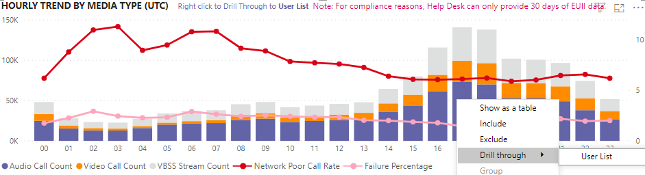

# Просмотр использования Microsoft Teams в Power BI с использованием данных CQDView Microsoft Teams utilization in Power BI using CQD data

В 2020 марта мы добавили отчет об использовании Teams в [шаблоны запросов Power BI для CQD](https://github.com/MicrosoftDocs/OfficeDocs-SkypeForBusiness/blob/live/Teams/downloads/CQD-Power-BI-query-templates.zip?raw=true).New in March 2020, we've added a Teams Utilization report to our downloadable [Power BI query templates for CQD](https://github.com/MicrosoftDocs/OfficeDocs-SkypeForBusiness/blob/live/Teams/downloads/CQD-Power-BI-query-templates.zip?raw=true). 

Эти новые отчеты об использовании Teams позволяют узнать, как (и сколько) ваши пользователи работают с Microsoft Teams, выполнив доступ к данным на панели мониторинга качества вызовов Teams (CQD).This new Teams Utilization reports lets you see how (and how much) your users are using Microsoft Teams by accessing Teams Call Quality Dashboard (CQD) data. Эти отчеты предназначены для централизованного хранения данных и могут быстро переходить от администраторов и руководителей предприятий.These reports are intended to be a centralized location that both administrators and business leaders can quickly go to for this data.

Отчет Power BI для работы с группами состоит из двух основных отчетов: **[Сводка по количеству звонков](#call-count-summary-report)** и **[Сводка по звуковым минутам](#audio-minutes-summary-report)**.The Teams Utilization Power BI report consists of two primary reports: **[Call Count Summary](#call-count-summary-report)** and **[Audio Minutes Summary](#audio-minutes-summary-report)**. [Ежедневное использование](#daily-usage), [сведения о региональных](#regional-audio-details)параметрах, [сведения о конференции](#conference-details) и отчеты о [списках пользователей](#user-list) воспринимаются, когда пользователь использует преимущества подробных отчетов, указанных в описании ниже.The [Daily Usage](#daily-usage), [Regional Audio Details](#regional-audio-details), [Conference Details](#conference-details) and [User List](#user-list) reports come into play when a user takes advantage of the drill-down reports, noted in the descriptions below.

> [!NOTE]
> Данные о сборке и подсети должны быть заполнены для предоставления региональных и сетевых возможностей фильтрации.Building and subnet data must be populated to provide regional and network filtering capabilities.

## Сводный отчет о подсчете звонковCall Count Summary Report

Главная страница (сводка подсчета звонков) немедленно предоставляет количество сеансов обмена аудио-и видеосигналами и экрана за последние 30 и 90 дней, как указано в заголовке раздела.The main page (Call Count Summary) immediately provides the number of audio, video and screen sharing sessions over the last 30 and 90 days as noted in the section title. Изначально данные отображаются для всей Организации, и их можно отфильтровать с помощью параметров раскрывающегося списка срезов в левой части страницы.The data initially displayed is for the organization as a whole and can be filtered using the slicer dropdown options on the left side of the page.

1. Справа от раскрывающегося списка срезов число звонков по типу СМИ разбивается на внутреннее или внешнее представление за последние 30 дней.To the right of the slicer dropdowns, the number of calls by media type is broken down to an internal/external view over the past thirty days. Мы можем просмотреть снимок экрана, на котором есть больше звонков из внешних организационных расположений, которые имеют смысл при рассмотрении текущей глобальной среды.We can see through the above screenshot that there are more calls happening from outside organizational locations, which makes sense considering the current global environment.
  

1. Справа от поля Счетчик типа мультимедиа для последних 90 дней вычислено ежемесячные звонки по типам носителей.To the right of the media type count box, we have the Monthly Call Count by Media Type for the last 90 days. Каждый столбец и тип мультимедиа можно навести на отображение количества за предыдущий месяц или с текущего месяца до текущей даты, предоставляя сведения о тенденциях использования.Each column and media type can be hovered over to display the count for a previous month or the current month to date, providing usage trend information.
  
 

1. Функция середина графа, как и в случае с диаграммой с 90 днем, обеспечивает ежедневное представление использования за последние 30 дней и позволяет пользователю щелкнуть правой кнопкой мыши и подробно ознакомиться с подробными сведениями за определенный день.The middle graph functions as the 90-day graph does, however it provides a daily usage view for the past 30 days and allows a user to right click and drill down into details for a specific day.
  

В левом нижнем углу страницы находится таблица, предоставляющая общие значения для каждого типа мультимедиа за последний год.On the bottom left section of the page, you'll find a table providing total values for each media type over the past year. 
         

На линейчатой диаграмме справа от таблицы отображаются клиенты с наибольшей эффективностью использования (вызовы/потоки) за последние 30 дней.To the right of the table, a bar chart shows clients with the most use (calls/streams) for the past 30 days.
   

В последнем наборе диаграмм на этой странице каждый тип мультимедиа отображается по отдельности с разбивкой на Конференции и использование P2P.The last set of charts for this page show each media type individually, with a breakdown showing conference and P2P usage. На приведенных ниже диаграммах показано, что в сравнении с P2P количество используемых конференций значительно выше.The charts below show that there is a significantly higher number of conference usage as compared to P2P.
  

## Сводный отчет по звуковой минутеAudio Minutes Summary Report

В отчете об использовании звуковых минут использование общего числа минут обеспечивается в нескольких различных представлениях.On the Audio Minutes usage report, the total minute usage is provided through a few different views. 

Для использования текстовых полей у нас есть ежемесячные сведения об использовании, отображаемые рядом с срезами.We have the thirty-day usage summary shown next to the slicers as easy to consume text boxes. В поле "число" отображается 30-дневный итог, в котором есть внутренние и внешние подразделения.The top number shows the thirty-day total, with internal and external breakdowns below that.

На верхней правой линейчатой диаграмме представлено yearlong представление использования звука в конференц-связи.The top right bar graph provides a yearlong view of conference audio usage. Наведите указатель мыши на месяц, чтобы показать звуковой тезис Конференции.Hover over the month to show the conference audio minutes.

Для отображения различий между P2P и звуком конференции в нижней левой части экрана используется весь звук в прошлом году и он разбивается между двумя типами.To show the difference in P2P and conference audio, the bottom left chart takes all audio for the past year and breaks it up between the two types.

Последняя диаграмма на странице "звуковые минуты" показывает использование звуковых минут в глобальной раскрытиех карт.The last chart for the Audio minutes page shows audio minute usage on a global map overlay. Эта диаграмма будет работать только в том случае, если данные построения и подсети загружены в клиент.This chart will only work if building and subnet data is uploaded to the tenant. Наложение круговой диаграммы на карте можно прокрутить, а затем в соответствии с региональными национальным использованием звука.The pie chart overlay on the map can be drilled into, subsequently providing regional audio usage.

## Возможности детализацииDrill-through capabilities

Как отмечалось выше, пользователи могут детализировать отчеты об использовании в повседневной и региональной регионах.As previously noted, users can drill into the daily and regional usage reports.

### Ежедневное использованиеDaily Usage

Отчет об использовании ежедневно позволяет администратору определять периоды пикового потребления в течение дня.The Daily Usage report allows an administrator to identify peak consumption periods through the course of a day. Помимо использования, мы также можем захватить общую информацию о пользователе и тональность за этот день.In addition to usage, we are also able to capture overall user sentiment and feedback for that day.

В отчете об использовании ежедневно отображаются общие сведения о звуковых и видеофайлах, а также о видеосвязи для выбранного дня, благодаря которым добавлена возможность различать внутренние и внешние подключения.The Daily usage report displays the number of Audio, Video and Screen shares for the selected day with the added ability to differentiate between internal and external connectivity. Подразделение Конференции и одноранговой сети — это непосредственно справа от поля «Итого» модальности.A Conference and Peer to Peer breakdown is to the immediate right of the modality total box. В правом верхнем углу отчета содержится список конференций с соответствующими ИДЕНТИФИКАТОРами и участниками в течение дня.The top right of the report provides a list of conferences with their associated ID and participants for the day. Список конференций также предоставляет дополнительный уровень детализации в отчете о Конференции.The conference list provides an additional drill down to the Conference Details report as well. ЗАМЕНА РИСУНКАREPLACE GRAPHIC

Линейчатая диаграмма в центральной области позволяет пользователю определять периоды пикового расхода в течение дня.The bar graph in the center area allows the user to identify peak consumption periods through the course of a day. Пользователи могут детализировать на графике часы, представленные на диаграмме, которые будут представлять отчет о списке пользователей за час.Users may drill down into the hour represented on the graph which will present the User List report for the hour.

Справа от линейчатой диаграммы обратная связь пользователя представлена в визуальном формате.To the right of the bar graph, User Feedback is presented in a visual format. Несмотря на то, что пользователь тональность может быть ценным, он обеспечивает понимание, которое можно использовать для выявления потенциальных проблем.While user sentiment can be subjective, it does provide insight that can be used to identify potential issues.

В нижней таблице показан диапазон показателей для дня.The bottom table provides a range of metrics for the day. Слабые процентные значения и тарифы на сбои могут предоставить администратору потенциальные области улучшения.Poor percentages along with failure rates can provide an administrator with potential areas of improvement. Каждый час также можно выбрать отдельно, как показано ниже.Each hour can also be selected individually as shown below.

Эти данные можно использовать для определения регионов, в которых возникли проблемы во время пикового потребления.This data can be used to identify regions having problems during peak consumption times.

Щелкните столбец для этого дня, чтобы отобразить метрики за этот час.Click on the column for that day to display metrics for that hour.

  
  1.  В таблице под диаграммой отобразятся метрики за этот час.The table below the chart will display the metrics for that hour. Это можно сортировать по любому заголовку столбца; Тем не менее, мы будем заинтересованы в поиске проблемных областей.This can be sorted by any column header; however, we would be interested in finding problematic areas.  
    
    
  2.  Мы видим, что при этом в конференциях в течение этого времени область с изображением пропадает с низкой производительностью.We see that the IND region is experiencing poor video performance in conferences during this time frame. Впоследствии CQD QER Microsoft Reports можно использовать для сужения проблемного места, так как вы определили область "регион" и "время".Subsequently, the CQD QER Microsoft reports can be used to narrow down the problematic location as the region and time frame has been identified.

### Сведения о КонференцииConference Details

Отчет о Конференции содержит дополнительные сведения о собраниях, в списке участников — на типы мультимедиа, используемые во время сеанса.The Conference Details report provides additional insight for meetings, from an attendee list, to the media types used during the session.

Щелкните правой кнопкой мыши Конференц-связь на диаграмме ИДЕНТИФИКАТОРов конференц-связи на странице ежедневного использования, чтобы детально просмотреть сведения о Конференции.Right click a conference the participant bar in the conference ID chart on the Daily usage page to drill down into the conference details.

  

Мы можем видеть участников конференции, а также всю необходимую информацию в отношении потери и колебаний пакетов, чтобы помочь в использовании потенциальных операций по устранению неполадок в нижней части таблицы.We can see the participants in the conference as well as all the pertinent information down to packet loss and jitter to assist with potential troubleshooting efforts in the bottom table.

### Региональные параметры звукаRegional Audio Details

В разделе сведения о региональных звуках в конкретном разделе показано использование звуковых минут для выбранного региона.The Regional Audio Details drill down specifically shows the audio minute usage for the selected region. Пользователи, у которых есть доступ к CQD, могут просматривать тенденции использования как для P2P, так и для звука конференции в выбранной области.Users with access to CQD can see usage trends for both P2P and conference audio within the selected region.

1.  На странице "Сводка количества звонков" перейдите в раздел "определенный регион по таблице".On the Call Count Summary page, drill-through to as specific region through the table.
  

2.  Выберите строку, для которой требуются дополнительные сведения о регионе.Select the row with the region additional information is needed for.
  

3.  В тенденциях данных показано значительное количество минут, которые используются во внутренней сети, и конференц-связь значительно преходила за использование P2P.The data trends show a significant number of minutes being used on the internal network, with conferencing far surpassing P2P use.
  

Региональная тенденция для звука может быть использована для того, чтобы показать влияние пользователей на внешний эффект в мире.The regional audio trend can be used to show how users are impacted by external influences in the world. В частности, мы бы хотели видеть внешнее использование в регионах EMEA и APAC, чтобы больше узнать о том, что пользователи должны работать удаленно.Specifically, right now, we would expect to see the external usage for the EMEA and APAC regions to increase with people being asked to work remotely.

### Список пользователейUser List

Детализация списка пользователей — это ожидаемая информация, определенная пользователем за определенный час, выбранный пользователем, просматривающим отчет.The User List drill down provides, as one might expect, user specific information for a specific hour selected by the person viewing the report. Отчет о списке пользователей можно получить, выполняя детализацию на диаграмме "почасовые тенденции" в отчете "Ежедневный анализ".The User List report is accessible through a drill down in the Hourly Trends graph on the Daily Usage report. Щелкните правой кнопкой мыши часы, необходимые для получения дополнительных сведений, и выберите Детализация и список пользователей, как показано ниже.Right click on the hour additional information is needed for and select Drill through and User List, as shown below.

В отчете список пользователей отображается внутреннее и внешнее подключение через кольцевую диаграмму в центре верхнего края страницы.The User List report shows internal/external connectivity through the doughnut chart in the top center of the page. Мы можем видеть, что в приведенном ниже изображении есть большое количество участников, находящихся за пределами корпоративной сети.We can see that there is a large amount of participation from Outside the corporate network in the below image.

В правом верхнем углу графика показано количество звонков, выполненных каждым пользователем в течение часа.The top right of the graph shows the number of calls made by each user within that hour.

В нижней таблице приведены подробные сведения о сеансах, в которых участвовали пользователи в течение этого часа.The bottom table provides detailed information for the sessions each user participated in during that hour. Столбец "тип сбоя" полезен при определении того, что вызвало удаление звонка.The Failure Type column is useful in determining what caused a call to drop. Столбцы «захват» и «рендеринг» полезны для определения причины, по которой во время звонка возникло низкое качество.The Capture and Render Device columns are useful in identifying why a call was reported having poor quality.

## Связанные статьиRelated topics

[Измерения и меры на панели мониторинга качества звонковDimensions and measures available in Call Quality Dashboard](dimensions-and-measures-available-in-call-quality-dashboard.md)

[Классификация потоков на панели мониторинга качества звонковStream Classification in Call Quality Dashboard](stream-classification-in-call-quality-dashboard.md)

[Настройка средства аналитики звонков в Skype для бизнесаSet up Skype for Business Call Analytics](set-up-call-analytics.md)

[Использование аналитики звонков для устранения проблем с качеством звонкаUse Call Analytics to troubleshoot poor call quality](use-call-analytics-to-troubleshoot-poor-call-quality.md)

[Аналитика звонков и панель мониторинга качества звонковCall Analytics and Call Quality Dashboard](difference-between-call-analytics-and-call-quality-dashboard.md)

[Устранение неполадок TeamsTeams Troubleshooting](https://docs.microsoft.com/MicrosoftTeams/troubleshoot/teams)
 