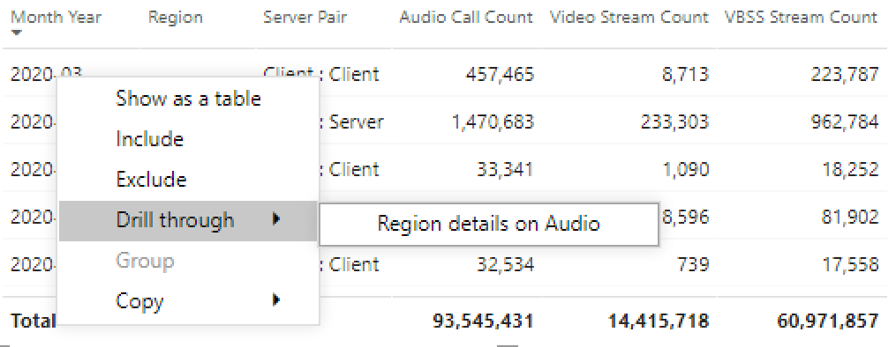

# Просмотр использования Microsoft Teams в Power BI с помощью данных CQD

В марте 2020 г. мы добавили отчет об использовании Teams в загружаемые шаблоны запросов Power BI для [CQD.](https://github.com/MicrosoftDocs/OfficeDocs-SkypeForBusiness/blob/live/Teams/downloads/CQD-Power-BI-query-templates.zip?raw=true) 

Эти новые отчеты по использованию Teams позволяют узнать, как (и в какой степени) пользователи используют Microsoft Teams, используя данные панели мониторинга качества звонка (CQD) Teams. Эти отчеты предназначены для централизованного использования этих данных и администраторами, и руководителями предприятий.

Отчет Power BI по использованию Teams состоит из двух основных отчетов: **["Сводка](#call-count-summary-report)** по подсчету вызовов" и **["Итоги](#audio-minutes-summary-report)** аудиосвязи в минутах". Отчеты ["Ежедневное](#daily-usage)использование",  "Региональные аудиоконференции", "Сведения о конференции" и "Список пользователей" вступает в силу, когда пользователь получает возможность воспользоваться подробными отчетами, которые описаны ниже.  

> [!NOTE]
> Для того чтобы обеспечить возможности фильтрации по регионам и сетям, данные о здании и подсети должны быть заполнены.

## Сводный отчет о подсчете вызовов

На главной странице ("Сводка по подсчету вызовов") сразу выведется количество сеансов общего доступа к звуку, видео и экрану за последние 30 и 90 дней, как отмечено в разделе. Изначально отображаемая информация отображается для всей организации и может быть отфильтрованной с помощью параметров перепада среза в левой части страницы.

1. Справа от срезов количество вызовов по типам мультимедиа разбито на внутреннее или внешнее представление за последние 30 дней. На снимке экрана выше по видно, что происходят дополнительные вызовы из-за пределов организации, что дает смысл рассмотреть текущую глобальную среду.
  

1. Справа от окна "Количество типов мультимедиа" есть ежемесячный подсчет вызовов по типу мультимедиа за последние 90 дней. На каждый столбец и тип мультимедиа можно навести курсор, чтобы отобразить количество за предыдущий или текущий месяц на текущую дату, предоставляя сведения о тенденциях использования.
  
 

1. Средний график работает так же, как и на 90-дневном графике, но предоставляет представление ежедневного использования за последние 30 дней и позволяет пользователю щелкнуть правой кнопкой мыши и деталить детали для определенного дня.
  

В нижнем левом разделе страницы вы найдете таблицу с итогами для каждого типа мультимедиа за последний год. 
        

В правой части таблицы показаны клиенты, которые чаще всего используют (вызовы и потоки) за последние 30 дней.
   

В последнем наборе диаграмм для этой страницы каждый тип мультимедиа отображается по отдельности с разбивкой по конференциям и использованию P2P. На диаграммах ниже видно, что использование конференц-залов значительно больше по сравнению с P2P.
  

## Сводный отчет о минутах аудиосвязи

В отчете об использовании минут аудиосвязи общая сумма минут представлена в нескольких различных представлениях. 

Рядом с срезами отображается 30-дневная сводка по использованию текстовых полей. На верхнем числе — итог за 30 дней с внутренней и внешней разбивкой.

Верхний правый график предоставляет ежегодное представление использования аудиоконференции. Наведите курсор на месяц, чтобы показать минуты аудиоконференции.

Чтобы показать разницу в звуке на P2P и конференции, на нижней левой диаграмме высвещается весь звук за последний год, который разбивается на два типа.

Последняя диаграмма на странице "Минуты звука" отображает использование минут звука на глобальной карте. Эта диаграмма будет работать только в том случае, если данные о здании и подсети загружены в клиент. Круговая диаграмма, наложение диаграммы на карте, может быть разуверчена, что впоследствии обеспечивает использование региональной аудиосвязи.

## Возможности drill-through

Как было отмечено ранее, пользователи могут использовать отчеты о ежедневном и региональном использовании.

### Ежедневное использование

Отчет о ежедневном использовании позволяет администратору определить пиковые периоды потребления в течение дня. Кроме использования, мы также можем фиксировать общее тональность пользователей и отзывы за этот день.

В отчете о ежедневном использовании отображается количество звуковых, видеофайлов и экранных ресурсов за выбранный день с добавленной возможностью отличить внутреннее и внешнее подключение. Разбивка между одноранговой конференцией и одноранговой разбивкой находится справа от итога модального числа. В правой верхней части отчета содержится список конференций, связанных с их ИД и участниками на день. Кроме того, в списке конференций есть дополнительные возможности для деталисции отчета о конференции. РИСУНОК "ЗАМЕНИТЬ"

Гограмма в центральной области позволяет пользователям определять пиковые периоды потребления в течение дня. Пользователи могут просуммировать данные в час, представленный на графике, чтобы представить отчет о списке пользователей за час.

Справа от гограммы отзывы пользователей представлены в визуальном формате. Хотя это может быть неохожим, оно дает представление, которое можно использовать для выявления потенциальных проблем.

В нижней таблице содержится диапазон метрик для дня. Неудовлетворительные процентные показатели и коэффициенты сбоев могут предоставить администратору возможности улучшения. Каждый час также можно выбрать по отдельности, как показано ниже.

Эти данные можно использовать для определения регионов, в которые возникают проблемы во время пикового потребление.

Щелкните столбец для этого дня, чтобы отобразить метрики для этого часа.

  
  1.  В таблице под диаграммой отобразятся показатели за этот час. Его можно отсортировать по любому заглавию столбца. однако мы хотели бы заинтересовались поиском проблемных областей.  
    
    
  2.  Мы видим, что в регионе IND в этот период времени наблюдается низкая производительность видео во время конференций. Затем можно использовать отчеты Корпорации Майкрософт для QER для CQD, чтобы сузить проблемное расположение по мере определения региона и замера времени.

### Сведения о конференции

Отчет "Сведения о конференции" содержит дополнительные сведения о собраниях (от списка участников) до типов мультимедиа, используемых в ходе сеанса.

Щелкните правой кнопкой мыши диаграмму участников в диаграмме "Код конференции" на странице ежедневного использования, чтобы получить подробные сведения о конференции.

  

Мы видим участников конференции, а также всю относящемся к ней информацию (в том числе потери пакетов и дрожание), что помогает устранить неполадки в нижней таблице.

### Сведения о региональных аудиофайлах

Подробные сведения о региональных аудиофайлах, в частности, показывают минуты звука для выбранного региона. Пользователи с доступом к CQD могут видеть тенденции использования как для P2P-, так и для аудиоконференции в выбранном регионе.

1.  На странице "Сводка по подсчету вызовов" прообщайте сведения о конкретном регионе таблицы.
  

2.  Вы выберите строку с областью, для которую необходимы дополнительные сведения.
  

3.  Тенденции изменения данных показывают значительное количество минут, используемых во внутренней сети, при этом использование 2P-2P-2010 значительно превышает число минут.
  

Региональные тенденции звука можно использовать для демонстрации влияния внешних факторов на пользователей в мире. В частности, в настоящее время мы ожидаем, что внешний уровень использования регионов EMEA и APAC увеличится, и люди будут работать удаленно.

### Список пользователей

Как и предполагалось, данные о пользователях за определенный час, выбранный пользователем для просмотра отчета, можно просмотреть в списке пользователей. Отчет "Список пользователей" доступен с помощью drill down (Почасовая диаграмма тенденций) в отчете "Ежедневное использование". Щелкните правой кнопкой мыши нужные дополнительные сведения о часах и выберите "Развернуть" и "Список пользователей", как показано ниже.

В отчете "Список пользователей" показаны внутренние и внешние подключения через кольцевую диаграмму в центре верхней части страницы. На приведенной ниже картинке видно, что за пределами корпоративной сети участие большое количество участников.

Справа вверху на графике показано количество звонков, сделанных каждым пользователем в течение часа.

В нижней таблице содержится подробная информация о сеансах, в которых участвовал каждый пользователь в течение этого часа. Столбец "Тип сбоя" удобен для определения причин, которые вызывались звоном. Столбцы "Захват" и "Отрисовка устройства" полезны для определения причин неудовлетворительнго качества звонка.

## Статьи по теме

[Измерения и меры на панели мониторинга качества звонков](dimensions-and-measures-available-in-call-quality-dashboard.md)

[Классификация потоков на панели мониторинга качества звонков](stream-classification-in-call-quality-dashboard.md)

[Настройка средства аналитики звонков в Skype для бизнеса](set-up-call-analytics.md)

[Использование аналитики звонков для устранения проблем с качеством звонка](use-call-analytics-to-troubleshoot-poor-call-quality.md)

[Аналитика звонков и панель мониторинга качества звонков](difference-between-call-analytics-and-call-quality-dashboard.md)

[Устранение неполадок Teams](https://docs.microsoft.com/MicrosoftTeams/troubleshoot/teams)
 