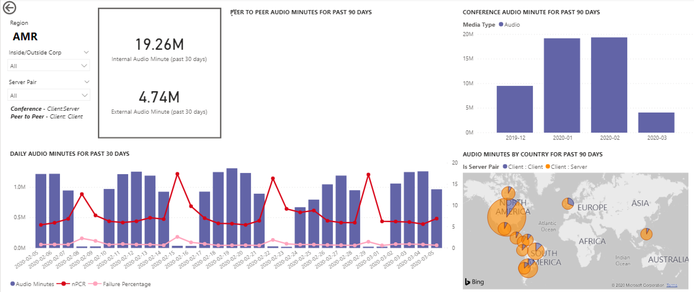

# Просмотр использования Microsoft Teams в Power BI с помощью данных CQD

Отчет об использовании Teams доступен как часть загружаемых шаблонов [запросов Power BI для CQD](https://www.microsoft.com/download/details.aspx?id=102291). 

Этот отчет позволяет узнать, как (и сколько) пользователи используют Microsoft Teams, используя данные панели мониторинга качества звонков (CQD) Teams. Эти отчеты предназначены для централизованного размещения, в которое администраторы и руководители компаний могут быстро перейти к этим данным. Обратите внимание, что мы [не рекомендуем полагаться на эти данные для конкретных номеров из-за](CQD-frequently-asked-questions.md#im-trying-to-use-cqd-for-usage-type-reports-and-find-that-some-of-the-data-is-incomplete----why-is-that) характера телеметрии качества звонков.

Отчет Power BI об использовании Teams состоит из двух основных отчетов **[: "](#call-count-summary-report)** Сводка по счетчику звонков" и " **[Сводка по звуковым минутам"](#audio-minutes-summary-report)**. [Отчеты о](#daily-usage) ежедневном [использовании,](#regional-audio-details) региональных аудиозаписях[,](#conference-details) сведениях о конференции и списке пользователей вступает в действие, когда пользователь использует детализированное описание, указанное в описании ниже.

> [!NOTE]
> Данные сборки и подсети должны быть заполнены, чтобы обеспечить возможности региональной и сетевой фильтрации.

## Сводный отчет по счетчику  вызовов

На главной странице (сводка по количеству вызовов) сразу же отображается количество сеансов общего доступа к звуку, видео и экрану за последние 30 и 90 дней, как указано в заголовке раздела. Изначально отображаемые данные отображаются для всей организации и могут быть отфильтрованы с помощью параметров раскрывающегося списка среза в левой части страницы.

1. Справа от раскрывающихся списков срезов количество вызовов по типу носителя разбивается на внутреннее или внешнее представление за последние 30 дней. На приведенном выше снимке экрана можно увидеть, что из-за пределов организации происходит больше вызовов, что имеет смысл учитывать текущую глобальную среду.
  

1. Справа от поля счетчика типов носителей имеется число ежемесячных  вызовов по типу мультимедиа за последние 90 дней. На каждый столбец и тип носителя можно навести указатель мыши, чтобы отобразить количество значений за предыдущий или текущий месяц с указанием сведений о тенденциях использования.
  
 

1. Средний граф работает так же, как и 90-дневный график, однако он предоставляет представление ежедневного использования за последние 30 дней и позволяет пользователю щелкнуть правой кнопкой мыши и детализировать сведения за определенный день.
  

В левом нижнем разделе страницы вы найдете таблицу, в которой указаны общие значения для каждого типа носителя за прошлый год. 
    
       

Справа от таблицы на линейчатой диаграмме отображаются клиенты с наиболее распространенным использованием (вызовы и потоки) за последние 30 дней.
   

В последнем наборе диаграмм на этой странице каждый тип носителя отображается по отдельности с разбивкой по использованию конференций и P2P. На приведенных ниже диаграммах показано, что использование конференций значительно выше по сравнению с P2P.
  

## Сводный отчет по минутам звука

В отчете об использовании минут звука общее использование минут предоставляется через несколько различных представлений. 

У нас есть сводка по использованию за 30 дней, показанная рядом с срезами, которая упрощает использование текстовых полей. В верхнем число показано итоговое значение за 30 дней с внутренними и внешними разбивками ниже.

Верхний правый линейчатый график предоставляет представление использования аудиоконференции в течение года. Наведите указатель мыши на месяц, чтобы отобразить минуты аудиоконференции.

Чтобы отобразить разницу в звуке P2P и аудиоконференции, на нижней левой диаграмме отображается весь звук за прошлый год и он разбивает его между двумя типами.

На последней диаграмме на странице "Минуты звука" показано использование минут звука на глобальном наложение карты. Эта диаграмма будет работать только в том случае, если сборка и данные подсети передаются в клиент. Наложение круговой диаграммы на карте можно детализировать, что впоследствии обеспечивает региональное использование звука.

## Возможности детализации

Как отмечалось ранее, пользователи могут детализировать отчеты о ежедневном и региональном использовании.

### Ежедневное использование

Отчет о ежедневном использовании позволяет администратору определять пиковые периоды потребления в течение дня. Помимо использования, мы также можем записать общую тональность пользователей и отзывы за этот день.

В отчете о ежедневном использовании отображается количество общих папок "Звук", "Видео" и "Экран" за выбранный день с добавленной возможностью различать внутреннее и внешнее подключение. Разбивка между конференцией и одноранговыми узлами находится справа от поля итога модального распределения. В правом верхнем углу отчета представлен список конференций с соответствующим идентификатором и участниками за день. Список конференций также содержит дополнительные сведения о отчете "Сведения о конференции". ЗАМЕНИТЬ РИСУНОК

Гистограмма в центральной области позволяет пользователю определять пиковые периоды потребления в течение дня. Пользователи могут детализировать час, представленный на графе, который будет представлять отчет списка пользователей за час.

Справа от линейчатого графа отзывы пользователей представлены в визуальном формате. Хотя тональность пользователей может быть нестрогой, она предоставляет аналитические сведения, которые можно использовать для выявления потенциальных проблем.

В нижней таблице представлен диапазон метрик за день. Низкая процентная доля, а также частота сбоев могут предоставить администратору потенциальные области улучшения. Каждый час также можно выбрать по отдельности, как показано ниже.

Эти данные можно использовать для определения регионов, в которых возникают проблемы во время пикового потребления.

Щелкните столбец для этого дня, чтобы отобразить метрики за этот час.

  
  1.  В таблице под диаграммой будут отображены метрики за этот час. Это можно отсортировать по любому заголовку столбца. однако мы будем заинтересованы в поиске проблемных областей.  
    
    
  2.  Мы видим, что в регионе IND наблюдается низкая производительность видео в конференциях в течение этого интервала времени. Впоследствии отчеты CQD QER майкрософт можно использовать для сужения проблемного расположения по мере определения региона и интервала времени.

### Сведения о конференции

В отчете "Сведения о конференции" содержатся дополнительные сведения о собраниях ( от списка участников до типов носителей, используемых во время сеанса).

Щелкните правой кнопкой мыши панель участников на диаграмме идентификаторов конференции на странице ежедневного использования, чтобы детализировать сведения о конференции.

  

Мы видим участников конференции, а также всю соответствующую информацию до потери пакетов и дрожания, чтобы помочь в устранении неполадок в нижней таблице.

### Региональные сведения о звуке

Детализация сведений о региональных аудиоданных специально показывает использование минут звука для выбранного региона. Пользователи с доступом к CQD могут видеть тенденции использования как для P2P, так и для аудиоконференции в выбранном регионе.

1.  На странице "Сводка по счетчику вызовов" выполните детализацию по определенному региону в таблице.
  

2.  Выберите строку с дополнительными сведениями о регионе.
  

3.  Тенденции данных показывают, что во внутренней сети используется значительное количество минут, а конференц-связь значительно превышает использование P2P.
  

Региональный тренд звука можно использовать для демонстрации того, как на пользователей влияют внешние факторы в мире. В частности, сейчас мы ожидаем, что внешнее использование регионов EMEA и APAC увеличится, так как пользователям будет предложено работать удаленно.

### Список пользователей

Детализация списка пользователей предоставляет, как можно ожидать, сведения о пользователе за определенный час, выбранный пользователем, просматривая отчет. Отчет "Список пользователей" доступен с помощью детализации на графике "Почасовые тенденции" в отчете о ежедневном использовании. Щелкните правой кнопкой мыши час, чтобы получить дополнительные сведения, и выберите "Детализация" и "Список пользователей", как показано ниже.

В отчете по списку пользователей отображаются внутренние и внешние подключения через кольцевую диаграмму в верхнем центре страницы. На приведенном ниже рисунке мы видим, что за пределами корпоративной сети имеется большое количество участников.

В правом верхнем углу диаграммы показано количество вызовов, выполненных каждым пользователем в течение этого часа.

В нижней таблице приведены подробные сведения о сеансах, в которых участвовал каждый пользователь в течение этого часа. Столбец "Тип сбоя" полезен для определения причины удаления вызова. Столбцы устройства захвата и отрисовки полезны для определения причин, по которым вызов был передан с низким качеством.

## Статьи по теме

[Измерения и меры на панели мониторинга качества звонков](dimensions-and-measures-available-in-call-quality-dashboard.md)

[Классификация потоков на панели мониторинга качества звонков](stream-classification-in-call-quality-dashboard.md)

[Настройка средства аналитики звонков в Skype для бизнеса](set-up-call-analytics.md)

[Использование аналитики звонков для устранения проблем с качеством звонка](use-call-analytics-to-troubleshoot-poor-call-quality.md)

[Аналитика звонков и панель мониторинга качества звонков](./monitor-call-quality-qos.md)

[Устранение неполадок Teams](/MicrosoftTeams/troubleshoot/teams)
