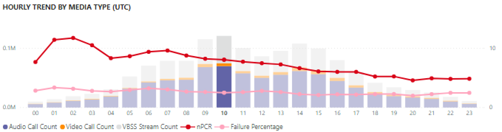
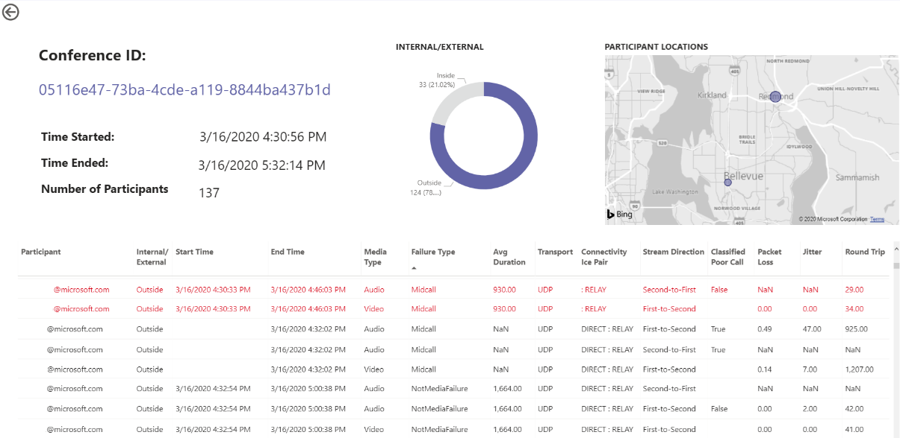

# Просмотр Microsoft Teams использования в Power BI данных CQD

В марте 2020 г. мы добавили отчет об использовании Teams в шаблоны запросов Power BI [CQD.](https://github.com/MicrosoftDocs/OfficeDocs-SkypeForBusiness/blob/live/Teams/downloads/CQD-Power-BI-query-templates.zip?raw=true) 

Новые отчеты Teams использования позволяют узнать, как (и в какой степени) пользователи используют Microsoft Teams, используя данные панели мониторинга качества Teams (CQD). Эти отчеты предназначены для централизованного использования этих данных как администраторами, так и руководителями предприятий.

Отчет Teams использование Power BI состоит из двух основных отчетов: **** "Сводка по подсчету вызовов" и "Сводка по звуку в **[минутах".](#audio-minutes-summary-report)** Отчеты [Ежедневное](#daily-usage) [использование,](#regional-audio-details)Сведения  о региональных аудиофайлах, Сведения о конференции и Список пользователей вступает в силу, когда пользователь получает возможность воспользоваться отчетами для детали, которые описаны в описании ниже. 

> [!NOTE]
> Чтобы обеспечить возможности фильтрации по регионам и сетям, необходимо заполнить данные здания и подсети.

## Сводный отчет по подсчету вызовов

На главной странице (Сводка по подсчету вызовов) сразу же выведется количество сеансов общего доступа к аудио- и видеофайлам и экрану за последние 30 и 90 дней, как отмечено в разделе. Изначально отображаемая информация используется для всей организации и может быть отфильтрованной с помощью параметров среза в левой части страницы.

1. Справа от срезов количество звонков по типам мультимедиа разбито на внутреннее или внешнее представление за последние 30 дней. На снимке экрана выше видно, что в организации происходит больше звонков из-за пределов организации, что имеет смысл с учетом текущей глобальной среды.
  

1. Справа от окна количество типов мультимедиа за последние 90 дней отсчитываются по типу мультимедиа Monthly Call Count by Media Type. На каждый столбец и тип мультимедиа можно навести курсор, чтобы отобразить количество за предыдущий или текущий месяц с информацией о тенденциях использования.
  
 

1. Средний график работает так же, как и 90-дневная диаграмма, но предоставляет представление ежедневного использования за последние 30 дней и позволяет пользователю щелкнуть правой кнопкой мыши и деталить детали для определенного дня.
  

В левом нижнем разделе страницы вы найдете таблицу с итогами для каждого типа мультимедиа за последний год. 
        

Справа от таблицы на линих диаграмме показаны клиенты с наиболее часто используемой (звонками и потоками) за последние 30 дней.
   

В последнем наборе диаграмм для этой страницы каждый тип мультимедиа отображается по отдельности с разбивкой по конференциям и использованию P2P. На диаграммах ниже по сравнению с P2P-данными было значительно больше конференций.
  

## Сводный отчет о минутах аудиосвязи

В отчете Использование минут аудиосвязи общая поминутная использование представлена в нескольких различных представлениях. 

Рядом с срезами показана 30-дневная сводка по использованию текстовых полей. Верхнее число — это итоговая 30-дневная с внутренними и внешними разбивками.

На правом верхнем графике можно просмотреть аудиоконференции на год. Наведите курсор на месяц, чтобы показать минуты аудиоконференции.

Чтобы показать разницу в P2P и аудиоконференции, на нижней левой диаграмме берется весь звук за последний год и он разбивается между двумя типами.

На последней диаграмме страницы Минуты звука показано использование минут на глобальной карте. Эта диаграмма будет работать только при отправке данных о здании и подсети в клиент. Круговую диаграмму на карте можно обрезать, что впоследствии обеспечивает использование регионального звука.

## Возможности drill-through

Как уже было отмечено, пользователи могут использовать отчеты о ежедневном и региональном использовании.

### Ежедневное использование

Отчет о ежедневном использовании позволяет администратору определять пиковые периоды потребления в течение суток. В дополнение к использованию, мы также можем получить общее мнение пользователей и отзывы за этот день.

В отчете Ежедневное использование отображается количество звуковых, видео- и экранных ресурсов для выбранного дня с добавленной возможностью различать внутреннее и внешнее подключение. Разбивка по конференциям и одноранговой разбивке находится справа от итога модали. В правой верхней части отчета справа от нее содержится список конференций с их связанными ИД и участниками на день. Список конференций также содержит дополнительные сведения о конференции. РИСУНОК "ЗАМЕНИТЬ"

График в центральной области позволяет пользователю определять пиковые периоды потребления в течение дня. Пользователи могут просуммировать час, представленный на графике, в котором будет представлен отчет о списке пользователей за час.

Справа от гограммы представлены отзывы пользователей в визуальном формате. Хотя такие идеи могут быть неохожна, они предоставляют информацию, которая может использоваться для выявления потенциальных проблем.

В нижней таблице содержится диапазон метрик на день. Неудовлетворительные процентные показатели и коэффициенты сбоев могут помочь администратору в улучшении. Каждый час также можно выбрать по отдельности, как показано ниже.

Эти данные можно использовать для определения регионов, в которые возникают проблемы во время пикового потребления.

Щелкните столбец для этого дня, чтобы отобразить показатели за этот час.

  
  1.  В таблице под диаграммой будут показаны показатели за этот час. Его можно отсортировать по любому заглавию столбца. однако мы хотели бы найти проблемные области.  
    
    
  2.  Мы видим, что в регионе IND наблюдается низкая производительность видео в конференциях в течение этого времени. Впоследствии отчеты Корпорации Майкрософт QQD QER можно использовать для сужение проблемного расположения по мере определения региона и замера времени.

### Сведения о конференции

Отчет "Сведения о конференции" содержит дополнительные сведения о собраниях ( от списка участников до типов мультимедиа, используемых во время сеанса).

Щелкните правой кнопкой мыши конференцию в диаграмме "Код конференции" на странице Ежедневное использование, чтобы деталижать сведения о конференции.

  

Мы можем видеть участников конференции, а также всю относяжнюю информацию в зависимости от потери пакетов и дрожания, чтобы помочь в устранении неполадок в нижней таблице.

### Сведения о региональных аудиофайлах

Подробные сведения о региональных аудиозаписях специально показывают использование минут на звук для выбранного региона. Пользователи с доступом к CQD могут видеть тенденции использования P2P-и аудиоконференции в выбранном регионе.

1.  На странице Сводка по подсчету вызовов пролили в таблицу как определенный регион.
  

2.  Вы можете выбрать строку с областью, для которую необходимы дополнительные сведения.
  

3.  Тенденции изменения данных показывают значительное количество минут, используемых во внутренней сети, при этом использование P2P-2P значительно ухудшено.
  

Региональные тенденции аудиосвязи можно использовать для демонстрации влияния внешних факторов на пользователей в мире. В частности, в настоящее время мы ожидаем, что внешний уровень использования регионов EMEA и APAC увеличится, и людям будет предложено работать удаленно.

### Список пользователей

В списке пользователей можно просмотреть сведения о пользователях за определенный час, выбранные пользователем, просматривая отчет. Отчет Список пользователей доступен с помощью drill down в графике Почасовые тенденции в отчете Ежедневное использование. Щелкните правой кнопкой мыши час, когда потребуется дополнительная информация, и выберите развернуть и список пользователей, как показано ниже.

В отчете Список пользователей показаны внутренние и внешние подключения через кольцевую диаграмму в верхней центральной части страницы. На приведенной ниже картинке видно, что за пределами корпоративной сети большое количество участников.

В правом верхнем верхнем конце графика показано количество звонков, сделанных каждым пользователем в течение часа.

В нижней таблице содержится подробная информация о сеансах, в которых участвовал каждый пользователь в течение этого часа. Столбец Тип сбоя удобен для определения причин перепада звонка. Столбцы "Захват" и "Отрисовка устройства" удобна для определения причин неудовлетворительнго качества звонка.

## Статьи по теме

[Измерения и меры на панели мониторинга качества звонков](dimensions-and-measures-available-in-call-quality-dashboard.md)

[Классификация потоков на панели мониторинга качества звонков](stream-classification-in-call-quality-dashboard.md)

[Настройка средства аналитики звонков в Skype для бизнеса](set-up-call-analytics.md)

[Использование аналитики звонков для устранения проблем с качеством звонка](use-call-analytics-to-troubleshoot-poor-call-quality.md)

[Аналитика звонков и панель мониторинга качества звонков](./monitor-call-quality-qos.md)

[Устранение неполадок Teams](/MicrosoftTeams/troubleshoot/teams)
