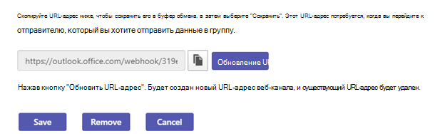
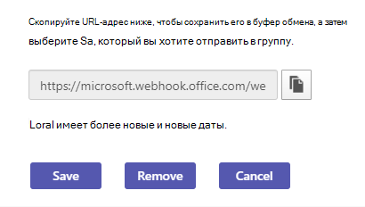

# Используйте Microsoft 365 и пользовательские соединители в Microsoft Teams

Чтобы ваша команда постоянно обновлялась, соединители доставляют часто используемое содержимое и обновления служб непосредственно в Teams канале. Благодаря соединительным Teams пользователи могут получать обновления из популярных служб, таких как Trello, Wunderlist, GitHub и Azure DevOps Services. Обновления будут опубликованы непосредственно в потоке чата в их группе.

Microsoft 365 используются как с группами Microsoft Teams, так и Microsoft 365, что упрощает синхронизацию и быстрое получение важной информации для всех участников. Microsoft Teams и Exchange используют одинаковую модель соединителей, что позволяет использовать одни соединители на обеих платформах. Однако следует отметить, что отключение соединители для группы Microsoft 365, от которую зависит рабочая группа, также отключает возможность создавать соединители для этой группы.

Любой участник группы может подключить свою команду к популярным облачным службам с помощью соединитеров, если это разрешает группа, и все участники группы будут уведомлены о действиях в этой службе. Соединитетели продолжают работать после того, как слева от нее покинул участник, настроивший соединителю. Любой участник группы с разрешениями на добавление или удаление может изменять соединители, застроив их другими участниками.

> [!NOTE]
> Соединитетели по умолчанию отключены в средах Community (GCC) для государственных GCC. Чтобы включить эти параметры, установите `ConnectorsEnabled` для параметра `ConnectorsEnabledForTeams` (или) `$true` параметры с помощью cmdlet `SetOrganizationConfig` . Подключение к Exchange Online [PowerShell](/powershell/exchange/connect-to-exchange-online-powershell?view=exchange-ps).

## Добавление соединителю в канал

В настоящее время вы можете добавлять соединители с помощью Microsoft Teams и веб-клиентов. Однако информацию, опубликованную этими соединителами, можно просматривать во всех **клиентах** , включая мобильные устройства.

1. Чтобы добавить соединитель в канал, щелкните многострок **(...),** справа от имени канала и выберите **соединители**.

    > [!div class="mx-imgBorder"]
    > 

2. Вы можете выбрать один из множества доступных соединитетелей и нажать кнопку **Добавить**.

    > [!div class="mx-imgBorder"]
    > 

3. Укажите требуемые данные о соединителе и нажмите кнопку **Сохранить**. Для правильной работы соединителям требуется самая разнообразная информация, а некоторым — еще и вход пользователя в службу по ссылкам на странице конфигурации соединителя.

    > [!div class="mx-imgBorder"]
    > 

4. Предоставляемые соединителем данные автоматически публикуются в канале.

    > [!div class="mx-imgBorder"]
    > 

<!---Delete this section after customer migration to new Webhook URL is complete --->

> [!IMPORTANT]
> **Уведомление об обновлении URL-адреса соединителя**
>
> Соедините Teams переходят на новый URL-адрес для повышения безопасности. В ходе этого перехода вы будете получать определенные уведомления об обновлении настроенного соединитела для использования нового URL-адреса. Настоятельно рекомендуется немедленно обновить соединители, чтобы избежать перебоев в работе соединитеных служб. Чтобы обновить URL-адрес, необходимо сделать следующее:
>
> 1. На странице конфигурации соединитетелей под кнопкой "Управление" отобразилось сообщение "Требуется внимание" для подключений, которые необходимо обновить.
> 
> 2. Для соединителя входящих веб-страниц пользователи могут воссоздать подключение, просто выбрав Обновить **URL-адрес** и используя только что созданный URL-адрес веб-канала.
> 
> 3. Для других типов соединитегорий пользователю потребуется удалить соединитегорию и воссоздать конфигурацию.
> 4. После успешного обновления URL-адреса вы увидите сообщение "URL-адрес обновлен".
> 

## См. также

* [Создание настраиваемой соединители и веб-страниц](/microsoftteams/platform/webhooks-and-connectors/what-are-webhooks-and-connectors)
