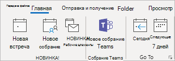
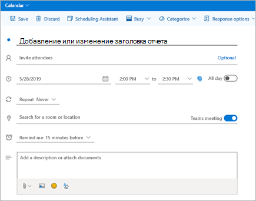
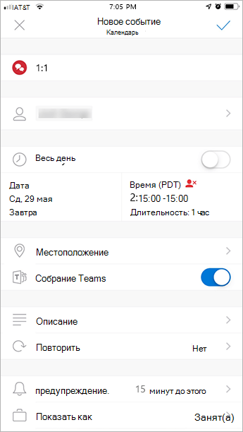

# Использование надстройки "Собрание Teams" в Outlook

В этой статье подробно описаны требования к проверке подлинности и функциональные возможности надстройки Teams Meeting в Outlook для конечных пользователей. Здесь также показано, как включить частные собрания и настроить параметры политики для пользователей в режиме острова. Если у вас возникли проблемы с надстройки, ознакомьтесь с нашим [последним руководством по устранению неполадок](/MicrosoftTeams/troubleshoot/meetings/resolve-teams-meeting-add-in-issues).

С помощью надстройки "Собрание Teams" пользователи могут планировать собрания команд из Outlook. Эта надстройка доступна в Outlook для Windows, Mac, в Интернете и на мобильных устройствах.

## Надстройка "Собрание Teams" в Outlook для Windows

Надстройка "Собрание Teams" автоматически устанавливается для пользователей Windows, на компьютерах которых есть Microsoft Teams и Office 2013, Office 2016, Office 2019 или Office 2021. Надстройка "Собрание Teams" отображается для пользователей на ленте календаря Outlook.

> [!NOTE]
>
>
> - **Нет прямого URL-адреса**, ссылающегося на надстройку Teams.
> - Необходимо учитывать и другие факторы, если ваша организация использует Teams и Skype для бизнеса. В некоторых случаях надстройка Teams будет недоступна в Outlook. Дополнительные сведения см. в статье [Переход со Skype для бизнеса на Teams](upgrade-to-Teams-on-prem-tools.md).
> - Разрешение пользователя на выполнение файла Regsvr32.exe является минимальным требованием для установки надстройки Совещания групп на компьютере.
> - Если надстройка "Собрание Teams" не отображается, попросите пользователей закрыть Outlook и Microsoft Teams, затем перезапустить клиент Microsoft Teams, войти в него и перезапустить клиент Outlook (именно в таком порядке).
> - Если вы используете установку Office Outlook из Microsoft Store, надстройка Совещания команд не поддерживается. Пользователям, которым требуется эта надстройка, рекомендуется установить версию Office "нажми и работай", как описано в статье [Office для Windows 10 в режиме S](https://support.office.com/article/faq-office-on-windows-10-in-s-mode-717193b5-ff9f-4388-84c0-277ddf07fe3f).
> - Установка [Webview2](/microsoft-edge/webview2/concepts/distribution) и .Net 4.8 необходима, чтобы избежать снижения производительности надстройки Teams Meeting.

## Надстройка "Собрание Teams" в Outlook для Mac

Кнопка "Собрание Teams" в Outlook для Mac отображается на ленте Outlook для Mac, если Outlook работает с производственной сборкой 16.24.414.0 и более поздних версий и активируется с помощью клиентской подписки Microsoft 365 или Office 365.

Координаты собрания (ссылка на присоединение к Teams и номера для телефонного подключения) будут добавлены в приглашение на собрание после нажатия кнопки **Отправить**.  

## Надстройка "Собрание Teams" в Outlook Web App

Кнопка собраний Teams в Outlook Web App будет отображаться в процессе создания события, если пользователь работает в более ранней версии Outlook в Интернете. Сведения об использовании более ранних версий Outlook в Интернете см. в [блоге, посвященном Outlook](https://techcommunity.microsoft.com/t5/Outlook-Blog/Designed-to-be-fast-The-Outlook-on-the-web-user-experience-gets/ba-p/234909?utm_source=t.co&utm_medium=referral).

Координаты собрания (ссылка на присоединение к Teams и номера для телефонного подключения) будут добавлены в приглашение на собрание после нажатия кнопки **Отправить**.  

## Надстройка "Собрание Teams" в Outlook Mobile (iOS и Android)

Кнопка "Собрание Teams" отображается в последних сборках приложений Outlook для iOS и Android.

Координаты собрания (ссылка на присоединение к Teams и номера для телефонного подключения) будут добавлены в приглашение на собрание после нажатия кнопки **Отправить**.  

## Надстройка "Собрание Teams" и надстройка "Поиск времени" для Outlook

Поиск времени — надстройка для Outlook, помогающая пользователям из разных организаций договориться о времени собрания. После того как участники собрания укажут предпочитаемое время, надстройка "Поиск времени" отправляет приглашение на собрание от имени пользователя. Если в надстройке "Поиск времени" выбран параметр **Собрания по сети**, будет запланировано собрание Skype для бизнеса или Microsoft Teams. (Надстройка "Поиск времени" будет использовать вариант, установленный в вашей организации по умолчанию в качестве канала собрания по сети.)

> [!NOTE]  
> Если в [панели мониторинга надстройки "Поиск времени"](https://findtime.microsoft.com/UserDashboard) сохранен параметр Skype для бизнеса, он будет использоваться вместо Microsoft Teams. Если вы хотите использовать Microsoft Teams, удалите параметр Skype для бизнеса в панели мониторинга.

Дополнительные сведения см. в статье [Планирование собраний с помощью настройки "Поиск времени"](https://support.office.com/article/scheduling-meetings-with-findtime-4dc806ed-fde3-4ea7-8c5e-b5d1fddab4a6).

## Требования к проверке подлинности

Чтобы использовать надстройку "Собрание Teams", пользователи должны войти в Microsoft Teams с помощью современной проверки подлинности. Если не использовать этот метод проверки подлинности для входа, работа с клиентом Teams будет возможна, но нельзя будет планировать [собрания Teams по сети](https://www.microsoft.com/microsoft-teams/online-meetings) с помощью надстройки Outlook. Решить эту проблему можно одним из следующих способов:

- Если для вашей организации не настроена современная проверка подлинности, настройте ее.
- Если современная проверка подлинности настроена, но отключена в диалоговом окне, попросите пользователей повторить вход с помощью многофакторной проверки подлинности.

Дополнительные сведения о настройке проверки подлинности: [Модели удостоверений и проверка подлинности в Microsoft Teams](identify-models-authentication.md).

## Активация частных собраний

Для развертывания надстройки требуется включить параметр **Разрешить планирование частных собраний** в Центре администрирования Microsoft Teams. В Центре администрирования выберите **Собрания** > **Политики собраний** и в разделе **Общие** установите переключатель **Разрешить планирование частных собраний** в положение Вкл.)

Клиент Microsoft Teams устанавливает нужную надстройку, определяя, требуется ли пользователям 32- или 64-разрядная версия.

> [!NOTE]
> Для получения новейшей версии надстройки пользователям может потребоваться перезапустить Outlook после установки или обновления Microsoft Teams.

## Политика обновления Teams и надстройка "Собрание Teams" для Outlook

Пользователи могут [выбрать свой способ перехода со Skype для бизнеса на Teams](upgrade-and-coexistence-of-skypeforbusiness-and-teams.md). Администраторы клиента могут использовать режим сосуществования Teams, чтобы определить этот переход для своих пользователей. Администраторы клиента могут разрешить пользователям использовать Teams вместе со Skype для бизнеса (режим островов).

Если пользователи в режиме островов планируют собрание в Outlook, обычно предполагается выбор между планированием собрания Skype для бизнеса и Teams. В Outlook в Интернете, Outlook для Windows и Outlook для Mac пользователи в режиме островов по умолчанию видят как надстройку Skype для бизнеса, так и надстройку Teams. Вы можете настроить параметр политики собраний Teams, чтобы указать, могут ли пользователи в режиме островов использовать только надстройку "Собрание Teams" или обе надстройки "Собрание Teams" и "Собрание Skype для бизнеса".

Из-за определенных ограничений в первоначальном выпуске Outlook Mobile поддерживает создание только собраний Skype для бизнеса **или** Teams. Подробные сведения приведены в следующей таблице.

| Режим сосуществования в Центре администрирования Teams | Поставщик службы собраний по умолчанию в Outlook Mobile |
| --------------------------------------|---------------------------------------------|
| Острова | Skype для бизнеса |
| Только Skype для бизнеса | Skype для бизнеса |
| Совместная работа между пользователями Teams и Skype для бизнеса | Skype для бизнеса |
| Skype для бизнеса с совместной работой и собраниями в Teams | Teams |
| Только Teams | Teams |

### Укажите, могут ли пользователи в режиме островов использовать только надстройку "Собрание Teams" или обе надстройки "Собрание Teams" и "Собрание Skype для бизнеса".

Как администратор вы можете настроить параметры политики собраний Teams, чтобы управлять тем, какие надстройки собраний в Outlook используется для *пользователей, которые находятся в режиме островов*. Укажите, могут ли пользователи в режиме островов использовать только надстройку "Собрание Teams" или обе надстройки "Собрание Teams" и "Собрание Skype для бизнеса" для планирования собраний в Outlook.

Эту политику можно применять только к пользователям, которые находятся в режиме островов и установили для параметра **AllowOutlookAddIn** значение **True** в политике собраний Teams. Действия по настройке этой политики см. в статье [Параметры политики собраний — общие](meeting-policies-in-teams-general.md#meeting-provider-for-islands-mode).

## Другие особенности

Разработка функционала надстройки "Собрание Teams" продолжается, так что помните о следующем:

- Надстройка собрания Teams требует почтовый ящик Exchange для основного пользователя, планирующего собрание. Убедитесь в том, что у вас есть по крайней мере один почтовый ящик Exchange, настроенный в профиле Outlook, и используйте его для планирования собрания Teams с помощью надстройки. Требования для использования Exchange см. в статье [Взаимодействие Exchange и Teams](./exchange-teams-interact.md).
- Надстройка предназначена для запланированных собраний с конкретными участниками, а не для собраний в канале. Собрания в канале нужно планировать в Microsoft Teams.
- Эта надстройка не будет работать, если прокси-сервер проверки подлинности находится в сетевом пути компьютера пользователя и служб Teams.
- Пользователь не может планировать трансляции из Outlook. Чтобы запланировать трансляции, перейдите в Teams. Дополнительные сведения см. в статье [Что такое трансляции Microsoft Teams?](teams-live-events/what-are-teams-live-events.md)

Дополнительные сведения о [собраниях и звонках в Microsoft Teams](https://support.office.com/article/Meetings-and-calls-d92432d5-dd0f-4d17-8f69-06096b6b48a8).

## Статьи по теме

- [Устранение неполадок Teams](/MicrosoftTeams/troubleshoot/teams)

- [Планирование собраний Teams из Outlook](https://support.microsoft.com/office/schedule-a-teams-meeting-from-outlook-883cc15c-580f-441a-92ea-0992c00a9b0f)
