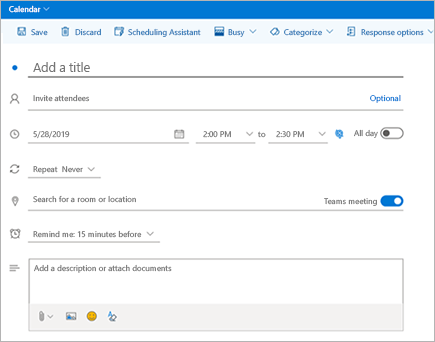

Использование надстройки "Собрание Teams" в Outlook
=======================================

С помощью надстройки "собрание Teams" пользователи могут планировать собрания Teams из Outlook. Надстройка доступна для Outlook в Windows, Mac, Интернете и на мобильных устройствах.

## Надстройка для собраний Teams в Outlook для Windows

Надстройка для собраний Teams автоматически устанавливается для пользователей, у которых установлен Microsoft Teams и Office 2010, Office 2013 или Office 2016 на компьютере с Windows. Надстройка "Собрание Teams" отображается в ленте "Календарь Outlook".

> [!NOTE]
> - Для выполнения программы regsvr32. exe на компьютере должны быть установлены разрешения пользователей на выполнение файла, предназначенного для проведения собраний Teams.
> - Если надстройка "Собрание Teams" не отображается, попросите пользователей закрыть Outlook и Microsoft Teams, затем перезапустить клиент Microsoft Teams, войти в него и перезапустить клиент Outlook (именно в таком порядке).
> - Если вы используете установку Office Outlook из Microsoft Store, надстройка для собраний Teams не поддерживается. Пользователям, которым требуется эта надстройка, рекомендуется установить версию Office "нажми и работай", как описано в разделе " [Office для Windows 10" в режиме S](https://support.office.com/article/faq-office-on-windows-10-in-s-mode-717193b5-ff9f-4388-84c0-277ddf07fe3f) .

## Надстройка для собраний Teams в Outlook для Mac

Кнопка "собрание Teams" в Outlook для Mac появится на ленте Outlook для Mac, если в Outlook используется сборка 16.24.414.0 и более поздней версии, а затем она активируется с помощью клиентской подписки на Office 365.

Координаты собрания (ссылки для присоединения к ним и номера коммутируемого подключения) будут добавлены в приглашение на собрание после того, как пользователь нажмет кнопку " **Отправить**".  

## Надстройка для собраний Teams в Outlook Web App

Кнопка "собрания Teams" в Outlook Web App будет отображаться в рамках создания нового события, если пользователь использует более раннюю версию новой версии Outlook в Интернете. Сведения о том, как пользователи могут попробовать более раннюю версию Outlook в Интернете, можно найти в [блоге Outlook](https://techcommunity.microsoft.com/t5/Outlook-Blog/Designed-to-be-fast-The-Outlook-on-the-web-user-experience-gets/ba-p/234909?utm_source=t.co&utm_medium=referral) .

Координаты собрания (ссылки для присоединения к ним и номера коммутируемого подключения) будут добавлены в приглашение на собрание после того, как пользователь нажмет кнопку " **Отправить**".  

## Надстройка для собраний Teams в Outlook Mobile (iOS и Android)

Кнопка собрания Teams отображается в последних сборках приложения Outlook для iOS и Android.

Координаты собрания (ссылки для присоединения к ним и номера коммутируемого подключения) будут добавлены в приглашение на собрание после того, как пользователь нажмет кнопку " **Отправить**".  

## Надстройка для собраний Teams в и Финдтиме для Outlook
Финдтиме — это надстройка для Outlook, которая помогает пользователям достичь вашего согласия на время проведения собрания в разных компаниях. После того как приглашение на собрание предоставило свое предпочтительное время, Финдтиме отправляет приглашение на собрание от имени пользователя. Если в Финдтиме выбран параметр **собрание по сети** , финдтиме запланирует собрание Skype для бизнеса или Microsoft Teams. (Финдтиме будет использовать какой-либо элемент, установленный в вашей организации в качестве канала собрания по сети по умолчанию.)

> [!NOTE]  
> Если вы сохранили параметр Skype для бизнеса на [панели мониторинга финдтиме](https://findtime.microsoft.com/UserDashboard), он будет использоваться Финдтиме вместо Microsoft Teams. Если вы хотите использовать Microsoft Teams, удалите параметр Skype для бизнеса на панели мониторинга.

Более подробную информацию смотрите [в разделе Планирование собраний с помощью финдтиме](https://support.office.com/article/scheduling-meetings-with-findtime-4dc806ed-fde3-4ea7-8c5e-b5d1fddab4a6) .

## Требования к проверке подлинности

Чтобы использовать надстройку "Собрание Teams", пользователи должны войти в Microsoft Teams с помощью современной проверки подлинности. Если не использовать этот метод проверки подлинности для входа, работа с клиентом Microsoft Teams будет возможна, но нельзя будет планировать собрания Microsoft Teams по сети с помощью настройки Outlook. Решить эту проблему можно одним из следующих способов:

- Если для вашей организации не настроена современная проверка подлинности, настройте ее.
- Если используется современная проверка подлинности, но они были отменены в диалоговом окне, вы должны попросить пользователей повторно войти в систему с помощью многофакторной проверки подлинности.

Дополнительные сведения о настройке проверки подлинности: [Модели удостоверений и проверка подлинности в Microsoft Teams](identify-models-authentication.md).

## Активация частных собраний

Вы **можете включить планирование для частных собраний** в центре администрирования Microsoft Teams для развертывания надстройки. В центре администрирования **перейдите в** > раздел**политики собраний**по собраниям, а затем в разделе **Общие** нажмите переключатель **Разрешить планирование личных собраний** .

Клиент Microsoft Teams устанавливает нужную надстройку, определяя, требуется ли пользователям 32- или 64-разрядная версия.

> [!NOTE]
> Для получения новейшей версии надстройки пользователям может потребоваться перезапустить Outlook после установки или обновления Microsoft Teams.

## Политика обновления Teams и надстройка "собрание Teams для Outlook"

Пользователи могут [выбрать свое путешествие по обновлению в Skype для бизнеса в Teams](upgrade-and-coexistence-of-skypeforbusiness-and-teams.md). Администраторы клиентов могут использовать режим совместного существования Teams, чтобы определить этот путешествие для своих пользователей. Администраторы клиентов имеют возможность разрешить пользователям использовать группы в Skype для бизнеса (режим "острова"). 

Если пользователи, которые находятся в режиме "Остров задач", запланируи собрание в Outlook, обычно они могут выбрать, нужно ли планировать собрания в Skype для бизнеса или Teams. В Outlook в Интернете, в Windows и Outlook Mac пользователи видят надстройки Skype для бизнеса и Teams в режиме острова. Благодаря определенным ограничениям в исходном выпуске Outlook Mobile поддерживает только создание собраний Skype для бизнеса **и** рабочих групп. Дополнительные сведения приведены в таблице ниже.

| Режим сосуществования в центре администрирования Teams | Поставщик собраний по умолчанию в Outlook Mobile |
| --------------------------------------|---------------------------------------------|
| Блоки | Skype для бизнеса |
| Только Skype для бизнеса | Skype для бизнеса |
| Skype для бизнеса с совместная работа в Teams | Skype для бизнеса |
| Skype для бизнеса с совместной работой и собраниями в Teams | Teams |
| Только Teams | Teams |

## Другие особенности

Разработка функционала надстройки "Собрание Teams" продолжается, так что помните о следующем:

- Надстройка предназначена для запланированных собраний с конкретными участниками, а не для собраний в канале. Собрания в канале нужно планировать в Microsoft Teams.
- Надстройка не будет работать, если прокси-сервер проверки подлинности находится по сетевому пути пользовательского ПК и служб Microsoft Teams.
- Пользователи не могут планировать события в реальном времени в Outlook. Для планирования событий в реальном времени перейдите в Teams. Дополнительные сведения можно найти в разделе [что такое мероприятия Microsoft Teams Live?](teams-live-events/what-are-teams-live-events.md).

## Поиск и устранение неполадок

Если вы не можете установить надстройку "собрание Teams" для Outlook, воспользуйтесь приведенными ниже инструкциями по устранению неполадок.

- Убедитесь, что все доступные обновления для настольного клиента Outlook были применены.
- Перезапустите клиент Teams для настольных компьютеров.
- Выйдите из системы, а затем снова войдите в классическое приложение Teams.
- Перезапустите клиент Outlook для настольных систем. (Убедитесь, что Outlook не работает в режиме администратора.)
- Убедитесь в том, что имя учетной записи пользователя, выполнившего вход, не содержит пробелы. (Это известная проблема, которая будет устранена в следующем обновлении.)
- Убедитесь, что включен единый вход (SSO).

Если администратор настроил Microsoft Exchange для [управления доступом к веб-серверу Exchange (EWS)](https://docs.microsoft.com/exchange/client-developer/exchange-web-services/how-to-control-access-to-ews-in-exchange), представителю не удастся запланировать собрание Teams от имени начальника. Решение для этой конфигурации находится на стадии разработки и будет выпущено в будущем. 

Общие указания по отключению надстроек: [Просмотр и установка надстроек, а также управление ими в приложениях Office](https://support.office.com/article/View-manage-and-install-add-ins-in-Office-programs-16278816-1948-4028-91E5-76DCA5380F8D).

Получите дополнительные сведения о [собраниях и звонках в Microsoft Teams](https://support.office.com/article/Meetings-and-calls-d92432d5-dd0f-4d17-8f69-06096b6b48a8).
