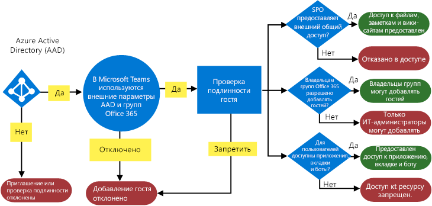
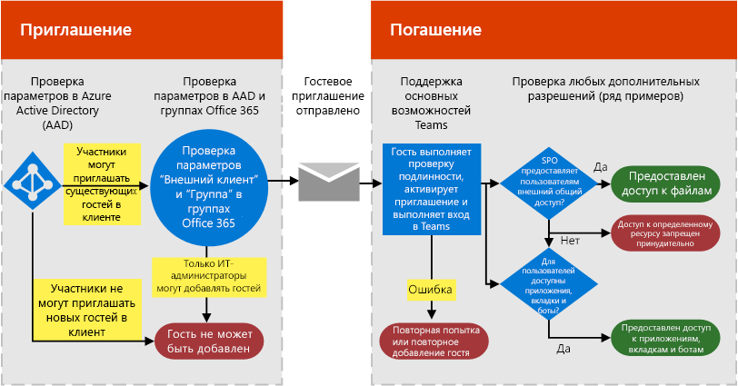
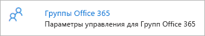
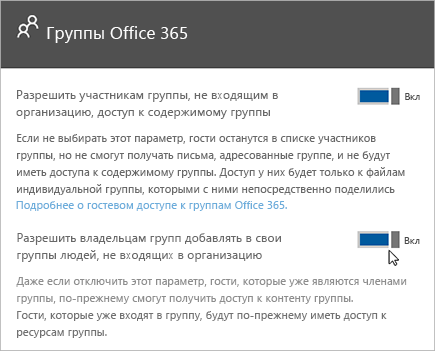

Авторизация гостевого доступа в Microsoft Teams
===========================================

Чтобы выполнить требования организации, можно управлять функциями и возможностями гостевого доступа Microsoft Teams с помощью четырех разных уровней авторизации. К клиенту Office 365 применяются все уровни авторизации. Каждый уровень авторизации управляет взаимодействием с гостями, как показано ниже:

- **Azure Active Directory**: Гостевой доступ в Microsoft Teams опирается на платформу Azure AD B2B. Этот уровень авторизации управляет взаимодействием с гостями на уровне каталога, клиента и приложения.
- **Microsoft Teams**: Управляет взаимодействием с гостями только в Microsoft Teams.
- **Группы Office 365**: Управляет взаимодействием с гостями в группах Office 365 и Microsoft Teams.
- **SharePoint Online и OneDrive для бизнеса**: Управляет взаимодействием с гостями в SharePoint Online, OneDrive для бизнеса, группах Office 365 и Microsoft Teams.

Все эти уровни авторизации дают вам гибкость в настройке гостевого доступа для организации. Например, если вы хотите запретить гостей в Microsoft Teams, но разрешить их в своей организации, просто отключите гостевой доступ в Microsoft Teams. Другой пример. Вы можете включить гостевой доступ на уровнях Azure AD, Microsoft Teams и групп, но затем отключить добавление гостей в выбранных группах, соответствующих одному критерию или нескольким, например, если данные классифицируются как конфиденциальная информация. SharePoint Online и OneDrive для бизнеса имеют собственные параметры гостевого доступа, которые не связаны с группами Office 365.

> [!NOTE]
> На гостей распространяются ограничения служб [Office 365](https://go.microsoft.com/fwlink/p/?linkid=282347) и [Azure Active Directory](https://go.microsoft.com/fwlink/p/?linkid=853019). 

На следующей схеме показано, как зависимость авторизации гостевого доступа предоставляется и встраивается в связке с Azure Active Directory, Microsoft Teams и Office 365.

На следующей схеме в общих чертах показано взаимодействие пользователей с моделью разрешений посредством стандартного приглашения для гостевого доступа и потока активации.

Важно отметить, что приложениям, ботам и соединителям может требоваться собственный набор разрешений и/или согласие, относящееся к учетной записи пользователя. Может потребоваться предоставить их отдельно. Кроме того, в SharePoint могут применяться дополнительные ограничения внешнего общего доступа для определенного пользователя, группы пользователей или даже на уровне сайта.

Две предыдущие схемы также применяются в [Visio](https://github.com/MicrosoftDocs/OfficeDocs-SkypeForBusiness/blob/live/Teams/media/teams_dependencies.vsdx?raw=true).

## Управление гостевым доступом в Azure Active Directory

Используйте Azure AD, чтобы определить, можно ли приглашать внешних участников в свой клиент в качестве гостей, а также способы приглашения. Дополнительные сведения о гостевом доступе Azure B2B см. в статье [Что представляет собой гостевой доступ в службе совместной работы Azure Active Directory B2B?](https://docs.microsoft.com/ru-RU/azure/active-directory/b2b/what-is-b2b) Сведения о ролях Azure AD см. в статье [Предоставление пользователям разрешений от партнерских организаций в клиенте Azure Active Directory](https://docs.microsoft.com/ru-RU/azure/active-directory/b2b/add-guest-to-role).

Параметры приглашений применяются на уровне клиента и управляют гостевым взаимодействием на уровне каталога, клиента и приложения. Чтобы настроить эти параметры на портале Azure, выберите **Azure Active Directory** > **Пользователи** > **Настройки пользователя** и выберите в разделе **Внешние пользователи** пункт **Управление параметрами внешнего взаимодействия**.

В Azure AD есть следующие параметры для настройки внешних пользователей:

- **Разрешения для гостей ограничены**. **Да** означает, что у гостей нет разрешения на выполнение определенных задач в каталоге, например на перечисление пользователей, групп или других ресурсов каталога. Кроме того, гостям не могут быть назначены роли администраторов в каталоге. **Нет** означает, что гости обладают теми же правами доступа к данным каталога, что и обычные пользователи в каталоге.
- **Администраторы и пользователи с ролью приглашающего гостей могут приглашать других пользователей**. **Да** означает, что администраторы и пользователи с ролью приглашающего гостей смогут приглашать гостей в клиент. **Нет** означает, что администраторы и пользователи не могут приглашать гостей в клиент.
- **Участники могут приглашать других пользователей**. **Да** означает, что пользователи, не являющиеся администраторами каталога, могут приглашать гостей для совместной работы с ресурсами, защищенными службой Azure AD, например сайтами SharePoint или ресурсами Azure. **Нет** означает, что только администраторы могут приглашать гостей в каталог. 
      
    > [!NOTE]
    > В настоящее время приложение Teams не поддерживает роль приглашающего гостей. Как минимум, переключатель **Участники могут приглашать других пользователей** должен быть установлен в положение **Да**, чтобы гостевой доступ поддерживался в Teams.
- **Гости могут приглашать других пользователей**. **Да** означает, что гости в вашем каталоге смогут приглашать других гостей для совместной работы с ресурсами, защищенными службой Azure AD, например сайтами SharePoint или ресурсами Azure. **Нет** означает, что гости не могут приглашать других гостей для совместной работы с вашей организацией.
 
Дополнительные сведения об управлении возможностью приглашения гостей см. в статье [Делегирование приглашений для службы совместной работы Azure Active Directory B2B](https://docs.microsoft.com/ru-RU/azure/active-directory/b2b/delegate-invitations).

> [!NOTE]
> Вы также можете управлять тем, какие домены могут быть приглашены в ваш клиент в качестве гостей. См. статью [Разрешение и блокировка гостевого доступа к группам Office 365](https://docs.microsoft.com/exchange/recipients-in-exchange-online/manage-group-access-to-office-365-groups).

Не требуется вручную добавлять гостевую учетную запись в Azure AD B2B, так как она будет добавлена в каталог автоматически при добавлении гостя в Teams.

Условия лицензирования Azure AD позволяют добавить до 5 гостей на одну лицензию. Дополнительные сведения о лицензировании Azure AD см. в статье [Руководство по лицензированию службы совместной работы Azure Active Directory B2B](https://docs.microsoft.com/ru-RU/azure/active-directory/b2b/licensing-guidance).

## Управление гостевым доступом в Teams

В Teams вы можете управлять включением поддержки гостевых функций в вашей организации. Параметр отключен по умолчанию и применяется на уровне клиента только для Teams.

Вы можете управлять параметрами гостевого доступа Teams в Центре администрирования Microsoft Teams. Дополнительные сведения см. в статье [Включение и отключение гостевого доступа для Microsoft Teams](set-up-guests.md). 

## Управление гостевым доступом в группах Office 365

В группах Office 365 вы можете управлять добавлением гостевых пользователей и гостевым доступом ко всем группам Office 365 и Microsoft Teams в организации.

1. Войдите с учетной записью глобального администратора Office 365 на сайт [https://portal.office.com/adminportal/home](https://portal.office.com/adminportal/home).

2. В меню навигации выберите **Параметры** и затем **Services &amp; add-ins** (Службы и надстройки).

3. Выберите **Группы Office 365**.

     
  
4. На странице "Группы Office 365" установите переключатель в положение **Вкл.** или **Откл.**, в зависимости от того, хотите ли вы разрешить владельцам групп и команд, не входящим в организацию, доступ к группам Office 365. Установите переключатель в положение **Вкл.** рядом с параметром **Разрешить владельцам групп добавлять людей, не входящих в организацию, в группы**. Если **включить** этот параметр, вы сможете выбрать, разрешать ли владельцам групп и команд добавлять пользователей, не входящих в организацию, в группы Office 365 и команды Microsoft Teams. Установите переключатель в положение **Вкл.**, если хотите разрешить владельцам групп и команд добавлять гостей. 
 
   

Эти параметры применяются на уровне клиента и управляют взаимодействием с гостями в группах Office 365 и Microsoft Teams.

Дополнительные сведения о гостевом доступе в группах, включая принцип работы гостевого доступа, как управлять гостевым доступом и ответы на часто задаваемые вопросы, см. в статье [Гостевой доступ в группах Office 365](https://support.office.com/ru-RU/article/Guest-access-in-Office-365-Groups-bfc7a840-868f-4fd6-a390-f347bf51aff6).

## Управление гостевым доступом к SharePoint Online и OneDrive для бизнеса

Система Teams использует SharePoint Online и OneDrive для бизнеса, чтобы хранить файлы и документы для бесед в каналах и чате.  

Чтобы обеспечить полноценный гостевой доступ в Teams, администраторам Office 365 следует выбрать значение **Включить** для следующих параметров:

- В SharePoint Online: **Существующие гости**, **Новые и существующие гости** или **Все пользователи**

    Дополнительные сведения см. в статье [Включение и отключение внешнего доступа](https://docs.microsoft.com/sharepoint/turn-external-sharing-on-or-off).

- В Группах Office 365: **Разрешить владельцам групп добавлять людей, не входящих в организацию, в группы**

    Дополнительные сведения см. в разделе [Управление гостевым доступом в группах Office 365](#control-guest-access-in-office-365-groups) выше.
  
Эти параметры применяются на уровне клиента и управляют взаимодействием с гостями в SharePoint Online, OneDrive для бизнеса, группах Office 365 и Teams.

Вы можете управлять параметрами внешних пользователей SharePoint Online для подключенного к Teams сайта группы. Дополнительные сведения см. в статье [Управление параметрами для сайта группы SharePoint](https://support.office.com/article/Manage-your-SharePoint-team-site-settings-8376034d-d0c7-446e-9178-6ab51c58df42).

## Сравнение гостевого и внешнего доступа (федерация)

[!INCLUDE [guest-vs-external-access](includes/guest-vs-external-access.md)]

## Связанные статьи

- [Справочные сведения о параметрах гостевого общего доступа в Microsoft 365](https://docs.microsoft.com/Office365/Enterprise/microsoft-365-guest-settings)
