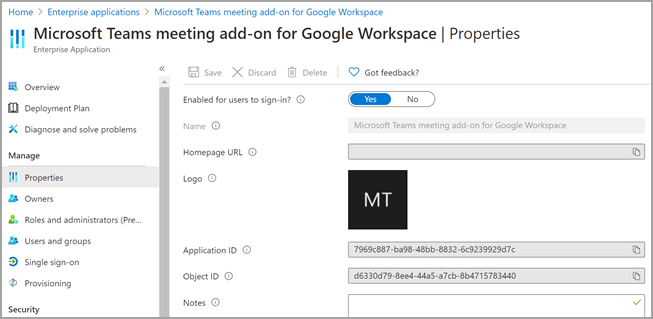

# <a name="set-up-microsoft-teams-meeting-add-on-for-google-workspace"></a>Настройка надстройки для собраний Microsoft Teams в Google Workspace

С помощью надстройки для собраний Microsoft Teams можно планировать пользователей Google календаря и присоединяться к собранию Microsoft Teams прямо из Google Workspace. Пользователи получают доступ к функциям собраний Teams, в том числе к видеоконференциям и голосовой связи, демонстрации экрана, чат для собраний, цифровых досках и т. д. Оставайтесь на связи и работайте над ними, чтобы больше узнать о работе в рамках работы, учебного заведения и жизненного цикла.

Надстройка для собраний Microsoft Teams для Google Workspace должна быть включена администратором Teams, прежде чем пользователи клиента смогут получить доступ к приложению.

## <a name="enable-or-disable-microsoft-teams-meeting-add-on-for-google-workspace-in-the-azure-portal"></a>Включение и отключение надстройки Microsoft Teams для собрания в Google Workspace на портале Azure

Как администратор клиента вы можете включить или отключить надстройку собрания Microsoft Teams для рабочей области Google из учетной записи администратора организации с помощью портала Azure.

Надстройка включена по умолчанию.

1. Войдите на портал Azure.

2. Выберите **корпоративное приложение**  >  **все приложения**.

3. Поиск **надстройки Microsoft Teams для собраний в Google Workspace**.

   

4. Нажмите кнопку **Да**.

   

5. Необязательно Чтобы отключить надстройку, выберите пункт **нет** , а не **Да** в действии 4.

## <a name="disable-microsoft-teams-meeting-add-on-for-google-workspace-using-powershell"></a>Отключение надстройки Microsoft Teams для собрания в Google Workspace с помощью PowerShell

```powershell
Connect-AzureAD

$displayName = 'Microsoft Teams meeting add-on for Google Workspace'
$appId = '7969c887-ba98-48bb-8832-6c9239929d7c'

# Check if a service principal already exists for the app
$servicePrincipal = Get-AzureADServicePrincipal -Filter "appId eq '$appId'"
if ($servicePrincipal) {
    # Service principal exists already, disable it
    Set-AzureADServicePrincipal -ObjectId $servicePrincipal.ObjectId -AccountEnabled $false
    Write-Host "Disabled existing Service Principal \n"
} else {
    # Service principal does not yet exist, create it and disable it at the same time
    New-AzureADServicePrincipal -AppId $appId -DisplayName $displayName
    $servicePrincipal = New-AzureADServicePrincipal -AppId $appId -DisplayName $displayName -AccountEnabled $false
    Write-Host "Created and disabled the Service Principal \n"
}
```

Дополнительные сведения можно найти [в разделе Создание субъекта-службы Azure с помощью Azure PowerShell](https://docs.microsoft.com/powershell/azure/create-azure-service-principal-azureps?view=azps-5.0.0).

## <a name="delete-the-microsoft-teams-meeting-add-on-for-google-workspace"></a>Удаление надстройки Microsoft Teams для собрания в Google Workspace

Инструкции по [удалению приложения Google Workspace Marketplace](https://support.google.com/a/answer/6216211?hl=en) вы видите в документации Google.
