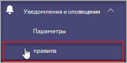
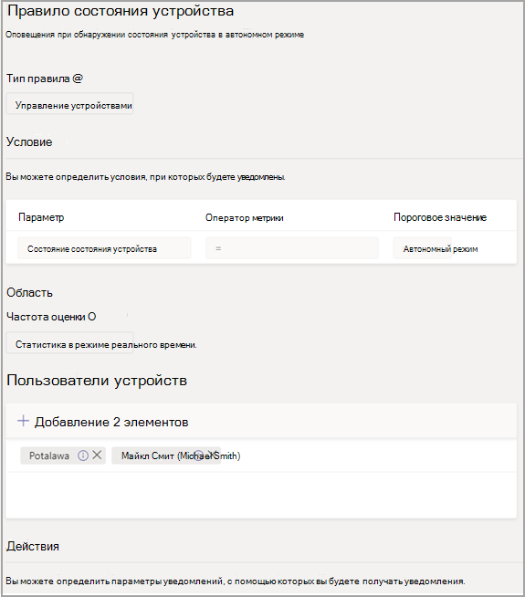
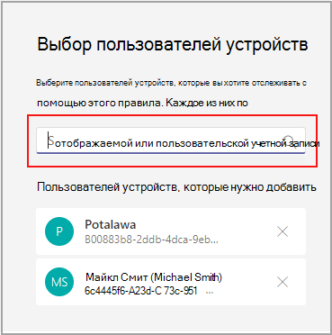

# Microsoft Teams мониторинга работоспособности устройств

Мониторинг работоспособности устройств в Microsoft Teams администрирования позволяет заранее отслеживать работоспособность различных Teams устройств. Отслеживайте автономное состояние устройства и получать оповещения в режиме реального времени, если отслеживаемые устройства в организации переходя в автономный режим.  

Перед началом работы вам потребуются разрешения на создание команд или каналов в клиенте. [Дополнительные сведения](/microsoft-365/solutions/manage-creation-of-groups?view=o365-worldwide).

## Настройка правила состояния устройства

1. В левой области навигации центра администрирования Microsoft Teams уведомления & **alertsRules** > .

   

2. На странице **правил выберите** **правило состояния устройства**.

3. Выберите устройство, чтобы настроить правило состояния для включения оповещений.

    

## Интерпретация конфигурации правила

|Поле |Описание  |
|--------|-------------|
|**Тип правила**   |Правило состояния устройства помогает эффективно управлять. Teams устройства и классифицируется как тип управления устройствами. В будущем будут доступны дополнительные правила типа управления устройствами для мониторинга других связанных возможностей (например, неработоспособное устройство и состояние входа устройства).|
|**Условие**   |Вы можете отслеживать работоспособность устройств, если они находятся в автономном режиме. [Дополнительные сведения](../devices/device-management.md) об управлении устройствами см. Teams центре администрирования. |
|**Область**   |Вы можете указать частоту отслеживания состояния работоспособности устройства, указав частоту оценки правила. По умолчанию устройства teams будут отслеживаться почти в режиме реального времени, если они находятся в автономном режиме. |
|**Пользователи устройств**   |Вы можете указать, на каких устройствах требуется упреждающий автономный мониторинг в автономном режиме, выбрав их на основе пользователей, выполнив вход. Дополнительные сведения [см. в разделе "Выбор устройств для настройки](#select-devices-for-configuration) ". |
|**Действия** >  **Оповещение канала**   |В разделе "Действия" можно указать каналы teams, для которых вы хотите получать оповещения. В настоящее время будет создана команда по умолчанию с именем **"Оповещения** и уведомления администратора", а также канал **MonitoringAlerts** , в который будут доставляться уведомления.     Глобальные администраторы и Teams администраторы в клиенте будут автоматически добавлены в эту команду по умолчанию.|
|**Действия** >  **Веб-перехватчик**   |Вы также можете получать уведомления с помощью внешнего веб-перехватчика (необязательно). Укажите URL-адрес внешнего общедоступного веб-перехватчика в разделе веб-перехватчика, куда будут отправляться полезные данные уведомления JSON.      Полезные данные уведомлений с помощью веб-перехватчиков можно интегрировать с другими системами в организации для создания пользовательских рабочих процессов.   

**Схема полезных данных JSON для веб-перехватчика:**   
<pre lang="json">{      "type": "object",     "properties": {        "AlertTitle": { "type": "string "} ,       "DeviceLoggedInUserId": { "type": "string" } ,       "DeviceId": { "type": "string" } ,        "MetricValues": {              "type": "object",             "properties": {                   "DeviceHealthStatus": { "type": "string"}              }         } ,        "RuleName": { "type": "string"} ,        "RuleDescription": { "type": "string"} ,        "RuleFrequency": { "type": "string"} ,        "RuleType": { "type": "string"} ,        "TenantId": { "type": "string"} ,         "RuleCondition": { "type": "string"} ,         "AlertRaisedAt": { "type": "string"}      }  } </pre>   

  **Примеры полезных данных JSON**:    <pre lang="JSON">    {        "AlertTitle":"*sample_device_name* of *User_Name* has become offline",       "DeviceLoggedInUserId": *User_GUID* ,       "DeviceId": *Device_GUID* ,        "MetricValues": {           "DeviceHealthStatus": "offline"              },                  "RuleName": "Device state rule" ,        "RuleDescription": "Alerts when device health status is detected as offline" ,        "RuleFrequency": "Real-time" ,        "RuleType": "Device Management" ,        "TenantId": *Tenant_GUID* ,         "RuleCondition": "DeviceHealthStatus = Offline" ,         "AlertRaisedAt": "2020-02-28T12:49:06Z"      }  </pre>   

## Выбор устройств для настройки

1. Вы можете выбрать Teams устройства, которые требуется отслеживать, выбрав пользователей, вошедных на эти устройства. Выберите **"Добавить** " в **разделе "Пользователи** устройства".

2. Выберите одного или нескольких пользователей, для которых требуется отслеживать состояние работоспособности устройства.

   

   Выбранный список пользователей отображается в разделе **"Пользователи устройства** ". Этот список можно изменить, добавив или удалив пользователей.

Все устройства входа, используемые выбранным списком пользователей, будут отслеживаться для состояния работоспособности в автономном режиме.

## Уведомления в Teams клиенте

Уведомления доставляются в автоматически созданном **канале MonitoringAlerts** группы оповещений **и уведомлений администратора** . Вы получите оповещение в течение 15 минут после перехода устройства в автономный режим. 

Автономное уведомление устройства может содержать следующие сведения:

- Имя устройства, которое не в сети.
- Пользователь автономного устройства.
- Когда устройство переехает в автономный режим. (В настоящее время время отображается в формате UTC.)
- Тип правила, которое вызывает оповещение.
- Почему создается оповещение.
