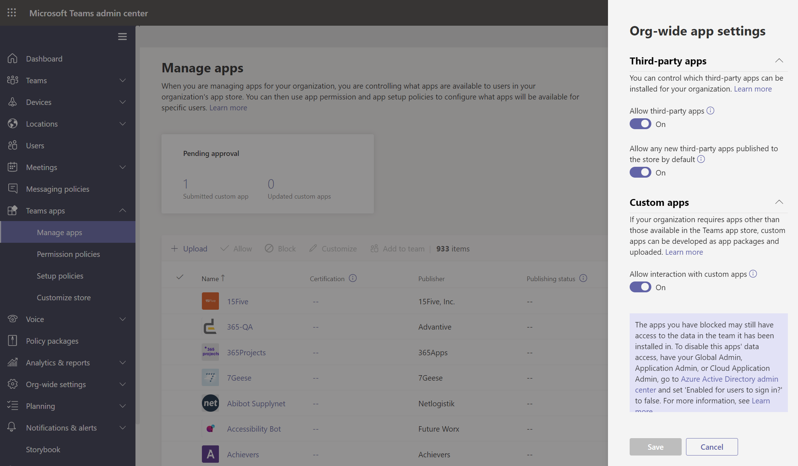

# Общие сведения о политиках приложений, используемых для управления приложениями в Microsoft Teams

Политики приложений используются для управления приложениями в Microsoft Teams.

## Политики разрешений приложений

**Политики разрешений приложений** используются для управления приложениями, доступными для пользователей. Администратор может разрешить или заблокировать определенные приложения, которые пользователи устанавливают из Teams app Store. [Управление политиками разрешений](teams-app-permission-policies.md) приложений осуществляется через Microsoft Teams администрирования.

## Политики установки приложений

**Политики установки приложений** позволяют закреплять и устанавливать приложения от имени пользователей и управлять этими параметрами для вашей организации. [Управление политиками установки приложений](teams-app-setup-policies.md) Teams центре администрирования.

## Пользовательские политики приложений

Вы можете контролировать, кто может отправлять пользовательские приложения в Teams с помощью **настраиваемых политик приложений**. [Управление настраиваемыми параметрами и политиками](teams-custom-app-policies-and-settings.md) приложения осуществляется через Microsoft Teams администрирования.

## Статьи по теме

* [Управление пользовательскими политиками и параметрами приложений в Teams](teams-custom-app-policies-and-settings.md)
* [Управление политиками настройки приложений в Teams](teams-app-setup-policies.md)
* [Управление политиками разрешений для приложений в Teams](teams-app-permission-policies.md)
* [Управление Teams с помощью политик](manage-teams-with-policies.md)
