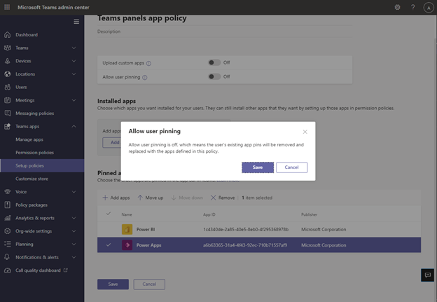

# Поддержка приложений Microsoft Teams и бизнес-приложений на панелях Teams

Панели Teams добавляют поддержку приложений [Teams или бизнес-приложений](/microsoftteams/platform/overview). Это позволит предприятиям добавлять дополнительные возможности на панелях в соответствии с потребностями вашей организации. Этот выпуск поддерживает статическое веб-содержимое.

> [!IMPORTANT]
> Эта функция доступна только после обновления устройств панелей Teams. Для поддержки приложений на панелях Teams необходимо приложение Teams версии 1449/1.0.97.2021070601 или более поздней.

## Интерфейс приложения Teams на панелях Teams

*Начальный экран панелей Teams включает параметры навигации приложения, выделенные красным цветом на снимке экрана. Обратите внимание, что это примеры значков, которые могут быть недоступны для использования.*

*Когда конечный пользователь касается одного из значков приложения, он будет видеть экран приложения Teams, показанный на предыдущем снимке экрана. Серый прямоугольник на снимке экрана — это место, где приложения отображаются на Панель Teams. Панель приложения фиксирована и является частью приложения "Панели Teams".*

## Настройка приложений панелей Teams и управление ими в Центре администрирования Teams

Приложения Microsoft Teams содержат ключевую информацию, общие инструменты и доверенные процессы, в которых люди собирают, учиться и работают. Приложения Teams [работают с интегрированными возможностями](/microsoftteams/platform/concepts/capabilities-overview). Теперь, как ИТ-администратор, вы можете выбрать, какие приложения включить на устройство панелей Teams вашей организации и настроить разрешения через [Центр администрирования Teams](https://admin.teams.microsoft.com/).

Теперь вы можете использовать приложения Teams на панелях Teams и настраивать взаимодействие с пользователем в соответствии с потребностями вашей организации. Вы можете решить, какое веб-приложение пользователи могут получать доступ к представлениям приложений и использовать их, а также определять их приоритеты. Некоторые параметры, такие как бот и возможности обмена сообщениями, в настоящее время не поддерживаются. Узнайте больше о [приложениях Teams](/microsoftteams/platform/overview) [и об управлении устройствами в Microsoft Teams](/microsoftteams/devices/device-management).

## Управление приложениями на панелях Teams в Центре администрирования Teams

**Примечание**. Для доступа к Центру администрирования Teams необходимо быть глобальным администратором или администратором служб [Teams](https://admin.teams.microsoft.com/).

Конечные пользователи могут просматривать, но не устанавливать приложения на панелях Teams. Администратор может просматривать все приложения Teams для своей организации и управлять ими через Центр администрирования Teams. Дополнительные сведения об управлении приложениями в Центре администрирования [Microsoft Teams](/microsoftteams/manage-apps) см. на странице **"Управление приложениями** ". На **странице "Управление приложениями** " в Центре администрирования Teams также можно отправлять [пользовательские приложения](/microsoftteams/manage-apps#publish-a-custom-app-to-your-organizations-app-store).

После настройки приложений можно использовать политики разрешений  приложений и политики настройки приложений  для настройки интерфейса приложения для определенных учетных записей комнат в организации.

## Закрепление приложений на панелях Teams с помощью политик установки приложений

Так как Teams предоставляет возможность отображения широкого спектра приложений, администраторы могут решить, какие приложения наиболее важны для организации, и закрепить их только на начальном экране панелей Teams для быстрого  доступа. Если имеется более пяти закрепленных или незакрепленных приложений, они будут отображаться на экране **"Дополнительно** ". Корпорация Майкрософт рекомендует создать настраиваемую политику установки приложений специально для панелей Teams.

Чтобы управлять закрепленными приложениями, отображаемые на панелях Teams, войдите в Центр администрирования Teams для своей организации и перейдите к политикам установки приложений **Teams** \>  \> **Select или Create a new policy** \> **Pinned apps**.

*Приложения, включенные в этот образ, являются только примерами и могут быть недоступны для использования.*

Корпорация Майкрософт рекомендует отключить отправку **пользовательских** приложений и  закрепление пользователей для оптимального взаимодействия с приложениями Teams на панелях Teams.

Дополнительные сведения о закреплении приложений см. в разделе ["Управление политиками установки приложений"](/microsoftteams/teams-app-setup-policies).

## Управление порядком отображения приложений на панелях Teams

*Приложения, включенные в этот образ, являются только примерами и могут быть недоступны для использования.*

Чтобы управлять порядком отображения приложений на панелях Teams, войдите в Центр администрирования Teams для своей организации и перейдите к политикам установки приложений **Teams** \>  \> **.** \> Выберите закрепленные в политике приложения **:** перемещение вверх **или вниз**.

## Назначение политик установки учетной записи ресурса комнаты

После создания политики установки администратору необходимо назначить эту политику учетной записи ресурса комнаты, которая будет выполнять вход на панели Teams. Дополнительные сведения см. в [разделе "Назначение политик пользователям и группам"](/microsoftteams/assign-policies-users-and-groups).

## Вопросы и ответы

### Сколько времени требуется панелям Teams для получения новых или обновленных политик установки приложений?

После изменения или назначения новых политик в Центре администрирования Teams может потребоваться до 24 часов, чтобы изменения вступили в силу. Администраторы могут попытаться выйти или войти с панели, нажать значок "Параметры" и вернуться на начальный экран,  чтобы попытаться обновить политики.

### Как упорядочивания приложений на экране "Дополнительно"

На странице **"Дополнительные** приложения" закрепленные приложения будут отображаться первыми. Затем все остальные установленные приложения будут отображаться в алфавитном порядке.

### Почему приложения-боты не отображаются на панелях Teams?

В настоящее время поддерживается только веб-содержимое статических вкладок.

### Почему собственные приложения Teams, такие как календарь и задачи, не отображаются на панелях Teams?

Собственные приложения Teams, такие как календарь и задачи, не отображаются на панелях Teams.

### В центре администрирования Teams в разделе "Политики установки" в чем разница между установленными и закрепленными приложениями?

Для панелей Teams корпорация Майкрософт рекомендует использовать закрепленные приложения, чтобы администратор может выбрать нужное приложение и изменить его порядок.

**Примечание:** Некоторые приложения не поддерживают закрепление приложений. Обратитесь к разработчику приложения, чтобы включить функции закрепления приложений.

### Почему другие приложения отображаются на экране "Дополнительно", даже если они не являются частью установленных или закрепленных приложений в разделе политики установки приложений Teams?

Если приложения ранее были установлены с помощью других политик приложений или вручную в классических или веб-клиентах Teams для учетной записи ресурса комнаты, используемой на панелях Teams, администратору может потребоваться войти в учетную запись ресурса комнаты в Teams и вручную удалить приложения, щелкнув приложение правой кнопкой мыши и выбрав команду "Удалить **".**

### Почему не удается найти приложение на панели "Добавление закрепленных приложений"?

Не все приложения можно закрепить в Teams с помощью политики установки приложений. Некоторые приложения могут не поддерживать эту функцию. Чтобы найти приложения, которые можно закрепить, выполните поиск приложения на панели **"Добавление закрепленных** приложений". Дополнительные сведения см. в часто задаваемых вопросы [о работе с политиками установки приложений](/microsoftteams/teams-app-setup-policies#why-cant-i-find-an-app-in-the-add-pinned-apps-pane).

### Почему я вижу всплывающее окно "Закрепление пользователя" на панели политик установки после отключения параметра "Закрепление пользователя?"

*Приложения, включенные в этот образ, являются только примерами и могут быть недоступны для использования.*

Такое поведение ожидается для устройства в общем пространстве и помогает предотвратить непреднамеренное закрепление приложений.
