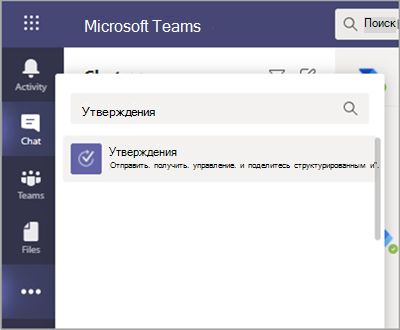
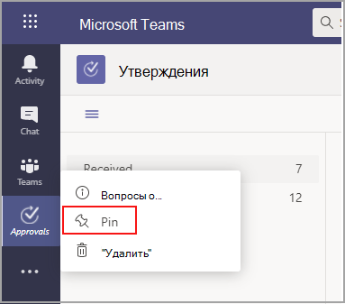
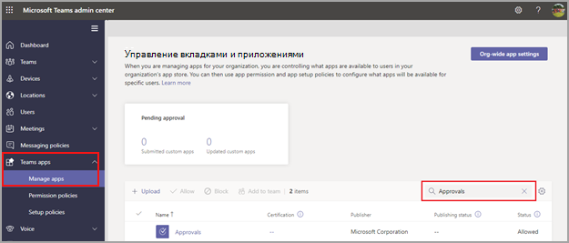
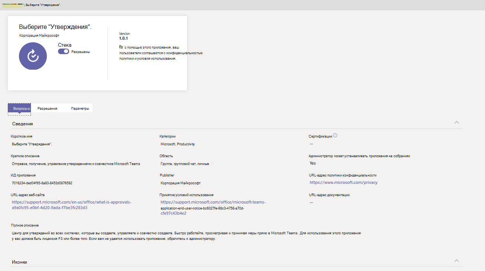

# Доступность приложения "Утверждения" Teams

Приложение "Утверждения" доступно в качестве персонального приложения для всех пользователей Microsoft Teams.
Приложение "Утверждения" обеспечивает простой способ обеспечения аудита, соответствия требованиям, подотчетности и рабочих процессов как для структурированных, так и для неструктурированных утверждений в Teams.

 

Пользователи могут закрепить приложение "Утверждения" в строке меню

 

Первое утверждение, созданное в приложении "Утверждения", станет сигналом к подготовке решения для утверждений в заданной по умолчанию среде Common Data Service (CDS). Утверждения, созданные в приложении "Утверждения", хранятся в заданной по умолчанию среде CDS.

В этой статье содержится информация о требованиях и ролях приложения "Утверждения".

> [!NOTE]
> Эта функция еще не выпущена для пользователей облако сообщества для государственных организаций (GCC), облако сообщества для государственных организаций высокая (GCCH) и Минобороны ( DOD).

## Необходимые разрешения и лицензии

Для развертывания приложения "Утверждения" необходимы разрешения для следующих элементов:

- Разрешения на создание базы данных Microsoft CDS.

- Учетная запись [flow.microsoft.com](https://flow.microsoft.com/)

- Роль администратора в целевой среде

- Лицензия [на Power Automate,](/power-automate/get-started-approvals)Office 365 или Dynamics 365.

- Для того чтобы пользователи настроили новые шаблоны утверждения, необходима лицензия на Microsoft Forms.

Для использования приложения "Утверждения" необходима лицензия на Power Automate, и ваша учетная запись будет автоматически добавлена к роли "Пользователь утверждения" в целевой среде при первом назначении утверждения.

## Хранилище CDS

Common Data Model (CDM) — это язык общих данных, используемый в приложениях для бизнеса и аналитики в CDS. Он состоит из набора стандартизованных расширяемых схем данных, публикуемых корпорацией Майкрософт и ее партнерами, и позволяет поддерживать согласованность данных и их значение во всех приложениях и бизнес-процессах. Подробнее о [языке Common Data Model Microsoft Power Platform](/power-automate/get-started-approvals).

Подробнее о рабочем процессе [утверждений](/power-automate/modern-approvals).

Утверждения, созданные на 2016 г., по-прежнему хранят данные в CDS, такие как название, сведения, ИД шаблона и другие. Ответы, отправленные по запросу на утверждение, хранятся в Forms. Дополнительные сведения о  [хранении данных в Microsoft Forms.](https://support.microsoft.com/office/data-storage-for-microsoft-forms-97a34e2e-98e1-4dc2-b6b4-7a8444cb1dc3#:~:text=Where%20data%20is%20stored%20for%20Microsoft%20Forms.%20Microsoft,European-based%20tenants%20is%20stored%20on%20servers%20in%20Europe)

>[!Note]
>Если вы удалите шаблон формы на сайте Microsoft Forms, шаблон утверждения будет разорвано, и пользователи не смогут запустить запрос. При попытке открыть шаблон утверждения, удаленный в Microsoft Forms, пользователи получают сообщение об ошибке "CDB TableNotFound".

Шаблоны утверждения хранятся в SDS служба хранилища, которая соответствует требованиям для хранения данных внутри корпорации Майкрософт. Шаблоны на масштабе организации хранятся в SDS-клиенте, а шаблоны для группы — в SDS. Это означает, что шаблоны на уровне организации имеют одно и то же время существования шаблонов на уровне клиента и группы. Таким образом, при окончательном удалении группы связанные шаблоны удаляются.

## Разрешения приложения "Утверждения" Teams

Приложение "Утверждения" Teams позволяет получать доступ к перечисленным ниже возможностям.

- Получение сообщений и данных, которые вы ему предоставляете.

- Отправка вам сообщений и уведомлений.

- Отрисовка персональных приложений и диалогов без колонтитула Teams.

- Получение доступа к информации вашего профиля, такой как ваше имя, адрес электронной почты, название компании и предпочтительный язык.

- Получение сообщений и данных, которые участники команды предоставляют ему в канале.

- Отправка сообщений и уведомлений в канале.

- Получение доступа к следующей информации о вашей команде:
  - название команды
  - список каналов
  - состав (имена и адреса электронной почты участников команды).

- Использование информации о команде для контакта с ней.

Разрешения для шаблона утверждения

- Все владельцы команд могут создать шаблон утверждения для своих команд.

- Когда администратор впервые создает шаблон для всей организации, он автоматически создает группу Teams для всех администраторов клиента, включая глобальных администраторов и администраторов служб группы. Эти администраторы будут добавлены в качестве владельцев команды, чтобы они могли совместно управлять шаблонами организации. Администраторов, которые еще не были добавлены в организацию после создания команды, необходимо вручную добавить в качестве владельцев команд, чтобы они могли управлять шаблонами для всей организации.

> [!Note]
> Если администратор удаляет группу, у вас есть месяц на ее восстановление на портале Azure Active Directory (AAD), чтобы восстановить все связанные данные. Через один месяц или, если администратор удалит эту группу из корзины, вы потеряете все связанные данные.

## Отключение приложения "Утверждения" в Teams

Приложение "Утверждения" доступно по умолчанию. Вы можете отключить его в Центре администрирования Teams.

  1. Войдите в Центр администрирования Teams.

  2. Разверните раздел **Приложения Teams** и выберите **Управление приложениями**.

  3. Выполните поиск приложения "Утверждения".

     

  4. Выберите "Утверждения".

  5. Выберите положение переключателя, соответствующее отключению приложения для вашей организации.

     

## Политика хранения

Утверждения, созданные в приложении "Утверждения", хранятся в заданной по умолчанию среде CDS, которая пока не поддерживает создание резервных копий. Подробнее на тему [Создание резервных копий и восстановление среды — Power Platform \| Документация Майкрософт](/power-platform/admin/backup-restore-environments).

Данные, хранимые в Forms, не будут удалены, пока владельцы команды не очистят их с вкладки "Удаленные формы" в веб-приложении Microsoft Forms. 

## Ограничения данных

Каждая команда может содержать не более 400 шаблонов утверждения, а каждый шаблон может собрать не более 50 000 запросов с учетом текущих возможностей Microsoft Forms.

## Аудит

Приложение "Утверждения" ведет журнал событий аудита в Центре безопасности и соответствия требованиям Microsoft 365. Вы можете просмотреть этот журнал аудита.

1. Перейдите в Центр соответствия требованиям Microsoft 365

2. Зайдите в раздел **Аудит**.

3. Выполните поиск в секции **Действия в Microsoft Teams, связанные с утверждениями**.

Вы можете выполнять поиск по перечисленным ниже действиям.

- Создание запроса на утверждение

- Просмотр сведений о запросе на утверждение

- Утвержденный запрос на утверждение

- Отклоненный запрос на утверждение

- Отмененный запрос на утверждение

- Общий запрос на утверждение

- Файл, вложенный в запрос на утверждение

- Повторно назначенный запрос на утверждение

- Добавленная цифровая подпись к запросу на утверждение

- Просмотр сведений о запросе электронной подписи

- Просмотренное запрос на электронную подпись

- Отменен запрос на электронную подпись

- Создание шаблона

- Изменение существующего шаблона

- Включить и отключить шаблон

- Просмотримый шаблон

Для доступа к другим данным аудита утверждений в рамках Flow включите и настройте аудит в заданной по умолчанию среде для главных элементов, связанных с утверждениями: "утверждение", "запрос на утверждение" и "ответ на запрос на утверждение". Операции создания, обновления и удаления являются подлежащими аудиту событиями в записях приложения "Утверждения". Подробнее на тему [Аудит данных и действий пользователей для обеспечения безопасности и соответствия требованиям — Power Platform \| Документация Майкрософт](/power-platform/admin/audit-data-user-activity).

Можно выполнить дополнительную настройку аудита в [Центре безопасности и соответствия требованиям Microsoft 365](https://support.office.com/article/go-to-the-office-365-security-compliance-center-7e696a40-b86b-4a20-afcc-559218b7b1b8?ui=en-US&rs=en-US&ad=US).

1. Чтобы воспользоваться предварительно настроенными отчетами, войдите в Центр безопасности и соответствия требованиям Microsoft 365.

2. Выберите **Поиск и исследование**.

3. Выполните поиск в журнале аудита и выберите вкладку **Действия в Dynamics 365**.

Подробнее на тему [Microsoft Dataverse и ведение журнала действий в приложениях на основе моделей — Power Platform](/power-platform/admin/enable-use-comprehensive-auditing).

## Безопасность

В приложении "Утверждения" Teams пользователи могут создавать утверждения, а также просматривать отправленные и полученные утверждения. Пользователи не имеют доступа к утверждениям, созданным другими пользователями, если не указаны в качестве адресата или наблюдателя в соответствующем запросе.

> [!Note]
> Пользователю назначается роль наблюдателя запроса, если он является участником чата или канала, где было создано утверждение. У него нет возможности совершать действия в отношении запроса, если при создании утверждения ему не была присвоена соответствующая роль.

## Интеграция с электронной подписью "Утверждения"

Утверждения электронной подписи, созданные в приложении "Утверждения", хранятся в облачной среде выбранного поставщика. Дополнительные сведения о хранилище в рамках соглашения с электронной подписью можно получить в документации выбранного поставщика.

Чтобы использовать функцию электронной подписи в приложении "Утверждения", вам нужны следующие элементы:

- Лицензия для конкретного поставщика электронной подписи, который вы выбираете. Чтобы получить лицензию для своей организации, необходимо перейти на сайт поставщика.

Для функций работы с электронной подписью "Утверждения" партнеры по подписи сторонних разработчиков по умолчанию отображаются в Teams "Утверждения". Вы можете отключить определенные поставщики электронной подписи, задав параметры приложения в Teams центре администрирования.

1. В центре Teams администрирования в **области** Управление приложениями выберите приложение **"Утверждения"** и Параметры . 

2. Каждый поставщик электронной подписи по умолчанию находится в положении "Вкл. (справа)". Чтобы отключить определенного поставщика электронной подписи, перевиньте его влево. Если администратор Teams отключает поставщика, конечные пользователи не будут видеть его при создании утверждения. Кроме того, конечные пользователи не смогут просматривать запросы на электронную подпись, сделанные с этим поставщиком.

Утверждения электронной подписи, созданные в приложении "Утверждения", хранятся в облаке выбранного поставщика. Поэтому для экспорта данных об электронных подписях необходимо перейти на сайт поставщика. Обратитесь к документации поставщика об экспорте и хранении этих соглашений.
