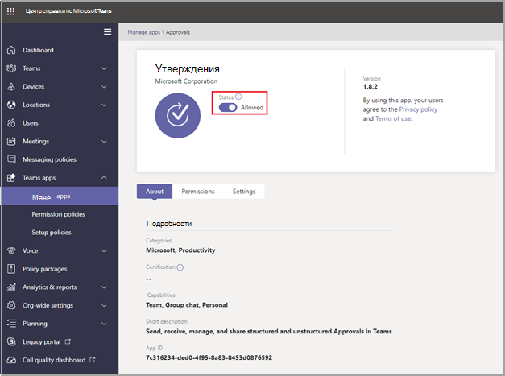

# Доступность приложения "Утверждения" Teams

Приложение "Утверждения" доступно в качестве персонального приложения для всех пользователей Microsoft Teams.
Приложение "Утверждения" обеспечивает простой способ обеспечения аудита, соответствия требованиям, подотчетности и рабочих процессов как для структурированных, так и для неструктурированных утверждений в Teams.

 

Пользователи могут закрепить приложение "Утверждения" в строке меню

 

Первое утверждение, созданное в приложении "Утверждения", станет сигналом к подготовке решения для утверждений в заданной по умолчанию среде Common Data Service (CDS). Утверждения, созданные в приложении "Утверждения", хранятся в заданной по умолчанию среде CDS.

В этой статье содержится информация о требованиях и ролях приложения "Утверждения".

> [!NOTE]
> Эта функция еще не выпущена для пользователей Government Community Cloud (GCC), Government Community Cloud High (GCCH) и Department of Defense (DOD).

## Необходимые разрешения и лицензии

Для использования приложения "Утверждения" вам необходимы перечисленные ниже разрешения.

- Разрешения на создание базы данных Microsoft CDS.

- Учетная запись [flow.microsoft.com](https://flow.microsoft.com/)

- Роль администратора в целевой среде

- Лицензия на [Power Automate](/power-automate/get-started-approvals), Office 365 или Dynamics 365.

## Хранилище CDS

Common Data Model (CDM) — это язык общих данных, используемый в приложениях для бизнеса и аналитики в CDS. Он состоит из набора стандартизированных схем данных, опубликованных корпорацией Майкрософт и нашими партнерами, что обеспечивает согласованность данных и их значение в приложениях и бизнес-процессах. Подробнее о [языке Common Data Model Microsoft Power Platform](/power-automate/get-started-approvals).

Подробнее о рабочем процессе [утверждений](/power-automate/modern-approvals).

## Разрешения приложения "Утверждения" Teams

Приложение "Утверждения" Teams позволяет получать доступ к перечисленным ниже возможностям.

- Получение сообщений и данных, которые вы ему предоставляете.

- Отправка вам сообщений и уведомлений.

- Отрисовка персональных приложений и диалогов без колонтитула Teams.

- Получение доступа к информации вашего профиля, такой как ваше имя, адрес электронной почты, название компании и предпочтительный язык.

- Получение сообщений и данных, которые участники команды предоставляют ему в канале.

- Отправка сообщений и уведомлений в канале.

- Получение доступа к следующей информации о вашей команде:
  - название команды
  - список каналов
  - состав (имена и адреса электронной почты участников команды).

- Использование информации о команде для контакта с ней.

## Отключение приложения "Утверждения" в Teams

Приложение "Утверждения" доступно по умолчанию. Вы можете отключить его в Центре администрирования Teams.

  1. Войдите в Центр администрирования Teams.

  2. Разверните раздел **Приложения Teams** и выберите **Управление приложениями**.

  3. Выполните поиск приложения "Утверждения".

  4. Выберите "Утверждения".

  5. Выберите положение переключателя, соответствующее отключению приложения для вашей организации.

## Политика хранения

Утверждения, созданные в приложении "Утверждения", хранятся в заданной по умолчанию среде CDS, которая пока не поддерживает создание резервных копий. Подробнее на тему [Создание резервных копий и восстановление среды — Power Platform \| Документация Майкрософт](/power-platform/admin/backup-restore-environments).

## Аудит

Приложение "Утверждения" ведет журнал событий аудита в Центре безопасности и соответствия требованиям Microsoft 365. Вы можете просмотреть этот журнал аудита.

1. Перейдите в Центр соответствия требованиям Microsoft 365

2. Зайдите в раздел **Аудит**.

3. Выполните поиск в секции **Действия в Microsoft Teams, связанные с утверждениями**.

Вы можете выполнять поиск по перечисленным ниже действиям.

- Создание запроса на утверждение

- Просмотр сведений о запросе на утверждение

- Утвержденный запрос на утверждение

- Отклоненный запрос на утверждение

- Отмененный запрос на утверждение

- Общий запрос на утверждение

- Файл, вложенный в запрос на утверждение

- Повторно назначенный запрос на утверждение

- Добавленная цифровая подпись к запросу на утверждение

Для доступа к другим данным аудита утверждений в рамках Flow включите и настройте аудит в заданной по умолчанию среде для главных элементов, связанных с утверждениями: "утверждение", "запрос на утверждение" и "ответ на запрос на утверждение". Операции создания, обновления и удаления являются подлежащими аудиту событиями в записях приложения "Утверждения". Подробнее на тему [Аудит данных и действий пользователей для обеспечения безопасности и соответствия требованиям — Power Platform \| Документация Майкрософт](/power-platform/admin/audit-data-user-activity).

Можно выполнить дополнительную настройку аудита в [Центре безопасности и соответствия требованиям Microsoft 365](https://support.office.com/article/go-to-the-office-365-security-compliance-center-7e696a40-b86b-4a20-afcc-559218b7b1b8?ui=en-US&rs=en-US&ad=US).

1. Чтобы воспользоваться предварительно настроенными отчетами, войдите в Центр безопасности и соответствия требованиям Microsoft 365.

2. Выберите **Поиск и исследование**.

3. Выполните поиск в журнале аудита и выберите вкладку **Действия в Dynamics 365**.

Подробнее на тему [Microsoft Dataverse и ведение журнала действий в приложениях на основе моделей — Power Platform](/power-platform/admin/enable-use-comprehensive-auditing).

## Безопасность

В приложении "Утверждения" Teams пользователи могут создавать утверждения, а также просматривать отправленные и полученные утверждения. Пользователи не имеют доступа к утверждениям, созданным другими пользователями, если не указаны в качестве адресата или наблюдателя в соответствующем запросе.

> [!Note]
> Пользователю назначается роль наблюдателя запроса, если он является участником чата или канала, где было создано утверждение. У него нет возможности совершать действия в отношении запроса, если при создании утверждения ему не была присвоена соответствующая роль.