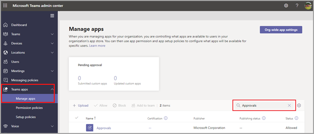

# Доступность приложения "Утверждения" TeamsTeams Approvals app availability

Приложение "Утверждения" доступно в качестве персонального приложения для всех пользователей Microsoft Teams.The Approvals app is available as a personal app for all Microsoft Teams users.
Приложение "Утверждения" обеспечивает простой способ обеспечения аудита, соответствия требованиям, подотчетности и рабочих процессов как для структурированных, так и для неструктурированных утверждений в Teams.The Approvals app provides a simple way to bring auditing, compliance, accountability, and workflows to both structured and unstructured Approvals in Teams.

 

Пользователи могут закрепить приложение "Утверждения" в строке менюUsers can pin the Approvals app to save it to the menu bar.

 

Первое утверждение, созданное в приложении "Утверждения", станет сигналом к подготовке решения для утверждений в заданной по умолчанию среде Common Data Service (CDS).The first approval created from the Approvals app will trigger the provisioning of the Approval Solution in the default Common Data Service (CDS) environment. Утверждения, созданные в приложении "Утверждения", хранятся в заданной по умолчанию среде CDS.Approvals created from the Approvals app will be stored in the default CDS environment.

В этой статье содержится информация о требованиях и ролях приложения "Утверждения".This article describes the Approvals app requirements and roles.

> [!NOTE]
> Эта функция еще не выпущена для пользователей Government Community Cloud (GCC), Government Community Cloud High (GCCH) и Department of Defense (DOD).This feature hasn't been released to Government Community Cloud (GCC), Government Community Cloud High (GCCH), and Department of Defense (DOD) users yet.

## Необходимые разрешения и лицензииRequired permissions and licenses

Для использования приложения "Утверждения" вам необходимы перечисленные ниже разрешения.To use the Approvals app, you need permission for the following items:

- Разрешения на создание базы данных Microsoft CDS.Permissions to create a Microsoft CDS database.

- Учетная запись [flow.microsoft.com](https://flow.microsoft.com/)An account on [flow.microsoft.com](https://flow.microsoft.com/)

- Роль администратора в целевой средеAdministrator Role in the target environment.

- Лицензия на [Power Automate](/power-automate/get-started-approvals), Office 365 или Dynamics 365.License for a [Power Automate](/power-automate/get-started-approvals), an Office 365, or a Dynamics 365.

## Хранилище CDSStorage with CDS

Common Data Model (CDM) — это язык общих данных, используемый в приложениях для бизнеса и аналитики в CDS.The Common Data Model (CDM) is the shared data language used by business and analytical applications in the CDS. Он состоит из набора стандартизированных схем данных, опубликованных корпорацией Майкрософт и нашими партнерами, что обеспечивает согласованность данных и их значение в приложениях и бизнес-процессах.It consists of a set of a standardized, extensible data schemas published by Microsoft and our partners, that enables consistency of data and its meaning across applications and business processes. Подробнее о [языке Common Data Model Microsoft Power Platform](/power-automate/get-started-approvals).Learn more about the [Common Data Model of the Microsoft Power Platform](/power-automate/get-started-approvals).

Подробнее о рабочем процессе [утверждений](/power-automate/modern-approvals).Learn more about the [Approval workflow](/power-automate/modern-approvals).

## Разрешения приложения "Утверждения" TeamsApprovals Teams app permissions

Приложение "Утверждения" Teams позволяет получать доступ к перечисленным ниже возможностям.The Approvals Teams app lets you access the following features:

- Получение сообщений и данных, которые вы ему предоставляете.Receive messages and data that you provide to it.

- Отправка вам сообщений и уведомлений.Send you messages and notifications.

- Отрисовка персональных приложений и диалогов без колонтитула Teams.Render personal apps and dialogs without a Teams-provided header.

- Получение доступа к информации вашего профиля, такой как ваше имя, адрес электронной почты, название компании и предпочтительный язык.Access your profile information such as your name, email address, company name, and preferred language.

- Получение сообщений и данных, которые участники команды предоставляют ему в канале.Receive messages and data that team members provide to it in a channel.

- Отправка сообщений и уведомлений в канале.Send messages and notifications in a channel.

- Получение доступа к следующей информации о вашей команде:Access your team's information:
  - название командыteam name
  - список каналовchannel list
  - состав (имена и адреса электронной почты участников команды).roster (team member's names and email addresses).

- Использование информации о команде для контакта с ней.Use the team's information to contact them.

## Отключение приложения "Утверждения" в TeamsDisable the Approvals app

Приложение "Утверждения" доступно по умолчанию.The Approvals app is available by default. Вы можете отключить его в Центре администрирования Teams.You can disable the app in the Teams admin center.

  1. Войдите в Центр администрирования Teams.Sign in to the Teams admin center.

  2. Разверните раздел **Приложения Teams** и выберите **Управление приложениями**.Expand **Teams apps** and select **Manage apps**.

  3. Выполните поиск приложения "Утверждения".Search for the Approvals app.

  4. Выберите "Утверждения".Select Approvals.

  5. Выберите положение переключателя, соответствующее отключению приложения для вашей организации.Select the toggle to disable the app for your organization.

## Политика храненияRetention policy

Утверждения, созданные в приложении "Утверждения", хранятся в заданной по умолчанию среде CDS, которая пока не поддерживает создание резервных копий.Approvals created from the Approvals App are stored in the default CDS environment, which doesn’t support backups at this time. Подробнее на тему [Создание резервных копий и восстановление среды — Power Platform \| Документация Майкрософт](/power-platform/admin/backup-restore-environments).Learn more about how to [Back up and restore environments - Power Platform \| Microsoft Docs](/power-platform/admin/backup-restore-environments).

## АудитAuditing

Приложение "Утверждения" ведет журнал событий аудита в Центре безопасности и соответствия требованиям Microsoft 365.The Approvals App logs audit events within the Microsoft 365 Security and Compliance Center. Вы можете просмотреть этот журнал аудита.You can view the audit log.

1. Перейдите в Центр соответствия требованиям Microsoft 365Go to the Microsoft 365 Compliance Site.

2. Зайдите в раздел **Аудит**.Select the **Audit** section.

3. Выполните поиск в секции **Действия в Microsoft Teams, связанные с утверждениями**.Search for activities under **Microsoft Teams approvals activities**.

Вы можете выполнять поиск по перечисленным ниже действиям.You can search for the following activities:

- Создание запроса на утверждениеCreate new approval request

- Просмотр сведений о запросе на утверждениеView approval request details

- Утвержденный запрос на утверждениеApproved approval request

- Отклоненный запрос на утверждениеRejected approval request

- Отмененный запрос на утверждениеCanceled approval request

- Общий запрос на утверждениеShared approval request

- Файл, вложенный в запрос на утверждениеFile attached to approval request

- Повторно назначенный запрос на утверждениеReassigned approval request

- Добавленная цифровая подпись к запросу на утверждениеAdded e-signature to approval request

Для доступа к другим данным аудита утверждений в рамках Flow включите и настройте аудит в заданной по умолчанию среде для главных элементов, связанных с утверждениями: "утверждение", "запрос на утверждение" и "ответ на запрос на утверждение".For access to more auditing approvals within Flow, enable and configure auditing in the default environment for the primary approval entities Approval, Approval Request, and Approval Response. Операции создания, обновления и удаления являются подлежащими аудиту событиями в записях приложения "Утверждения".Create, update, and delete operations are auditable events for Approval records. Подробнее на тему [Аудит данных и действий пользователей для обеспечения безопасности и соответствия требованиям — Power Platform \| Документация Майкрософт](/power-platform/admin/audit-data-user-activity).Learn more about [Audit data and user activity for security and compliance - Power Platform \| Microsoft Docs](/power-platform/admin/audit-data-user-activity).

Можно выполнить дополнительную настройку аудита в [Центре безопасности и соответствия требованиям Microsoft 365](https://support.office.com/article/go-to-the-office-365-security-compliance-center-7e696a40-b86b-4a20-afcc-559218b7b1b8?ui=en-US&rs=en-US&ad=US).Auditing can be customized further in the [Microsoft 365 Security and Compliance Center](https://support.office.com/article/go-to-the-office-365-security-compliance-center-7e696a40-b86b-4a20-afcc-559218b7b1b8?ui=en-US&rs=en-US&ad=US).

1. Чтобы воспользоваться предварительно настроенными отчетами, войдите в Центр безопасности и соответствия требованиям Microsoft 365.To use the preconfigured reports, sign in to Microsoft 365 Security and Compliance.

2. Выберите **Поиск и исследование**.Select **Search & investigation**.

3. Выполните поиск в журнале аудита и выберите вкладку **Действия в Dynamics 365**.Search the Audit log and select the **Dynamics 365 activities** tab.

Подробнее на тему [Microsoft Dataverse и ведение журнала действий в приложениях на основе моделей — Power Platform](/power-platform/admin/enable-use-comprehensive-auditing).Learn more about [Microsoft Dataverse and model-driven apps activity logging - Power Platform](/power-platform/admin/enable-use-comprehensive-auditing).

## БезопасностьSecurity

В приложении "Утверждения" Teams пользователи могут создавать утверждения, а также просматривать отправленные и полученные утверждения.From the Teams Approvals app, users have access to create new Approvals and view Approvals that they have sent and received. Пользователи не имеют доступа к утверждениям, созданным другими пользователями, если не указаны в качестве адресата или наблюдателя в соответствующем запросе.Users won't have access to Approvals that are created by others unless they're either a responder or a viewer of the request.

> [!Note]
> Пользователю назначается роль наблюдателя запроса, если он является участником чата или канала, где было создано утверждение.A user will be given a viewer role of a request if they are part of the chat or channel where the approval was created. У него нет возможности совершать действия в отношении запроса, если при создании утверждения ему не была присвоена соответствующая роль.They won't have the ability to take action on the request if they weren't given that role when the approval was created.