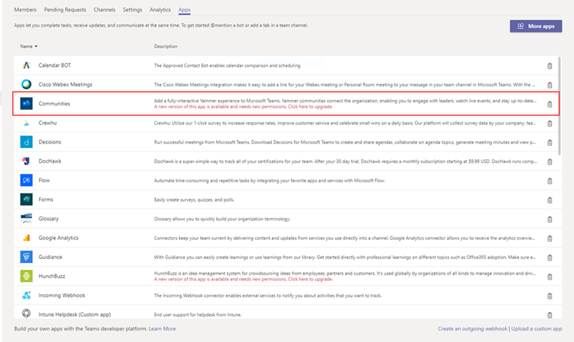

# Обновление приложений в Microsoft Teams

В большинстве случаев после публикации обновления приложения для пользователей автоматически появляется новая версия. Тем не менее существуют некоторые обновления манифеста <a href="/microsoftteams/platform/resources/schema/manifest-schema" target="_blank">Microsoft Teams,</a> которые требуют принятия пользователем:

* Бот был добавлен или удален
* Изменено свойство botId существующего бота
* Изменено свойство isNotificationOnly существующего бота
* Добавлены возможности "Поддержка", "ПоддержкаВидео" и "ПоддержкаFiles".
* Добавлено расширение для обмена сообщениями
* Добавлен новый соединител
* Свойства внутри "webApplicationInfo" изменены

> [!NOTE] 
> Процесс обновления применяется ко всем обновлениям приложений Майкрософт, пользовательских приложений и сторонних приложений. 

## Связанные статьи

[Управление приложениями](manage-apps.md)
