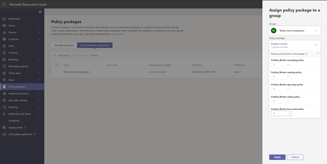

# <a name="assign-policy-packages-to-users-and-groups"></a>Назначение пакетов политик пользователям и группам

В этой статье рассматриваются различные способы назначения пакетов политики пользователям и группам в Microsoft Teams. Перед чтением убедитесь, что вы ознакомились с политиками назначения в Teams [начале работы](policy-assignment-overview.md).

> [!NOTE]
> Для получения назначенного пользовательского пакета политик каждому пользователю будет необходима надстройка Advanced Communications. Дополнительные сведения см. в статье [Надстройка Advanced Communications для Microsoft Teams](/microsoftteams/teams-add-on-licensing/advanced-communications).

## <a name="assign-a-policy-package-to-users"></a>Назначение пакета политики пользователям

Пакет политики в Teams представляет собой набор предопределенных политик и параметров политики, которые можно назначить пользователям с одинаковыми или аналогичными ролями в организации. Каждый пакет политики разработан на основе роли пользователя и включает стандартные политики и параметры политики, которые поддерживают действия, типичные для этой роли. Примерами пакетов политик являются пакет для образовательных учреждений (преподаватель) и пакет медицинских учреждений (медицинские работники). Дополнительные сведения см. в [разделе "Управление пакетами политики" Teams](manage-policy-packages.md).

### <a name="assign-a-policy-package-to-one-user"></a>Назначение пакета политики одному пользователю

1. В левой области навигации центра Microsoft Teams перейдите к разделу "**Пользователи" и** выберите пользователя.

2. На странице пользователя выберите " **Политики**", а затем рядом с пакетом **политики выберите "** Изменить **"**.

3. В области **"Назначение пакета политики** " выберите пакет, который нужно назначить, а затем нажмите кнопку **"Сохранить"**.


### <a name="assign-a-policy-package-to-multiple-users"></a>Назначение пакета политики нескольким пользователям

1. В левой области навигации центра администрирования Microsoft Teams перейдите к пакетам **политики, а** затем выберите пакет политики, который нужно назначить, щелкнув слева от имени пакета.

2. Выберите **Управление пользователями**.

3. В области **Управление пользователями** выполните поиск по отображаемому имени или по имени пользователя, выберите имя и нажмите **Добавить**. Повторите это действие для каждого пользователя, которого нужно добавить.

4. Завершив добавление пользователей, нажмите кнопку " **Сохранить"**.


## <a name="assign-a-policy-package-to-a-group"></a>Назначение пакета политики группе

Назначение пакетов политики группам позволяет назначать несколько политик группе пользователей, например группе безопасности или группе рассылки. Назначение политики распространяется на участников группы в соответствии с правилами очередности. При добавлении или удалении участников группы, назначения политик для них обновляются соответствующим образом.

Назначение пакета политики группам рекомендуется для групп до 50 000 пользователей, но оно также будет работать с более крупными группами.

При назначении пакета политики он немедленно назначается группе. Однако распространение назначения политики членам группы выполняется в фоновом режиме и может занять некоторое время в зависимости от размера группы. То же самое происходит при отмене назначения политики из группы или при добавлении участников в группу или удалении из нее.

> [!IMPORTANT]
> Прежде чем приступить к работе, важно [понимать (правила](assign-policies-users-and-groups.md#precedence-rules) приоритета) и ([ранжирование назначения группы](assign-policies-users-and-groups.md#group-assignment-ranking)). Убедитесь, что вы читаете и понимаете основные [понятия в разделе](assign-policies-users-and-groups.md#what-you-need-to-know-about-policy-assignment-to-groups) (что необходимо знать о назначении политик группам) ранее в этой статье.

### <a name="assign-a-policy-package-to-a-group-of-users-in-the-admin-center"></a>Назначение пакета политики группе пользователей в Центре администрирования

1. Войдите в Центр администрирования Teams.

2. В области навигации слева перейдите на страницу пакета политики.

3. Выберите вкладку назначения групповой политики.

4. Выберите **"Добавить группу**", а затем в области "Назначение пакета политики" выполните следующие действия.

    1. Найдите и добавьте группу, которой нужно назначить пакет политики.

    1. Выберите пакет политики.

    1. Задайте ранжирование для каждого типа политики.

    1. Нажмите **кнопку "Применить"**.


       

5. Чтобы управлять ранжированием для определенного типа политики, перейдите на определенную страницу политики.

6. Чтобы переназначить пакет политики группе, сначала удалите назначение групповой политики. Затем выполните описанные выше действия, чтобы назначить пакет политики группе.

### <a name="work-with-powershell"></a>Работа с PowerShell

#### <a name="get-the-teams-powershell-module"></a>Получение модуля Teams PowerShell

Пошаговые инструкции см. в разделе ["Установка Teams PowerShell"](teams-powershell-install.md).

#### <a name="assign-a-policy-package-to-a-group-of-users"></a>Назначение пакета политики группе пользователей

Используйте [командлет Grant-CsGroupPolicyPackageAssignment](/powershell/module/teams/grant-csgrouppolicypackageassignment) , чтобы назначить пакет политики группе. Группу можно указать с помощью идентификатора объекта, SIP-адреса или адреса электронной почты. При назначении пакета политики укажите ([ранжирование](assign-policies-users-and-groups.md#group-assignment-ranking) назначения группы) для каждого типа политики в пакете политики.

В этом примере пакет политики Education_Teacher назначается группе с ранжированием назначения 1 для TeamsAppSetupPolicy и TeamsMeetingBroadcastPolicy и ранжированием 2 для TeamsMeetingPolicy.

```powershell
Grant-CsGroupPolicyPackageAssignment -GroupId "dae90bb4-120f-4a3e-a15d-30f142e79f69" -PackageName "Education_Teacher" -PolicyRankings "TeamsAppSetupPolicy, 1", "TeamsMeetingBroadcastPolicy, 1", "TeamsMeetingPolicy, 2"
```

## <a name="assign-a-policy-package-to-a-batch-of-users"></a>Назначение пакета политики пакету пользователей

При назначении пакета пакетной политики можно назначить пакет политики большим наборам пользователей одновременно без использования скрипта. Командлет [New-CsBatchPolicyAssignmentOperation](/powershell/module/teams/new-csbatchpolicyassignmentoperation) используется для отправки пакета пользователей и пакета политики, который требуется назначить. Задания будут обрабатываться в фоновом режиме, а для каждого пакета будет создан идентификатор операции. Затем можно использовать командлет [Get-CsBatchPolicyAssignmentOperation](/powershell/module/teams/get-csbatchpolicyassignmentoperation) для отслеживания хода выполнения и состояния назначений в пакете.

Укажите пользователей по идентификатору объекта или SIP-адресу. SIP-адрес пользователя часто имеет то же значение, что и имя участника-пользователя (UPN) или адрес электронной почты, но это необязательно. Если пользователь указан с помощью имени участника-пользователя или электронной почты, но его значение отличается от его SIP-адреса, назначение политики для пользователя завершится ошибкой. Если пакет содержит повторяющиеся пользователи, повторяющиеся файлы будут удалены из пакета перед обработкой, и состояние будет предоставлено только для уникальных пользователей, оставшихся в пакете.

Пакет содержит до 5000 пользователей. Для достижения наилучших результатов не отдайте несколько пакетов за раз. Разрешить пакетам завершать обработку перед отправкой дополнительных пакетов.

### <a name="use-the-teams-powershell-module"></a>Использование модуля Teams PowerShell

Выполните следующую команду[, чтобы установить Microsoft Teams PowerShell](https://www.powershellgallery.com/packages/MicrosoftTeams) (если вы еще этого не сделали). Убедитесь, что установлена версия 1.0.5 или более поздняя.

```powershell
Install-Module -Name MicrosoftTeams
```

Выполните следующую команду, чтобы подключиться Teams и запустить сеанс.

```powershell
Connect-MicrosoftTeams
```

При появлении запроса войдите в систему, используя учетные данные администратора.

### <a name="assign-policy-packages-to-a-batch-of-users"></a>Назначение пакетов политик пакету пользователей

В этом примере мы используем командлет [New-CsBatchPolicyAssignmentOperation](/powershell/module/teams/new-csbatchpolicyassignmentoperation) для назначения пакета Education_PrimaryStudent политики пакету пользователей.

```powershell
New-CsBatchPolicyPackageAssignmentOperation -Identity 1bc0b35f-095a-4a37-a24c-c4b6049816ab,user1@econtoso.com,user2@contoso.com -PackageName Education_PrimaryStudent
```

### <a name="see-the-status-of-a-batch-assignment"></a>Просмотр состояния пакетного назначения

Выполните следующую команду, чтобы получить состояние назначения пакета, где OperationId `New-CsBatchPolicyAssignmentOperation` — это идентификатор операции, возвращаемый командлетом для данного пакета.

```powershell
$Get-CsBatchPolicyAssignmentOperation -OperationId f985e013-0826-40bb-8c94-e5f367076044 | fl
```

Если выходные данные показывают, что произошла ошибка, выполните следующую команду, чтобы получить дополнительные сведения об ошибках, которые находятся в свойстве `UserState` .

```powershell
Get-CsBatchPolicyAssignmentOperation -OperationId f985e013-0826-40bb-8c94-e5f367076044 | Select -ExpandProperty UserState
```

Дополнительные сведения см. в [разделе Get-CsBatchPolicyAssignmentOperation](/powershell/module/teams/get-csbatchpolicyassignmentoperation).

## <a name="related-topics"></a>Статьи по теме

- [Управление Teams с помощью политик](manage-teams-with-policies.md)
- [Управление пакетами политик в Microsoft Teams](manage-policy-packages.md)
- [Обзор PowerShell в Teams](teams-powershell-overview.md)
- [Назначение политик в Teams — начало работы](policy-assignment-overview.md)
