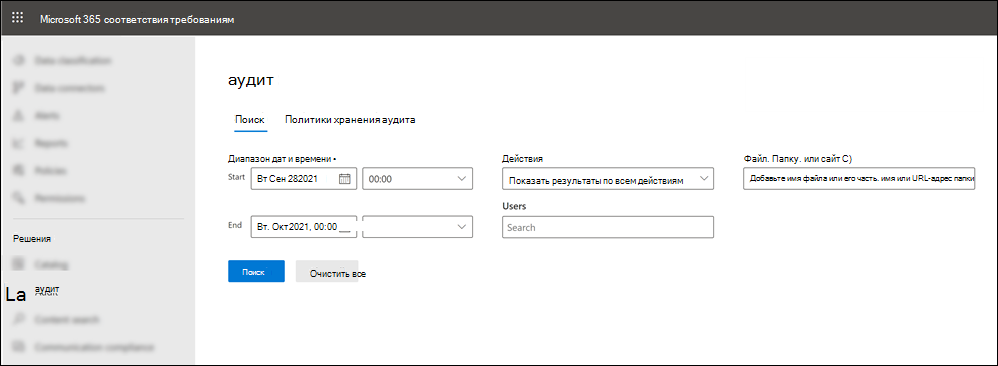

# Поиск событий Microsoft Teams в журнале аудитаSearch the audit log for events in Microsoft Teams

> [!IMPORTANT]
> [!INCLUDE [new-teams-sfb-admin-center-notice](includes/new-teams-sfb-admin-center-notice.md)]

Журнал аудита поможет вам исследовать конкретные действия в службах Microsoft 365.The audit log can help you investigate specific activities across Microsoft 365 services. Ниже перечислены некоторые действия, которые можно выполнять в Microsoft Teams.For Microsoft Teams, here are some of the activities that are audited:

- Создание командыTeam creation
- Удаление командыTeam deletion
- Добавление каналаAdded channel
- Изменение параметраChanged setting

Полный список действий в группах, для которых проводится аудит, можно найти в разделе [действия](#teams-activities) и [Смена групп в действиях Teams (в предварительной версии)](#shifts-in-teams-activities).For a complete list of Teams activities that are audited, see [Teams activities](#teams-activities) and [Shifts in Teams activities (in preview)](#shifts-in-teams-activities).

> [!NOTE]
> События аудита из закрытых каналов также регистрируются так же, как и для групп и стандартных каналов.Audit events from private channels are also logged as they are for teams and standard channels.

## Включение аудита в TeamsTurn on auditing in Teams

Прежде чем приступить к просмотру данных аудита, необходимо сначала включить аудит в [центре безопасности & соответствия требованиям](https://protection.office.com).Before you can look at audit data, you have to first turn on auditing in the [Security & Compliance Center](https://protection.office.com). Чтобы получить справку о включении аудита, прочтите раздел [Включение и отключение поиска в журнале аудита](https://support.office.com/article/Turn-Office-365-audit-log-search-on-or-off-e893b19a-660c-41f2-9074-d3631c95a014).For help with turning on auditing, read [Turn audit log search on or off](https://support.office.com/article/Turn-Office-365-audit-log-search-on-or-off-e893b19a-660c-41f2-9074-d3631c95a014).

> [!IMPORTANT]
> Данные аудита доступны только из той точки, в которой вы включили аудит.Audit data is only available from the point at which you turned on auditing.

## Извлечение данных Teams из журнала аудитаRetrieve Teams data from the audit log

1. Для извлечения журналов аудита войдите в [Центр безопасности и соответствия требованиям](https://go.microsoft.com/fwlink/?linkid=855775).To retrieve audit logs, go to the [Security & Compliance Center](https://go.microsoft.com/fwlink/?linkid=855775). В разделе **Поиск** выберите пункт **Поиск в журнале аудита** .Under **Search** , select **Audit log search** .

2. Используйте **Search** (Поиск) для фильтрации по действиям, датам и пользователям, по которым необходим аудит.Use **Search** to filter by the activities, dates, and users you want to audit.

3. Для дальнейшего анализа экспортируйте результаты в Excel.Export your results to Excel for further analysis.

> [!IMPORTANT]
> Данные аудита отображаются в журнале аудита только в том случае, если включен режим аудита.Audit data is only visible in the audit log if auditing is turned on.

Время, в течение которого запись аудита сохраняется и может быть найдена в журнале аудита, зависит от подписок Microsoft 365 или Office 365, а также от типа лицензии, назначенной пользователям.The length of time that an audit record is retained and searchable in the audit log depends on your Microsoft 365 or Office 365 subscription, and specifically the type of license that's assigned to users. Дополнительные сведения можно найти в [описании услуги центр соответствия & безопасности](https://docs.microsoft.com/office365/servicedescriptions/office-365-platform-service-description/office-365-securitycompliance-center).To learn more, see the [Security & Compliance Center service description](https://docs.microsoft.com/office365/servicedescriptions/office-365-platform-service-description/office-365-securitycompliance-center).

## Советы по поиску в журнале аудитаTips for searching the audit log

Ниже приведены советы по поиску действий Teams в журнале аудита.Here are tips for searching for Teams activities in the audit log.

- Вы можете выбрать определенные действия для поиска, щелкнув имя действия.You can select specific activities to search for by clicking the activity name. Кроме того, вы можете выполнить поиск по всем действиям в группе (например, к **файлам и папкам** ), щелкнув имя группы.Or you can search for all activities in a group (such as **File and folder activities** ) by clicking the group name. Если выбрано действие, вы можете щелкнуть его, чтобы отменить выделение.If an activity is selected, you can click it to cancel the selection. Вы также можете использовать поле поиска для отображения действий, которые содержат введенное ключевое слово.You can also use the search box to display the activities that contain the keyword that you type.

  

- Чтобы отобразить события для действий, выполняемых с помощью командлетов, выберите **Показать результаты для всех действий** в списке **действия** .To display events for activities run using cmdlets, select **Show results for all activities** in the **Activities** list. Если вы знаете имя операции для этих действий, выполните поиск по всем действиям, а затем отфильтруйте результаты, введя имя операции в поле в столбце **действие** .If you know the name of the operation for these activities, search for all activities, and then filter the results by typing the name of the operation in the box in the **Activity** column. Дополнительные сведения можно найти в разделе [действие 3: Фильтрация результатов поиска](https://docs.microsoft.com/microsoft-365/compliance/search-the-audit-log-in-security-and-compliance?view=o365-worldwide#step-3-filter-the-search-results).To learn more, see [Step 3: Filter the search results](https://docs.microsoft.com/microsoft-365/compliance/search-the-audit-log-in-security-and-compliance?view=o365-worldwide#step-3-filter-the-search-results).

- Чтобы очистить текущие условия поиска, нажмите кнопку **очистить** .To clear the current search criteria, click **Clear** . Диапазон дат возвращается к значениям по умолчанию за последние семь дней.The date range returns to the default of the last seven days. Вы также можете нажать кнопку **Очистить все, чтобы отобразить результаты всех действий** , чтобы отменить все выбранные действия.You can also click **Clear all to show results for all activities** to cancel all selected activities.

- Если найдено 5 000 результатов, возможно, предполагается, что существует больше 5 000 событий, удовлетворяющих условиям поиска.If 5,000 results are found, you can probably assume that there are more than 5,000 events that met the search criteria. Вы можете уточнить условия поиска и повторить поиск, чтобы вернуть меньше результатов, или вы можете экспортировать все результаты поиска, выбрав команду **Экспорт результатов**  >  **скачать все результаты** .You can refine the search criteria and rerun the search to return fewer results, or you can export all the search results by selecting **Export results** > **Download all results** .

Посмотрите [это видео](https://www.youtube.com/embed/UBxaRySAxyE) , чтобы использовать поиск по журналу звука.Check out [this video](https://www.youtube.com/embed/UBxaRySAxyE) for using audio log search. Присоединитесь к Ansuman Acharya, руководителю программы для Teams, так как в нем показано, как выполнить поиск по журналу аудита для Teams.Join Ansuman Acharya, a program manager for Teams, as he demonstrates how to do an audit log search for Teams.

## Настройка политик действий с помощью Cloud App SecurityUse Cloud App Security to set activity policies

С помощью интеграции [Microsoft Cloud App Security](https://docs.microsoft.com/cloud-app-security/what-is-cloud-app-security) вы можете настроить [политики активности](https://docs.microsoft.com/cloud-app-security/user-activity-policies) , чтобы обеспечить широкий диапазон автоматических процессов с помощью API поставщика приложений.Using [Microsoft Cloud App Security](https://docs.microsoft.com/cloud-app-security/what-is-cloud-app-security) integration, you can set [activity policies](https://docs.microsoft.com/cloud-app-security/user-activity-policies) to enforce a wide range of automated processes using the app provider's APIs. Эти политики позволяют наблюдать за определенными действиями, которые были выполнены для разных пользователей, или с непредвиденными высокими тарифами для одного определенного типа деятельности.These policies enable you to monitor specific activities carried out by various users, or follow unexpectedly high rates of one certain type of activity.

После настройки политики обнаружения действий начинается создание оповещений.After you set an activity detection policy, it starts to generate alerts. Оповещения генерируются только для действий, происходящих после создания политики.Alerts are only generated on activities that occur after you create the policy. Ниже приведено несколько примеров сценариев, в которых можно использовать политики действий в Cloud App Security для наблюдения за действиями в группах.Here's some example scenarios for how you can use activity policies in Cloud App Security to monitor Teams activities.

### Сценарий для внешних пользователейExternal user scenario

Один сценарий, на основе которого вы можете следить, — это Добавление внешних пользователей в среду Teams с учетом перспективы бизнеса.One scenario you might want to keep an eye on, from a business perspective, is the addition of external users to your Teams environment. Если включены внешние пользователи, рекомендуется наблюдать за их присутствием.If external users are enabled, monitoring their presence is a good idea.  Вы можете использовать [Cloud App Security](https://docs.microsoft.com/cloud-app-security/what-is-cloud-app-security) для выявления потенциальных угроз.You can use [Cloud App Security](https://docs.microsoft.com/cloud-app-security/what-is-cloud-app-security) to identify potential threats.

Снимок экрана, на котором показано, как добавить внешних пользователей, чтобы присвоить имя политике, задать уровень важности в соответствии с бизнес-потребностями, установить его как (в данном случае), а затем задать параметры, которые специально будут отслеживать только добавление невнутренних пользователей и ограничить это действие для Teams.The screenshot of this policy to monitor adding external users allows you to name the policy, set the severity according to your business needs, set it as (in this case) a single activity, and then establish the parameters that will specifically monitor only the addition of non-internal users, and limit this activity to Teams.

Результаты из этой политики можно просмотреть в журнале событий.The results from this policy can be viewed in the activity log:

Здесь вы можете просмотреть соответствия в заданной вами политике и внести необходимые изменения, а также экспортировать результаты для использования в другом месте.Here you can review matches to the policy you've set, and make any adjustments as needed, or export the results to use elsewhere.

### Сценарий массового удаленияMass delete scenario

Как упоминалось ранее, вы можете отслеживать сценарии удаления.As mentioned earlier, you can monitor deletion scenarios. Возможно создание политики, которая может отслеживать массовое удаление сайтов групп.It's possible to create a policy that would monitor mass deletion of Teams sites. В этом примере политика на основе предупреждения настраивается для обнаружения массового удаления групп в течение 30 минут.In this example, an alert-based policy is set up to detect mass deletion of teams in a span of 30 minutes.

Как показано на снимке экрана, вы можете настроить различные параметры для этой политики, чтобы отслеживать удаления групп, в том числе серьезности, одно или повторяющиеся действия, а также параметры, ограничивающие это для групп и удаления сайта.As the screenshot shows, you can set many different parameters for this policy to monitor Teams deletions, including severity, single or repeated action, and parameters limiting this to Teams and site deletion. Это можно сделать независимо от шаблона или создать шаблон, который будет основываться на этой политике, в зависимости от потребностей Организации.This can be done independently of a template, or you may have a template created to base this policy on, depending on your organizational needs.

После того как вы научитесь использовать политику, которая подходит для вашего бизнеса, вы можете просмотреть результаты в журнале активности, как если бы события были запущены.After you establish a policy that works for your business, you can review the results in the activity log as events are triggered:

Вы можете применить фильтр к нужной политике для просмотра результатов этой политики.You can filter down to the policy you've set to see the results of that policy. Если результаты, которые вы получаете в журнале активности, неудовлетворительны (возможно, вы видите большое количество результатов или ничего не знаете), это поможет вам настроить запрос, чтобы сделать его более точным для того, что вам нужно.If the results you're getting in the activity log are not satisfactory (maybe you're seeing lots of results, or nothing at all), this may help you to fine-tune the query to make it more relevant to what you need it to do.

### Сценарий оповещения и руководства по управлениюAlert and governance scenario

Вы можете настроить оповещения и отправлять сообщения администраторам и другим пользователям при срабатывании политики действий.You can set alerts and send emails to admins and other users when an activity policy is triggered. Вы можете настроить автоматизированные задачи управления, например приостановить пользователя или сделать так, чтобы пользователь мог автоматически войти в систему.You can set automated governance actions such as suspending a user or making a user to sign in again in an automated way. В этом примере показано, как можно приостановить учетную запись пользователя при срабатывании политики действий и определить, кто пользователь удалил несколько команд в течение 30 минут.This example shows how a user account can be suspended when an activity policy is triggered and determines a user deleted two or more teams in 30 minutes.

## Настройка политик обнаружения аномалий с помощью Cloud App SecurityUse Cloud App Security to set anomaly detection policies

[Политики обнаружения аномалий](https://docs.microsoft.com/cloud-app-security/anomaly-detection-policy) в Cloud App Security предоставляют встроенные аналитические средства для пользователей и сущностей (UEBA) и машинного обучения (ml), чтобы вы могли немедленно запускать улучшенное обнаружение угроз в облачной среде.[Anomaly detection policies](https://docs.microsoft.com/cloud-app-security/anomaly-detection-policy) in Cloud App Security provide out-of-the-box user and entity behavioral analytics (UEBA) and machine learning (ML) so that you can immediately run advanced threat detection across your cloud environment. Так как они автоматически включены, новые политики обнаружения аномалий обеспечивают немедленные результаты, предоставляя возможность немедленного обнаружения и нацеливания на многочисленные аномалии в работе пользователей, а также на компьютерах и устройствах, подключенных к сети.Because they're automatically enabled, the new anomaly detection policies provide immediate results by providing immediate detections, targeting numerous behavioral anomalies across your users and the machines and devices connected to your network. Кроме того, новые политики предоставляют больше данных из обработчика обнаружения Cloud App Security, что позволяет ускорить процесс расследования и включить в него текущие угрозы.Additionally, the new policies expose more data from the Cloud App Security detection engine, to help you speed up the investigation process and contain ongoing threats.

Мы работаем над интеграцией событий Teams в политики обнаружения аномалий.We're working to integrate Teams events into anomaly detection policies. Сейчас вы можете настроить политики обнаружения аномалий для других продуктов Office и принять меры для пользователей, которые соответствуют этим политикам.For now, you can set up anomaly detection policies for other Office products and take action items on users who match those policies.

## Действия в TeamsTeams activities

Ниже приведен список всех событий, которые регистрируются в журнале аудита Microsoft 365 для действий пользователей и администраторов в Teams.Here's a list of all events that are logged for user and admin activities in Teams in the Microsoft 365 audit log. Таблица содержит понятное имя, которое отображается в столбце " **действия** ", и имя соответствующей операции, которая отображается в подробных данных записи аудита и в CSV-файле при экспорте результатов поиска.The table includes the friendly name that's displayed in the **Activities** column and the name of the corresponding operation that appears in the detailed information of an audit record and in the CSV file when you export the search results.

|Понятное имяFriendly name  |ОперацияOperation|ОписаниеDescription |
|---------|---------|---------|
|Добавление роботов в группуAdded bot to team   |BotAddedToTeamBotAddedToTeam        |Пользователь добавляет в группу роботов.A user adds a bot to a team.        |
|Добавление каналаAdded channel   |ChannelAddedChannelAdded         |Пользователь добавляет канал в группу.A user adds a channel to a team.         |
|Добавлена соединительная линияAdded connector  |ConnectorAddedConnectorAdded          |Пользователь добавляет соединитель в канал.A user adds a connector to a channel.        |
|Добавлены участникиAdded members    |MemberAddedMemberAdded         |Владелец группы добавляет участников в группу, канал или групповой чат.A team owner adds members to a team, channel, or group chat.         |
|Добавлена вкладкаAdded tab    |TabAddedTabAdded         |Пользователь добавляет вкладку в канал.A user adds a tab to a channel.        |
|Параметр изменения каналаChanged channel setting    |ChannelSettingChangedChannelSettingChanged         |Операция ChannelSettingChanged регистрируется, когда участником команды выполняются следующие действия.The ChannelSettingChanged operation is logged when the following activities are performed by a team member. Для каждого из этих действий, описание измененного параметра (показанное в круглых скобках отображается в столбце " **элемент** " в результатах поиска по журналу аудита.For each of these activities, a description of the setting that was changed (shown in parentheses is displayed in the **Item** column in the audit log search results. <ul><li>Изменение имени канала группы ( **название канала** )Changes name of a team channel ( **Channel name** )</li><li>Изменения, описанные в канале группы ( **Описание канала** )Changes description of a team channel ( **Channel description** )</li> </ul>      |
|Измененный параметр ОрганизацииChanged organization setting   |TeamsTenantSettingChangedTeamsTenantSettingChanged         |Операция TeamsTenantSettingChanged регистрируется, когда глобальным администратором в центре администрирования Microsoft 365 выполняются следующие действия.The TeamsTenantSettingChanged operation is logged when the following activities are performed by a global admin in the Microsoft 365 admin center. Эти действия влияют на параметры групп на уровне Организации.These activities affect org-wide Teams settings. Дополнительные сведения можно найти в разделе [Управление параметрами групп в Организации](enable-features-office-365.md).To learn more, see [Manage Teams settings for your organization](enable-features-office-365.md).  Для каждого из этих действий в результатах поиска по журналу аудита отображается описание измененного параметра (отображено в скобках) в столбце " **элемент** ".For each of these activities, a description of the setting that was changed (shown in parentheses) is displayed in the **Item** column in the audit log search results.<ul><li>Включение или отключение команд для организации ( **Microsoft Teams** ).Enables or disables Teams for the organization ( **Microsoft Teams** ).</li><li>Включает или выключает взаимодействие между Microsoft Teams и Skype для бизнеса в Организации ( **взаимодействие с Skype для бизнеса** ).Enables or disables interoperability between Microsoft Teams and Skype for Business for the organization ( **Skype for Business interoperability** ).</li><li>Включение или отключение представления организационной диаграммы в клиентах Microsoft Teams ( **представление организационной диаграммы** ).Enables or disables the organizational chart view in Microsoft Teams clients ( **Org chart view** ).</li><li>Включение или отключение возможности планирования личных собраний для участников группы ( **планирование частных собраний** ).Enables or disables the ability for team members to schedule private meetings ( **Private meeting scheduling** ).</li><li>Включение или отключение возможности планирования собраний канала для участников группы ( **Планирование собраний канала** ).Enables or disables the ability for team members to schedule channel meetings ( **Channel meeting scheduling** ).</li><li>Включение и отключение видеозвонков в собраниях Teams ( **видео для собраний Skype** ).Enables or disables video calling in Teams meetings ( **Video for Skype meetings** ).</li><li>Включение и отключение демонстрации экрана в Microsoft Teams meetups для организации (демонстрация **экрана для собраний Skype** ).Enables or disables screen sharing in Microsoft Teams meetups for the organization ( **Screen sharing for Skype meetings** ).</li><li>Включение или отключение возможности добавления анимированных изображений (называемых Giphy) в беседы Teams ( **анимированные изображения** ).Enables or disables that ability to add animated images (called Giphys) to Teams conversations ( **Animated images** ).</li><li>Изменяет параметр рейтинга содержимого для организации ( **Оценка содержимого** ).Changes the content rating setting for the organization ( **Content rating** ). Оценка контента ограничивает тип анимированного изображения, которое может отображаться в беседах.The content rating restricts the type of animated image that can be displayed in conversations.</li><li>Включение или отключение возможности добавления настраиваемых изображений (называемых пользовательскими мемов) из Интернета в беседы группы ( **настраиваемые изображения из Интернета** ).Enables or disables the ability for team members to add customizable images (called custom memes) from the internet to team conversations ( **Customizable images from the Internet** ).</li><li>Включение или отключение возможности добавления редактируемых изображений (называемых наклейками) в беседы группы ( **редактируемые изображения** ) участниками группы.Enables or disables the ability for team members to add editable images (called stickers) to team conversations ( **Editable images** ).</li><li>Включение или отключение возможности использования ботов в чате и каналах Microsoft Teams (в **масштабах Организации ботов)** для участников группы.Enables or disables that ability for team members to use bots in Microsoft Teams chats and channels ( **Org-wide bots)** .</li><li>Включает специальные ботов для Microsoft Teams.Enables specific bots for Microsoft Teams. Это не относится к T-Bot, который является роботом справки Teams, который доступен, когда ботов включены для организации ( **отдельные ботов** ).This doesn't include the T-Bot, which is Teams help bot that's available when bots are enabled for the organization ( **Individual bots** ).</li><li>Включение или отключение возможности добавления расширений или вкладок ( **расширений или вкладок** ) для участников группы.Enables or disables the ability for team members to add extensions or tabs ( **Extensions or tabs** ).</li><li>Включает или выключает загрузку встроенных ботов для Microsoft Teams (Загрузка на любой **стороне ботов** ).Enables or disables the side-loading of proprietary bots for Microsoft Teams ( **Side loading of Bots** ).</li><li>Включение или отключение возможности отправки сообщений электронной почты в канал Microsoft Teams ( **канал электронной почты** ).Enables or disables the ability for users to send email messages to a Microsoft Teams channel ( **Channel email** ).</li></ul>|
|Изменена роль участников в группеChanged role of members in team    |MemberRoleChangedMemberRoleChanged         |Владелец команды изменяет роль участников в команде.A team owner changes the role of members in a team. Следующие значения указывают тип роли, назначенный пользователю.The following values indicate the role type assigned to the user.   **1** -указывает роль участника.**1** - Indicates the Member role. **2** -указывает роль владельца.**2** -  Indicates the Owner role. **3** -указывает роль гостя.**3** -  Indicates the Guest role.  В свойстве Members также указаны имя Организации и адрес электронной почты пользователя.The Members property also includes the name of your organization and the member's email address.        |
|Измененный параметр группыChanged team setting    |TeamSettingChangedTeamSettingChanged        |Операция TeamSettingChanged регистрируется в том случае, если владельцем команды выполняются следующие действия.The TeamSettingChanged operation is logged when the following activities are performed by a team owner. Для каждого из этих действий в результатах поиска по журналу аудита отображается описание измененного параметра (отображено в скобках) в столбце " **элемент** ".For each of these activities, a description of the setting that was changed (shown in parentheses) is displayed in the **Item** column in the audit log search results.<ul><li>Изменение типа доступа для команды.Changes the access type for a team. Команды можно сделать частными или общедоступными ( **типом доступа к группе** ).Teams can be set as private or public ( **Team access type** ). Если группа является конфиденциальной (параметр по умолчанию), пользователи могут получить доступ к команде только по приглашению.When a team is private (the default setting), users can access the team only by invitation. Если команда является общедоступной, она может быть открыта другим пользователем.When a team is public, it's discoverable by anyone.</li><li>Изменение классификации данных группы ( **классификация группы** ).Changes the information classification of a team ( **Team classification** ). Например, данные группы могут быть классифицированы как бизнес-влияние, снижение воздействия на бизнес или снижение влияния.For example, team data can be classified as high business impact, medium business impact, or low business impact.</li><li>Изменение имени группы ( **название группы** ).Changes the name of a team ( **Team name** ).</li><li>Изменение описания группы ( **Описание группы** ).Changes the team description ( **Team description** ).</li><li>Изменения, внесенные в параметры группы.Changes made to team settings. Для доступа к этим параметрам владелец команды может щелкнуть группу правой кнопкой мыши, выбрать команду **Управление командой** , а затем открыть вкладку **Параметры** . Для этих действий имя измененного параметра отображается в столбце **элемент** в результатах поиска по журналу аудита.To access these settings,  a team owner can right-click a team, select **Manage team** , and then click the **Settings** tab. For these activities, the name of the setting that was changed is displayed in the **Item** column in the audit log search results.</li></ul>         |
|Создана группаCreated team    |TeamCreatedTeamCreated         |Пользователь создает группу.A user creates a team.         |
|Удалены все приложения ОрганизацииDeleted all organization apps|DeletedAllOrganizationAppsDeletedAllOrganizationApps           |Удалены все приложения организации из каталога.Deleted all organization apps from the catalog.     |
|Удаленное приложениеDeleted app |AppDeletedFromCatalogAppDeletedFromCatalog           |Приложение удалено из каталога.An app has been deleted from the catalog.     |
|Удаленный каналDeleted channel     |ChannelDeletedChannelDeleted         |Пользователь удаляет канал из команды.A user deletes a channel from a team.         |
|Группа удаленаDeleted team  |TeamDeletedTeamDeleted            |Владелец команды удаляет команду.A team owner deletes a team.      |
|Установленное приложениеInstalled app |AppInstalledAppInstalled         |Установлено приложение.An app was installed.   |
|Действие, выполняемое на карточкеPerformed action on card|PerformedCardActionPerformedCardAction|Пользователь потратил действие на адаптивную карту в чате.A user took action on an adaptive card within a chat. Адаптивные карты обычно используются в ботов, чтобы предоставить широкие возможности отображения информации и взаимодействия во всех разговорах.Adaptive cards are typically used by bots to allow the rich display of information and interaction in chats.   **Примечание.** В журнале аудита будут доступны только встроенные входные действия на адаптивную карту внутри чата.**Note:** Only inline input actions on an adaptive card inside a chat will be available in the audit log. Например, когда пользователь отправляет ответ на запрос опроса в цепочке каналов на адаптивную карту, созданную роботом.For example, when a user submits a poll response in a channel conversation on an adaptive card generated by a Poll bot. Действия пользователя, например "просмотреть результат", которые открывают диалоговое окно или действия пользователя в диалоговых окнах, не будут доступны в журнале аудита.User actions such as "View result", which will open a dialog, or user actions inside dialogs won't be available in the audit log.|
|Опубликованное приложениеPublished app |AppPublishedToCatalogAppPublishedToCatalog           |Приложение Добавлено в каталог.An app was added to the catalog.     |
|Удалена Bot из командыRemoved bot from team   |BotRemovedFromTeamBotRemovedFromTeam         |Пользователь удаляет Bot из команды.A user removes a bot from a team.       |
|Соединитель удаленRemoved connector     |ConnectorRemovedConnectorRemoved         |Пользователь удаляет соединитель из канала.A user removes a connector from a channel.         |
|Удаленные участникиRemoved members    |MemberRemovedMemberRemoved        |Владелец команды удаляет участников из группы, канала или группового чата.A team owner removes members from a team, channel, or group chat.         |
|Вкладка удаленаRemoved tab    |TabRemovedTabRemoved         |Пользователь удаляет вкладку из канала.A user removes a tab from a channel.         |
|Удаленное приложениеUninstalled app |AppUninstalledAppUninstalled           |Удалено приложение.An app was uninstalled.     |
|Обновленное приложениеUpdated app |AppUpdatedInCatalogAppUpdatedInCatalog           |В каталоге было обновлено приложение.An app was updated in the catalog.     |
|Обновленная соединительная линияUpdated connector    |ConnectorUpdatedConnectorUpdated         |Пользователь изменил соединитель в канале.A user modified a connector in a channel.         |
|Обновленная вкладкаUpdated tab   |TabUpdatedTabUpdated         |Пользователь изменил вкладку в канале.A user modified a tab in a channel.         |
|Обновленное приложениеUpgraded app |AppUpgradedAppUpgraded           |Приложение было обновлено до последней версии в каталоге.An app was upgraded to its latest version in the catalog.     |
|Пользователь, войдя в TeamsUser signed in to Teams     |TeamsSessionStartedTeamsSessionStarted         |Пользователь входит в клиент Microsoft Teams.A user signs in to a Microsoft Teams client. Это событие не захватывает действия по обновлению маркеров.This event doesn't capture token refresh activities.         |

## Смена задач в TeamsShifts in Teams activities

**(Предварительная версия)****(in preview)**

Если ваша организация использует это приложение в Teams, вы можете искать в журнале аудита действия, связанные с приложением "Смена".If your organization is using the Shifts app in Teams, you can search the audit log for activities related to the Shifts app. Ниже приведен список всех событий, которые регистрируются в журнале аудита Microsoft 365 для действий, выполняемых в Teams для смены.Here's a list of all events that are logged for Shifts activities in Teams in the Microsoft 365 audit log.

|Понятное имяFriendly name  |ОперацияOperation  |ОписаниеDescription  |
|---------|---------|---------|
|Добавлена группа планированияAdded scheduling group |ScheduleGroupAddedScheduleGroupAdded          |Пользователь успешно добавляет новую группу планирования в расписание.A user successfully adds a new scheduling group to the schedule.|
|Группа измененных расписанийEdited scheduling group     |ScheduleGroupEditedScheduleGroupEdited         |Пользователь успешно редактирует группу планирования.A user successfully edits a scheduling group.          |
|Группа планирования удаленаDeleted scheduling group         |ScheduleGroupDeletedScheduleGroupDeleted              |Пользователь успешно удаляет группу планирования из расписания.A user successfully deletes a scheduling group from the schedule.|
|Расписание отозваноWithdrew schedule |ScheduleWithdrawnScheduleWithdrawn              |Пользователь успешно отказаться от опубликованного расписания.A user successfully withdraws a published schedule.|
|Добавлена сменаAdded shift      |ShiftAddedShiftAdded          |Пользователь успешно добавляет смену.A user successfully adds a shift.           |
|Измененный сдвигEdited shift       |ShiftEditedShiftEdited       |Пользователь успешно редактирует смену.A user successfully edits a shift.        |
|Удалена сменаDeleted shift          |ShiftDeletedShiftDeleted          | Пользователь успешно удаляет смену.A user successfully deletes a shift.               |
|Добавление нерабочее времяAdded time off      |TimeOffAddedTimeOffAdded          |Пользователь успешно добавил нерабочее время в календарный план.A user successfully adds time off on the schedule.          |
|Время отредактированоEdited time off         |TimeOffEditedTimeOffEdited           |Пользователь успешно редактирует нерабочее время.A user successfully edits time off.          |
|Время удаления удаленоDeleted time off     |TimeOffDeletedTimeOffDeleted              |Пользователь успешно удаляет время.A user successfully deletes time off.           |
|Добавлена открытая сменаAdded open shift     |OpenShiftAddedOpenShiftAdded          |Пользователь успешно добавляет в группу планирования открытую смену.A user successfully adds an open shift to a scheduling group.          |
|Изменено открытых сменEdited open shift    |OpenShiftEditedOpenShiftEdited          |Пользователь успешно редактирует открытую смену в группе планирования.A user successfully edits an open shift in a scheduling group.          |
|Удалена открытая сменаDeleted open shift      |OpenShiftDeletedOpenShiftDeleted          |Пользователь успешно удаляет открытую смену из группы планирования.A user successfully deletes an open shift from a scheduling group.         |
|Общее расписаниеShared schedule     |ScheduleSharedScheduleShared                  |Пользователь успешно предоставил расписание группы для диапазона дат.A user successfully shared a team schedule for a date range.          |
|Время, в которое вы используете часыClocked in using Time clock         |ClockedInClockedIn          |Пользователь успешно использует часовые часы.A user successfully clocks in using Time clock.          |
|Время ухода с работы с помощью часовClocked out using Time clock      |ClockedOutClockedOut          |Пользователь успешно зарегистрировался с помощью часов времени.A user successfully clocks out using Time clock.          |
|Начато прерывание с помощью часов времениStarted break using Time clock      |BreakStartedBreakStarted          |Пользователь успешно начинает перерыв в течение сеанса часов в активном состоянии.A user successfully starts a break during an active Time clock session.          |
|Окончание перерывов с использованием часовEnded break using Time clock    |BreakEndedBreakEnded          |Пользователь успешно завершает перерыв в течение сеанса часового периода в активном состоянии.A user successfully ends a break during an active Time clock session.          |
|Добавлена запись часов времениAdded Time clock entry     |TimeClockEntryAddedTimeClockEntryAdded          |Пользователь успешно добавляет новую запись часов ручного времени на лист времени.A user successfully adds a new manual Time clock entry on Time Sheet.          |
|Изменение записи часовEdited Time clock entry     | TimeClockEntryEditedTimeClockEntryEdited             |Пользователь успешно редактирует временную запись часов на листе.A user successfully edits a Time clock entry on Time Sheet.          |
|Удалена запись часов времениDeleted Time clock entry    |TimeClockEntryDeletedTimeClockEntryDeleted              |Пользователь успешно удаляет запись часов на листе "время".A user successfully deletes a Time clock entry on Time Sheet.          |
|Добавлен запрос на сменуAdded shift request         |RequestAddedRequestAdded              |Пользователь добавил запрос на смену.A user added a shift request.          |
|Ответ на запрос на сменуResponded to shift request     |RequestRespondedToRequestRespondedTo                  |Пользователь ответил на запрос на смену.A user responded to a shift request.          |
|Отмененный запрос на сменуCanceled shift request         |RequestCancelledRequestCancelled               |Пользователь отменил запрос на смену.A user canceled a shift request.          |
|Измененный параметр расписанияChanged schedule setting      |ScheduleSettingChangedScheduleSettingChanged          |Пользователь изменяет настройку в параметрах смен.A user changes a setting in Shifts settings.         |
|Добавлена интеграция сотрудниковAdded workforce integration      |WorkforceIntegrationAddedWorkforceIntegrationAdded                  | Приложение "Смена" интегрируется с системой третьей стороны.The Shifts app is integrated with a third-party system.         |
|Сообщение о принятии нажатий клавиши ShiftAccepted off shift message         |OffShiftDialogAcceptedOffShiftDialogAccepted          |Пользователь принимает на экран сообщение о несмещении для доступа к командам через сменные часы.A user acknowledges the off-shift message to access Teams after shift hours.           |

## API действий для управления Office 365Office 365 Management Activity API

Вы можете использовать API-интерфейс действия по управлению Office 365 для получения сведений о событиях Teams.You can use the Office 365 Management Activity API to retrieve information about Teams events. Дополнительные сведения о схеме API действий управления для Teams можно найти в статье [схема Teams](https://docs.microsoft.com/office/office-365-management-api/office-365-management-activity-api-schema#microsoft-teams-schema).To learn more about the  Management Activity API schema for Teams, see [Teams schema](https://docs.microsoft.com/office/office-365-management-api/office-365-management-activity-api-schema#microsoft-teams-schema).

## Назначение атрибутов в журналах аудита TeamsAttribution in Teams audit logs

Изменения в членстве в Teams (например, добавленные или удаленные пользователем), созданные с помощью Azure Active Directory (Azure AD), портал администрирования Microsoft 365 или API Microsoft 365 Groups, будут отображаться в сообщениях аудита Teams и в канале "Общее" с указанием атрибутов для существующего владельца команды, а не от фактического инициатора действия.Membership changes to Teams (such as users added or deleted) made through Azure Active Directory (Azure AD), Microsoft 365 admin portal, or Microsoft 365 Groups Graph API will appear in Teams audit messages and in the General channel with an attribution to an existing owner of the team, and not to the actual initiator of the action. В этих сценариях просмотрите [журналы аудита групп](https://docs.microsoft.com/microsoft-365/compliance/search-the-audit-log-in-security-and-compliance) Azure AD или Microsoft 365, чтобы просмотреть соответствующие сведения.In these scenarios, consult Azure AD or [Microsoft 365 Group audit logs](https://docs.microsoft.com/microsoft-365/compliance/search-the-audit-log-in-security-and-compliance) to see the relevant information.

## Статьи по темеRelated topics

- [Поиск в журнале аудита в центре соответствия требованиям Microsoft 365Search the audit log in the Microsoft 365 compliance center](https://docs.microsoft.com/microsoft-365/compliance/search-the-audit-log-in-security-and-compliance)
