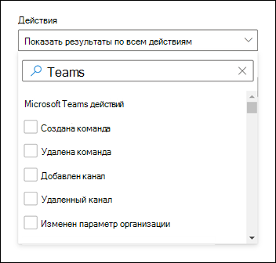

# Поиск событий Microsoft Teams в журнале аудита

> [!IMPORTANT]
> [!INCLUDE [new-teams-sfb-admin-center-notice](includes/new-teams-sfb-admin-center-notice.md)]

Журнал аудита поможет вам исследовать конкретные действия в службах Microsoft 365. Для Microsoft Teams ниже приведены некоторые из действий, которые проверяются.

- Создание команды
- Удаление команды
- Добавление канала
- Удаленный канал
- Изменен параметр канала

Полный список действий Teams, для которых выполняется аудит, см. в разделе [Действия Teams](#teams-activities) и [Смены в действиях Teams](#shifts-in-teams-activities).

> [!NOTE]
> События аудита из частных каналов также регистрируются так же, как и для команд и стандартных каналов.

## Включение аудита в Teams

Прежде чем просмотреть данные аудита, необходимо сначала включить аудит в Портал соответствия требованиям Microsoft Purview. Дополнительные сведения см. в разделе "Включение и отключение [аудита"](/microsoft-365/compliance/turn-audit-log-search-on-or-off).

> [!IMPORTANT]
> Данные аудита доступны только в том моменте, когда вы включили аудит.

## Извлечение данных Teams из журнала аудита

1. Чтобы получить журналы аудита для действий Teams, перейдите к <https://compliance.microsoft.com> разделу " **Аудит" и** выберите его.

2. На странице **поиска** отфильтруйте действия, даты и пользователей, которые требуется проверить.

3. Для дальнейшего анализа экспортируйте результаты в Excel.

Пошаговые инструкции см. в разделе ["Поиск в журнале аудита" в Центре соответствия требованиям](/microsoft-365/compliance/search-the-audit-log-in-security-and-compliance#search-the-audit-log).

> [!IMPORTANT]
> Данные аудита отображаются только в журнале аудита, если аудит включен.

Продолжительность хранения записи аудита и поиска в журнале аудита зависит от вашей подписки на Microsoft 365 или Office 365, а именно от типа лицензии, назначенной пользователям. Дополнительные сведения см. в описании [службы центра & безопасности](/office365/servicedescriptions/office-365-platform-service-description/office-365-securitycompliance-center).

## Советы по поиску в журнале аудита

Ниже приведены советы по поиску действий Teams в журнале аудита.

:::image type="content" alt-text="Снимок экрана: страница поиска по журналу аудита в Центре соответствия требованиям" source="media/audit-log-search-page.png" lightbox="media/audit-log-search-page.png":::

- Вы можете выбрать определенные действия для поиска, щелкнув флажок рядом с одним или несколькими действиями. Если выбрано действие, можно щелкнуть его, чтобы отменить выбор. Поле поиска также можно использовать для отображения действий, содержащих ключевое слово, которое вы введите.

  

- Чтобы отобразить события для действий, выполняемых с помощью командлетов, выберите "Показать **результаты для всех** действий" в **списке действий** . Если вы знаете имя операции для этих действий, введите его в поле поиска, чтобы отобразить действие, а затем выберите его.

- Чтобы очистить текущие условия поиска, нажмите кнопку **"Очистить все"**. Диапазон дат возвращается к значению по умолчанию за последние семь дней.

- Если найдено 5000 результатов, можно предположить, что существует более 5000 событий, соответствующих критериям поиска. Вы можете уточнить условия поиска и повторно запустить поиск, чтобы получить меньше результатов,  >  или экспортировать все результаты поиска, выбрав команду "Экспорт скачать **все результаты"**. Пошаговые инструкции по экспорту журналов аудита см. в статье "Экспорт результатов [поиска в файл"](/microsoft-365/compliance/search-the-audit-log-in-security-and-compliance#step-3-export-the-search-results-to-a-file).

Просмотрите [это видео, чтобы](https://www.youtube.com/embed/UBxaRySAxyE) узнать, как использовать поиск по журналам аудио. Присоединитесь к Ansuman Acharya, менеджеру программ для Teams, так как он демонстрирует, как выполнять поиск в журнале аудита для Teams.

## Действия в Teams

Ниже приведен список всех событий, регистрируемых для действий пользователей и администраторов в Teams в журнале аудита Microsoft 365. Таблица содержит понятное имя, отображаемое в столбце "Действия", и имя соответствующей операции, которая отображается в подробных сведениях записи аудита и в CSV-файле при экспорте результатов поиска.

|Понятное имя|Операция|Описание|
|---|---|---|
|Добавлен бот в команду|BotAddedToTeam|Пользователь добавляет бота в команду.|
|Добавление канала|ChannelAdded|Пользователь добавляет канал в команду.|
|Добавлен соединитель|ConnectorAdded|Пользователь добавляет соединитель в канал.|
|Добавлены сведения о собрании Teams 2|MeetingDetail|В Teams добавлены сведения о собрании, включая время начала, время окончания и URL-адрес для присоединения к собранию.|
|Добавлены сведения о участниках собрания 2|MeetingParticipantDetail|В Teams добавлены сведения о участниках собрания, включая идентификатор пользователя каждого участника, время присоединения участника к собранию и время, когда участник покинул собрание.|
|Добавлены члены|MemberAdded|Владелец команды добавляет участников в команду, канал или групповой чат.|
|Добавлена вкладка|TabAdded|Пользователь добавляет вкладку в канал.|
|Изменен параметр канала|ChannelSettingChanged|Операция ChannelSettingChanged регистрируется, когда участник команды выполняет следующие действия. Для каждого из этих действий описание параметра, который был изменен (показан в круглых скобках, отображается в столбце **Item** в результатах поиска журнала аудита. <ul><li>Изменение имени канала группы (**имя канала**)</li><li>Изменение описания канала группы (**описание канала**)</li> </ul>|
|Изменен параметр организации|TeamsTenantSettingChanged|Операция TeamsTenantSettingChanged регистрируется при выполнении следующих действий глобальным администратором в Центр администрирования Microsoft 365. Эти действия влияют на параметры Teams для всей организации. Дополнительные сведения см. [в статье "Управление параметрами Teams для вашей организации"](enable-features-office-365.md).  Для каждого из этих действий в столбце **Item** в результатах поиска журнала аудита отображается описание измененного параметра (показанного в круглых скобках).<ul><li>Включает или отключает Teams для организации (**Microsoft Teams**).</li><li>Включает или отключает взаимодействие между Microsoft Teams и Skype для бизнеса для организации (Skype для бизнеса **взаимодействия**).</li><li>Включает или отключает представление организационной диаграммы в клиентах Microsoft Teams (**представление организационной диаграммы**).</li><li>Включает или отключает возможность для участников команды планировать закрытые собрания (планирование **частных собраний**).</li><li>Включает или отключает возможность для участников команды планировать собрания каналов (планирование **собраний канала**).</li><li>Включает или отключает видеозвонки в собраниях Teams (**видео для собраний Skype**).</li><li>Включает или отключает демонстрацию экрана в собраниях Microsoft Teams для организации (демонстрация **экрана для собраний Skype**).</li><li>Включает или отключает эту возможность добавления анимированных изображений (giphys) в беседы Teams (**анимированные изображения**).</li><li>Изменяет параметр оценки содержимого для организации (**оценка содержимого**). Оценка содержимого ограничивает тип анимированных изображений, которые могут отображаться в беседах.</li><li>Включает или отключает возможность для участников команды добавлять настраиваемые образы (называемые настраиваемыми мемами) из Интернета в беседы группы (настраиваемые образы **из Интернета**).</li><li>Включает или отключает возможность для участников команды добавлять редактируемые изображения (называемые наклейками) в беседы группы (**редактируемые изображения**).</li><li>Включает или отключает эту возможность для участников команды использовать ботов в чатах и каналах Microsoft Teams (**боты для всей организации).**</li><li>Включает конкретные боты для Microsoft Teams. Это не относится к боту T-Bot, который является ботом справки Teams, который доступен, когда боты включены для организации (**отдельные боты**).</li><li>Включает или отключает возможность добавления расширений или вкладок (расширений или вкладок) для участников **команды**.</li><li>Включает или отключает неопубликоваемую загрузку собственных ботов для Microsoft Teams (загрузка ботов на **стороне**).</li><li>Включает или отключает возможность отправки сообщений электронной почты пользователями в канал Microsoft Teams (**канал электронной почты**).</li></ul>|
|Изменена роль участников в команде|MemberRoleChanged|Владелец команды изменяет роль участников в команде. Следующие значения указывают тип роли, назначенный пользователю.   **1** . Указывает роль участника. **2** . Указывает роль владельца. **3** . Указывает роль гостя.  Свойство Members также содержит имя вашей организации и адрес электронной почты участника.|
|Изменен параметр команды|TeamSettingChanged|Операция TeamSettingChanged регистрируется, когда владелец команды выполняет следующие действия. Для каждого из этих действий в столбце **Item** в результатах поиска журнала аудита отображается описание измененного параметра (показанного в круглых скобках).<ul><li>Изменяет тип доступа для команды. Teams можно задать как частные или общедоступные (**тип доступа группы**). Если команда является закрытой (параметр по умолчанию), пользователи могут получить доступ к команде только по приглашению. Когда команда является общедоступной, ее может обнаружить любой пользователь.</li><li>Изменяет классификацию сведений для команды (**классификация команды**). Например, данные группы можно классифицировать как высокое влияние на бизнес, среднее влияние на бизнес или низкое влияние на бизнес.</li><li>Изменяет имя команды (**имя команды**).</li><li>Изменяет описание команды (**описание команды**).</li><li>Изменения, внесенные в параметры команды. Чтобы получить доступ к этим параметрам, владелец команды может щелкнуть команду правой кнопкой мыши, выбрать команду " **Управление" и** выбрать вкладку **"Параметры** ". Для этих действий имя измененного параметра отображается в столбце **Item** в результатах поиска журнала аудита.</li></ul>|
|Создание чата 1,  2|ChatCreated|Был создан чат Teams.|
|Созданная команда|TeamCreated|Пользователь создает команду.|
|Удалено сообщение|MessageDeleted|Сообщение в чате или канале было удалено.|
|Удалены все приложения организации|DeletedAllOrganizationApps|Удалены все приложения организации из каталога.|
|Удалено приложение|AppDeletedFromCatalog|Приложение удалено из каталога.|
|Удаленный канал|ChannelDeleted|Пользователь удаляет канал из команды.|
|Удаленная команда|TeamDeleted|Владелец команды удаляет команду.|
|Изменено сообщение со ссылкой на URL-адрес в Teams|MessageEditedHasLink|Пользователь редактирует сообщение и добавляет ссылку на URL-адрес в Teams.|
|Экспортированные сообщения 1,  2|MessagesExported|Сообщения чата или канала были экспортированы.|
|Не удалось проверить приглашение к общему каналу3|FailedValidation|Пользователь отвечает на приглашение к общему каналу, но не удалось выполнить проверку приглашения.|
|Извлеченный чат 1,  2|ChatRetrieved|Получен чат Microsoft Teams.|
|Извлечено все размещенное содержимое сообщения1,  2|MessageHostedContentsListed|Было извлечено все размещенное в сообщении содержимое, например изображения или фрагменты кода.|
|Установлено приложение|AppInstalled|Приложение установлено.|
|Выполненное действие на карточке|PerformedCardAction|Пользователь выполнил действие с адаптивной карточкой в чате. Адаптивные карточки обычно используются ботами для отображения информации и взаимодействия в чатах.   **Примечание:** В журнале аудита будут доступны только встроенные входные действия для адаптивной карточки в чате. Например, когда пользователь отправляет ответ опроса в беседе канала на адаптивной карточке, созданной ботом опроса. Действия пользователя, такие как "Просмотр результата", которые открывают диалоговое окно или действия пользователя в диалоговых окнах, будут недоступны в журнале аудита.|
|Опубликовано новое сообщение 1,  2|MessageSent|Новое сообщение было опубликовано в чате или канале.|
|Опубликовано приложение|AppPublishedToCatalog|Приложение было добавлено в каталог.|
|Чтение сообщения 1,  2|MessageRead|Было извлечено сообщение чата или канала.|
|Чтение размещенного содержимого сообщения 1,  2|MessageHostedContentRead|Было извлечено размещенное содержимое в сообщении, например изображение или фрагмент кода.|
|Удален бот из команды|BotRemovedFromTeam|Пользователь удаляет бота из команды.|
|Удаленный соединитель|ConnectorRemoved|Пользователь удаляет соединитель из канала.|
|Удаленные члены|MemberRemoved|Владелец команды удаляет участников из чата команды, канала или группы.|
|Удален общий доступ к каналу группы3|TerminatedSharing|Команда или владелец канала отключает общий доступ к общему каналу.|
|Восстановлен общий доступ к каналу группы3|SharingRestored|Команда или владелец канала повторно включил общий доступ к общему каналу.|
|Удаленная вкладка|TabRemoved|Пользователь удаляет вкладку из канала.|
|Ответ на приглашение для общего канала3|InviteeResponded|Пользователь ответил на приглашение общего канала.|
|Ответ на приглашение на общий канал3|ChannelOwnerResponded|Владелец канала ответил на ответ пользователя, который ответил на приглашение общего канала.|
|Извлеченные сообщения 1,  2|MessagesListed|Были получены сообщения из чата или канала.|
|Отправлено сообщение со ссылкой на URL-адрес в Teams|MessageCreatedHasLink|Пользователь отправляет сообщение со ссылкой на URL-адрес в Teams.|
|Отправлено уведомление об изменении для создания сообщения 1,  2|MessageCreatedNotification|Было отправлено уведомление об изменении для уведомления приложения подписанного прослушивателя о новом сообщении.|
|Отправлено уведомление об изменении для удаления сообщения 1,  2|MessageDeletedNotification|Было отправлено уведомление об изменении для уведомления приложения подписанного прослушивателя об удалении сообщения.|
|Отправлено уведомление об изменении для сообщения с обновлением 1,  2|MessageUpdatedNotification|Было отправлено уведомление об изменении для уведомления приложения подписанного прослушивателя об обновлении сообщения.|
|Отправлено приглашение для общего канала3|InviteSent|Владелец или член канала отправляет приглашение общему каналу. Приглашения к общим каналам могут отправляться пользователям за пределами вашей организации, если политика канала настроена для совместного использования канала с внешними пользователями.|
|Подписка на уведомления об изменениях сообщений 1,  2|SubscribedToMessages|Подписка была создана приложением прослушивателя для получения уведомлений об изменениях для сообщений.|
|Удалено приложение|AppUninstalled|Приложение было удалено.|
|Приложение обновлено|AppUpdatedInCatalog|Приложение было обновлено в каталоге.|
|Обновлен чат 1,  2|ChatUpdated|Чат Teams был обновлен.|
|Обновлено сообщение 1,  2|MessageUpdated|Сообщение чата или канала было обновлено.|
|Обновленный соединитель|ConnectorUpdated|Пользователь изменил соединитель в канале.|
|Обновленная вкладка|TabUpdated|Пользователь изменил вкладку в канале.|
|Обновлено приложение|AppUpgraded|Приложение было обновлено до последней версии в каталоге.|
|Пользователь, вошед в Teams|TeamsSessionStarted|Пользователь входит в клиент Microsoft Teams. Это событие не фиксирует действия по обновлению маркера.|

> [!NOTE]
> 1 Запись аудита для этого события регистрируется только при выполнении операции путем вызова microsoft API Graph. Если операция выполняется в клиенте Teams, запись аудита не регистрируется 2 Это событие доступно только в audit (Premium). Это означает, что пользователям должна быть назначена соответствующая лицензия, прежде чем эти события будут регистрироваться в журнале аудита. Дополнительные сведения о действиях, доступных только в audit (Premium), см. [в разделе Audit (Premium) в Microsoft Purview](/microsoft-365/compliance/advanced-audit#advanced-audit-events). Сведения о требованиях к лицензированию аудита (цен. категория "Премиум") см. в разделе " [Решения аудита" в Microsoft 365](/microsoft-365/compliance/auditing-solutions-overview#licensing-requirements).   3 . Это событие находится в общедоступной предварительной версии.

## Смены в действиях Teams

**(предварительная версия)**

Если ваша организация использует приложение "Смены" в Teams, вы можете искать действия, связанные с приложением Shifts, в журнале аудита. Ниже приведен список всех событий, регистрируемых для действий shifts в Teams в журнале аудита Microsoft 365.

|Понятное имя|Операция|Описание|
|---|---|---|
|Добавлена группа планирования|ScheduleGroupAdded|Пользователь успешно добавляет новую группу планирования в расписание.|
|Измененная группа планирования|ScheduleGroupEdited|Пользователь успешно изменяет группу планирования.|
|Удаленная группа планирования|ScheduleGroupDeleted|Пользователь успешно удаляет группу планирования из расписания.|
|Расписание With|ScheduleWithdrawn|Пользователь успешно отзывает опубликованное расписание.|
|Добавлена смена|ShiftAdded|Пользователь успешно добавляет смену.|
|Измененная смена|ShiftEdited|Пользователь успешно изменяет смену.|
|Удаленная смена|ShiftDeleted|Пользователь успешно удаляет смену.|
|Добавлено время ожидания|TimeOffAdded|Пользователь успешно добавляет время ожидания по расписанию.|
|Измененное время ожидания|TimeOffEdited|Пользователь успешно изменяет время ожидания.|
|Удаленное время ожидания|TimeOffDeleted|Пользователь успешно удаляет время ожидания.|
|Добавлена открытая смена|OpenShiftAdded|Пользователь успешно добавляет открытый сдвиг в группу планирования.|
|Измененная открытая смена|OpenShiftEdited|Пользователь успешно изменяет открытую смену в группе планирования.|
|Удалена открытая смена|OpenShiftDeleted|Пользователь успешно удаляет открытый сдвиг из группы планирования.|
|Общее расписание|ScheduleShared|Пользователь успешно предоставил общий доступ к расписанию группы для диапазона дат.|
|С часовой стрелкой с часовой стрелкой|ClockedIn|Пользователь успешно использует часы времени.|
|Время ожидания с использованием часов времени|ClockedOut|Пользователь успешно отсевит часы с помощью часов времени.|
|Начался разрыв с использованием часов времени|BreakStarted|Пользователь успешно запускает разрыв во время активного сеанса часов времени.|
|Завершенный разрыв с использованием часов времени|Разорвано|Пользователь успешно завершает разрыв во время активного сеанса часов времени.|
|Добавлена запись "Часы времени"|TimeClockEntryAdded|Пользователь успешно добавляет новую ручную запись часов времени на листе времени.|
|Измененная запись часов времени|TimeClockEntryEdited|Пользователь успешно редактирует запись "Часы времени" на листе времени.|
|Удаленная запись часов времени|TimeClockEntryDeleted|Пользователь успешно удаляет запись часов времени на листе времени.|
|Добавлен запрос на смену|RequestAdded|Пользователь добавил запрос на смену.|
|Ответ на запрос на смену|RequestRespondedTo|Пользователь ответил на запрос на смену.|
|Отмененный запрос на смену|RequestCancelled|Пользователь отменил запрос на смену.|
|Изменен параметр расписания|ScheduleSettingChanged|Пользователь изменяет параметр в параметрах shifts.|
|Добавлена интеграция с сотрудниками|WorkforceIntegrationAdded|Приложение Shifts интегрировано со сторонней системой.|
|Принятое сообщение о смене|OffShiftDialogAccepted|Пользователь подтверждает сообщение о смене для доступа к Teams в нерабочее время.|

## Office 365 API действий управления

Для получения сведений о событиях Teams Office 365 API действий управления. Дополнительные сведения о схеме API действий управления для Teams см. в [схеме Teams](/office/office-365-management-api/office-365-management-activity-api-schema#microsoft-teams-schema).

## Атрибуция в журналах аудита Teams

Изменения членства в Teams (например, добавленные или удаленные пользователи), внесенные через Azure Active Directory (Azure AD), портал администрирования Microsoft 365 или Группы Microsoft 365 API Graph, будут отображаться в сообщениях аудита Teams и в канале "Общие" с атрибутом существующего владельца команды, а не фактического инициатора действия. В этих сценариях обратитесь к Azure AD или журналам аудита группы [Microsoft 365](/microsoft-365/compliance/search-the-audit-log-in-security-and-compliance), чтобы просмотреть соответствующие сведения.

## Настройка политик действий с помощью Defender для облачных приложений

С [Microsoft Defender for Cloud Apps](/cloud-app-security/what-is-cloud-app-security) интеграции можно настроить политики действий для  применения широкого спектра автоматизированных процессов с помощью API поставщика приложений. Эти политики позволяют отслеживать определенные действия, выполняемые различными пользователями, или отслеживать неожиданно высокую частоту одного из определенных типов действий.

После установки политики обнаружения действий она начинает создавать оповещения. Оповещения создаются только для действий, которые происходят после создания политики. Ниже приведены некоторые примеры сценариев использования политик действий в Defender для облачных приложений для мониторинга действий Teams.

### Сценарий внешнего пользователя

Одним из сценариев, на которые вы можете следить с точки зрения бизнеса, является добавление внешних пользователей в среду Teams. Если внешние пользователи включены, рекомендуется выполнять мониторинг их присутствия.  Defender для [облачных приложений можно](/cloud-app-security/what-is-cloud-app-security) использовать для выявления потенциальных угроз.

:::image type="content" alt-text="Политика для отслеживания добавления внешних пользователей." source="media/TeamsExternalUserAddPolicy.png" lightbox="media/TeamsExternalUserAddPolicy.png":::

Снимок экрана этой политики для отслеживания добавления внешних пользователей позволяет назначать политику, задавать серьезность в соответствии с потребностями бизнеса, задавать для нее одно действие, а затем устанавливать параметры, которые будут специально отслеживать только добавление не внутренних пользователей и ограничивать это действие Teams.

Результаты этой политики можно просмотреть в журнале действий:

:::image type="content" alt-text="События, активированные политикой внешних пользователей." source="media/TeamsExternalUserList.png" lightbox="media/TeamsExternalUserList.png":::

Здесь можно просмотреть совпадения с заданной политикой, внести необходимые изменения или экспортировать результаты для использования в другом месте.

### Сценарий массового удаления

Как упоминалось ранее, можно отслеживать сценарии удаления. Можно создать политику, которая будет отслеживать массовое удаление сайтов Teams. В этом примере политика на основе оповещений настроена для обнаружения массового удаления команд в течение 30 минут.

:::image type="content" alt-text="Политика, показывающая настройку политики для обнаружения массового удаления команды." source="media/TeamsMassDeletePolicy.png" lightbox="media/TeamsMassDeletePolicy.png":::

Как показано на снимке экрана, для этой политики можно задать множество различных параметров для отслеживания удалений Teams, включая серьезность, одно или несколько повторяющихся действий, а также параметры, ограничивающие это удалением Teams и сайта. Это можно сделать независимо от шаблона или создать шаблон для данной политики в зависимости от потребностей организации.

После установки политики, которая подходит для вашего бизнеса, вы можете просмотреть результаты в журнале действий при активации событий:

:::image type="content" alt-text="Снимок экрана: события, активированные массовым удалением." source="media/TeamsMassDeleteList.png" lightbox="media/TeamsMassDeleteList.png":::

Вы можете выполнить фильтрацию по настроенной политике, чтобы просмотреть результаты этой политики. Если результаты, которые вы получаете в журнале действий, неудовлетворительны (возможно, вы видите много результатов или ничего не видите), это может помочь вам точно настроить запрос, чтобы сделать его более релевантным к нужному.

### Сценарий оповещений и управления

Вы можете настроить оповещения и отправлять сообщения электронной почты администраторам и другим пользователям при активации политики действий. Вы можете настроить автоматические действия управления, такие как приостановка пользователя или повторное выполнение входа автоматически. В этом примере показано, как можно приостановить учетную запись пользователя при активации политики действий и определить, что пользователь удалил две или более команд за 30 минут.

## Настройка политик обнаружения аномалий с помощью Defender для облачных приложений

Политики [обнаружения](/cloud-app-security/anomaly-detection-policy) аномалий в Defender для облачных приложений предоставляют встроенную аналитику поведения пользователей и сущностей (UEBA) и машинного обучения (ML), чтобы можно было немедленно запустить расширенное обнаружение угроз в облачной среде. Так как они автоматически включены, новые политики обнаружения аномалий предоставляют немедленные результаты, предоставляя немедленные обнаружения, нацеленные на многочисленные аномалии поведения пользователей, компьютеров и устройств, подключенных к сети. Кроме того, новые политики предоставляют больше данных от подсистемы обнаружения Defender для облачных приложений, чтобы ускорить процесс исследования и содержать текущие угрозы.

Мы работаем над интеграцией событий Teams в политики обнаружения аномалий. Сейчас вы можете настроить политики обнаружения аномалий для других продуктов Office и выполнять действия с пользователями, которые соответствуют этим политикам.

## См. также

- [Поиск в журнале аудита в Портал соответствия требованиям Microsoft Purview](/microsoft-365/compliance/search-the-audit-log-in-security-and-compliance)
