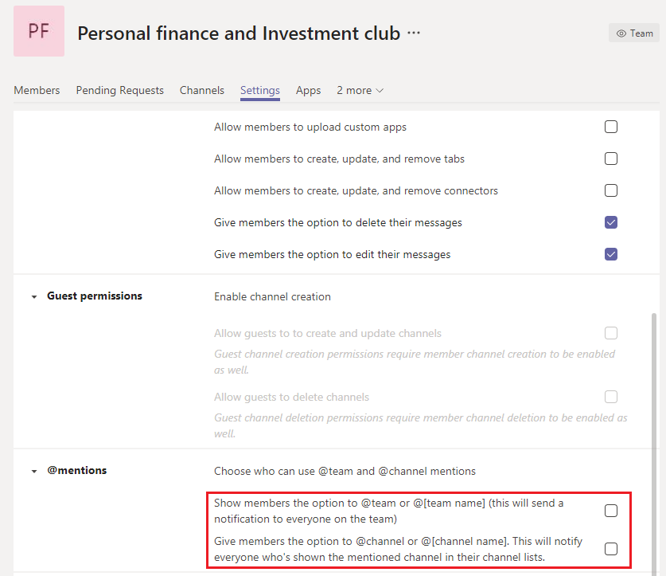

# Управление большими командами в Microsoft Teams — рекомендации

Microsoft Teams одинаково эффективно поддерживает обмен данными между небольшими группами с десятками участников и большими группами с тысячами участников. [Ознакомьтесь с ограничениями и спецификациями Для Teams](limits-specifications-teams.md), чтобы ознакомиться с обновлениями размеров команд. Увеличение размера группы приводит к уникальным задачам управления и эксплуатации. В этой статье описываются рекомендации по созданию и управлению большими командами, состоящими из тысяч участников.

## Ценность больших команд

Крупные команды очень полезны при реализации следующих сценариев совместной работы:

- **Совместная** работа в пределах отдела. Если в вашей организации есть несколько отделов, таких как "Финансы", "Операции", "R&D" и т. д., можно создать одну команду, включаемую всех участников в определенный отдел. Теперь все сообщения, относящиеся к отделу, можно совместно использовать в этой команде, что упрощает мгновенное взаимодействие с участниками.

- **Совместная работа в группах ресурсов** сотрудников: организации часто имеют большие группы людей с взаимной интересами, принадлежащих к другому отделу или рабочей группе. Например, может быть группа людей, которые совместно используют личные финансы и инвестиции. Часто бывает трудно подключиться в крупной организации. Чтобы разработать сообщества для таких групп, администраторы клиентов могут создать большую команду, которая выступает в качестве общедоступной группы ресурсов для всей компании, к которую может присоединиться любой пользователь и воспользоваться преимуществами. В конечном итоге эти сообщества собирают информацию, которую могут использовать как новые, так и существующие участники.

- **Совместная работа между** внутренними и внешними членами. Популярные продукты часто разрабатывают сообщество ранних последователей, которые хотят попробовать новые выпуски продуктов и оставить отзыв. Ранние последователей разрабатывают связь с группами продуктов, чтобы помочь сформировать продукт. В таких сценариях администраторы клиентов могут настроить большую команду, включаемую как внутренние группы продуктов, так и внешние средства оценки продуктов для упрощения расширенного процесса разработки продукта. Эти команды также могут предоставлять поддержку клиентам для выбранного набора клиентов.

## Создание команд из существующих групп

Используйте группы контактов, группы безопасности или группы Office, чтобы перейти к началу работы с командой. Вы можете импортировать группу, чтобы создать команду или создать ее из группы Office.

**Импортируйте группу**, чтобы создать команду. При импорте группы с до 3500 участников в Teams Teams автоматически вычисляет общее количество участников в группе. Это только один раз импорт, и будущие изменения в группе не будут автоматически обновляться в Teams.

Создайте команду из большой группы **Microsoft 365**. При создании команды из большой группы Microsoft 365 участники автоматически являются частью группы Microsoft 365 и команды. В будущем, когда участники команды присоединяются к группе Microsoft 365 или покидают ее, они автоматически добавляются в нее или удаляются из нее.

## Массовый импорт, экспорт и удаление участников команды

Этот портал Azure позволяет пользователям выполнять массовый импорт, экспорт и удаление участников в группе Microsoft 365. Дополнительные сведения см. в разделе ["Массовый импорт элементов группы"](/azure/active-directory/enterprise-users/groups-bulk-import-members#to-bulk-import-group-members).

Так как каждая команда поддерживается группой Microsoft 365, вы можете использовать портал Azure для выполнения этих операций в группе, соответствующей команде. Операции участников будут отражены в команде в течение 24 часов.

## Создать каналы для обсуждения

Вы можете сузить обсуждения групп, создав каналы с фокусом. [Ознакомьтесь с рекомендациями по организации команд](best-practices-organizing.md).

## Ограничение создания канала

Если любому участнику команды разрешено создавать каналы, у этой команды может быть разрастающееся количество каналов. Владельцы команд должны отключить создание, обновление, удаление и восстановление каналов для участников в разделе "Параметры **>"**. См [. общие сведения о командах и каналах](teams-channels-overview.md).

## Добавление избранных каналов

Чтобы ускорить новое вовлечение пользователей и обнаружение содержимого, можно выбрать избранные каналы, доступные пользователю по умолчанию. В области **"Каналы** " Центра администрирования проверьте каналы в столбце **"Показать для участников** ".

 [Дополнительные сведения см. в](get-started-with-teams-create-your-first-teams-and-channels.md) статье "Создание первых команд и каналов".

## Регулирование приложений и ботов в больших командах

Чтобы предотвратить добавление отвлекающих приложений или ботов, владельцы команд могут отключать, добавлять, удалять и отправлять приложения и соединители для участников команды. В центре администрирования в **разделе "**>", снимите флажки трех параметров, позволяющих участникам добавлять приложения или соединители.

[Ознакомьтесь с общими сведениями о приложениях Teams](deploy-apps-microsoft-teams-landing-page.md).

## Регулирование упоминаний в командах и каналах

Упоминания команд и каналов можно использовать для того, чтобы привлечь внимание всей команды к определенным публикациям канала. После использования упоминания в записи тысячам участников команды отправляется уведомление. Если уведомления слишком часты, участники команды могут перегружаться и могут отправлять жалобы владельцам команд. Чтобы предотвратить упоминания команд или каналов, отключите упоминания команд и каналов для участников, снимив флажки в области параметров **> @mentions** teams.

## Рассмотрите возможность настройки модерации в ваших каналах

Владельцы команд могут включить модерацию для канала, чтобы контролировать, кто может создавать новые сообщения и отвечать на сообщения в этом канале. Когда вы настраиваете модерацию, вы можете выбрать одного или нескольких членов команды в качестве модераторов. Владельцы команд по умолчанию являются модераторами. Дополнительные сведения см. в разделе ["Настройка модерации каналов и управление ими"](manage-channel-moderation-in-teams.md).

## См. также

- [Рекомендации по организации Teams](best-practices-organizing.md)
- [Создание команды для всей организации](create-an-org-wide-team.md)