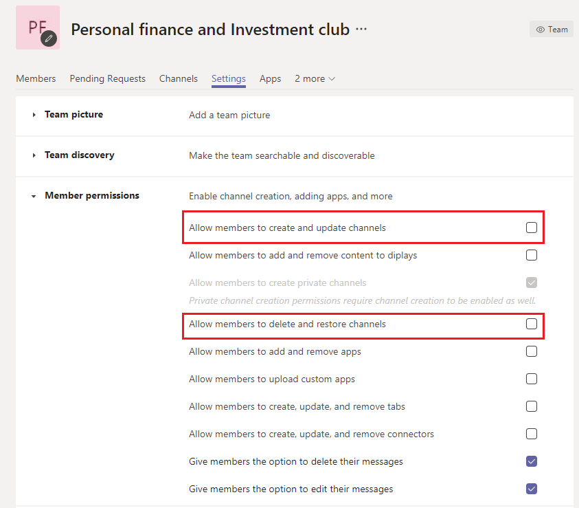

# Управление большими командами в Microsoft Teams - лучшие методики

Microsoft Teams не менее эффективны для уравняющих связей между небольшими группами с десятками участников и большими группами с тысячами участников. Просмотрите [ограничения и спецификации для Teams](limits-specifications-teams.md) для обновлений размеров группы. Увеличение размера группы приводит к уникальным задачам управления и эксплуатации. В этой статье описаны методики создания и управления большими командами, состоящими из тысяч участников.

## Значение больших команд

Большие группы очень полезны для включения следующих сценариев совместной работы:

- Совместная работа в рамках всего **отдела.** Если в вашей организации есть несколько отделов, таких как финансы, операции, отделы&D и т. д., вы можете создать одну команду, включаю в нее всех сотрудников определенного отдела. Теперь в этой группе можно совместно использовать все сообщения, относящуюся к отделу, что упрощает обмен информацией и взаимодействие с участниками.

- **Совместная работа в группах ресурсов** сотрудников. В организациях часто есть большие группы людей с интересами, которые принадлежат к другому отделу или рабочей группе. Например, может быть группа людей, которые разделяют энтузиазм по личных финансам и инвестициям. В крупной организации зачастую бывает сложно подключиться. Чтобы разработать сообщества для таких групп, администраторы клиентов могут создать большую группу ресурсов, которая является открытой группой ресурсов в масштабах всей компании, в которую может присоединиться любой человек. Со временем эти сообщества собирают сведения, которые могут использовать как новые, так и существующие участники.

- **Совместная работа** между внутренними и внешними участниками. Популярные продукты часто разрабатывают сообщество ранних пользователей, которые хотят попробовать новые выпуски продуктов и предоставить отзывы. Ранние принятия разрабатывают отношения с группами продуктов, чтобы помочь сформировать продукт. В таких случаях администраторы клиентов могут создать большую группу, которая включает как внутренние группы продуктов, так и внешние оценки продуктов, чтобы упростить процесс разработки продукта. Эти группы также могут предоставлять поддержку для выбранного набора клиентов.

## Создание команд из существующих групп

Используйте группы контактов, группы безопасности или Office групп, чтобы приступить к команде. Вы можете импортировать группу, чтобы создать ее или создать ее из Office группы.

**Импорт группы** в группу. При импорте группы с численностью до 3500 участников в Teams Teams автоматически вычисляет общее количество участников в группе. Это разовая импортируемая информация, и последующие изменения в группе не будут автоматически обновляться в Teams.

**Создание команды из** большой группы Microsoft 365: при создании команды из большой группы Microsoft 365 группы участники автоматически становятся  частью Microsoft 365 группы и команды. В будущем, когда участники группы присоединяются к группе Microsoft 365 покидают ее, они автоматически добавляются в нее или удаляются из нее.

## Массовый импорт, экспорт и удаление участников группы

На портале Azure пользователи могут массово импортировать, экспортировать и удалять участников Microsoft 365 группы. Дополнительные сведения см. в [сведениях О массовом импорте участников группы.](/azure/active-directory/enterprise-users/groups-bulk-import-members#to-bulk-import-group-members)

Так как каждая группа использует Microsoft 365, вы можете использовать портал Azure для выполнения этих операций в соответствующей группе. Операции с членами будут отражены в группе в течение 24 часов.

## Создать каналы для обсуждения

Вы можете сузить обсуждение группы, создав каналы с фокусом. См. [методики организации команд.](best-practices-organizing.md)

## Ограничение создания канала

Если участнику группы разрешено создавать каналы, у этой команды может быть спрайт каналов. Владельцы команд должны отключить создание, обновление, удаление и восстановление канала для **Параметры > права участника**. См. [обзор команд и каналов.](teams-channels-overview.md)

## Добавление избранных каналов

Чтобы ускорить новое вовлечение пользователей и обнаружение контента, вы можете выбрать избранные каналы, доступные пользователю по умолчанию. В **области Каналы** Центра администрирования проверьте каналы в столбце **Показать для участников.**

 Дополнительные [сведения см. в теме Создание первых групп и](get-started-with-teams-create-your-first-teams-and-channels.md) каналов.

## Регулирование приложений и ботов в больших командах

Чтобы предотвратить добавление отвлекающих приложений или ботов, владельцы команд могут отключать, добавлять, удалять и добавлять приложения и соединители для участников команды. В Центре администрирования в **Параметры >** разрешениях для участников , с помощью трех параметров, позволяющих участникам добавлять приложения или соединители.

См. [приложения, боты и & соединители.](deploy-apps-microsoft-teams-landing-page.md)

## Регулирование упоминаний в группах и каналах

Упоминания в командах и каналах можно использовать для привлечь внимание всей команды к определенным публикациям в каналах. После использования упоминания в сообщении тысячам участников группы отправляется уведомление. Если уведомлений слишком много, это может привести к перегрузке и жалобам владельцев команд. Чтобы запретить упоминания в командах или каналах, отключите упоминания в командах  и каналах для участников, сключив флажки в Параметры > @mentions командах.

## Рассмотрите возможность настройки модерации в ваших каналах

Владельцы команд могут включить модерацию для канала, чтобы контролировать, кто может создавать новые сообщения и отвечать на сообщения в этом канале. Когда вы настраиваете модерацию, вы можете выбрать одного или нескольких членов команды в качестве модераторов. По умолчанию владельцы команд являются модераторами. Дополнительные сведения см. в [теме Настройка модерации канала и управление ими.](manage-channel-moderation-in-teams.md)

## Статьи по теме

- [Лучшие методики организации Teams](best-practices-organizing.md)
- [Создание команды для всей организации](create-an-org-wide-team.md)