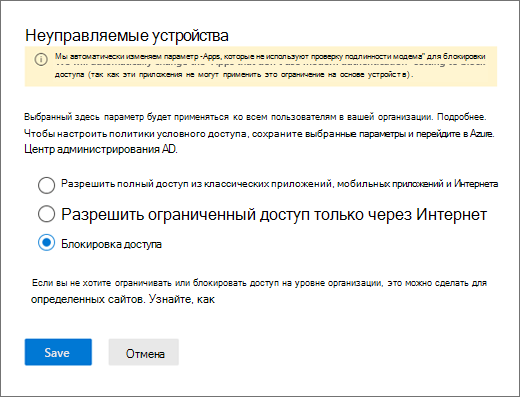

# Блокировка доступа к SharePoint для определенных пользователей

Применение политики условного доступа в SharePoint в Microsoft 365 также обеспечивает ее применение в Teams. Некоторые организации хотят блокировать доступ к файлам SharePoint (отправка, скачивание, просмотр, изменение, создание), но разрешать своим сотрудникам использовать классические, мобильные и веб-клиенты Teams на неуправляемых устройствах. В рамках правил политики условного доступа блокировка SharePoint также приведет к блокировке Teams. В этой статье описано, как обойти это ограничение и разрешить своим сотрудникам продолжать использование Teams при полной блокировке доступа к файлам, хранящимся в SharePoint.

> [!Note]
> Для блокирования или ограничения доступа на неуправляемых устройствах применяются политики условного доступа Azure AD. Сведения о [лицензировании Azure AD](https://azure.microsoft.com/pricing/details/active-directory/). Общие сведения о условном доступе в Azure AD см. в статье [Условный доступ в Azure Active Directory](https://docs.microsoft.com/azure/active-directory/conditional-access/overview). Сведения о рекомендуемых политиках доступа SharePoint Online см. в статье рекомендации по [Рекомендации политики по защите сайтов и файлов SharePoint](https://docs.microsoft.com/microsoft-365/enterprise/sharepoint-file-access-policies). Если вы ограничили доступ на неуправляемых устройствах, пользователи управляемых устройств должны использовать [поддерживаемые сочетания ОС и браузера](https://docs.microsoft.com/azure/active-directory/conditional-access/technical-reference#client-apps-condition) или их доступ также будет ограничен.

Можно заблокировать или ограничить доступ:

- для сотрудников организации или только для некоторых пользователей либо групп безопасности;

- ко всем сайтам организации или только к некоторым сайтам.

Если доступ заблокирован, пользователь увидит сообщение об ошибке. Блокировка доступа помогает обеспечить безопасность и защищает конфиденциальные данные. Если доступ заблокирован, пользователь увидит сообщение об ошибке.

1. Откройте Центр администрирования SharePoint.

2. Разверните **Политики** > **Политики доступа**.

3. В разделе **Неуправляемые устройства** выберите **Блокировать доступ** и нажмите **Сохранить**.

   

4. Откройте портал [Azure Active Directory](https://portal.azure.com/#blade/Microsoft_AAD_IAM/ConditionalAccessBlade/Policies) и перейдите в **Политики условного доступа**.

    Вы увидите новую политику, созданную приложением SharePoint, как в следующем примере:

    

5. Обновите политику, чтобы назначить ее только определенным пользователям или группам.

    

  > [!Note]
> Настройка этой политики запретит вам доступ к порталу администрирования SharePoint. Рекомендуем настроить политику исключения и выбрать глобальных администраторов и администраторов SharePoint.

6. В качестве конечного облачного приложения выберите только SharePoint

    

7. Обновите **Условия**, чтобы добавить классические клиенты.

    

8. Включите **Предоставление доступа**

    

9. Включите **Использовать ограничения на основе приложений**.

10. Включите свою политику и выберите **Сохранить**.

    

Чтобы протестировать политику, вам требуется выйти из любого клиента, например из классического приложения Teams или клиента синхронизации OneDrive для бизнеса, а затем снова войти, чтобы увидеть работу политики. Если ваш доступ заблокирован, в Teams появится сообщение о том, что элемент может отсутствовать.

 

В SharePoint появится сообщение об отказе в доступе.

## Статьи по теме

[Управление доступом для неуправляемым устройств в SharePoint](https://docs.microsoft.com/sharepoint/control-access-from-unmanaged-devices)
