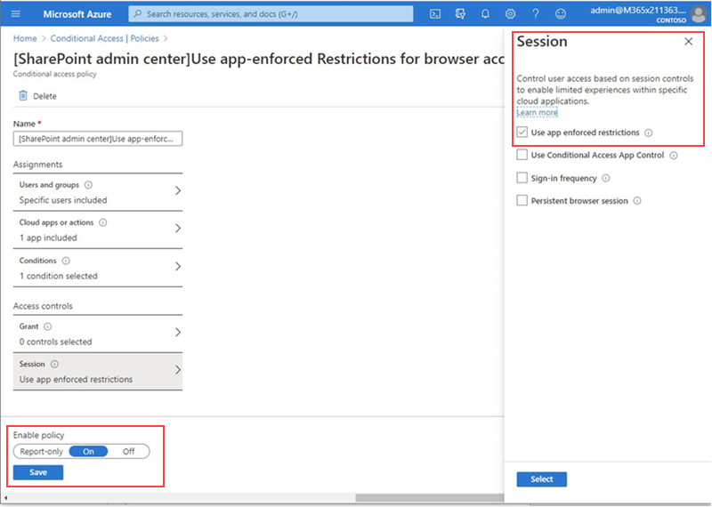

# Блокировка доступа к SharePoint для определенных пользователей

Применение политики условного доступа (ЦС) в SharePoint в Microsoft 365 также применяется к Teams. Тем не менее, в некоторых организациях нужно заблокировать доступ к файлам SharePoint (добавить, скачать, просмотреть, изменить, создать), но разрешить их сотрудникам использование настольных, мобильных и веб-клиентов Teams на неуправляемых устройствах. В соответствии с правилами политики ЦС блокировка SharePoint может также привести к блокировке групп. В этой статье объясняется, как можно обойти это ограничение и позволить вашим сотрудникам продолжать использовать Teams и полностью блокировать доступ к файлам, хранящимся в SharePoint.

> [!Note]
> Блокировка или ограничение доступа на неуправляемых устройствах зависит от политик условного доступа Azure AD. Дополнительные сведения о [лицензировании Azure AD](https://azure.microsoft.com/pricing/details/active-directory/). Общие сведения об условном доступе в Azure AD см. [в разделе условный доступ в Azure Active Directory](https://docs.microsoft.com/azure/active-directory/conditional-access/overview). Сведения о рекомендуемых политиках доступа SharePoint Online см. в разделе [рекомендации по политике безопасности сайтов и файлов SharePoint](https://docs.microsoft.com/microsoft-365/enterprise/sharepoint-file-access-policies). Если вы ограничили доступ к неуправляемым устройствам, пользователи на управляемых устройствах должны использовать одну из [поддерживаемых комбинаций ОС и браузеров](https://docs.microsoft.com/azure/active-directory/conditional-access/technical-reference#client-apps-condition), или они также будут иметь ограниченный доступ.

Вы можете заблокировать или ограничить доступ к:

- Пользователи в организации или только некоторые пользователи или группы безопасности.

- Все сайты в организации или только некоторые сайты.

Когда Access блокируется, пользователи увидят сообщение об ошибке. Блокировка доступа обеспечивает безопасность и защищает конфиденциальные данные. Когда Access блокируется, пользователи увидят сообщение об ошибке.

1. Откройте [центр администрирования](https://admin.microsoft.com/sharepoint?page=accessControl&modern=true)SharePoint.

2. **Разворачивание политик**  >  **доступа**.

3. В разделе **неуправляемые устройства** выберите команду **блокировать доступ** и нажмите кнопку **сохранить**.

   

4. Откройте портал [Azure Active Directory](https://portal.azure.com/#blade/Microsoft_AAD_IAM/ConditionalAccessBlade/Policies) и перейдите в раздел **политики условного доступа**.

    Вы увидите, что SharePoint создал новую политику, которая похожа на приведенный ниже.

    

5. Обновление политики для назначения только определенным пользователям или группам.

    

  > [!Note]
> Если вы настраиваете этот параметр политики, ваш доступ к порталу администрирования SharePoint будет сокращен. Рекомендуется настроить политику исключений и выбрать глобальную группу и администраторов SharePoint.

6. Проверка того, что выбрано только SharePoint в качестве целевого облачного приложения

    

7. Обновите **условия** , чтобы включить настольные клиенты.

    

8. Убедитесь, что включен **доступ для предоставления доступа**

    

9. Убедитесь в том, что **функция использования принудительных ограничений приложения** включена.

10. Включите политику и нажмите кнопку **сохранить**.

    

Для проверки политики необходимо выйти из любого клиента, например из классического приложения Teams или клиента синхронизации OneDrive для бизнеса, и войти в систему еще раз, чтобы убедиться в том, что политика работает. Если ваш доступ заблокирован, вы увидите сообщение в Teams, в котором указано, что элемент может отсутствовать.

 

В SharePoint вы получите сообщение об отказе в доступе.

## Статьи по теме

[Управление доступом к неуправляемым устройствам в SharePoint](https://docs.microsoft.com/sharepoint/control-access-from-unmanaged-devices)
