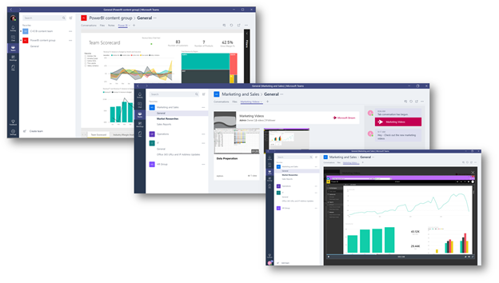

# Использование встроенных и настраиваемых вкладок в Microsoft Teams

Вкладки позволяют участникам группы получать доступ к службам и контенту в специальном месте в канале или чате. Это позволяет команде напрямую работать с инструментами и данными, а также беседовать об инструментах и данных в контексте канала или чата.

Владельцы и участники команды могут добавлять вкладки в канал, приватный чат или групповой чат для интеграции с соответствующими облачными службами. Вкладки можно добавлять, чтобы пользователи могли легко получать доступ к нужным данным и управлять ими, а также взаимодействовать с ними чаще всего. Это может быть отчет Power BI, панель мониторинга и даже видеоканал [Microsoft Stream](https://go.microsoft.com/fwlink/?linkid=855785), где вы публикуете обучающие ролики.

>[!Note]
> Переход с использования Microsoft Stream на [OneDrive для бизнеса и SharePoint для записей собраний](tmr-meeting-recording-change.md) будет поэтапным процессом. При запуске вы сможете согласиться на использование этого интерфейса. В ноябре потребуется отказаться от использования, если вы хотите продолжить использование Stream. В начале 2021 г. мы сделаем использование OneDrive для бизнеса и SharePoint для новых записей собраний обязательным для всех пользователей.

## Работа с вкладками

- В каждом новом канале по умолчанию предусмотрены две вкладки: Беседы и Файлы.

    
- В каждом личном чате по умолчанию предусмотрены четыре вкладки: "Беседы", "Файлы", "Организация" и "Действия".

    

- Владельцы и участники команды   в верхней части канала или чата.

- Excel, PowerPoint, Word и PDF-файлы необходимо добавить на вкладку Файлы, прежде чем их можно будет  преобразовать в вкладки. Любой добавленный файл можно преобразовать на вкладку одним щелчком мыши, как показано ниже.

    

- Чтобы добавить веб-сайт, URL-адрес должен начинаться с **префикса https** , чтобы обменялись информацией.

- Подробные инструкции предоставляются, когда участник группы пытается добавить настраиваемую вкладку в свой канал или чат. При добавлении настраиваемой вкладки в канал  создается беседа с вкладками, позволяющая участникам группы сосредоточиться на обсуждениях контента.

    

## Разработка настраиваемых вкладок

Помимо встроенных вкладок, вы можете разрабатывать и разрабатывать собственные вкладки для интеграции с Teams другими сообществами или делиться ими с другими. Дополнительные сведения см. в [документации для разработчиков](/microsoftteams/platform/tabs/what-are-tabs).

---
