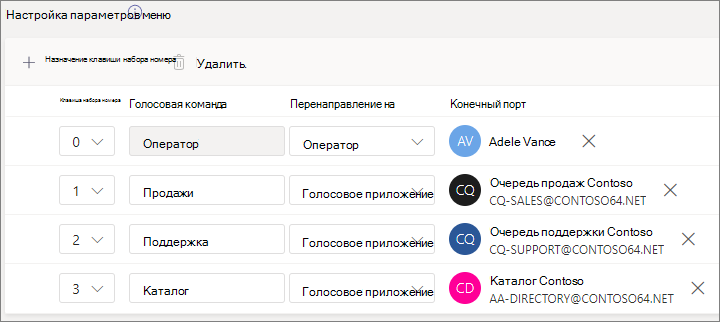

# Настройка автозавода — учебник по малому бизнесу

Автозаверяющие могут звонить в вашу организацию и переходить в систему меню для связи с нужным отделом, очередью вызовов, человеком или оператором. В Центре администрирования Microsoft Teams можно создавать автозаводы для своей организации.

#### До начала работы

Получите номера служб, необходимые для автозаполнения, чтобы получать доступ к данным с помощью прямого набора номера из-за пределов организации. Это может быть [перенос номеров от другого поставщика или](../phone-number-calling-plans/transfer-phone-numbers-to-teams.md) запрос новых [номеров служб.](../getting-service-phone-numbers.md)

Получите [телефонную систему — лицензию виртуального пользователя](../teams-add-on-licensing/virtual-user.md) для каждого автозавода, который вы планируете создать. Эти лицензии бесплатны, поэтому мы рекомендуем получить дополнительные лицензии на случай, если вы решите внести изменения в настройку в будущем.

Если вы хотите, чтобы в праздники звонки  автоответа перенаводились по-разному, создайте праздники, которые вы хотите использовать, прежде чем создавать автозавод.

#### Выполните эти действия, чтобы настроить автостраницу

# [Шаг   1. Номер телефона](#tab/phone-number)

Для каждого создающегося автозачета требуется учетная запись ресурса. Эта учетная запись аналогична учетной записи пользователя, за исключением того, что она связана с автоотетарем или очередью вызовов, а не с человеком. На этом шаге мы создадим учетную запись, назначим ее телефонной системе *Microsoft 365 —* лицензию виртуального пользователя, а затем назначим номер службы.

### Создание учетной записи ресурса

Учетную запись ресурса можно создать в Центре администрирования Teams.

1. В Центре администрирования Teams раз щелкните **"Учетные** записи ресурсов", чтобы развернуть параметры для всей **организации.**

2. Нажмите **Добавить**.

3. В области **"Добавление учетной** записи ресурса" введите отображаемого **имени,** имя пользователя и выберите "Автозачет"  для типа учетной **записи ресурса.**

    

4. Щелкните **Сохранить**.

Новая учетная запись появится в списке учетных записей.

### Назначение лицензии

Учетной записи ресурса необходимо назначить телефонную систему *Microsoft 365 —* лицензию виртуального пользователя.

1. В Центре администрирования Microsoft 365 выберите учетную запись ресурса, для которой вы хотите назначить лицензию.

2. На **вкладке "Лицензии и** приложения" в **области "Лицензии"** выберите **"Телефонная система Microsoft 365 — виртуальный пользователь".**

3. Нажмите **кнопку "Сохранить изменения".**

    

### Назначение номера службы

Если вам нужно, чтобы с этим автоотчетом можно было связаться по номеру телефона, назначьте этот номер учетной записи ресурса.

1. В Центре администрирования Teams  на странице "Учетные записи ресурсов" выберите учетную запись ресурса, для которой вы хотите назначить номер службы, а затем нажмите кнопку "Назначить/отозначить". 

2. В **dropdown (Тип номера телефона)** выберите нужный тип номера.

3. В поле **"Назначенное номер телефона"** найдите нужный номер и нажмите кнопку "Добавить". 

    

4. Щелкните **Сохранить**.

> [!div class="nextstepaction"]
> [Шаг 2. Общие сведения для автосектора >](https://review.docs.microsoft.com/microsoftteams/business-voice/create-a-phone-system-auto-attendant-smb?branch=mikeplum-smb-voice&tabs=general-info#steps)

# [Общие сведения о   помощнике по шагу 2](#tab/general-info)

Настройка автозавода

1. В Центре администрирования Teams раз нажмите **кнопку "Голосовая** **команда",** выберите "Автоотетары" и нажмите кнопку **"Добавить".**

2. Введите имя автозавода в поле в верхней части окна.

3. Если вы хотите назначить оператор, укажите место назначения для звонков оператору. Это необязательно (но рекомендуется). Параметр **"Оператор"** позволяет вызывателям выйти из меню и поговорить с назначенным человеком.

4. Укажите часовой пояс для этого автозавода. Часовой пояс используется для расчета рабочих часов, если вы создаете отдельный поток зовов в нечасовом времени.

5. Укажите язык для этого автозавода. Этот язык будет использоваться для системных голосовых подсказок.

6. Выберите, нужно ли включить голосовой ввод. Если этот параметр включен, название каждого параметра меню становится ключевым словом распознавания речи. Например, можно сказать "Один" для выбора параметра меню, назначенного клавише 1, или "Продажи", чтобы выбрать пункт меню "Продажи".

    

7. Нажмите кнопку **Далее**.

> [!div class="nextstepaction"]
> [Шаг 3. >](https://review.docs.microsoft.com/microsoftteams/business-voice/create-a-phone-system-auto-attendant-smb?branch=mikeplum-smb-voice&tabs=call-flow#steps)

# [Шаг   3. Поток вызовов](#tab/call-flow)

Выбор параметров потока звонка

1. Выберите, хотите ли вы воспроизведения приветствия, когда автоответ отвечает на звонок.

    Выбрав **"Воспроизведения звукового** файла",  вы можете добавить записанное приветствие, сохраненное как звуковое сообщение, с помощью кнопки "Отправить файл". WAV, . MP3 или . Формат WMA. Размер записи не должен быть больше 5 МБ.

    Если вы **выберете** "Введите приветствие", система прочитает текст, который вы введите (до 1000 символов), когда автостраница отвечает на звонок.

    

2. Выберите, как вы хотите перена маршрутизовыть звонок.

    Если вы выберете **"Отключить",** автоотетарь повесит звонок.

    При выборе пункта **"Перенаправление** звонка" можно выбрать одно из назначений маршрутиации.

    Если **выбраны** параметры меню "Воспроизведения", можно  выбрать "Воспроизведения звукового файла" или "Ввести приветствие", а затем выбрать параметры меню и поиск по каталогу. 

    

3. Если вы хотите, чтобы для навигации использовались клавиши набора номера, в меню "Настройка" выберите, что должно происходить при нажатии клавиши набора номера. (Если вы создаете этого автозавода в качестве каталога организации, оставьте параметры набора параметров пустыми.)

    Вы можете настроить любую из этих клавиш для следующих назначений:

    - **Человек в организации —** это человек в вашей организации, который может принимать голосовые звонки.
    - **Голосовое приложение** — еще один автозавод или очередь вызовов.
    - **Внешний номер телефона** — любой номер телефона. Используйте такой формат: +[код страны][код города][номер телефона]
    - **Голосовая почта** — это почтовый ящик голосовой почты, связанный с группой Microsoft 365, которую вы указали.
    - **Оператор** — оператор, задавающийся для автозавода. Определение оператора не является обязательным. Оператор можно определить как любой другой пункт назначения в этом списке.

    Мы рекомендуем установить для оператора 0.

    Для каждого параметра меню укажите следующее:

    - **Клавиша набора** номера — клавиша на телефонной клавиатуре для доступа к этому параметру.

    - **Голосовая** команда — определяет голосовую команду, которую может предоставить вызываемая команда для доступа к этому параметру, если включен голосовой ввод. Оно может содержать несколько слов, например "Обслуживание клиентов" или "Действия и причины". 

    - **Перенаправление** в то место, куда должен перенаправляться звонок при выборе этого параметра. Если вы перенаправляете звонок к автоотправлению или очереди вызовов, выберите связанную с ним учетную запись ресурса.

    

4. Если вы хотите использовать этого автозавода в качестве каталога организации, в области поиска по каталогу **выберите**"Набрать **имя".** Если включить этот параметр, звоня людям, которые будут называть имя пользователя или ввести его, можно будет ввести на телефонной клавиатуре. Любой пользователь в Сети с лицензией на телефонную систему является подходящим пользователем, и его можно найти с помощью звонка по имени. 

    (Вы можете выбрать **"Звонить по расширению",** но расширение необходимо настроить в Azure Active Directory.)

5. Выбрав параметр поиска  по каталогу, нажмите кнопку **"Далее".**

> [!div class="nextstepaction"]
> [Шаг 4. Неавное время >](https://review.docs.microsoft.com/microsoftteams/business-voice/create-a-phone-system-auto-attendant-smb?branch=mikeplum-smb-voice&tabs=after-hours#steps)

# [Шаг   4.](#tab/after-hours)

Для каждого автозавода можно настроить часы работы. Если рабочие часы не настроены, по умолчанию устанавливается круглосуточный график работы без выходных дней. Для работы можно установить перерывы в течение дня, а все часы, которые не считаются часами, считаются неавтными. Вы можете настроить другие параметры обработки входящих параметров обработки параметров и приветствий в течение часа.

В зависимости от настройки автозаполнения и очередей звонков может потребоваться настроить маршрутику звонков только для автозаполнения с прямыми номерами телефонов.

Если вам нужна отдельная маршрутия для вызывающих телефонных вызовов в нечасовом времени, укажите часы работы для каждого дня. Нажмите **кнопку "Добавить новое** время", чтобы указать несколько часов для заданного дня, например, чтобы указать перерыв на обед.

Заданные часы работы можно выбрать в параметрах маршрутки параметров перенач. Доступны те же параметры, что и при маршрутке параметров в часы, заданных в шаге **3 "Поток вызовов".**

Когда **все будет** готово, нажмите кнопку "Далее".

> [!div class="nextstepaction"]
> [Шаг 5. Holiday call flow >](https://review.docs.microsoft.com/microsoftteams/business-voice/create-a-phone-system-auto-attendant-smb?branch=mikeplum-smb-voice&tabs=holidays#steps)

# [Шаг   5. Праздники](#tab/holidays)

В праздники звонки автоответа могут перенастраиваться не так, как в другие дни. (Если вы не хотите, чтобы в праздники велись другие вызовы, этот шаг можно пропустить.)

Для каждого настроенного вами праздника автостраница может настроить поток звонка. Вы можете добавить до 20 запланированных праздников для каждого автосекретаря.

1. На странице параметров звонка "Праздник" нажмите кнопку **"Добавить".**

2. Введите название этого параметра праздников.

3. В **выпадаемом** окнах "Праздники" выберите праздник, который вы хотите использовать.

4. Выберите нужный тип приветствия.

    

5. Выберите, хотите ли вы **отключить или** **перенаправить** звонок.

6. Если вы перенаправили звонок, выберите пункт назначения маршрутиации для звонка.

    

7. Щелкните **Сохранить**.

Повторите процедуру для каждого дополнительного праздника.

После того как вы добавите все праздники, нажмите кнопку **"Далее".**

> [!div class="nextstepaction"]
> [Шаг 6. Выбор людей, которые будут в каталоге>](https://review.docs.microsoft.com/microsoftteams/business-voice/create-a-phone-system-auto-attendant-smb?branch=mikeplum-smb-voice&tabs=dial-scope#steps)

# [Участники каталога шага 6  ](#tab/dial-scope)

Область *набора определяет* пользователей, доступных в каталоге, если звоня по имени или с помощью телефонного звонка по расширению. По умолчанию для **всех сетевых пользователей** входят все пользователи в организации, которые являются пользователями Online с лицензией на телефонную систему.

Вы можете включить или исключить  определенных  пользователей, выбрав пользовательскую группу в группе "Включить" или **"Исключить"** и выбрав одну или несколько групп Microsoft 365, списки рассылки или группы безопасности. Например, может потребоваться исключить руководителей организации из каталога набора номера. (Если пользователь есть в обоих списках, он будет исключен из каталога.)

> [!NOTE]
> Для того чтобы новый пользователь указал свое имя в каталоге, может потребоваться до 36 часов.

После настройки области набора номера нажмите кнопку **"Далее".**

> [!div class="nextstepaction"]
> [Шаг 7. Назначение учетной записи ресурса >](https://review.docs.microsoft.com/microsoftteams/business-voice/create-a-phone-system-auto-attendant-smb?branch=mikeplum-smb-voice&tabs=resource-accounts#steps)

# [Шаг   7. Учетные записи ресурсов](#tab/resource-accounts)

У всех автозачетных должно быть связанная учетная запись ресурса.  Автослужбу первого уровня потребуется по крайней мере одна учетная запись ресурса с связанным номером службы. При желании вы можете назначить автозаводу несколько учетных записей ресурсов с отдельным номером службы.

Добавление учетной записи ресурса

1. Нажмите **кнопку "Добавить** учетную запись" и найдите учетную запись, которую вы хотите добавить. Нажмите **кнопку "Добавить"** и выберите **"Добавить".**

    

2. Завершив добавление учетных записей служб, нажмите кнопку **"Отправить".**

    

В этом случае будет завершена настройка автоотполнеющего персонала.

---

