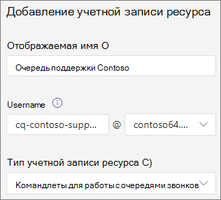

# Создание очереди вызовов — учебник по малому бизнесу

Очереди вызовов предоставляют способ маршрутизации вызывающих людей в организации, которые могут помочь с определенной проблемой или вопросом. Звонки распределяются по одному для людей, которые находятся в очереди (которые называются *агентами).* 

Очереди вызовов предоставляют:

- Приветствие.

- Музыка, пока люди находятся на удержании в очереди.

- Маршрутия вызовов — в порядке first *In, First Out* (FIFO) — агентам.

- Параметры обработки переполнения и времени ожидания в очереди.

#### Видеодемонстрация

В этом видео показано, как создать очередь вызовов в Teams.

> [!VIDEO https://www.microsoft.com/videoplayer/embed/RWCF23?autoplay=false]

#### Подготовка к работе

Получите [лицензии телефонная система виртуальных](../teams-add-on-licensing/virtual-user.md) пользователей, если у вас их еще нет. Получите по одному для каждой очереди вызовов и автосбережающего, которые вы планируете настроить. Эти лицензии бесплатны, поэтому мы рекомендуем получить дополнительные лицензии на случай, если вы решите внести изменения в настройку в будущем.

Так как агенты в очереди звонков могут звонить, чтобы вернуть звонок клиента, вы можете установить для агентов вызова основной номер телефона или номер соответствующего автозаполненика. Дополнительные [сведения см.](../caller-id-policies.md) в Microsoft Teams управление политиками ИД звоня.

#### Чтобы настроить очередь вызовов, выполните указанные здесь действия.

# [Шаг   1. Создание команды](#tab/create-team)

При создании очереди вызовов вы можете добавить отдельных пользователей в очередь или использовать существующую группу безопасности, группу Microsoft 365 или Microsoft Teams группу. Мы рекомендуем [использовать канал команды](https://support.microsoft.com/office/9f07dabe-91c6-4a9b-a545-8ffdddd2504e). Это позволяет участникам очереди общаться друг с другом, делиться идеями, создавать документы и другие ресурсы, чтобы помочь клиентам. Группа также предоставляет голосовой почтовый ящик, в который звонящие могут оставлять сообщения в не часах или в очереди достигает максимальной вместимости.

Создание команды

1. Сначала щелкните **Teams** в левой части приложения, а  затем щелкните Присоединиться или создать команду в нижней части списка команд.

2. Затем нажмите **кнопку Создать команду** (первая карточка, левый верхний угол).

3. Выберите **Создать команду с нуля**.

4. Затем выберите, хотите ли вы сделать команду открытой или закрытой. Для **очереди** присоединения к звонку мы рекомендуем сделать ее закрытой, чтобы избежать непреднамеренного вхождения людей в очередь путем присоединения к команде.

5. Привязайте имя своей команды и при желании добавьте описание.

6. Когда все будет готово, нажмите кнопку **Создать**.

8. Введите имена нужных людей в очереди вызовов и нажмите кнопку **Добавить.**

9. Нажмите кнопку **Закрыть**. Люди, которых вы добавляете в команду, получат по электронной почте сообщение о том, что они теперь являются членами вашей команды, и группа будет отовсюю демонстрироваться в списке команд.

Затем добавим канал для использования с очередью вызовов.

Добавление канала

1. В Teams найдите только что созданную  команду, щелкните Дополнительные параметры (...), а затем щелкните **Добавить канал**.

2. Введите название и описание канала.

3. В **группе Конфиденциальность** выберите **Стандартная — доступно** всем в команде и нажмите кнопку **Добавить**.

> [!div class="nextstepaction"]
> [Шаг 2. Учетные записи ресурсов >](/microsoftteams/business-voice/create-a-phone-system-call-queue-smb?tabs=resource-account#steps)

# [Шаг   2. Учетные записи ресурсов](#tab/resource-account)

Для каждой создаемой очереди вызовов требуется учетная запись ресурса. Эта учетная запись аналогична учетной записи пользователя, за исключением того, что она связана с автозаводом или очередью вызовов, а не с пользователем. На этом шаге мы создадим учетную запись, назначим Microsoft 365 телефонная система *лицензию виртуальный* пользователь, а затем создадим очередь зовите ее.

### Создание учетной записи ресурса

Учетную запись ресурса можно создать в Центре Teams администрирования.

1. В Центре администрирования Teams раз нажмите **кнопку Голосовая почта** и выберите **учетные записи ресурсов.**

2. Нажмите **Добавить**.

3. В области Добавление **учетной записи** ресурса введите отображаемого имени **,** **имя пользователя** и выберите очередь зовов для типа **учетной записи ресурса**.  Агенты увидят отображаемую фамилию, когда получат входящий звонок из очереди.

    

4. Нажмите кнопку **Сохранить**.

   Новая учетная запись появится в списке учетных записей.

   

### Назначение лицензии

Учетной записи *ресурса необходимо назначить Microsoft 365 телефонная система — виртуальный* пользователь.

1. На Центр администрирования Microsoft 365 в списке **Активные** пользователи выберите учетную запись ресурса, для которой вы хотите назначить лицензию.

2. На **вкладке Лицензии и приложения** в области **Лицензии** выберите Microsoft 365 телефонная система **— виртуальный пользователь**.

3. Нажмите кнопку **Сохранить изменения**.

    

### Создание очереди вызовов

Далее мы начнем создавать очереди вызовов и назначать учетную запись ресурса.

1. В Центре администрирования Teams **Разойдите в центр администрирования Voice (Голосовые вызовы),** **выберите** очереди вызовов и нажмите кнопку **Добавить**.

1. Введите имя очереди вызовов.

2. Нажмите **кнопку Добавить учетные** записи , найдите учетную запись ресурса, которую вы хотите использовать с этой очередью вызовов, нажмите кнопку Добавить **и** выберите **добавить**.

3. (Необязательно) В **области Назначение ИД звонка** нажмите кнопку Добавить , найдите учетные записи ресурсов, созданные для автоответчивающего, нажмите кнопку Добавить, а затем нажмите кнопку **Добавить**.   При этом вашим агентам будет выдастся ИД звоня из главной строки.

    

3. Выберите язык. Этот язык будет использоваться для системных голосовых подсказок и транскрибации голосовой почты (если вы их включаете).

    

4. Укажите, хотите ли вы воспроизведения приветствия для вызывающих людей при их поступления в очередь. Необходимо отправить файл MP3, WAV или WMA, содержащий приветствие, которое вы хотите воспроизведения.

5. Teams предоставляет вызывателям музыку по умолчанию, когда они находятся на удержании в очереди. Если вы хотите воспроизведения определенного  звукового файла, выберите Вариант воспроизведения звукового файла и загрузите файл MP3, WAV или WMA.

   > [!NOTE]
   > Размер загруженной записи не должен быть больше 5 МБ.
   > По умолчанию музыка, которая поставляется Teams очередях вызовов, не оплачивается вашей организацией. 

> [!div class="nextstepaction"]
> [Шаг 3. Вызов агентов >](/microsoftteams/business-voice/create-a-phone-system-call-queue-smb?tabs=call-agents#steps)

# [Шаг   3. Агенты вызовов](#tab/call-agents)

Чтобы добавить агентов в очередь вызовов, мы добавим их в ранее созданную команду и канал. Для этого необходимо быть участником команды.

1. Выберите команду **Выберите команду** и нажмите **кнопку Добавить канал**.
2. Введите имя созданной команды, выберите ее и нажмите кнопку **Добавить.**
3. Выберите канал, созданный для очереди.
3. Нажмите кнопку **Применить**.

    

> [!NOTE]
> При добавлении новых пользователей в команду для первого звонка может быть до восьми часов.

> [!div class="nextstepaction"]
> [Шаг 4. Учетные записи ресурсов >](/microsoftteams/business-voice/create-a-phone-system-call-queue-smb?tabs=call-routing#steps)

# [Шаг   4. Маршрутия вызовов](#tab/call-routing)

Выберите нужный способ маршрутизов зова.

1. Установите **для режима конференции** **авто.**

2. Выберите **нужный** способ маршрутинга. Это определяет порядок, в котором агенты будут принимать звонки из очереди. Рекомендуем использовать **порядковую маршрутику** или **округлую маршрутику.** Выберите один из этих вариантов:

    - **Маршруты attendant одновременно** звонят всем агентам в очереди. Звонок получит первый агент вызова.

    - **Порядковая маршрутия** звонит всем агентам вызова по одному. Если агент отклоает звонок или не звонит, звонок звонит следующему агенту и пробует всех агентов до тех пор, пока он не будет отклонен или разоберется.

    - **Round balances** the routing of incoming calls so each call agent gets the same number of calls from the queue. Это может быть нежелательно в среде входящие продаж, чтобы обеспечить равные возможности для всех агентов звонка.

    - **Наиболее длинные** неавтоматные маршруты каждый звонок передается агенту, который простаивает в течение длительного времени. (Агенты, состояние присутствия которых было нет на сети более 10 минут, не включаются.)

    

3. **Включите маршрутику на основе присутствия.** В этом случае звонки будут маршрутизовы на агентов, состояние присутствия которых **доступно.**

4. Выберите, хотите ли вы разрешить агентам отказаться от звонков.

5. Укажите **время оповещения агента,** чтобы указать, как долго телефон агента будет звонить, прежде чем очередь перенаправит звонок следующему агенту.

    

> [!div class="nextstepaction"]
> [Шаг 5. Переполнение вызовов >](/microsoftteams/business-voice/create-a-phone-system-call-queue-smb?tabs=call-overflow#steps)

# [Шаг   5. Переполнение звонка](#tab/call-overflow)

Выберите, как вы хотите обрабатывать звонки, превышают максимальное значение в очереди.

1. Установите **максимальное число звонков в очереди.**

2. Выберите, что вы хотите сделать, когда достигается максимальное количество звонков. Вы можете отключить звонок или перенаправить его. Мы рекомендуем перенаправить звонок на одно из следующих мест:
    - **Человек в организации —** человек в вашей организации, который может принимать голосовые звонки
    - **Голосовое приложение** — автозаводка или другая очередь вызовов. (При выборе этого целевого объекта выберите учетную запись ресурса, связанную с автосекретарем или очередью вызовов.)
    - **Внешний номер телефона** — любой номер телефона. Используйте такой формат: +[код страны][код города][номер телефона]
    - **Голосовая** почта: вы можете использовать почтовый ящик созданной вами команды.

    

> [!div class="nextstepaction"]
> [Шаг 6. Время >](/microsoftteams/business-voice/create-a-phone-system-call-queue-smb?tabs=call-timeout#steps)

# [Шаг   6. Время вызова](#tab/call-timeout)

Выберите, что должно происходить, если звонки уже слишком долго ожидаются в очереди.

1. Установите **максимальное время ожидания**.

2. Выберите, что вы хотите сделать, когда время звонка разозвать. Вы можете отключить звонок или перенаправить его. Мы рекомендуем перенаправить звонок на одно из следующих мест:
    - **Человек в организации —** человек в вашей организации, который может принимать голосовые звонки
    - **Голосовое приложение** — автозаводка или другая очередь вызовов. (При выборе этого целевого объекта выберите учетную запись ресурса, связанную с автосекретарем или очередью вызовов.)
    - **Внешний номер телефона** — любой номер телефона. Используйте такой формат: +[код страны][код города][номер телефона]
    - **Голосовая** почта: вы можете использовать почтовый ящик созданной вами команды.

    

3. Нажмите кнопку **Сохранить**.

В этом случае настройка очереди вызовов будет завершена. Затем вам может потребоваться [настроить автоотекатаря.](create-a-phone-system-auto-attendant-smb.md)

---

