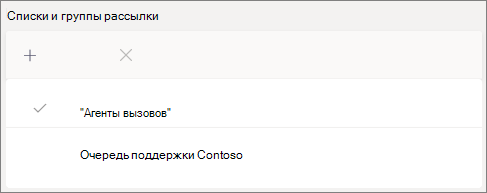

# Создание очереди вызовов — учебник для малого бизнесаCreate a call queue - small business tutorial

Очереди вызовов предоставляют способ маршрутизации вызывающих вызовов для людей в организации, которые могут помочь с определенной проблемой или вопросом.Call queues provide a method of routing callers to people in your organization who can help with with a particular issue or question. Звонки распределяются по одному людям в очереди (которые называются *агентами).*Calls are distributed one at a time to the people in the queue (who are known as *agents*). 

Очереди вызовов предоставляют:Call queues provide:

- Приветствие.A greeting message.

- Музыка, пока люди находятся в очереди на удержание.Music while people are waiting on hold in a queue.

- Маршрутка вызовов ( *в порядке first In, First Out* (FIFO) для агентов.Call routing - in *First In, First Out* (FIFO) order - to agents.

- Параметры обработки для переполнения очереди и времени ожидания.Handling options for queue overflow and timeout.

#### До начала работыBefore you begin

Получите [телефонную систему — лицензии](../teams-add-on-licensing/virtual-user.md) виртуальных пользователей, если у вас их еще нет.Get some [Phone System - Virtual User licenses](../teams-add-on-licensing/virtual-user.md) if you don't already have them. Получите по одному для каждой очереди вызовов и автозавода, которые вы планируете настроить.Get one for each call queue and auto attendant that you plan to set up. Эти лицензии бесплатны, поэтому мы рекомендуем получить дополнительные лицензии на случай, если вы решите внести изменения в настройку в будущем.These licenses are free, so we suggest getting a few extra in case you decide to make changes to your setup in the future.

Так как агенты из очереди звонков могут звонить и возвращать клиентский звонок, вы можете установить для своих агентов, вызывающего звонок, основной номер телефона или номер соответствующего автосбережа.Since agents in a call queue may dial out to return a customer call, consider setting the caller ID for your call agents to your main phone number or the number of an appropriate auto attendant. Дополнительные сведения см. в сведениях об управлении политиками ИД вызываемой [службы в Microsoft Teams.](../caller-id-policies.md)See [Manage caller ID policies in Microsoft Teams](../caller-id-policies.md) for more information.

#### Выполните эти действия, чтобы настроить очередь вызововFollow these steps to set up your call queue

# [Шаг   1. Создание командыStep 1 Create a team](#tab/create-team)

При создании очереди вызовов вы можете добавить отдельных пользователей в очередь или использовать существующую группу безопасности, группу Microsoft 365 или команду Microsoft Teams.When creating a call queue, you can add individual users to the queue, or you can use an existing security group, Microsoft 365 group, or Microsoft Teams team. Рекомендуем использовать команду.We recommend using a team. Благодаря этому участники очереди могут общаться друг с другом, обмениваться идеями, создавать документы и другие ресурсы для помощи своим клиентам.This allows members of the queue to chat with each other, share ideas, and create documents or other resources to help them help your customers. Группа также предоставляет вызывателям голосовой почты почтовый ящик, в который можно отправлять сообщения в не часах или в том случае, если очередь достигает максимальной емкости.A team also provides a voice mailbox for callers to leave a message after hours or if the queue reaches its maximum capacity.

Создание командыTo create a team

1. Сначала щелкните **Teams** в левой части приложения, а затем нажмите кнопку **"Присоединиться"** или "Создать команду" в нижней части списка команд.First, click **Teams** on the left side of the app, then click **Join or create a team** at the bottom of your teams list.

2. Затем нажмите **кнопку "Создать команду"** (первая карточка, левый верхний угол).Then click **Create team** (first card, top left corner).

3. Выберите **"Создать команду с нуля".**Choose **Build a team from scratch**.

4. Затем выберите, нужна ли вам частная или гостевая команда.Next, choose whether you want a public or private team. Мы рекомендуем **сделать** очередь личных, чтобы избежать непреднамеренного вхождения людей в очередь путем присоединения к команде.We recommend **Private** for your call queue to avoid people unintentionally becoming part of the queue by joining the team.

5. Привязайте имя команды и добавьте необязательное описание.Name your team and add an optional description.

6. Когда все будет готово, нажмите кнопку **"Создать".**When you're done, click **Create**.

8. Введите имена людей, которых вы хотите добавить в очередь вызовов, и нажмите кнопку **"Добавить".**Type the names of the people that you want to have in your call queue, and then click **Add**.

9. Нажмите кнопку **Закрыть**.Click **Close**. Люди, которых вы добавите в команду, получат по электронной почте сообщение с сообщением о том, что они теперь являются членами вашей команды, и группа от пока не будет добавлена в их список команд.People you add to a team will receive an email letting them know they are now a member of your team and the team will show up in their teams list.

> [!div class="nextstepaction"]
> [Шаг 2. Учетные записи ресурсов >Step 2 - Resource accounts >](https://review.docs.microsoft.com/microsoftteams/business-voice/create-a-phone-system-call-queue-smb?branch=mikeplum-smb-voice&tabs=resource-account#steps)

# [Шаг   2. Учетные записи ресурсовStep 2 Resource accounts](#tab/resource-account)

Для каждой создаемой очереди вызовов требуется учетная запись ресурса.Each call queue that you create requires a resource account. Эта учетная запись аналогична учетной записи пользователя, за исключением того, что она связана с автоотчетом или очередью вызовов, а не с человеком.This is similar to a user account, except the account is associated with an auto attendant or call queue instead of a person. На этом шаге мы создадим учетную запись, назначим ее телефонной системе *Microsoft 365 —* лицензию виртуального пользователя, а затем создадим очередь звонков с ее помощью.In this step, we'll create the account, assign it a *Microsoft 365 Phone System - Virtual User* license, and then use it to start creating the call queue.

### Создание учетной записи ресурсаCreate a resource account

Учетную запись ресурса можно создать в Центре администрирования Teams.You can create a resource account in the Teams admin center.

1. В Центре администрирования Teams раз щелкните **"Учетные** записи ресурсов", чтобы развернуть параметры для всей **организации.**In the Teams admin center, expand **Org-wide settings**, and then click **Resource accounts**.

2. Нажмите **Добавить**.Click **Add**.

3. В области **"Добавление учетной** записи ресурса" введите  отображаемого **имени,** имя пользователя и выберите "Очередь зовов" для типа учетной **записи ресурса.**In the **Add resource account** pane, fill out **Display name**, **Username**, and choose **Call queue** for the **Resource account type**.

    

4. Щелкните **Сохранить**.Click **Save**.

Новая учетная запись появится в списке учетных записей.The new account will appear in the list of accounts.

### Назначение лицензииAssign a license

Учетной записи ресурса необходимо назначить *лицензию "Телефонная система Microsoft 365 —* виртуальный пользователь".You must assign a *Microsoft 365 Phone System - Virtual User* license to the resource account.

1. В Центре администрирования Microsoft 365 выберите учетную запись ресурса, для которой вы хотите назначить лицензию.In the Microsoft 365 admin center, click the resource account to which you want to assign a license.

2. На **вкладке "Лицензии и** приложения" в **области "Лицензии"** выберите **"Телефонная система Microsoft 365 — виртуальный пользователь".**On the **Licenses and Apps** tab, under **Licenses**, select **Microsoft 365 Phone System - Virtual User**.

3. Нажмите **кнопку "Сохранить изменения".**Click **Save changes**.

    

### Создание очереди вызововCreate a call queue

Затем мы начнем создавать новую очередь зовов и назначаем учетную запись ресурса.Next, we'll start creating a new call queue and assign the resource account.

1. В Центре администрирования Teams раззовите **"Голосовая команда",** **выберите**"Очереди зовов" и нажмите кнопку **"Добавить".**In the Teams admin center, expand **Voice**, click **Call queues**, and then click **Add**.

1. Введите имя очереди звонка.Type a name for the call queue. Это имя будет видно агентам при входящих вызовах из очереди.Agents will see this name when they receive an incoming call from the queue.

2. Нажмите **кнопку "Добавить учетные** записи", найдите учетную запись ресурса, которую вы хотите использовать с этой очередью вызовов, нажмите кнопку "Добавить", а затем нажмите кнопку **"Добавить".**Click **Add accounts**, search for the resource account that you want to use with this call queue, click **Add**, and then click **Add**.

3. Выберите язык.Choose a language. Этот язык будет использоваться для системных голосовых подсказок и транскрибации голосовой почты (если вы их включаете).This language will be used for system-generated voice prompts and voicemail transcription (if you enable them).

    

4. Укажите, хотите ли вы воспроизведения приветствия вызывателям при их поступления в очередь.Specify if you want to play a greeting to callers when they arrive in the queue. Необходимо отправить файл MP3, WAV или WMA, содержащий приветствие, которое вы хотите воспроизведения.You must upload an MP3, WAV, or WMA file containing the greeting that you want to play.

5. Teams предоставляет музыку по умолчанию вызывателям, пока они находятся на удержании в очереди.Teams provides default music to callers while they are on hold in a queue. Если вы хотите воспроизведения определенного  звукового файла, выберите "Воспроизведения звукового файла" и загрузите файл MP3, WAV или WMA.If you want to play a specific audio file, choose **Play an audio file** and upload an MP3, WAV, or WMA file.

> [!NOTE]
> Размер добавленной записи не должен быть больше 5 МБ.The uploaded recording can be no larger than 5 MB.
> По умолчанию музыка, которая предоставляется в очередях вызовов Teams, не предоставляется вашей организацией.The default music supplied in Teams call queues is free of any royalties payable by your organization. 

> [!div class="nextstepaction"]
> [Шаг 3. Звонок агентам >Step 3 - Call agents >](https://review.docs.microsoft.com/microsoftteams/business-voice/create-a-phone-system-call-queue-smb?branch=mikeplum-smb-voice&tabs=call-agents#steps)

# [Шаг   3. Агенты по звонкамStep 3 Call agents](#tab/call-agents)

Чтобы добавить агентов в очередь вызовов, мы добавим ранее созданную команду.To add agents to the call queue, we'll add the team that we created earlier.

1. Нажмите **кнопку "Добавить группы".**Click **Add groups**.
2. Введите имя группы, которую вы создали.Type the name of the team that you created.
3. Нажмите **кнопку "Добавить"** и выберите **"Добавить".**Click **Add**, and then click **Add**.

    

Вы можете добавить до 20 агентов по отдельности и до 200 агентов с помощью групп или команд.You can add up to 20 agents individually and up to 200 agents via groups or teams.

> [!NOTE]
> При добавлении новых пользователей в команду первый звонок может занять до восьми часов.When new users are added to the team, it can take up to eight hours for their first call to arrive.

> [!div class="nextstepaction"]
> [Шаг 4. Учетные записи ресурсов >Step 4 - Resource accounts >](https://review.docs.microsoft.com/microsoftteams/business-voice/create-a-phone-system-call-queue-smb?branch=mikeplum-smb-voice&tabs=call-routing#steps)

# [Шаг   4. Маршрутка вызововStep 4 Call routing](#tab/call-routing)

Выберите нужный способ маршрутизов.Choose the call routing method that you want to use.

1. Установите режим  **конференции автоматическим.**Set **Conference mode** to **Auto**.

2. Выберите **нужный способ** маршрутинга.Choose the **Routing method** you want to use. Это определяет порядок, в котором агенты получают звонки из очереди.This determines the order in which agents receive calls from the queue. Рекомендуем **серийный маршрут или Округлевую** **юлеву.**We recommend **Serial routing** or  **Round robin**. Выберите один из этих вариантов:Choose from these options:

    - **Маршрутка с помощником** одновременно звонит всем агентам в очереди.**Attendant routing** rings all agents in the queue at the same time. Звонок получает первый агент, который звонит.The first call agent to pick up the call gets the call.

    - **В последовательной маршрутке** все агенты звонят по одному.**Serial routing** rings all call agents one by one. Если агент отклоает или не берет звонок, звонок будет звонить следующему агенту и будет пытаться все агенты до тех пор, пока он не будет разозвать или невызовется.If an agent dismisses or does not pick up a call, the call will ring the next agent and will try all agents until it is picked up or times out.

    - **Round balances** the routing of incoming calls so each call agent gets the same number of calls from the queue.**Round robin** balances the routing of incoming calls so that each call agent gets the same number of calls from the queue. Это может быть нежелательно в среде входящие продаж, чтобы гарантировать равные возможности для всех агентов по звонкам.This may be desirable in an inbound sales environment to assure equal opportunity among all the call agents.

    - **Наиболее длинные** неавтомитные маршруты каждый звонок агенту, который простаивает самый длительный срок.**Longest idle** routes each call to the agent who has been idle the longest time. (Агенты, состояние присутствия которых было "Нет на сети" более 10 минут, не включаются.)(Agents whose presence state has been Away for more than 10 minutes are not included.)

    

3. **Включив маршрутную маршрутику на основе присутствия.**Turn **Presence-based routing** on. В этом случае звонки будут маршрутизовы агентам со статусом "В **сети".**This routes calls to agents whose presence status is **Available**.

4. Выберите, нужно ли разрешить агентам отказаться от звонков.Choose if you want to allow agents to opt out of calls.

5. Укажите **время оповещения** агента, чтобы указать, как долго телефон агента будет звонить до того, как очередь перенаправит звонок следующему агенту.Set an **Agent alert time** to specify how long an agent's phone will ring before the queue redirects the call to the next agent.

    

> [!div class="nextstepaction"]
> [Шаг 5. Переполнение вызовов >Step 5 - Call overflow >](https://review.docs.microsoft.com/microsoftteams/business-voice/create-a-phone-system-call-queue-smb?branch=mikeplum-smb-voice&tabs=call-overflow#steps)

# [Шаг   5. Переполнение звонкаStep 5 Call overflow](#tab/call-overflow)

Выберите, как обрабатывать вызовы, превышают максимальное значение в очереди.Choose how you want to handle calls that exceed the maximum in the queue.

1. Установите **максимальное число звонков в очереди.**Set the **Maximum calls in the queue**.

2. Выберите, что вы хотите сделать, когда достигается максимальное количество звонков.Choose what you want to do when the maximum number of calls is reached. Вы можете отключить звонок или перенаправить его.You can disconnect the call or redirect it. Мы рекомендуем перенаправить звонок на одно из следующих назначений:We recommend that you redirect the call to one of the following destinations:
    - **Человек в организации —** человек в организации, который может принимать голосовые звонки**Person in the organization** - a person in your organization who is able to receive voice calls
    - **Приложение голосовой** почты — автозавод или другая очередь вызовов.**Voice app** - an auto attendant or another call queue. (Выберите учетную запись ресурса, связанную с автостраницой или очередью вызовов, при выборе этого назначения.)(Choose the resource account associated with the auto attendant or call queue when choosing this destination.)
    - **Внешний номер телефона** — любой номер телефона.**External phone number** - any phone number. Используйте такой формат: +[код страны][код города][номер телефона]Use this format: +[country code][area code][phone number]
    - **Голосовая** почта — вы можете использовать почтовый ящик созданной вами группы голосовой почты.**Voicemail** - you can use the voice mailbox of the team that you created.

    

> [!div class="nextstepaction"]
> [Шаг 6. Время >Step 6 - Call timeout >](https://review.docs.microsoft.com/microsoftteams/business-voice/create-a-phone-system-call-queue-smb?branch=mikeplum-smb-voice&tabs=call-timeout#steps)

# [Шаг   6. Время вызоваStep 6 Call timeout](#tab/call-timeout)

Выберите, что должно происходить, когда звонки будут ждать в очереди слишком долго.Choose what you want to happen when calls have been waiting in the queue for too long.

1. Настройка времени **ожидания звонка: максимальное время ожидания.**Set the **Call Timeout: maximum wait time**.

2. Выберите, что вы хотите делать, когда разоберется время звонка. Вы можете отключить звонок или перенаправить его.Choose what you want to do when a call times out. You can disconnect the call or redirect it. Мы рекомендуем перенаправить звонок на одно из следующих назначений:We recommend that you redirect the call to one of the following destinations:
    - **Человек в организации —** человек в организации, который может принимать голосовые звонки**Person in the organization** - a person in your organization who is able to receive voice calls
    - **Приложение голосовой** почты — автозавод или другая очередь вызовов.**Voice app** - an auto attendant or another call queue. (Выберите учетную запись ресурса, связанную с автостраницой или очередью вызовов, при выборе этого назначения.)(Choose the resource account associated with the auto attendant or call queue when choosing this destination.)
    - **Внешний номер телефона** — любой номер телефона.**External phone number** - any phone number. Используйте такой формат: +[код страны][код города][номер телефона]Use this format: +[country code][area code][phone number]
    - **Голосовая** почта — вы можете использовать почтовый ящик созданной вами группы голосовой почты.**Voicemail** - you can use the voice mailbox of the team that you created.

    

3. Щелкните **Сохранить**.Click **Save**.

В этом случае настройка очереди звонка будет завершена.This completes the setup of your call queue. Затем может потребоваться настроить [автозаполнеть.](create-a-phone-system-auto-attendant-smb.md)Next, you may want to [set up an auto attendant](create-a-phone-system-auto-attendant-smb.md).

---

