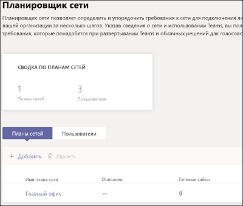
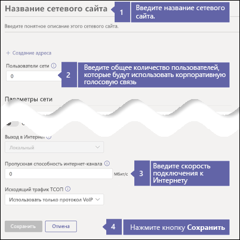
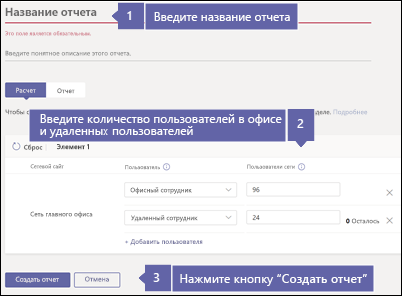
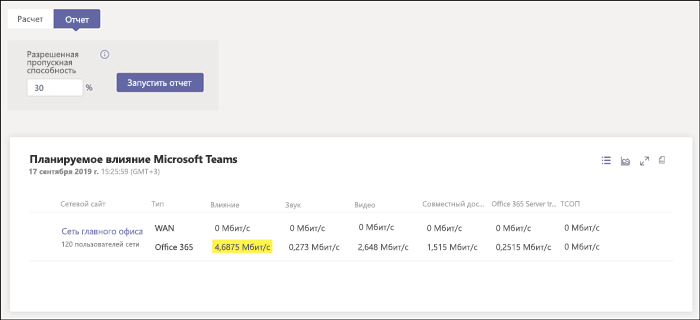

# Проверка подключения к Интернету для корпоративной голосовой связи

Корпоративная голосовая связь находится в облаке с Microsoft 365. Для всех устройств, использующих Microsoft Teams и корпоративную голосовую связь, требуется подключение к Интернету.

Для оптимальной работы с корпоративной голосовой связью требуется широкополосное подключение к Интернету, которое может поддерживать максимальное количество звонков, которое может выполняться в любой фиксированный момент времени в организации. Также необходимо убедиться, что компьютеры в вашей сети могут получить доступ к серверам Microsoft 365.

Чтобы выполнить эти действия, необходимо наличие клиента с одной из следующих подписок:

* Microsoft 365 бизнес базовый
* Microsoft 365 бизнес стандарт
* Office 365 E1
* Office 365 E3
* Office 365 F1
* Microsoft 365 A1
* Microsoft 365 A3
* Microsoft 365 E3
* Microsoft 365 бизнес

Для выполнения этих действий не требуется лицензия на корпоративную голосовую связь.

## Проверьте скорость подключения к Интернету

Эта статья поможет определить, достаточно ли быстрое подключение к Интернету для пользователей, которым необходимо совершать телефонные звонки и проводить видеоконференции. Вам нужно указать сведения о вашей организации и получить отчет о том, какая часть вашего подключения к Интернету будет использоваться Teams и корпоративной голосовой связью.

### Сбор сведений о подключении к Интернету и о пользователях

Перед началом вам требуется следующая информация:

* Скорость подключения к Интернету
* Количество пользователей, которые будут использовать корпоративную голосовую связь в основном в офисе
* Количество пользователей, которые будут использовать корпоративную голосовую связь в основном из удаленных расположений, таких как домашний офис

### Ввод данных в планировщик сети

Выполните следующие действия.

1. В браузере перейдите по адресу https://admin.teams.microsoft.com. Выполните вход, используя учетную запись с правами глобального администратора. Учетная запись, которую вы использовали для регистрации в Microsoft 365 или Office 365, имеет такие разрешения.
2. Откройте **Планирование** и выберите **Планировщик сети**.
3. В разделе **Планы сетей** выберите пункт **Добавить**. Укажите имя для плана и нажмите кнопку **Применить**. Ваш план сети должен выглядеть так:

    
1. Выберите имя плана сети. (Это **Главный офис** на предыдущем изображении.)
2. На следующей странице выберите **Добавить сетевой сайт** на вкладке **Сетевые сайты**.
3. Заполните только те поля, которые указаны на снимке экрана ниже, и нажмите кнопку **Сохранить**. Оставьте пустыми остальные поля на этом экране и не выбирайте параметр **ExpressRoute** или **Подключено к глобальной сети**.

    
1. На вкладке **Отчет** нажмите кнопку **Создать отчет**.
1. Введите указанные ниже сведения и нажмите кнопку **Создать отчет**. В отчете будут отражены требования к пропускной способности для Teams. Сведения о том, как прочитать отчет, см. в следующем разделе.

    

### Определение минимальной скорости подключения к Интернету

Когда вы выбираете **Создать отчет**, Microsoft 365 или Office 365 создает отчет, который выглядит так:

Выделенное число показывает, какая часть вашего подключения к Интернету и корпоративной голосовой связи будет использоваться. Мы рекомендуем, чтобы это число составляло не более 30 процентов от общей скорости подключения к Интернету. Например, если подключение к Интернету составляет 60 Мбит/с, Teams и корпоративная голосовая связь должны использовать не более 18 Мбит/с.

Минимальную скорость подключения к Интернету можно определить с помощью следующей формулы: *\<highlighted number> / 0,3*. С использованием выделенного числа на предыдущем рисунке расчетное значение будет составлять *4,6875 / 0,3 = 15,6*. В этом случае скорость подключения к Интернету должна составлять не менее 15,6 Мбит/с.

Если Teams и корпоративная голосовая связь будут использовать более 30 процентов общей скорости подключения к Интернету, выделенное число будет отображаться красным цветом. В таком случае вам может потребоваться обновить подключение к Интернету.

## Убедитесь, что компьютеры и устройства в вашей сети могут получить доступ к Microsoft 365

Компьютеры и устройства, использующие корпоративную голосовую связь, должны применять определенные сетевые порты для взаимодействия с серверами Microsoft 365. Эти порты, в сущности, представляют собой "двери", через которые устройства взаимодействуют друг с другом через сеть или Интернет. Ваш брандмауэр должен разрешить устройствам в вашей сети доступ к Microsoft 365 через следующие *исходящие* сетевые порты:

* **TCP-порты** 80 и 443
* **UDP-порты** 3478, 3479, 3480 и 3481

Чтобы убедиться, что ваш брандмауэр разрешает взаимодействие через эти сетевые порты, проще всего выполнить тестовый звонок в Teams:

1. Перейдите по адресу https://aka.ms/getteams на компьютере в вашей сети и установите Teams. Убедитесь, что у компьютера есть динамики и микрофон.
2. Откройте Teams и выполните вход с использованием учетной записи Microsoft 365.
3. В Teams щелкните свой аватар и выберите **Настройки** > **Устройства**.
4. В разделе **Звуковые устройства** нажмите кнопку **Сделать пробный звонок**.
5. Следуйте инструкциям, чтобы оставить сообщение и прослушать его воспроизведение.

   * Если звонок установлен и вы слышите свое сообщение, ваш брандмауэр настроен правильно.
   * Если звонок установлен, но вы не слышите инструкции или свое сообщение, проверьте, правильно ли настроены ваши динамики и микрофон, и повторите попытку.
   * Если звонок не подключается или же звонок подключается, но вы не слышите свое сообщение, вам может понадобиться обновить брандмауэр, чтобы разрешить доступ к требуемым сетевым портам. Проверьте документацию своего брандмауэра или обратитесь за помощью к ИТ-специалисту.

 Если вы ИТ-специалист и хотите узнать больше о том, как подготовить крупные или более сложные сети для поддержки корпоративной голосовой связи, см. статью [Оценка среды](../3-envision-evaluate-my-environment.md). Эта статья содержит сведения о требованиях к пропускной способности, прокси-серверу и брандмауэру, а также об использовании [Средства оценки сети](../3-envision-evaluate-my-environment.md#test-the-network) для проверки сети.

