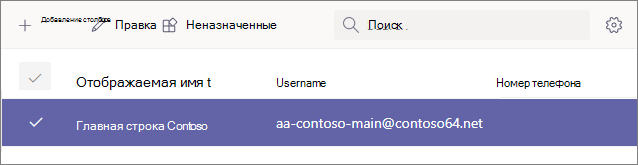

# Шаг 4. Настройка учетной записи ресурса Business Voice

Учетные записи ресурсов не назначены конкретному пользователю. Вместо них учетные записи ресурсов, которые используют бесплатную виртуальную лицензию пользователя, используются устройствами и службами в Microsoft 365. В Microsoft Teams, учетным записям ресурсов назначены номера телефонов, которые затем связываются с автоспутниками и очередями звонков.

Связав учетные записи ресурсов с автоотехами и очередями звонков, вы можете добавить к ним один или несколько платных или бесплатных номеров телефонов. Например, вы можете связать одну учетную запись ресурса с платным номером с автозаполненным номером для локальных вызывающих пользователей. Для междугородных звонков можно связать другую учетную запись ресурса с бесплатным номером для того же автоответа.

В разделах этой статьи поется о том, как настроить учетную запись ресурса и назначить для нее номер телефона. Позже вы соберем учетную запись ресурса с автоотчетом.

В следующем видео показано, как выполнить эти действия в Центре Teams администрирования.

> [!VIDEO https://www.microsoft.com/videoplayer/embed/RE4OFYG]

## Получение лицензий виртуальных пользователей

Учетным записям ресурсов необходима лицензия для работы с автоотехами и очередями вызовов. Вы можете использовать бесплатную лицензию *Microsoft 365 телефонная система — виртуальный* пользователь.

> [!NOTE]
> Вам потребуется выполнить следующие действия, только если вы озвучили пробный период. Если вы приобрели лицензии на business Voice, для вашей учетной записи уже должны быть применены виртуальные лицензии. 
>
> Чтобы узнать, есть ли у вас виртуальные лицензии, войдите в Microsoft 365 учетную запись с разрешениями глобального администратора. Затем перейдите в выставление > [ваши продукты](https://admin.microsoft.com/Adminportal/Home#/subscriptions). Если у вас есть виртуальные лицензии, они будут отображаться в Microsoft 365 телефонная система **- Виртуальный пользователь**.

1. Откройте Центр администрирования Microsoft 365 и войдите с пользователем, который является глобальным администратором (обычно это учетная запись, которую вы использовали для регистрации в Microsoft 365).
2. В области навигации слева <a href="https://admin.microsoft.com/Adminportal/Home#/catalog" target="_blank">   > </a>перейдите к надстройке "Приобретение служб вы выставление счета" См. все продукты  >    >  **надстройки**.
3. Прокрутите список до конца, чтобы найти **Microsoft 365 телефонная система — виртуальный пользователь.** Выберите **Сведения**, а затем **Купить**.
4. На странице приобретения лицензии выберите нужное количество виртуальных пользовательских лицензий. Для каждого автозавода и очереди вызовов, которые вы планируете настроить, необходима одна виртуальная лицензия. Рекомендуем выбрать по крайней мере пять лицензий, чтобы в будущем можно было легко настроить дополнительных автозаполнения и очереди вызовов, не приобретая дополнительные лицензии.
5. Отключите автоматические назначения всем пользователям **без лицензий.**
6. Выберите **"Проверить сейчас"**.
7. Подтвердите заказ, выберите **Далее**, а затем **Заказать**.

> [!NOTE]
> Помните, что вам  необходимо приобрести лицензию, даже если она имеет нулевую стоимость.

## Создание учетной записи ресурса

После получения лицензии *Microsoft 365 телефонная система — виртуальный* пользователь вы можете создать учетную запись ресурса.

1. Откройте центр Microsoft Teams администрирования и войдите с учетной записью глобального администратора (обычно это учетная запись, которую вы использовали для регистрации в Microsoft 365).
2. В области навигации слева перейдите к настройкам учетных записей ресурсов для всей <a href="https://admin.teams.microsoft.com/company-wide-settings/resource-accounts" target="_blank">   >  **организации.**</a>
3. Нажмите **Добавить**.
4. В области **Добавление учетной записи** ресурса в заполните **отображаемом имени**, а затем **имя пользователя**. Чтобы описать назначение учетной записи ресурса, выберите описательное имя, например "Автоотслевод основной строки".
5. В **типе учетной записи ресурса** выберите **Автоотекатарь**.
6. Нажмите **Сохранить**.

## Назначение лицензии

После создания учетной записи ресурса необходимо назначить лицензию на *Microsoft 365 телефонная система —* виртуальный пользователь или телефонная система *лицензию.*

1. Откройте Центр администрирования Microsoft 365 и войдите с пользователем, который является глобальным администратором (обычно это учетная запись, которую вы использовали для регистрации в Microsoft 365).
1. В области навигации слева перейдите в меню <a href="https://admin.microsoft.com/Adminportal/Home#/users" target="_blank"> **Пользователи**  >  **Активные пользователи**</a>.
1. Выберите учетную запись ресурса.
1. На **вкладке Лицензии и приложения** в области **Лицензии** выберите Microsoft 365 телефонная система **— виртуальный пользователь**.
1. Выберите **сохранить изменения** и **закрыть**.

## Назначение номера службы

1. Откройте центр Microsoft Teams администрирования и войдите с учетной записью глобального администратора (обычно это учетная запись, которую вы использовали для регистрации в Microsoft 365).
1. В области навигации слева перейдите к настройкам учетных записей ресурсов для всей <a href="https://admin.teams.microsoft.com/company-wide-settings/resource-accounts" target="_blank">   >  **организации.**</a>
1. Выберите только что созданную учетную запись ресурса и нажмите кнопку **Назначить/отозначить**.
1. В Телефон **тип номера выберите** В **сети**.
1. В **поле Назначен номер телефона** найдите нужный номер и нажмите кнопку **Добавить.** Не забудьте включить код страны (например, **+1** 250 555 0012).
1. Нажмите кнопку **Сохранить**.

> [!div class="nextstepaction"]
> [Следующий шаг: назначение номеров телефонов пользователям](set-up-assign-numbers.md)
