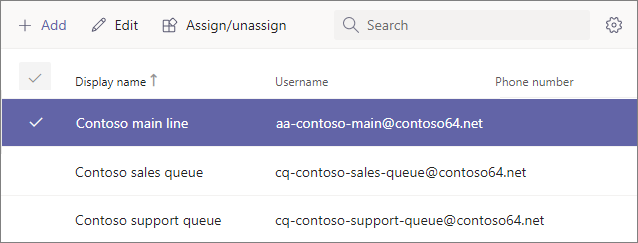

# Шаг 4. Настройка учетной записи ресурса Business Voice

В Microsoft Teams требуется учетная запись ресурса для каждого автозавода или очереди вызовов. Учетным записям ресурсов также могут быть назначены телефонные номера служб. Таким образом вы назначаете номера телефонов автоотводчикам и очередям звонков, чтобы звонив Teams могли связаться с автозаводчиком или очередью звонков.

## Получение лицензий виртуальных пользователей

Учетным записям ресурсов необходима лицензия для работы с автозаказщиками и очередями вызовов. Вы можете использовать бесплатную *лицензию Microsoft 365 телефонная система — виртуальный* пользователь.

1. Войдите в Центр администрирования Microsoft 365.
2. Перейти к **надстройкам**"Приобретение служб вы выставлением  >    >  **счета"**  >  **См. все продукты надстройки**
3. Прокрутите список до конца, чтобы найти **Microsoft 365 телефонная система — виртуальный пользователь.** Выберите **Сведения**, а затем **Купить**.
4. На странице приобретения лицензии выберите нужное количество виртуальных пользовательских лицензий. Для каждого автозавода и очереди вызовов, которые вы планируете настроить, требуется одна виртуальная лицензия. Рекомендуем выбрать по крайней мере пять лицензий, чтобы в будущем можно было легко настроить дополнительных автозаполнения и очереди вызовов, не приобретая дополнительные лицензии.
5. Отключите автоматические назначения всем пользователям **без лицензий.**
6. Выберите **"Проверить сейчас"**.
7. Подтвердите заказ, выберите **Далее**, а затем **Заказать**.

> [!NOTE]
> Помните, что вам  необходимо приобрести лицензию, даже если она имеет нулевую стоимость.

## Создание учетной записи ресурса

После получения лицензии *Microsoft 365 телефонная система виртуальный* пользователь вы можете создать учетную запись ресурса.

1. В центре Teams разметка **параметров** для всей организации и нажмите кнопку **Учетные записи ресурсов.**
2. Нажмите **Добавить**.
3. В области **Добавление учетной записи** ресурса в заполните **отображаемом имени**, а затем **имя пользователя**. Чтобы описать назначение учетной записи ресурса, выберите описательное имя, например "Автоотслевод основной строки".
4. В **типе учетной записи ресурса** выберите **Автоотекатарь**.
5. Нажмите **Сохранить**.

## Назначение лицензии

После создания учетной записи ресурса необходимо назначить лицензию на *Microsoft 365 телефонная система —* виртуальный пользователь или телефонная система *лицензию.*

1. В центре Microsoft 365 пользователей перейдите в **группу Пользователи**  >  **Активные пользователи**.
2. Выберите учетную запись ресурса.
1. На **вкладке Лицензии и приложения** в области **Лицензии** выберите Microsoft 365 телефонная система **— виртуальный пользователь**.
1. Выберите **сохранить изменения и** **закрыть**.

## Назначение номера службы

1. В центре Teams администрирования перейдите в параметры для всей организации, а **затем** — Учетные **записи ресурсов.** 
1. Выберите только что созданную учетную запись ресурса и нажмите кнопку **Назначить/отозначить**.
1. В Телефон **числовом типе** выберите В **сети**.
1. В **поле Назначен номер телефона** найдите нужный номер и нажмите кнопку **Добавить.** Не забудьте включить код страны (например, **+1** 250 555 0012).
1. Нажмите кнопку **Сохранить**.
    > [!NOTE]
    > Вам не нужно выбирать автозаводщика в области Назначить, так как автозаводщик, в который вы хотите добавить номер, уже выбран. 

> [!div class="nextstepaction"]
> [Следующий шаг: назначение номеров телефонов пользователям](set-up-assign-numbers.md)
