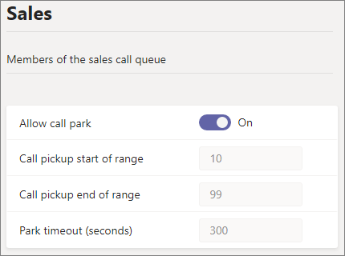

# Парковка и восстановление звонков в Microsoft Teams

Парк вызовов и извлечение — это функция, которая позволяет пользователю удержание звонка. При приостровке звонка служба создает уникальный код для искомого звонка. Пользователь, который приоовал звонок, или кто-то другой может использовать этот код с поддерживаемой программой или устройством для получения звонка. (Подробные [сведения см.](https://support.office.com/article/park-a-call-in-teams-8538c063-d676-4e9a-8045-fc3b7299bb2f) в Teams.)

Некоторые распространенные сценарии использования парка вызовов:

- Администратор регистратора позвонит человеку, который работает на заводе. После этого регистратор озвучит звонок и номер кода по общедоступным адресным системам. Пользователь, которому будет звонить, может забрать телефон Teams на заводском цехе и ввести код, чтобы получить звонок.
- Пользователь перезаряжает звонок на мобильном устройстве, так как аккумулятор устройства не работает. Затем пользователь может ввести код, чтобы получить звонок с Teams телефоне.
- Представитель службы поддержки отправляет в канале Teams объявление о том, что специалист может получить звонок и помочь клиенту. Эксперт вводит код в Teams, чтобы получить звонок

Для приозвать и получить звонки пользователь должен быть Корпоративная голосовая связь и включаться в политику парк звонков.

> [!NOTE]
> Парк вызовов и извлечение доступны только Teams [режиме](teams-and-skypeforbusiness-coexistence-and-interoperability.md) развертывания и не поддерживаются Skype для бизнеса IP-телефонах.

## Настройка парка вызовов и извлечение

Настроить парк вызовов и восстановить Teams может только администратор. По умолчанию она отключена. Вы можете включить ее для пользователей и создать группы пользователей с помощью политики парков вызовов. При применении одной и той же политики к набору пользователей они могут припарковать и получать звонки между собой.

По умолчанию диапазон номеров для звонка составляет от 10 до 99. Вы также можете создать собственный диапазон от 10 до 9999. Первый приопаркованный звонок будет отрисовлен с кодом вызова в начале диапазона (например, 10). Следующий приоплатный звонок будет отрисовка кода приращения с шагом 1; то есть 11 и так далее, пока конец диапазона не будет отрисовлен как код выноски. После этого отрисовка кодов выноски еще раз начинается с начала диапазона. 

Время ожидания можно указать в секундах, прежде чем звонить, когда не был установлен приозвать приозвать звонок. Допустимый диапазон составляет 120–1800 секунд, а значение по умолчанию — 300 секунд.

Чтобы настроить диапазон настраиваемого парка и время времени времени его пользования, используйте командлеты New- и Set-CsTeamsCallParkPolicy, доступные в Teams PowerShell Module 2.6.0 или более поздней. (В Центре администрирования настраиваемого парка изменения времени времени и времени времени Teams нельзя настроить. Обратите внимание, Teams центре администрирования по-прежнему будут по-прежнему показываться значения по умолчанию.)

Чтобы включить политику парк зовите:

1. В левой области навигации Центра Microsoft Teams администрирования перейдите **к** политикам в парке  >  **голосовых зовов**.
2. На **вкладке Управление политиками** нажмите кнопку **Добавить**.
3. Придайте политике имя, а затем переключение в переключатель **Разрешить парк вызовов** в **переключатель Включит**. (Диапазон и время перенастройки звонка нельзя настроить.)

    

4. Нажмите **Сохранить**.

Чтобы изменить политику, выберите ее в списке и нажмите кнопку **Изменить.**

Чтобы политика работала, ее необходимо наказать пользователям. Политику [можно назначить пользователям](assign-policies-users-and-groups.md) по отдельности или группе.

Назначение группы политики парков вызовов

1. На странице **Политики в парке** вызовов на **вкладке Назначение** групповой политики нажмите **кнопку Добавить группу**.
2. Найдите группу, которую вы хотите использовать, и нажмите кнопку **Добавить.**
3. Выберите ранг по сравнению с другими заданиями группы.
4. В **группе Выберите политику** выберите политику, для которую вы хотите назначить эту группу.

    

5. Выберите **Применить**.

## Статьи по теме

[Приозвать звонок в Teams](https://support.office.com/article/park-a-call-in-teams-8538c063-d676-4e9a-8045-fc3b7299bb2f)

[Назначение политик пользователям в Teams](policy-assignment-overview.md)

[New-CsTeamsCallParkPolicy](/powershell/module/skype/new-csteamscallparkpolicy)

[Set-CsTeamsCallParkPolicy](/powershell/module/skype/set-csteamscallparkpolicy)

[Grant-CsTeamsCallParkPolicy](/powershell/module/skype/grant-csteamscallparkpolicy)
