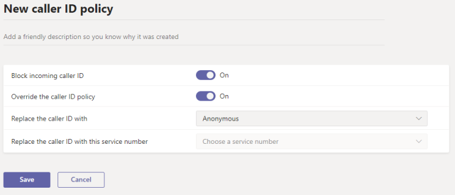

# Управление политиками идентификации вызывающего абонента в Microsoft Teams

> [!NOTE]
> Чтобы установить для ИД звонящая номер телефона учетной записи ресурса и имя вызываемой стороны, используйте командлеты PowerShell New-CsCallingLineIdentity или Set-CsCallingLineIdentity в модуле Teams PowerShell 2.3.1 или более поздней. (В настоящее время эти параметры недоступны в Центре Microsoft Teams администрирования.) 

По умолчанию, когда Teams звонит на телефон ЗВОНКОВ, отображается номер Teams этого пользователя. Точно так же, когда звоня Teams ЗВОНКОВ через ПСПС, этот номер телефона отображается.

Администратор может изменить или заблокировать его (или изменить или заблокировать его) с помощью политик ИД вызываемой связи. С помощью политик ИД звонящая можно отображать дополнительный номер телефона для пользователей Teams в организации, блокировать исходящие телефонные номера, блокировать отображение входящих номеров или устанавливать имя вызываемой стороны (CNAM). Например, когда пользователь звонит, вы можете изменить его ИД, чтобы вместо номера телефона пользователя отображались основной номер телефона организации и название организации.

Управлять политиками ИД вызываемого звоня можно в центре администрирования Microsoft Teams   >   голосовых вызовов. Вы можете использовать глобальную (по умолчанию в пределах организации) политику или создавать и присваивать настраиваемые политики. Пользователи вашей организации автоматически получают глобальную политику, если вы не создали и не назначили настраиваемую политику.

## Создание настраиваемой политики ИД вызываемого звоня

1. В левой области навигации Центра администрирования Microsoft Teams перейдите **к** политикам ИД  >  **голосового звоня.**
2. Нажмите **Добавить**.  

3. Введите имя и описание для политики.
4. В этом окте выберите нужные параметры:

    - **Блокировать ИД входящих звонков:** включите этот параметр, чтобы не отображаться ИД звонящая при входящих звонках.
    - **Переопределение** политики ИД вызываемого пользователя: включите этот параметр, чтобы позволить пользователям переопределять параметры политики, касающиеся отображения номера для вызывающих пользователей. Это означает, что пользователи могут выбрать, следует ли отображать свой ИД вызываемой связи. Дополнительные сведения см. в [этой](./how-can-caller-id-be-used-in-your-organization.md#end-user-control-of-outbound-caller-id)ссылке.
    - **Замените ИД вызываемого** пользователя на : Настройка отображения ИД вызываемого пользователя для пользователей, выбрав один из следующих ок.

        - **Номер пользователя:** отображает номер пользователя. 
        - **Номер службы:** позволяет настроить номер телефона службы для отображения в качестве ИД звоня.
        - **Анонимный:** отображает ИД звоняного как анонимный.

    - **Замените ИД вызываемого** пользователя этим номером службы: выберите номер службы, чтобы заменить его. Этот параметр доступен, если  вы выбрали Номер службы в **Заменить ИД вызываемого вызова на**.

5. Нажмите кнопку **Сохранить**.

## Изменение политики ИД вызываемого звоня

Вы можете редактировать глобальную политику или любые настраиваемые политики, которые вы создаете. 

1. В левой области навигации Центра администрирования Microsoft Teams перейдите **к** политикам ИД  >  **голосового звоня.**
2. Выберите политику, щелкнув слева от ее имени, а затем нажмите **Изменить**.
3. Измените нужные параметры и нажмите кнопку **Сохранить.**

## Назначение пользовательской политики ИД вызываемого пользователя пользователям

[!INCLUDE [assign-policy](includes/assign-policy.md)]

## Статьи по теме

[New-CsCallingLineIdentity](/powershell/module/skype/new-cscallinglineidentity?view=skype-ps)

[Set-CsCallingLineIdentity](/powershell/module/skype/set-cscallinglineidentity?view=skype-ps)

[Назначение политик пользователям в Teams](assign-policies.md)