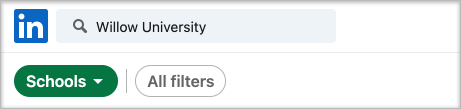
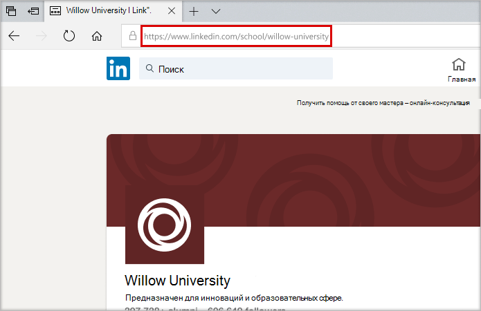
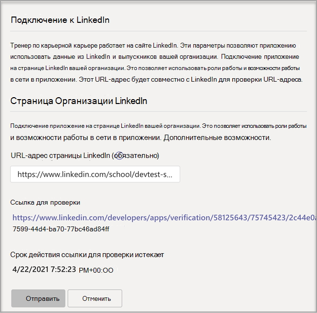
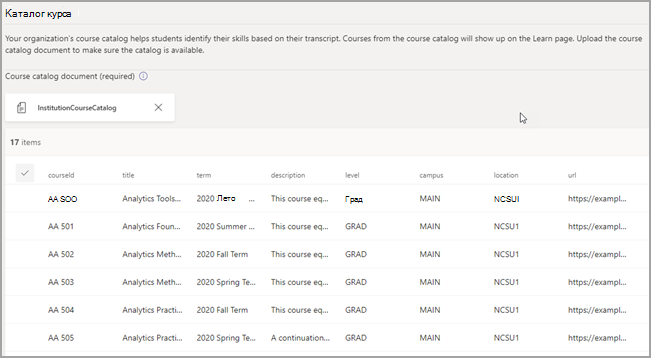

# Приобретение, настройка и Профконсультант для Microsoft Teams

Профконсультант — это Microsoft Teams для образования, которое работает на сайте LinkedIn, которое предоставляет учащимся высшего образования персонализированные рекомендации по переходу к карьере. Профконсультант предлагает учебным заведениям единое решение для карьерной работы учащихся, которое позволяет им найти путь к карьере, развивать реальные навыки и создать свою сеть в одном месте.

## Поддерживаемые языки

Профконсультант локализованы на следующих языках:

- Китайский (упрощенное, китайское(упрощенное))
- Китайский (традиционное письмо, Тайвань)
- Английский (США)
- Английский (Соединенное Королевство)
- Французский (Канада)
- Французский (Франция)
- Немецкий (Немецкий)
- Японский (Япония)
- Португальский (Бразилия)
- Испанский (Испания)
- Испанский (Мексика)

Подробнее [о Профконсультант.](https://aka.ms/career-coach)

> [!TIP]
> Используйте рекомендации и полезные советы из этого руководства, чтобы включить возможности Профконсультант для студентов, преподавателей и сотрудников. См. [статью Краткое руководство по планированию](https://support.microsoft.com/office/c5d0b934-bfcf-4fe7-8a85-ba7bbb1b6ad4) .

## Проверка требований

Чтобы включить Профконсультант для своего учебного заведения, просмотрите, что нужно для запуска приложения.

**Технические требования**

- Office 365 клиента с Azure Active Directory.

- Microsoft Teams.

- Подключения учетной записи LinkedIn в Azure Active Directory.

**Лицензии**

- Факультет

- Студентов

> [!IMPORTANT]
> Для Профконсультант конфигурации ИТ-администратору должна быть назначена лицензия на Профконсультант преподавателей.

**Данные и файлы из вашего образовательного учреждения**

- Логотип учебного заведения и графические ресурсы в требуемом формате.

- Данные каталога курса.

- Список предлагаемых полей исследования.

- Страница [LinkedIn учебного заведения](https://www.linkedin.com/help/linkedin/answer/40133/differences-between-a-linkedin-page-for-a-school-and-company?lang=en).

- URL-адрес политики конфиденциальности учебного заведения.

- Образовательное учреждение ссылок на ресурсы, связанные с карьерной работой, такие как службы по вакансиям и вакансии учащихся (необязательно).

- LinkedIn Обучение подписку на campus (предпочтительный вариант).

## Приобретение лицензий Профконсультант лицензий

Профконсультант доступна по всему миру (за исключением Китая и России) для квалифицированных высших учебных заведений в качестве лицензии на надстройку через регистрирует решения для образовательных учреждений (EES), поставщики облачных услуг (CSP) и Центр администрирования Microsoft 365 (прямой веб-сайт). Как приложение Microsoft Teams клиент должен иметь Microsoft 365 A3/A5 или Office 365 A1/A3/A5, чтобы приобрести Профконсультант надстройки. Для студентов, преподавателей и сотрудников предлагаются отдельные лицензии.

Стандартная 90-дневная бесплатная пробная версия доступна для 25 учащихся и 25 лицензий преподавателей и сотрудников. Пробные лицензии можно активировать Центр администрирования Microsoft 365 клиентах, которые могут приобрести Профконсультант.

### Назначение лицензий на приложения пользователям

Пошаговую инструкцию см. в инструкциях по [назначению лицензий пользователям](/microsoft-365/admin/manage/assign-licenses-to-users).

### Включить подключения к учетной записи LinkedIn

Профконсультант **требуется**, чтобы пользователи вашего учебного заведения иметь возможность подключать свою учетную запись Microsoft 365 к своей учетной записи LinkedIn, которая упростилась в Профконсультант.

1. Во войти в [Центр администрирования Azure AD](https://aad.portal.azure.com/) можно с помощью учетной записи, которая является глобальным администратором организации Azure AD.

2. Выберите **Пользователи**.

3. На странице **Пользователи** выберите **Параметры пользователя**.

4. **Для правильной настройки подключений** к учетной записи LinkedIn необходимо установить Профконсультант да или выбранную группу. 

   

   > [!NOTE]
   > Никакие данные не делиться, пока пользователи не согласится подключить свои учетные записи.

   - Выберите **Да** , чтобы включить службу для всех пользователей в вашем образовательном учреждении.

   - Выберите **выбранную группу** , чтобы включить службу только для группы выбранных пользователей в вашем образовательном учреждении.

Дополнительные сведения см. в [Azure Active Directory](/azure/active-directory/enterprise-users/linkedin-integration).

## Доступ к Профконсультант приложения

В Microsoft Teams администрирования можно настроить Профконсультант для учебного заведения и включить его для пользователей.

> [!IMPORTANT]
> Для доступа к странице необходимо быть глобальным Teams администратором службы.

1. Во sign in to the **[Teams admin center](https://admin.teams.microsoft.com)**.

2. В левой области навигации выберите Teams **приложенияУправляемые** >  **[приложениями](https://admin.teams.microsoft.com/policies/manage-apps)**.  

3. Найдите **или найдите** Профконсультант.  

4. Выберите **Профконсультант**, а **затем выберите Параметры**.  

    

## Настройка параметров Профконсультант приложения

Профконсультант имеет пять категорий конфигурации:

- [Торговая марка и настройки](#brand-and-preferences) — обязательно

- [Подключение LinkedIn](#linkedin-connection) — обязательно

- [Каталог курса](#course-catalog) — обязательно

- [Поля исследования](#fields-of-study) — обязательное поле

- [Настройки](#customization)

> [!IMPORTANT]
> Чтобы эффективно включить приложение для студентов, преподавателей и сотрудников, необходимы фирменная  марка и параметры, конфигурация LinkedIn, каталог курса и поля обучения.

### Торговая марка и настройки

Настройте Профконсультант в соответствие с фирменным названием учебного заведения. Вы несете ответственность за соблюдение прав других людей, включая права авторского права и товарных знаков.

> [!IMPORTANT]
> Это необходимый раздел: Профконсультант невозможно включить, если не заданы фирменая марка и параметры.

1. Во sign in to the **[Teams admin center](https://admin.teams.microsoft.com)**.

2. Выберите **Teams управляемые** >  **[приложениями](https://admin.teams.microsoft.com/policies/manage-apps)** >  **Профконсультант** >  **Бранд и настройки**.

3. Upload **значок образовательного учреждения**. Значок используется во всех Профконсультант для идентификации содержимого, уникального для вашего учебного заведения, ресурсов каталога курсов во всем приложении и в разделе реальных функций панели мониторинга. Значок лучше всего отформатирован как:

    - Прозрачный PNG
    - Пропорции 1:1
    - Максимальный размер: 64 px x 64 px

4. Upload **эскиз учебного заведения**. Эскиз будет использоваться для ресурсов каталога курса во всем приложении, если определенное изображение не доступно для курса. Эскиз лучше всего отформатирован как:

    - A PNG
    - Пропорции 16:9
    - Максимальный размер: 360 px x 200 px

5. Добавьте **URL-адрес политики конфиденциальности учебного заведения**. При добавлении политика конфиденциальности учебного заведения будет доступна учащимся для проверки в Профконсультант приложении.

6. Выберите **Отправить**.

### Подключение к LinkedIn

Конфигурация LinkedIn связывает Профконсультант с данными общедоступных выпускников из LinkedIn.

> [!IMPORTANT]
> Это необходимый раздел: Профконсультант невозможно включить без проверки подключения к странице LinkedIn.

#### Добавление страницы LinkedIn
  
1. Во sign in to the **[Teams admin center](https://admin.teams.microsoft.com)**.

2. Выберите **Teams Науправляемые** >  **[приложениями](https://admin.teams.microsoft.com/policies/manage-apps)** >  **Профконсультант** >  **ПодключениеLinkedIn**.

3. Чтобы найти страницу LinkedIn, найдите ее в LinkedIn и выберите **учебный** фильтр. Вы также можете связаться с сотрудником службы по карьерной карьере, чтобы определить правильную страницу LinkedIn для использования. Дополнительные сведения см. в [сведениях о том, как определить страницы LinkedIn](https://www.linkedin.com/help/linkedin/answer/40133/differences-between-a-linkedin-page-for-a-school-and-company?lang=en).

    

4. Добавьте URL-адрес страницы LinkedIn учебного заведения. URL-адрес должен быть учебной страницей, а не страницей компании и обычно имеет формат `https://www.linkedin.com/school/willow-university/`.

   

5. Выберите **Отправить**.
#### Проверка страницы LinkedIn 

> [!IMPORTANT]
> Проверку должен пройти супер администратор страницы LinkedIn вашего учебного заведения.

1. В случае успешной отправки страница будет обновлена, чтобы показать ссылку "Проверка" и "**Срок действия ссылки для проверки"**. Срок действия ссылки для проверки истекает через 30 дней.

     

2. Скопируйте ссылку на проверку и поделитесь им со страницей LinkedIn своего учебного заведения, супер администратором. Узнайте больше о роли супер администратора на странице LinkedIn в [документации администратора страниц LinkedIn](https://www.linkedin.com/help/linkedin/answer/102672).

3. Администратор страницы LinkedIn использует уникальную ссылку для проверки, чтобы Профконсультант со страницей вашего учебного заведения. Дополнительные сведения см. в дополнительных документах о [проверке страницы LinkedIn](https://www.linkedin.com/help/linkedin/answer/102672) .

   

### Каталог курса

Каталог курсов представляет курсы и классы, предлагаемые учащимся учебным заведением.

> [!IMPORTANT]
> Это необходимый раздел: Профконсультант невозможно включить без каталога курса.

Эти курсы используются в приложении в двух областях:

- Курсы возвращаются как часть учебных ресурсов.  

- Курсы и метаданные курса, например описания, используются для того, чтобы помочь учащимся определить свои навыки при отправке расшифровки.  

Чтобы создать каталог курсов, составьте список всех курсов, которые вы преподаете в учебном заведении, и загрузите его в CSV-файл. Приложение использует каталог курсов, чтобы определить навыки учащегося из его расшифровки и предложить курсы.

#### Добавление каталога курса

1. Во sign in to the **[Teams admin center](https://admin.teams.microsoft.com)**.

1. Выберите **Teams приложений Управление** &gt; **[приложениями Профконсультант](https://admin.teams.microsoft.com/policies/manage-apps)** &gt;  &gt; **Параметры** &gt;**каталоге курсов**.  

2. Upload курсы в формате CSV с требуемой колонкой: courseId, название и sourceLink. Каждая строка должна включать данные для каждого из необходимых столбцов. _Включив рекомендуемые поля, вы повысите качество работы учащихся, возвращая более лучшие результаты поиска и определение навыков._

4. Выберите **Отправить**.

   

#### Формат и схема каталога курсов

Документ должен быть в формате CSV с максимальным размером 18 МБ. В документе должны быть указаны название **курса, его** **ИД** и **URL-адрес**. 

> [!TIP]
> Начните с [образца документа каталога курса]( https://aka.ms/career-coach/docs/it-admins/sample-catalog) , чтобы обеспечить правильное форматирование. _Включив рекомендуемые поля, вы повысите качество работы учащихся, возвращая более лучшие результаты поиска и определение навыков._

В следующей таблице показаны элементы, которые нужно включить в каталог курса:

| Имя             | Статус      | Тип   | Описание                                                                    |
|------------------|-------------|--------|--------------------------------------------------------------------------------|
| courseId         | Обязательно    | Строка | Как правило, это ид курса (обычно он сопописается с тем, что создается в записи разговоров). |
| Название            | Обязательно    | Строка | Обычно название курса.                                                      |
| sourceLink       | Обязательно    | URL    | Ссылка веб-сайта на страницу курса.                                               |
| Описание      | Рекомендуется | Строка | Вводный текст курса.                                              |
| language         | Рекомендуется | Строка | Язык курса. Используйте стандартные языковые коды.                           |
| Формат           | Рекомендуется | Строка | Режим преподавания (в сети, видео, лично).                                   |
| thumbnailLink    | Рекомендуется | URL    | Ссылка эскиза на изображение курса.                                            |
| thumbnailAltText | Рекомендуется | Строка | Заме доступа к изображению                                           |
| educationLevel   | Рекомендуется | Строка | Учебный уровень, пример. Студент-выпускник.                                       |
| Темы           | Рекомендуется | Строка | Темы и теги, связанные с навыками, которые преподаются в курсах.          |

### Поля исследования

Поля исследования являются синонимами с основными областями интересов, академическими и градусами. На эти названия ссылается студент, когда он начинает использовать приложение и настраивает свой персонализированный профиль.

> [!IMPORTANT]
> Это необходимый раздел: Профконсультант невозможно включить без списка полей исследования.

#### Добавление полей исследования

1. Во sign in to the **[Teams admin center](https://admin.teams.microsoft.com)**.
1. Выберите **Teams приложения Управление** &gt; **** &gt; приложениями **Профконсультант** &gt; **Параметры** &gt;**полей исследования**.  

2. Upload в формате CSV.

3. Выберите **Отправить**.

#### Поля формата и схемы документа исследования

Добавьте все поля обучения, доступные учащимся, например инженерные, английский, бизнес и так далее. Список полей позволяет учащимся найти интересуют их поля и добавить в свой профиль область фокуса.

> [!TIP]
> Начните с [примера поля документа,](https://aka.ms/career-coach/docs/it-admins/sample-fieldsofstudy) чтобы обеспечить правильное форматирование.

В следующей таблице показаны элементы, которые нужно включить в поля исследования:

| Имя          | Статус   | Тип   | Описание                    |
|---------------|----------|--------|--------------------------------|
| fieldsOfStudy | Обязательно | Строка | Имя поля исследования |

### Настройки

Профконсультант можно настроить так, чтобы они были уникальными для вашего учебного заведения. Настройка поддерживает добавление функций на панель мониторинга. Рекомендуется добавлять ссылки на доски вакансий, мероприятия, офис служб по карьерной работе, мероприятия, связанные с карьерой, клубы учащихся и другие ресурсы, которые помогут учащимся получить реальный опыт.

#### Добавление настраиваемых функций

1. Во sign in to the **[Teams admin center](https://admin.teams.microsoft.com)**.

1. Выберите **Teams приложения Управление** &gt; **[приложениями Профконсультант](https://admin.teams.microsoft.com/policies/manage-apps)** &gt;  > **Параметры** &gt; **настройки**.

2. Добавьте каждое название, URL-адрес и краткое описание.  
  
3. Выберите **Отправить**.

## Обеспечение Профконсультант для организации

Теперь Профконсультант настроена для вашей организации. Выполните эти действия, чтобы Профконсультант организации в Microsoft Teams.

### Включить приложение

После завершения настройки в включить приложение для учащихся и лицензированных пользователей, чтобы они могли получить доступ к Профконсультант.  
  
> [!IMPORTANT]
> У вас должны быть разрешения глобального Teams роли администратора.

1. Во sign in to the **[Teams admin center](https://admin.teams.microsoft.com)**.

1. Выберите **Teams приложения Управление** &gt; **[приложениями Профконсультант](https://admin.teams.microsoft.com/policies/manage-apps)**&gt;.

2. Переместит в положение Разрешено положение **Состояние**.  

   > [!NOTE]
   > **Разрешено** означает, что приложение доступно для пользователей в вашем образовательном учреждении. Заблокировано означает, что приложение не доступно учащимся.

### Добавление Профконсультант как установленного приложения

> [!IMPORTANT]
> Это гарантирует, что Профконсультант правильно настроена для вашей организации и что учащиеся находят Профконсультант.

1. Во sign in to the **[Teams admin center](https://admin.teams.microsoft.com)**.

2. Выберите **Teams политики установки** &gt; приложений и выберите предпочитаемую политику.
Если вы не знаете, какую политику использовать, обратитесь к документации  по управлению политиками Microsoft Teams или настройте политику  для Microsoft Teams с помощью мастера политики для образовательных Microsoft Teams.

3. В области Установленные приложения выберите **Добавить приложения**.

4. В области Добавить установленные приложения найщите приложения, которые нужно автоматически установить для пользователей при Teams. Вы также можете фильтровать приложения с помощью политики разрешений приложений. Выбрав список приложений, выберите **Добавить**.

5. Нажмите **Сохранить**.

> [!NOTE]
> Изменение или назначение политики может занять несколько часов, чтобы изменения вступили в силу. Приложение Профконсультант будет доступно в Microsoft Teams до завершения изменений.

### Закрепление приложения

Закрепление Профконсультант сделает приложение более доступным и видимым для учащихся.

1. Во sign in to the **[Teams admin center](https://admin.teams.microsoft.com)**.

2. Выберите **Teams политики установки** &gt; приложений и выберите предпочитаемую политику.
Если вы не знаете, какую политику использовать, обратитесь к документации  по управлению политиками Microsoft Teams или настройте политику  для Microsoft Teams с помощью мастера политики для образовательных Microsoft Teams.

3. В **области Закрепленные приложения** выберите **Добавить приложения**.

4. Найщите **Профконсультант** и выберите **Добавить**.

5. Выберите порядок появления приложения и выберите **сохранить**.

> [!NOTE]
> Учащиеся будут уведомлены в Microsoft Teams о том, Профконсультант был закреплен.

[Дополнительные сведения можно и здесь: Управление политиками настройки приложений в Корпорации](/microsoftteams/teams-app-setup-policies) Майкрософт.

## Профконсультант состояния параметров

На Профконсультант параметров в Центре администрирования Teams содержится отчет о незавершенных, ожидающих обработки, завершенных и сбойных действиях по настройке приложения. Эти состояния помогают определить, Профконсультант настроены ли клиенты и готовы ли они к выпуску.

### Состояние конфигурации

Текущее состояние отображается в разделе состояния конфигурации страницы параметров приложения.

| Категория              | Статус                    | Описание                                                 |
| --------------------- | ------------------------- | ----------------------------------------------------------- |
| Подготовка служб  | Pending                   | Приложение добавляется в клиент. Дальнейшие действия не требуется. |
| Подготовка служб  | Полный                  | Готовы отправить параметры ИТ-администратору.                      |
| Торговая марка и настройки | Не начато               | Параметры нужно будет сдано.                              |
| Торговая марка и настройки | _Отсутствуют необходимые поля_ | ИТ-администратору необходимо добавить или добавить отсутствующие поля.         |
| Торговая марка и настройки | Полный                  | Дальнейшие действия не требуется.                                   |
| Каталог курса        | Не начато               | Каталог необходимо отправки.                              |
| Каталог курса        | Неполной                | Подробные сведения о том, как решить проблему, можно найти в статусе ingestion.   |
| Каталог курса        | Полный                  | Дальнейшие действия не требуется.                                   |
| Подключение к LinkedIn   | Не начато               | URL-адрес учебной страницы LinkedIn должен быть отправлен.             |
| Подключение к LinkedIn   | Pending                   | Ожидание утверждения администратором страницы LinkedIn на учебном замещающий сайт.               |
| Подключение к LinkedIn   | Полный                  | Дальнейшие действия не требуется.                                   |
| Поля исследования       | Не начато               | Документ должен быть отправлен.                             |
| Поля исследования       | Полный                  | Дальнейшие действия не требуется.                                   |

> [!NOTE]
> После пометки всех действий приложение можно успешно освободить для вашего клиента и назначить Профконсультант лицензии. Пошаговую инструкцию см. в инструкциях по [назначению лицензий пользователям](/microsoft-365/admin/manage/assign-licenses-to-users?view=o365-worldwide).

### Состояние каталога курса

Состояние каталога курса отображается на странице параметров каталога курса после отправки документа с подробными сведениями о его отправке и обработке.

| Столбец           | Значение     | Описание                                                                                        |
| ---------------- | --------- | -------------------------------------------------------------------------------------------------- |
| Время отправки    | Timestamp | Дата и время отправки документа ИТ-администратором.                                                     |
| Время завершения   | Timestamp | Дата и время полной обработки документа.                                               |
| Загруженные курсы | Целое число   | Количество найденных в документе курсов.                                                           |
| Состояние Ingestion | Pending   | Документ в очереди для обработки.                                                                  |
| Состояние Ingestion | Запущена   | В настоящее время документ обрабатывается. Этот процесс может занять до 60 минут.                        |
| Состояние Ingestion | Success (Успешно)   | Процесс ingestion завершен, и курсы будут доступны в приложении после завершения настройки. |
| Состояние Ingestion | Сбой при    | Проверьте формат документа и перезагрузийте его.                                                            |
| Дубликаты       | Целое число   | Количество найденных в документе дубликатов курсов.                                                 |

> [!NOTE]
> Если столбец пустой, документ обрабатывается и эти значения недоступны. После обработки документа значения будут заполнены. Вы можете обновить страницу, чтобы проверить, нет ли обновлений.

## Устранение неполадок

- Если в приложении Профконсультант есть разделы, Профконсультант настроено для использования в ближайшее время, необходимые __разделы не выполнены__. Чтобы можно __было использовать__ Профконсультант, необходимо выполнить следующие разделы [: "](#brand-and-preferences)Фирменно и предпочтения", "Подключение [LinkedIn](#linkedin-connection)[", "](#course-catalog)Каталог курса" и "Поля [исследования"](#fields-of-study).

- CSV-форматы для каталога курса и поля исследования имеют требуемую форматирование и максимальный размер 18 МБ. Чтобы [обеспечить правильную](#course-catalog-document-format-and-schema) конфигурацию, Профконсультант схемы документов каталога Профконсультант и  поля схемы учебных документов.

- Если поля не заполнены, на страницах параметров с нужными полями страница не будет отправляться. Предупреждение не вы увидите. страница просто не будет отправляться.

- При первой настройке Профконсультант может появиться баннер ошибки с сообщением "Не можем обновить параметры приложения. Попробуйте еще раз". Скорее всего, это связано с тем, что клиент Профконсультант приложение, которое может занять до 15 минут. В этом случае подождите 15 минут перед повторной отправкой.

- Если Профконсультант не отображается в Microsoft Teams, возможно, изменения политики не вступили в силу. Изменение политики может занять несколько часов. Приложение Профконсультант будет доступно в Microsoft Teams до завершения изменений.

## Удаление данных клиента

Данные клиента включают сведения, которые были добавлены или созданы в рамках конфигурации приложения. Чтобы удалить все данные в Профконсультант клиента, глобальный администратор клиента должен открыть запрос в службу поддержки  с запросом на окончательное удаление данных клиента. Следует помнить, что этот процесс нельзя оточитать. После удаления данных приложение Профконсультант в предварительно настроенное неконфигурационное состояние для всех пользователей, и администратору Teams потребуется снова настроить приложение, чтобы продолжить его использование.

Процедура удаления объясняется следующим образом:

- Глобальный администратор клиента должен обратиться в службу поддержки с четким запросом на окончательное удаление данных клиента. **Ограничить набор данных или** время удаления не существует.

- После этого заявка в службу поддержки будет решена через неделю, чтобы соответствовать политике хранения с минимальным соответствием требованиям. В это время операцию можно отменить.

- По иной Профконсультант группа гарантирует удаление всех данных, связанных с клиентом. Служба поддержки Майкрософт отслеживает этот вопрос и уведомляет вас об этом после завершения процесса удаления не более **чем за 30 дней**.

## Ресурсы

Следующие ресурсы помогут вам спланировать Профконсультант приложения.

- [Знакомство с Microsoft Teams](Teams-overview.md)

- [Как выполнить развертывание Teams](get-started-with-teams-resources-for-org-wide-rollout.md?tabs=SmallBusiness)

- [Обзор команд и каналов в Microsoft Teams](teams-channels-overview.md)

- [Управление приложениями в Microsoft Teams администрирования](manage-apps.md)

- [Набор виртуальных ориентаций в Интернете](https://www.microsoft.com/education/remote-learning/virtual-orientation)

- [Ограничения и спецификация Teams каналов](limits-specifications-teams.md)

- [Начало работы с обучением администраторов Microsoft Teams](ITAdmin-readiness.md)

- [Устранение неисправностей Teams](/microsoftteams/troubleshoot/teams-welcome)

- [Управление политиками разрешений для приложений в Microsoft Teams](teams-app-permission-policies.md)
