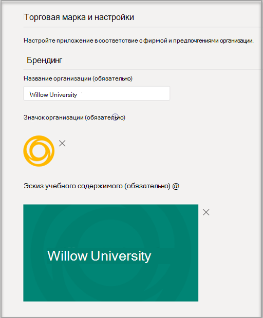
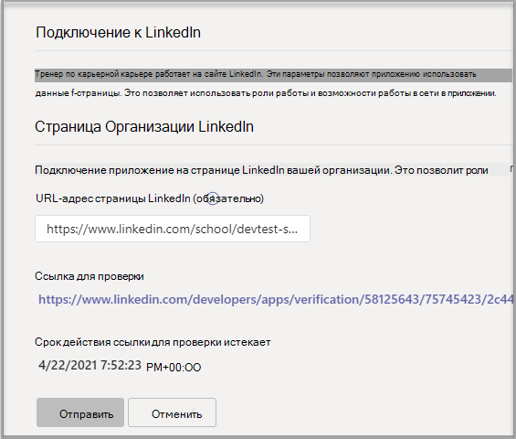

# Приобрести, настроить и включить для тренеров по Microsoft Teams

Career Coach — это приложение Microsoft Teams для образовательных сфере, которое работает на сайте LinkedIn и предоставляет учащимся более высокого уровня индивидуальные рекомендации по переходу к карьере. Тренер по карьерной подготовке предлагает учебным заведениям единое решение для карьерных целей, которое позволяет учащимся найти свой путь к карьере, развивать реальные навыки и создать свою сеть в одном месте.

Подробнее о [тренере по карьерной карьере.](https://aka.ms/career-coach)

> [!NOTE]
> Используйте рекомендации и полезные советы из этого руководства, чтобы включить возможности тренера по карьерной деятельности для студентов, преподавателей и сотрудников. См. [статью Краткое руководство по планированию.](https://support.microsoft.com/office/c5d0b934-bfcf-4fe7-8a85-ba7bbb1b6ad4)

## Проверка требований

Чтобы включить для вашего учебного заведения функцию "Тренер по карьерной работе", просмотрите, что нужно для запуска приложения.

**Технические требования**

  - Office 365 с Azure Active Directory

  - Microsoft Teams

  - Подключения учетной записи LinkedIn в Azure Active Directory

**Лицензии**

  - Факультет 

  - Студентов

> [!NOTE]
> ИТ-администратору, заполняющий конфигурацию, должна быть назначена лицензия преподавателя по карьерной деятельности.

**Данные и файлы из вашего учебного заведения**

  - Данные каталога курса

  - Предлагаемые поля исследования

  - Страница LinkedIn образовательного учреждения

  - Подписка на LinkedIn Learning campus (предпочитаемая)

## Приобретение лицензий для тренера по карьерной карьере

Она доступна по всему миру (за исключением Китая и России) для квалифицированных высших учебных заведений с помощью регистрации решений для образовательных учреждений (EES), поставщиков облачных услуг (CSP) и Microsoft 365 администрирования (прямой веб-сайт). Как приложение Microsoft Teams, клиенты должны Microsoft 365 A3/A5 или Office 365 A1/A3/A5.

### Назначение лицензий на приложения пользователям

Пошаговую инструкцию см. в инструкциях по [назначению лицензий пользователям.](/microsoft-365/admin/manage/assign-licenses-to-users)

### Включить подключения к учетной записи LinkedIn

Чтобы **упростить** работу тренера по карьерной карьере, пользователи учебного заведения должны иметь возможность подключить свою учетную запись Microsoft 365 к учетной записи LinkedIn, которая упростилась в рамках тренера по карьерной карьере.

1. Во sign in the [Azure AD admin center](https://aad.portal.azure.com/) with an account that's a global admin for the Azure AD organization.

2. Выберите **Пользователи**.

3. На странице **Пользователи** выберите **Параметры пользователя**.

4. В **области Подключения к учетной записи LinkedIn** разрешить пользователям подключать свои учетные записи для доступа к своим подключениям LinkedIn в некоторых приложениях Майкрософт. Никакие данные не делиться, пока пользователи не согласится подключить свои учетные записи.

   - Выберите **Да,** чтобы включить службу для всех пользователей в образовательном учреждении

   - Выберите **выбранную группу,** чтобы включить службу только для группы выбранных пользователей в вашем образовательном учреждении

   - Выберите **Нет,** чтобы отозвать согласие всех пользователей в образовательном учреждении

Узнайте, как [интегрировать подключения учетной записи LinkedIn в Azure Active Directory](/azure/active-directory/enterprise-users/linkedin-integration)

## Настройка тренера по карьерной Teams центре администрирования

Используя параметры администрирования в Центре Microsoft Teams, вы можете настроить его для своего учебного заведения и включить для пользователей.

## Доступ к настройкам приложения "Тренер по карьерной карьере"

На странице [Управление приложениями](/microsoftteams/manage-apps) можно просмотреть Teams приложения в каталоге приложений учебного заведения.

1. Во sign in to the **Teams admin center**.

2. В левой области навигации выберите Teams **приложения**  >  **Управление приложениями**.  

    > [!NOTE]
    > Для доступа к странице необходимо быть глобальным Teams администратором службы.

3. Поиск или поиск по **запросу "Тренер по карьерной работе"**.  

4. Выберите **Тренер по карьерной** деятельности , а затем выберите **Параметры.**  

    

### Настройка параметров приложения "Тренер по карьерной карьере"

У тренера по карьерной карьере пять категорий конфигураций:

- [Торговая марка и параметры](#brand-and-preferences)

- [Конфигурация LinkedIn](#linkedin-configuration)

- [Каталог курса](#course-catalog)

- [Поля исследования](#fields-of-study)

- [Настройки](#customization)

> [!NOTE]
> Чтобы эффективно включить приложение для студентов, преподавателей и  сотрудников, необходимо использовать фирменную марку и параметры, конфигурацию LinkedIn, каталог курса и поля обучения.

#### Торговая марка и параметры

Задайте название, логотип и язык по умолчанию учебного заведения на странице параметров и фирме.

##### Значок образовательного учреждения

Значок учебного заведения используется во всем приложении "Тренер по карьерной деятельности", чтобы идентифицировать содержимое, уникальное для вашего учебного заведения, ресурсы каталога курса во всем приложении и в разделе реальных функций панели мониторинга. Значок лучше всего отформатирован как:

 - Прозрачный PNG
 - Пропорции 1:1
 - Максимальный размер: 64 px x 64 px.

##### Эскиз образовательного учреждения

Значок учебного заведения будет использоваться для ресурсов каталога курсов во всем приложении, если определенное изображение не доступно для курса. Значок лучше всего отформатирован как:

- A PNG
- Пропорции 16:9
- Максимальный размер: 360 px x 200 px.

#### Конфигурация LinkedIn

Конфигурация LinkedIn связывает Тренера по карьерной деятельности с данными общедоступных выпускников из LinkedIn.

> [!NOTE]
> Невозможно включить тренера по карьерной карьере без проверки подключения к странице LinkedIn.

##### Добавление и подтверждение страницы LinkedIn

Определите страницу LinkedIn учебного заведения. Найдите страницу LinkedIn, вы можете найти ее в LinkedIn или связаться с сотрудником, который является сотрудником службы по карьерной карьере, чтобы определить правильную страницу.  
  
1. Во sign in to the **Teams admin center**.

1. Выберите Teams **приложения Управление**  >  **приложениями Подключение** к  >  **LinkedIn Для**  >  **тренеров по карьерной карьере**.

2. Введите URL-адрес страницы LinkedIn учебного заведения.  

3. Выберите **Применить**.

4. Скопируйте URL-адрес проверки и поделитесь им с документацией администратора страниц LinkedIn на странице администратора страниц LinkedIn вашего [учебного заведения.](https://www.linkedin.com/help/linkedin/answer/4783/linkedin-page-admins-overview?lang=en) Срок действия ссылки для проверки истекает через 30 дней.  

     

#### Каталог курса

Каталог курсов представляет курсы и классы, предлагаемые учащимся учебным заведением. Эти курсы используются в приложении в двух областях:

- Курсы возвращаются как часть учебных ресурсов.  

- Курсы и метаданные курса, например описания, используются для того, чтобы помочь учащимся определить свои навыки при отправке расшифровки.  

Чтобы создать каталог курсов, составьте список всех курсов, которые вы преподаете в учебном заведении, и загрузите его в CSV-файл. Приложение использует каталог курсов для определения навыков учащегося из его расшифровки и для определения курса. 

##### Форматирование и схема документов каталога курсов

Документ должен быть в формате CSV с максимальным размером 18 МБ. Документ должен содержать обязательное название курса полей, его **ИД** и **URL-адрес курса.** Включив рекомендуемые поля, вы повысите качество работы учащихся, возвращая более лучшие результаты поиска и определение навыков.

> [!NOTE]
> Начните с [образца документа каталога]( https://aka.ms/career-coach/docs/it-admins/sample-catalog) курса, чтобы приступить к работе.

В следующей таблице показаны элементы, которые нужно включить в каталог курса:

| Имя             | Статус      | Тип   | Описание                                                                    |
|------------------|-------------|--------|--------------------------------------------------------------------------------|
| courseId         | Обязательно    | Строка | Обычно ид курса (как правило, он сопописается с тем, что создается в записи разговоров). |
| Название            | Обязательно    | Строка | Обычно название курса.                                                      |
| sourceLink       | Обязательно    | Url    | Ссылка веб-сайта на страницу курса.                                               |
| Описание      | Рекомендуется | Строка | Вводный текст для курса.                                              |
| Язык         | Рекомендуется | Строка | Язык курса. Используйте стандартные языковые коды.                           |
| Формат           | Рекомендуется | Строка | Режим обучения, например, онлайн, видео, линлин.                              |
| thumbnailLink    | Рекомендуется | Url    | Ссылка эскиза на изображение курса.                                            |
| thumbnailAltText | Рекомендуется | Строка | Заме доступа к изображению                                           |
| educationLevel   | Рекомендуется | Строка | Учебный уровень, пример. Студент-выпускник.                                       |
| Темы           | Рекомендуется | Строка | Темы и теги, связанные с навыками, которые преподаются в курсах.          |

##### Добавление каталога курса

1. Во sign in to the **Teams admin center**.

1. Выберите Teams **приложения** &gt; **Manage apps** Career &gt; **Coach** &gt; **Параметры** &gt; **course catalog**.  

2. Upload курсы в формате CSV.

4. Выберите **Применить**.

   

#### Поля исследования

Поля исследования являются синонимами с основными областями интересов, академическими и градусами. На эти названия ссылается студент, когда он начинает использовать приложение и настраивает свой персонализированный профиль.

Добавьте все поля обучения, доступные учащимся, например инженерные, английский, бизнес и так далее. Список полей позволяет учащимся найти интересуют их поля и добавить в свой профиль область фокуса.

> [!NOTE]
> Начните с [примера поля документа.](https://aka.ms/career-coach/docs/it-admins/sample-fieldsofstudy)
##### Добавление полей исследования

1. Во sign in to the **Teams admin center**.
1. Выберите **Teams приложения Manage** &gt; **apps** Career &gt; **Coach** &gt; **Параметры** Fields of Study &gt; (Поля **обучения).**  

2. Upload в формате CSV.

3. Выберите **Применить**.

#### Настройки

Тренера по карьерной карьере можно настроить так, чтобы он был уникальным для вашего образовательного учреждения. Настройка поддерживает добавление новых функций на панель мониторинга. Рекомендуется добавлять ссылки на доски вакансий, мероприятия, офис служб по карьерной работе, мероприятия, связанные с карьерой, клубы учащихся и другие ресурсы, которые помогают учащимся получить реальный опыт.

##### Добавление настраиваемых функций

1. Во sign in to the **Teams admin center**.

1. Выберите Teams **приложения Управление** &gt; **приложениями** &gt; **Coach для**  >  **Параметры** &gt; **настройки**.

2. Добавьте каждый URL-адрес, заголовок и краткое описание.  
  
3. Выберите **Применить**.

## Как сделать тренера по карьерной карьере доступным для вашей организации

Теперь, когда для вашей организации настроен тренер по карьерной карьере. Выполните эти действия, чтобы гарантировать, что тренер по карьерной деятельности доступен для организации в Microsoft Teams.

### Включить приложение

После завершения настройки в включить приложение для учащихся и лицензированных пользователей, чтобы они могли получить доступ к тренеру по карьерной карьере.  
  
> [!NOTE]
> У вас должны быть разрешения глобального Teams роли администратора.

1. Во sign in to the **Teams admin center**.

1. Выберите Teams **приложения Manage** &gt; **apps** &gt; **Career Coach**.

2. Переместить в положение Разрешено положение **состояние**.  

  > [!NOTE]
  > Разрешено означает, что приложение доступно для пользователей в вашем учебном заведении. Заблокировано означает, что приложение не доступно учащимся.

### Добавление тренера по карьерной карьере в качестве установленного приложения

> [!NOTE]
> Это гарантирует, что 1) правильно настроен тренер по карьерной деятельности для вашей организации 2), что учащиеся находят тренера по карьерной карьере.

1. Во sign in to the **Teams admin center**.

2. Выберите **Teams политики установки** приложений &gt; **Ваша** &gt; *политика*. 

3. В области Установленные приложения выберите Добавить приложения.

4. В области Добавить установленные приложения найщите приложения, которые вы хотите автоматически установить для пользователей при Teams. Вы также можете фильтровать приложения с помощью политики разрешений приложений. Выбрав список приложений, выберите Добавить.

### Закрепление приложения

Закрепление тренера по карьерной деятельности сделает приложение более доступным и видимым для учащихся.

1. Во sign in to the **Teams admin center**.

2. Выберите **Teams политики установки** приложений &gt; **Ваша** &gt; *политика*. 

3. В **области Закрепленные приложения** выберите Добавить **приложения**.

4. Найщите **тренера по карьерной карьере,** а затем выберите **Добавить**.

5. Выберите порядок появления приложения и выберите **сохранить**.

> [!NOTE]
> Учащиеся будут уведомлены в Microsoft Teams о том, что тренер по карьерной деятельности закреплен.

Дополнительные [сведения можно и здесь:](/microsoftteams/teams-app-setup-policies) Управление политиками настройки приложений в Корпорации Майкрософт.

## Ресурсы

Следующие ресурсы помогут вам спланировать приложение "Тренер по карьерной карьере".

- [Знакомство с Microsoft Teams](Teams-overview.md)

- [Способ развертывания Teams](get-started-with-teams-resources-for-org-wide-rollout.md?tabs=SmallBusiness)

- [Обзор команд и каналов в Microsoft Teams](teams-channels-overview.md)

- [Управление приложениями в Центре Microsoft Teams администрирования](manage-apps.md)

- [Набор виртуальных ориентаций в Интернете](https://www.microsoft.com/education/remote-learning/virtual-orientation) 

- [Ограничения и спецификация Teams каналов](limits-specifications-teams.md)

- [Начало работы с обучением администраторов Microsoft Teams](ITAdmin-readiness.md)

- [Устранение неисправностей Teams](/microsoftteams/troubleshoot/teams-welcome)

- [Управление политиками разрешений для приложений в Microsoft Teams](teams-app-permission-policies.md)
